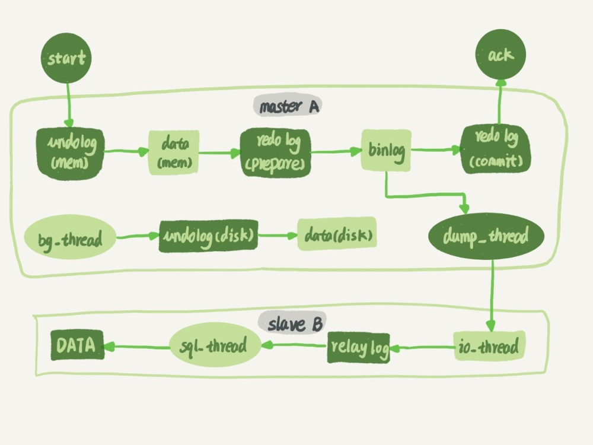

## MySQL 保证主备一致

在主从的时候，建议将从库设置成只读（readonly）状态。有几个理由：

1. 查询类的数据去备库，设置只读是防止误操作
2. 防止主备切换逻辑有 bug，比如切换过程中出现双写，造成主备不一致
3. 可以用 readonly 状态，来判断节点的角色
4. readonly 设置对超级（super）权限用户是无效的，而用于同步更新的线程，就拥有超级权限。因此备库设置只读，还可以和主库保持同步更新。

如下图，是主从同步的流程



一个事务日志同步的完整过程：

1. 在备库 B 上通过 change master 命令，设置主库 A 的 IP、端口、用户名、密码，以及要从那个位置开始请求 binlog，这个位置包括文件名和日志偏移量
2. 在备库 B 上执行 start slave 命令，这时候备库会启动两个线程，就是图中的 io_thread 和 sql_thread。其中 io_thread 负责与主库建立连接
3. 主库 A 校验完用户名、密码后，开始按照备库 B 传过来的位置，从本地读取 binlog，发给 B
4. 备库 B 拿到 binlog 后，写到本地文件，称为中转日志（relay log）
5. sql_thread 读取中转日志，解析出日志里的命令，并执行

创建主备关系时，是由备库指定的，比如基于那个文件那个位置；主库就从这个指定的位置开始往后法；而主备复制关系搭建完成后，是主库来决定“要发数据给备库”的，主库有生成新的日志，就会发送给备库。

### 一、binlog 的三种格式

先记录下 binlog 相关的数据库操作

```
show variables like 'log_bin';  # ON 表示开启了 binlog 日志
```

如果为 OFF 的话，需要修改数据库配置文件

```
[mysqld]
log-bin=mysql-bin # 开启Binlog 一般只需要修改这一行即可
binlog-format=ROW # 设置格式 此行可以不加 命令设置即可 详见下方拓展
server_id=1  # 配置serverID  这一行本来就存在
```

重启数据库

```
mysqladmin shutdown -S /xxx/mysql.sock 
./bin/mysqld_safe --defaults-file=/data/mysql5.5/data/my.cnf --skip-grant-tables --user=root
```

查看 binlog 设置

```
 show variables like "%binlog_format%"; # 查看日志模式命令
 set global binlog_format='MIXED'; # 设置日志模式命令 
 show binary logs; # 查看 binlog 文件列表
 show master status; # 查看当前正在写入的 binlog 文件
 show binlog events in 'mysql-bin.00002'; # 查看指定 binlog 文件的内容
```

假如我们创建了这样的表，并且给表插入了数据

```
mysql> CREATE TABLE `t` (
  `id` int(11) NOT NULL,
  `a` int(11) DEFAULT NULL,
  `t_modified` timestamp NOT NULL DEFAULT CURRENT_TIMESTAMP,
  PRIMARY KEY (`id`),
  KEY `a` (`a`),
  KEY `t_modified`(`t_modified`)
) ENGINE=InnoDB;

insert into t values(1,1,'2018-11-13');
insert into t values(2,2,'2018-11-12');
insert into t values(3,3,'2018-11-11');
insert into t values(4,4,'2018-11-10');
insert into t values(5,5,'2018-11-09');
```

这是我们删除一行数据，来查看这个 delete 语句在 binlog 中是如何记录的？

```
mysql> delete from t /*comment*/  where a>=4 and t_modified<='2018-11-10' limit 1;
mysql> show master status;
mysql> show binlog events in 'mysql-bin.000003';
```

#### 1. statement 格式

查看 binlog 中的内容

```
mysql> show binlog events in 'mysql-bin.000003';
+------------------+-----+-------------+-----------+-------------+----------------------------------------------------------------------------+
| Log_name         | Pos | Event_type  | Server_id | End_log_pos | Info                                                                       |
+------------------+-----+-------------+-----------+-------------+----------------------------------------------------------------------------+
| mysql-bin.000003 |   4 | Format_desc |       101 |         107 | Server ver: 5.5.45-log, Binlog ver: 4                                      |
| mysql-bin.000003 | 107 | Query       |       101 |         183 | BEGIN                                                                      |
| mysql-bin.000003 | 183 | Query       |       101 |         292 | use `test`; insert into t values(4,4,'2018-11-10')                         |
| mysql-bin.000003 | 292 | Xid         |       101 |         319 | COMMIT /* xid=10 */                                                        |
| mysql-bin.000003 | 319 | Query       |       101 |         395 | BEGIN                                                                      |
| mysql-bin.000003 | 395 | Query       |       101 |         528 | use `test`; delete from t  where a>=4 and t_modified<='2018-11-10' limit 1 |
| mysql-bin.000003 | 528 | Xid         |       101 |         555 | COMMIT /* xid=11 */                                                        |
+------------------+-----+-------------+-----------+-------------+----------------------------------------------------------------------------+
```

- 在 BEGIN 和 COMMIT 的中间是一个事务
- 其中语句前的 `use test ` 命令是自动添加的，保证日志传到备库去执行时，都能够准确的更新到 test 库的表 t 。后面就 SQL 命令原文了。
- COMMIT 行有 xid=11，这里的 xid 有一个功效就是用来联系 binlog 和 redo log 的，比如它们有一个共同的数据字段，叫 XID。崩溃恢复的时候，会按顺序扫描 redo log：如果碰到既有 prepare、又有 commit 的 redo log，就直接提交；如果碰到只有 parepare、而没有 commit 的 redo log，就拿着 XID 去 binlog 找对应的事务。

statement 格式会有问题的，这个命令可能不安全。比如这行命令：`delete from t /*comment*/  where a>=4 and t_modified<='2018-11-10' limit 1;` 

- 如果 delete 语句使用的是索引 a，那么会根据索引 a 找到第一个满足条件的行，也就是删除 a=4 这一行
- 如果 delete 语句使用的索引是 t_modified，那么删除的就是 ` t_modified='20218-11-09'` 也就是 a=5 这一行

由于 statement 格式记录的是 sql 原文，主库和备库如果执行语句使用的索引不一样，就出现不一致了

#### 2. ROW 格式

同样的执行命令 `delete from t /*comment*/  where a>=4 and t_modified<='2018-11-10' limit 1;` 查看 binlog 得到如下：

```
mysql> show binlog events in 'mysql-bin.000003';
Log_name         | Pos  | Event_type  | Server_id | End_log_pos | Info       
mysql-bin.000003 | 1190 | Query       |       101 |        1266 | BEGIN                                                                      
mysql-bin.000003 | 1266 | Table_map   |       101 |        1308 | table_id: 23 (test.t)                                                      
mysql-bin.000003 | 1308 | Delete_rows |       101 |        1350 | table_id: 23 flags: STMT_END_F                                             
mysql-bin.000003 | 1350 | Xid         |       101 |        1377 | COMMIT /* xid=37 */       
```

- Table_map event，用于说明接下来要操作的表是 test 库的表 t
- Delete_rows event，用于定义删除的行为

从这里看不到详细信息，需要借助 mysqlbinlog 工具。这个事务是从 1190 开始位置开始的


- server id 是 101，表示这个事务是在 server_id = 101 的这个库上执行的
- Table_map event 显示了接下来要打开的表，mao 到数字 23。如果要操作多张表，每个表都有一个对应的 Table_map event、都会 map 到一个单独的数字，用于区分不同表的操作
- 在 mysqlbinlog 命令中，使用 -vv 参数可以把内容解析出来。所以从结果里面可以看到各个字段的值（比如 @1=4、@2=4 这些值）
- binlog_row_image 的默认配置是 FULL，因此 Delete_event 里面，包含了删掉的行的所有字段的值。如果把 binlog_row_image 设置为 MINIMAL，则只会记录必要的信息，在这个例子里，就是只会记录 id=4 这个信息
- 最后 Xid event，用于表示事务被正确提交了

可以看到，当 binlog_format 使用 ROW 格式的时候，binlog 里面记录了真实删除的主键 Id，这样到备库的时候就肯定会删除 id=4 的行，不会出现主备不一致的情况了

#### 3. Mixed 格式

为什么还会有 Mixed 格式呢？

- 有些 statement 格式的 binlog 可能会导致主备不一致，所以要使用 row 格式
- 但是 row 格式的缺点是占用空间较大，比如用 delete 语句删除 10 万行数据，用 statement 的话就是一个 sql 语句，占用几十字节的空间。但如果使用 row 格式的话，就要把 10万条记录都写到 binlog 中，不仅会占用大量空间，写 binlog 也耗费 IO 资源，影响执行速度
- 因此 mysql 取了折中方案 Mixed 格式的 binlog。mixed 格式的意思是 mysql 自己会判断这条 sql 语句是否可能引起主备不一致，如果有可能，就用 row 格式，否则就用 statement 格式

但是很多场景要求 MySQL 的 binlog 格式设置为 row，比如用来恢复数据
如果执行的是 delete 语句，因为 row 格式的 binlog 会把被删除的行的整行信息保存起来。所以执行完一条 delete 语句以后，发现删错数据，可以直接把 binlog 记录的 delete 语句转成 insert ，把被错删的数据插入回去就可以恢复了。

还有一个问题说明，比如有这样的语句：` insert into t values(10, 10, now())`。binlog_format 设置的是 Mixed，mysql 会使用 statement 格式，那 now() 会不会导致主备数据不一致？不会的，binlog 在记录 event 的时候，会多记一条命令：`set TIMESTAMP=1546103491;` 。它用 SET TIMESTAMP 命令约定了接下来的 now() 函数的返回时间。
因此，有些语句的执行结果是依赖于上下文命令的，直接执行的结果可能是错误的

### 二、循环复制的问题

有这样的一个场景。数据库 A 是 数据库 B 的子机，同时，数据库 B 是数据库 A 的子机。业务逻辑在数据库 A 上更新了一条语句，然后在把生成的 binlog 发送给 B，B 执行完这条更新语句后也会生成 binlog。（把参数 log_slave_updates 设置为 on，表示备库执行 relay log 后生成 binlog）。那么如果 A 是 B 的备库，相当于又把 B 新生成的 binlog 拿过来执行了一次。然后 A 和 B 之间，会不断循环执行这个更新语句，也就是循环复制了，如何解决？

mysql 在 binlog 中记录了这个命令第一次执行时所在实例的 server id，根据下面的逻辑，解决循环复制的问题

1. 规定两个库的 server id 必须不同，如果相同，则他们之间不能设定为主备关系
2. 一个备库接到 binlog 并在重放的过程中，生成与原 binlog 的 server id 相同的新的 binlog
3. 每个库在收到从自己的主库发过来的日志后，先判断 server id，如果跟自己的相同，表示这个日志是自己生成的，就直接丢弃这个日志。

即使有了上面的逻辑，也有可能出现循环复制，比如：

- 在一个主库更新事务后，用命令 set global server_id=x 修改了 server_id。等日志再传回来的时候，发现 server_id 跟自己的 server_id 不同，就只能执行了，那用原 server id 生成的 log 被两个 mysql 认为都不是自己的而被循环执行

- 有三个节点的时候，trx1 是在节点 B 执行的，因此 binlog 上的 server_id 就是 B，binlog 传给节点 A，然后 A 和 A’搭建了双 M 结构，就会出现循环复制。

    

    一般在做数据库迁移的时候会出现，如果出现了循环复制，可以在 A 或者 A' 上，执行

    ```
    stop slave；
    CHANGE MASTER TO IGNORE_SERVER_IDS=(server_id_of_B);
    start slave;
    ```

    这样这个节点收到日志后就不会再执行，过一段时间后，在执行下面的命令把这个值改回来

    ```
    stop slave；
    CHANGE MASTER TO IGNORE_SERVER_IDS=();
    start slave;
    ```

    


