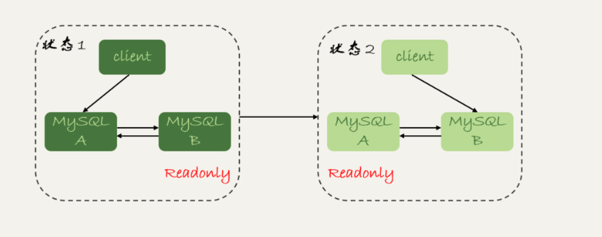
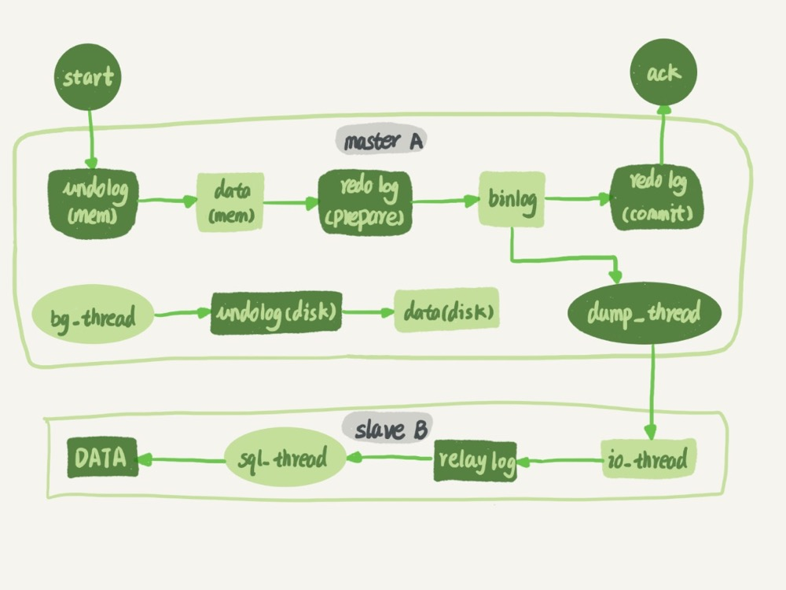
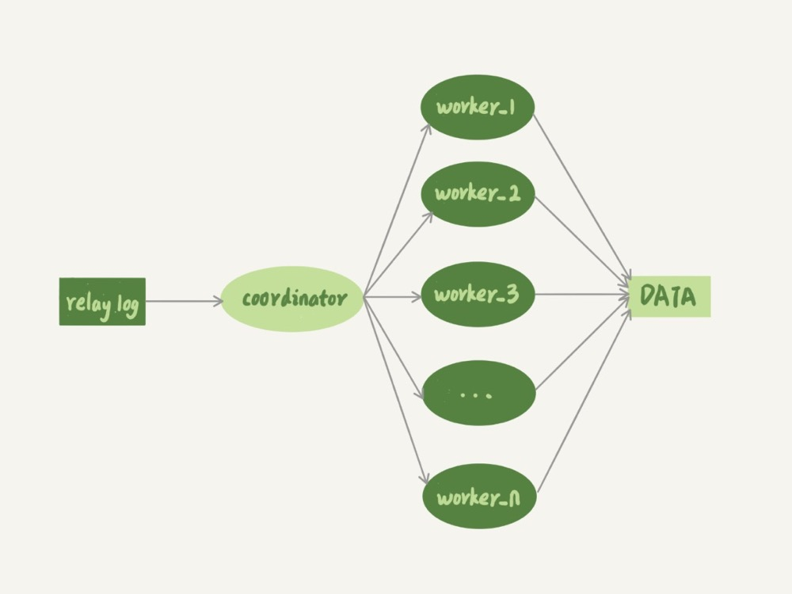

## MySQL 保证高可用

### 一、主备延迟

与同步延迟有关的时间点：

1. 主库 A 执行完一个事务，写入 binlog，把这个时刻记为 T1，每个事务的 binlog 里面都有一个时间字段，用于记录主库上写入的时间
2. 之后传给备库 B，把备库B 接收完这个 binlog 的时刻记为 T2
3. 备库 B 执行完成这个事务，把这个时刻记为 T3

使用 ` show slave status; ` 命令可以看到 `  seconds_behind_master`  用于表示当前备库延迟了多少秒，这个值就是 `T3 - T1`  精度为秒。

主备库机器的系统时间设置不一致，会不会导致主备延迟的值不准？不会，备库连接到主库时，会通过执行 ` select unix_timestamp()` 函数来获得当前主库的系统时间。如果发现主库的系统时间与自己不一致，备库在执行 `seconds_behind_master` 计算的时候会自动扣掉这个值。

网络正常情况下，T2-T1 的值非常小；主备延迟的主要来源是备库接收完 binlog 和执行这个事务之间的时间差。因此主备延迟最直接的表现是，备库消费中转日志（relay log）的速度，比主库生产 binlog 的速度要慢，接下来看下有哪些原因导致的？

### 二、主备延迟的原因

##### 1. 备库所在的机器性能差

有人会想，反正备库没有请求，可以用差一点的机器，或者把很多备库集中在一台机器上。其实，更新操作对 IOPS（系统磁盘的每秒读写次数） 的压力在主库和备库是无差别的。因此，一般会将备库设置为“非双1”的模式。（双1 模式 redo log 和 binlog 会立即刷新，非双1 模式会减少刷盘的次数）

##### 2. 备库的压力大

大家对主库的使用比较克制，但有时候会忽视对备库的压力控制，备库上的查询耗费了大量的 CPU 资源，影响了同步速度，造成主备延迟。

通常可以一主多从，让多个从库来分担读的压力。而且从库很适合做数据的全量备份

##### 3. 大事务

因为主库上必须等事务执行完成才会写入 binlog，再传给备库。所以，如果一个主库上的语句执行 10 分钟，那这个事务很可能就会导致从库延迟 10 分钟。比如：一次性的用 delete 语句删除太多数据

##### 4. 大表DDL

DDL 修改表结构之类的操作。TODO

##### 5. 备库的并行复制能力

### 三、主备切换的策略

因为主备存在延迟，因为在做主备切换时，需要不同的策略

##### 1. 可靠性/一致性优先策略



比如这种双 MySQL结构，从状态1 切换到状态2的详细过程是这样的：

1. 判断备库B 现在的 seconds_behind_master，如果小于某个值（比如 5 秒）继续下一步，否则持续重试这一步
2. 把主库 A 改成只读状态，即把 readonly 设置为true
3. 判断备库B 的 seconds_behind_master 的值，直到这个值变为0为止；按照 T3-T1 是不可能为0 的，判断完全同步了
4. 把备库B 改成可读写状态，也就是把 readonly 设置为 false 
5. 把业务请求切到备库B

这个切换流程是有不可用时间的。在这个不可用状态中，比较耗费时间的是步骤3，可能需要耗费好几秒的时间，这也是为什么需要在步骤1 先做判断，确保 seconds_behind_master 的值足够小。如果直接切换的话，一开始主备延迟有30分钟，那么整个系统的不可用时间就会长达30分钟。

##### 2. 可用性优化策略

1. 把备库 B 改成可读写状态，也就是把 readonly 设置为 false 
2. 把主库 A 改成只读状态，也就是把 readonly 设置为 true 
3. 把业务请求切到备库B

有可能造成数据不一致的情况，比如有两条 sql 语句

```
sql1: insert into t(c) values(4);
sql2: insert into t(c) values(5);
```

如果设置 binlog_format=mixed 或者 statement，A 执行了 sql1，并且把 sql1 同步给备库了；此时发生主备切换，sql2 被 B 执行了。就会出现数据库 A 和 B 之间的数据不一致。

如果设置 binlog_format=row 时，因为 row 格式在记录 binlog 的时候，会记录新插入的行的所有字段值，所以最后只会有一行不一致。而且，两边的主备同步的应用线程会报错 duplicate key error 并停止。也就是说，这种情况下，备库 B 的 (5,4) 和主库 A 的 (5,5) 这两行数据，都不会被对方执行

总结：

1. 使用 row 格式的 binlog 时，数据不一致的问题更容易被发现。而使用 mixed 或者 statement 格式的 binlog 时，数据很可能悄悄地就不一致了。如果你过了很久才发现数据不一致的问题，很可能这时的数据不一致已经不可查，或者连带造成了更多的数据逻辑不一致
2. 主备切换的可用性优先策略会导致数据不一致。因此，大多数情况下，我都建议你使用可靠性优先策略。毕竟对数据服务来说的话，数据的可靠性一般还是要优于可用性的

### 三、备库的并行复制

如果备库执行日志的速度持续低于主库生成日志的速度，那这个延迟就有可能成了小时级别。而且对于一个压力持续比较高的主库来说，备库很可能永远都追不上主库的节奏。因此备库用于执行 relay log 的 sql_thread 线程可以是多线程。



mysql 5.6 版本之前，只支持单线程复制，由此在主库并发高、TPS 高时就会出现严重的主备延迟问题。原来的 sql_thread（coordinator） 不再直接更新数据，只负责读取中转日志和分发事务。真正更新日志的，变成了 worker 线程。而 work 线程的个数，就是由参数 slave_parallel_workers 决定的。



如何将事务分发给 worker 呢？

- 事务之间是有一定的顺序的，同一行的两个事务，在主库和备库上的执行顺序相反，会导致主备不一致。不能造成更新覆盖。要求同一行的两个事务，必须被分发到同一个 worker 中
- 同一事务的多个更新语句，如果分给多个不同的 worker 线程。虽然最终的结果是主备一致的，但是如果表 t1 执行完成的瞬间，备库有一个查询，就会看到这个事务“更新了一半的结果”，破坏了事务逻辑的隔离性。因此，同一个事物不能被拆开，必须放到同一个 worker 中

https://time.geekbang.org/column/article/77083


