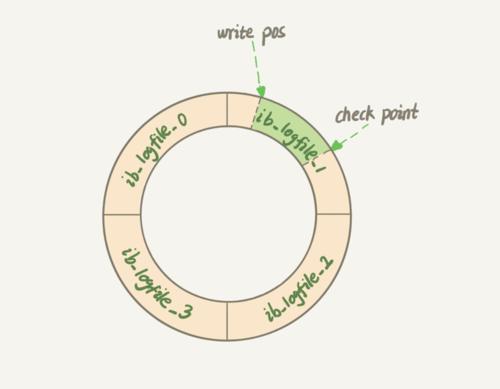
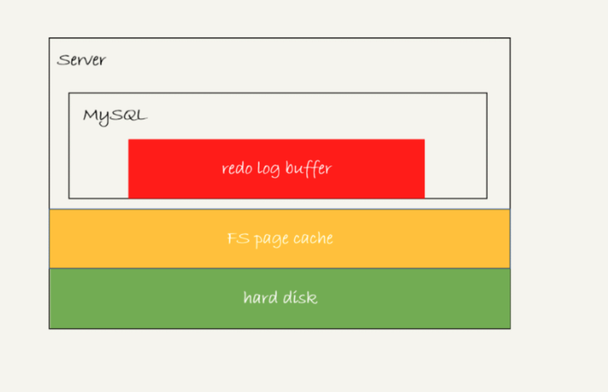
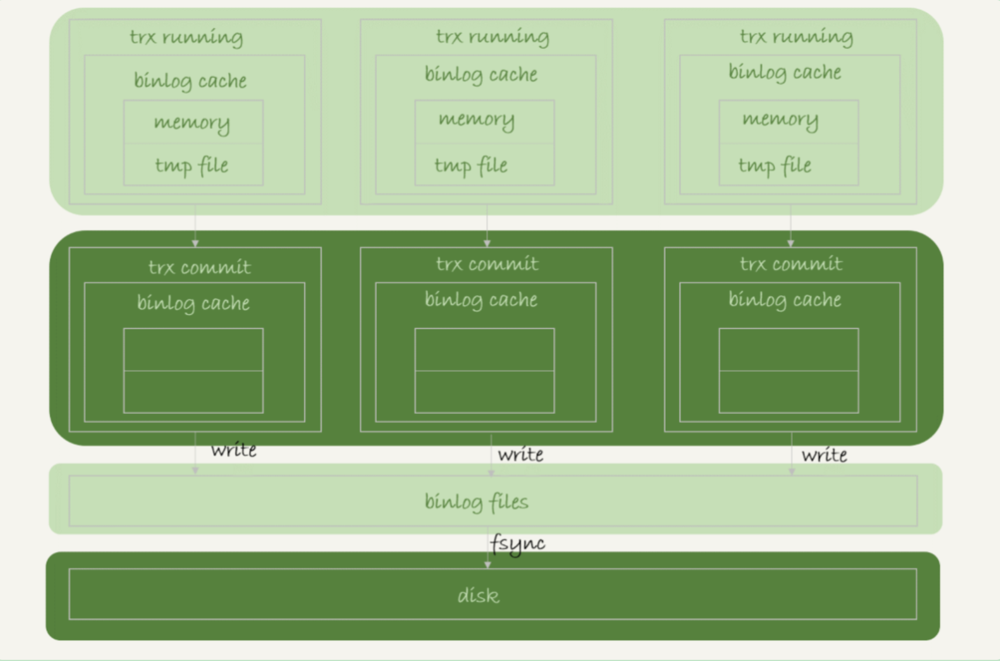

## 一、redo log

redo log 是 innodb 引擎特有的日志。是固定大小的，比如可以配置为一组 4 个文件，每个文件的大小是 1GB，是一个环状，如下



Write pos 是当前记录的位置，一边写一边后移，写到第3号文件末尾后就回到0号文件开头。checkpoint 是当前要擦除的位置，也是往后推移并且循环的，擦除记录前要把记录更新到数据文件。如果 write pos 追上 checkpoint，这时不能再执行新的更新，得停下来擦除一些记录，把 checkpoint 推进一下。

有了 redo log，InnoDB 就可以保证即使数据库发生异常重启，之前提交的记录都不会丢失，这个能力称为 crash-safe。

#### 1. redo log 的写入机制



redo log 可能存在三种状态：

1. 存在 redo log buffer 中，物理上是在 MySQL 进程内存中，图中红色部分
2. 写入磁盘（Write），但是没有持久化（fsync），物理上是在文件系统的 page cache 里面，图中黄色部分
3. 持久化到磁盘，对应的是 hard disk，图中绿色部分

redo log 的写入策略，InnoDB 提供了 innodb_flush_log_at_trx_commit 参数，他有三种可能取值

1. 设置为 0 的时候，表示每次事务提交时都只是把 redo log 留在 redo log buffer 中 ；InnoDB 有一个后台线程，每隔一秒，就会把 redo log buffer 中的日志，调用 write 写到文件系统的 page cache，然后调用 fsync 持久化到磁盘。
2. 设置为 1 的时候，表示每次事务提交时都将 redo log 直接持久化到磁盘；
3. 设置为 2 的时候，表示每次事务提交时都只是把 redo log 写到 page cache，不进行 fsync 操作。如果操作系统宕机，将丢失还没有刷入磁盘的数据

插入数据 50w 条的测试结果，每次插入完就显示的 commit 

| Innodb_flush_log_at_trx_commit | 执行所用时间  |
| ------------------------------ | ------------- |
| 0                              | 13.90 秒      |
| 1                              | 1 分 53.11 秒 |
| 2                              | 23.57 秒      |

虽然可以设置 Innodb_flush_log_at_trx_commit 为 0 或者 2，提高事务提交的性能，但同时也丧失了事务的 ACID 特性。可以从业务层面优化，比如 50w 条数据一起插入后做一次 commit。

注：事务执行中间过程的 redo log 也是直接写在 redo log buffer 中的，这些 redo log 也会被后台线程一起持久化到磁盘。也就是说，一个没有提交的事务的 redo log，也是可能已经持久化到磁盘的。也就是说，redo log 在事务进行中不断的被写入，而 binlog 只有在事务提交完成后进行一次写入。

还有两个场景会让一个没有提交的事务的 redo log 写入到磁盘中

1. 一种是，redo log buffer 占用的空间即将达到 innodb_log_buffer_size 一半的时候，后台线程会主动写盘。注意，由于这个事务并没有提交，所以这个写盘动作只是 write，而没有调用 fsync，也就是只留在了文件系统的 page cache。
2. 另一种是，并行的事务提交的时候，顺带将这个事务的 redo log buffer 持久化到磁盘。假设一个事务 A 执行到一半，已经写了一些 redo log 到 buffer 中，这时候有另外一个线程的事务 B 提交，如果 innodb_flush_log_at_trx_commit 设置的是 1，那么按照这个参数的逻辑，事务 B 要把 redo log buffer 里的日志全部持久化到磁盘。这时候，就会带上事务 A 在 redo log buffer 里的日志一起持久化到磁盘
3. 如果 write pos 追上 checkpoint 位置，就需要先将记录刷到磁盘

如果把 innodb_flush_log_at_trx_commit 设置成 1，那么 redo log 在 prepare 阶段就要持久化一次，因为有一个崩溃恢复逻辑是要依赖于 prepare 的 redo log，再加上 binlog 来恢复的。每秒一次后台轮询刷盘，再加上崩溃恢复这个逻辑，InnoDB 就认为 redo log 在 commit 的时候就不需要 fsync 了，只会 write 到文件系统的 page cache 中就够了。因为即使 redo log 没有持久化到磁盘，崩溃恢复的时候也可以通过 binlog 来恢复。

通常我们说 MySQL 的“双 1”配置，指的就是 sync_binlog 和 innodb_flush_log_at_trx_commit 都设置成 1。也就是说，一个事务完整提交前，需要等待两次刷盘，一次是 redo log（prepare 阶段），一次是 binlog。

##### 2. redo log 的内容

redo log buffer 和 redo log file 都是以块（block）的方式进行保存的，称为重做日志块，每块的大小为 512 字节。如果一个页中产生的重做日志数量大于 512 字节，那么需要分割为多个重做日志块进行存储。由于重做日志块的大小和磁盘扇区大小一样，都是 512 字节，因此重做日志的写入可以保证原子性，不需要 doublewrite 技术。

比如：INSERT 操作，其记录的是每个页上的变化，对于一张表 ` create table t(a int, b int, promary key(a), key(b)); ` 如果执行 SQL 语句 ` insert into t select 1, 2; ` 由于需要对聚集索引页和辅助索引页进行操作，其记录的重做日志大致为：

```
page(2, 3), offset 32, value 1,2    # 聚集索引
page(2, 4), offset 64, value 2      # 辅助索引
```

重做日志是物理日志，因此是幂等的；而对比 binlog 则不是，即使设置 ROW 模式，也有可能插入多条重复的记录。 

##### 2. 组提交机制

这个时候，如果MySQL 看到的 TPS 是每秒两万的话，每秒就会写四万次磁盘。但是磁盘的能力也就两万，如何实现MySQL 两万的TPS？

LSN（Log Sequence Number）代表的是日志序列号。在 InnoDB 中，LSN 占 8 个字节，并且单调递增。

- LSN 表示事务写入重做日志的字节的总量，单位是字节
- 在每个页的头部，有一个值 FIL_PAGE_LSN 记录了该页的 LSN。在页中，LSN 表示该页最后刷新时 LSN 的大小。因为重做日志记录的是每个页的日志，因此页中的 LSN 用来判断页是否需要进行恢复操作

使用组提交机制
https://time.geekbang.org/column/article/76161

##### 3. WAL（Write-Ahead Logging） 机制

即先写日志，在写磁盘。WAL 机制主要得益于两个方面：

1. redo log 和binlog 都是顺序写，磁盘的顺序写比随机写速度要快
2. 组提交机制，可以大幅降低磁盘的 IOPS 消耗

##### 4. MySQL 出现 IO 性能瓶颈，有哪些方法提升性能？

1. 设置 binlog_group_commit_sync_delay 和 binlog_group_commit_sync_no_delay_count 参数，减少 binlog 的写盘次数。这个方法是基于“额外的故意等待”来实现的，因此可能会增加语句的响应时间，但没有丢失数据的风险。
2. 将 sync_binlog 设置为大于 1 的值（比较常见是 100~1000）。这样做的风险是，主机掉电时会丢 binlog 日志。
3. 将 innodb_flush_log_at_trx_commit 设置为 2。这样做的风险是，主机掉电的时候会丢数据。

不建议你把 innodb_flush_log_at_trx_commit 设置成 0。因为把这个参数设置成 0，表示 redo log 只保存在内存中，这样的话 MySQL 本身异常重启也会丢数据，风险太大。而 redo log 写到文件系统的 page cache 的速度也是很快的，所以将这个参数设置成 2 跟设置成 0 其实性能差不多，但这样做 MySQL 异常重启时就不会丢数据了，相比之下风险会更小。

## 二、binlog

MySQL server层的日志binlog（归档日志）

#### 1. 为什么会有两份日志呢？

- 因为最开始 MySQL 里并没有 InnoDB 引擎。MySQL 自带的引擎是 MyISAM，但是 MyISAM 没有 crash-safe 的能力，binlog 日志只能用于归档
- 而 InnoDB 是另一个公司以插件形式引入 MySQL 的，既然只依靠 binlog 是没有 crash-safe 能力的，所以 InnoDB 使用另外一套日志系统——也就是 redo log 来实现 crash-safe 能力

#### 2. redo log 和 binlog 的区别

- redo log 是 InnoDB 引擎特有的；binlog 是 MySQL 的 Server 层实现的，所有引擎都可以使用。
- redo log 是物理日志，记录的是“在某个数据页上做了什么修改”；binlog 是逻辑日志，记录的是这个语句的原始逻辑，比如“给 ID=2 这一行的 c 字段加 1 ”。
- redo log 是循环写的，空间固定会用完；binlog 是可以追加写入的。“追加写”是指 binlog 文件写到一定大小后会切换到下一个，并不会覆盖以前的日志。

#### 3. binlog 的写入机制

binlog 的写入逻辑：事务执行过程中，先把日志写到 binlog cache，事务提交时，再把binlog cache写入binlog文件中。

一个事务的binlog 是不能被拆开的，要确保一次性写入。系统会给 binlog cache 分配一片内存，每个线程一个，参数 binlog_cache_size 用于控制单个线程内 binlog cache 所占用内存的大小。如果超过了这个参数规定的大小，就要暂存到磁盘。

事务提交的时候，执行器把binlog cache 里的完整事务写入到 binlog 中，并清空 binlog cache。



每个线程有自己 binlog cache，但是共用同一份 binlog 文件。

- 图中的 write，指的就是指把日志写入到文件系统的 page cache，并没有把数据持久化到磁盘，所以速度比较快。
- 图中的 fsync，才是将数据持久化到磁盘的操作。一般情况下，我们认为 fsync 才占磁盘的 IOPS。

write 和 fsync 的时机，是由参数 sync_binlog 控制的：

1. sync_binlog=0 的时候，表示每次提交事务都只 write，不 fsync；
2. sync_binlog=1 的时候，表示每次提交事务都会执行 fsync；
3. sync_binlog=N(N>1) 的时候，表示每次提交事务都 write，但累积 N 个事务后才 fsync。

因此，在出现 IO 瓶颈的场景里，将 sync_binlog 设置成一个比较大的值，可以提升性能。在实际的业务场景中，考虑到丢失日志量的可控性，一般不建议将这个参数设成 0，比较常见的是将其设置为 100~1000 中的某个数值。但是，将 sync_binlog 设置为 N，如果主机异常重启，会丢失最近 N 个事务的 binlog 日志


