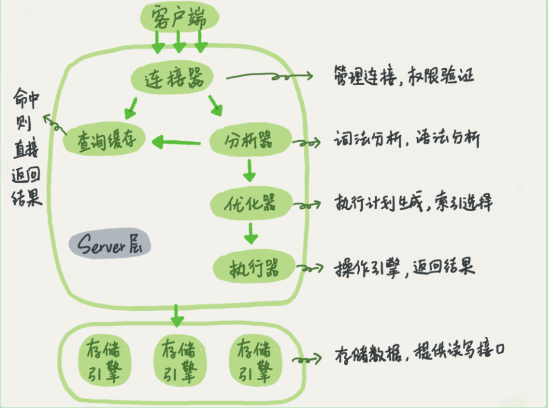
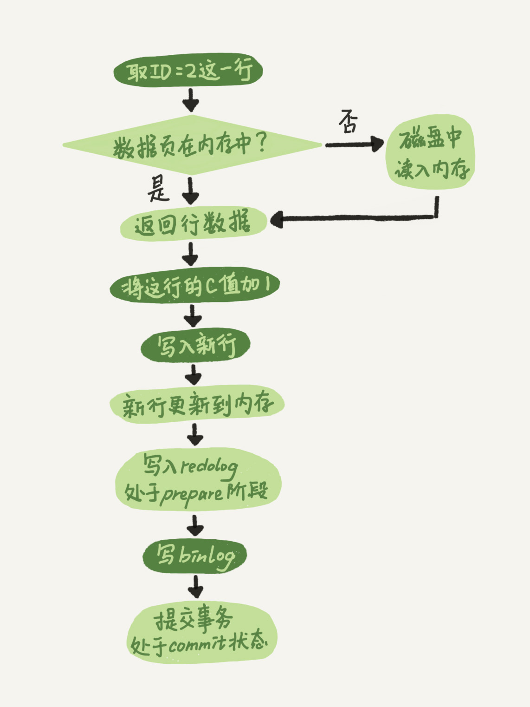

## 查询SQL语句的执行流程

Mysql的逻辑架构图



### 一、连接器

**作用**：负责与客户端建立连接、获取权限、维持和管理连接

**流程**：

1. 用户使用 mysql 这个客户端，尝试与连接器进行三次握手

2. 连接器开始认证身份，使用输出的用户名和密码

   1. 如果用户名和密码不对，会收到 `Access denied for user` 的错误。客户端程序结束

   2. 用户名密码认证通过，连接器会到权限表中查出此账号的权限。之后，这个连接里面的权限判断逻辑，都依赖于此时读到的权限

      注：用户连接成功后，这个用户的权限被修改，也不会影响已经存在连接的权限。修改权限后，只有再新建的连接才会使用新的权限设置

3. 客户端处于空闲时间由 ` wait_timeout ` 控制，默认8小时，超过此时间则连接器会断开与客户端连接。

   断开后，客户端再次发送请求，会有错误提醒：`Lost connection to MySQL server during query` 。客户端想继续操作，则需要重连。

**问题**：

Mysql在执行过程中临时使用的内存是管理在连接对象中的，这些资源会在连接断开时才释放。所以长连接累积下来，可能导致内存占用太大。方案如下：

1. 定期断开长连接。使用一段时间，或者程序里面判断执行过一个占用内存的大查询后，断开连接，之后要查询在重连
2. 如果使用的是 mysql 5.7 或更新版本，可以在每次执行一个比较大的操作后，通过执行 mysql_reset_connection 来重新初始化连接资源。这个过程不需要重连和重新做权限验证，但会将连接恢复到刚刚创建完成时的状态。

### 二、查询缓存

查询缓存中存储的是 key-value 对，key是查询的语句，value 是查询的结果。如果查询能够直接在这个缓存中找到key，那么这个value 就会被直接返回给客户端。如果语句不在查询缓存中，就会继续后面的执行阶段，执行完成之后，执行结果会存入查询缓存中。

**不建议使用查询缓存**：查询缓存的实效非常频繁，只要对一个表更新，这个表上所有的查询缓存都会被清空。查询缓存的命中率会非常低。根据业务的场景使用

```shell
# 设置查询缓存的参数
mysql> show variables like '%query_cache_type%';
+------------------+-------+
| Variable_name    | Value |
+------------------+-------+
| query_cache_type | OFF   |
+------------------+-------+
```

对于确定要使用查询缓存的语句，可以使用 `SQL_CACHE`显示指定

```shell
select SQL_CACHA * from T where ID=10;
```

### 三、分析器

词法分析、语法分析

### 四、优化器

优化器是在表里面有多个索引的时候，决定使用那个索引；或者在一个语句有多表关联（join）时，决定各表的连接顺序。

```
select * from t1 join t2 using(ID) where t1.c=10 and t2.d=20;
```

- 既可以先从表 t1 里面取出 c=10 的记录的 ID 值，再根据 ID 值关联到表 t2，再判断 t2 里面 d 的值是否等于 20。
- 也可以先从表 t2 里面取出 d=20 的记录的 ID 值，再根据 ID 值关联到 t1，再判断 t1 里面 c 的值是否等于 10。

这两种执行方法的逻辑结果时一样的，但是执行的效率会有不同，优化器的作用就是决定使用那一个方案

### 五、执行器

首先判断账户对这个表有没有执行查询的权限（工程实现上：查询会在优化器之前调用 precheck验证权限）

打开表的时候，执行器会根据表的引擎定义，去使用这个引擎提供的接口。比如查询语句：`select * from T where ID=10;` 表 T 中 ID 字段没有索引。执行器的执行流程：

1. 调用 InnoDB 引擎接口取这个表的第一行，判断 ID 值是不是 10，如果不是则跳过，如果是则将这行存在结果集中
2. 调用引擎接口取下一行，重复相同的逻辑，直接取到这个表的最后一行
3. 执行器将上述遍历过程中所有满足条件的行组成的记录集作为结果集返回给客户端

对于有索引的表，执行的逻辑也差不多，第一次调用的是“取满足条件的第一行”这个接口，之后循环取“满足条件的下一行”这个接口，这些接口都是引擎中已经定义好的。

## 更新SQL语句的执行流程

与查询流程不同的是，更新SQL涉及到 redo log（重做日志）和 binlog（归档日志）

### 一、redo log

 是 InnoDB 引擎的特有的日志模块，固定大小，比如配置4个文件，每个文件1GB，就可以记录4GB的操作。类似于环形链表，可以循环写入

有两个记录 write pos 和 checkpoint。

1. write pos ：当前记录的位置，边写边后移

2. checkpoint：当前要擦除的位置，边擦除边后移，擦除记录前要把记录更新到数据文件

   注：如果 write pos 追上 checkpoint，此时不能在执行新的更新，得停下来擦掉一些记录，把checkpoint 推进一下

作用：InnoDB 保证了即使数据库发生异常重启，之前提交的记录都不会丢失，这个能力成为 crash-safe 

### 二、binlog

mysqld server 层的日志 binlog，最开始 mysql 自带引擎是 MyISAM，但 MyISAM 没有 crash-safe 能力，binlog 日志只能用于归档。InnoDB 是以插件形式引入 MySQL 中的，因此InnoDB 使用 redo log 来实现 crash-safe 能力。

### 三、redo log 和 binlog 的对比

1. redo log 是 InnoDB 引擎特有的；binlog 是MySQL 的server 层实现的，所有引擎都可以使用
2. redo log 是物理日志，记录的是“在某个数据页上做了什么修改”；binlog 是逻辑日志，记录的是这个语句的原始逻辑，比如“给ID=2这一行的c字段加1”
3. redo log 是循环写的，空间固定会用完；binlog 是可以追加写入的，binlog 文件写到一定大小会切换下一个

### 四、更新 SQL 语句的流程

1. 执行器先找引擎取 ID=2 这一行。如果 ID=2 这一行所在的数据页本来就在内存中，就直接返回给执行器；否则需要从磁盘读入内存，在返回
2. 执行器拿到引擎给的行数据，给这个值加1，得到新的一行数据，在调用引擎接口写入这行新数据
3. 引擎将这行新数据更新到内存中，同时将这个更新操作记录到 redo log 中，此时 redo log 处于 prepare 状态。然后告知执行器执行完成了，随时可以提交事务
4. 执行器生成这个操作的 binlog，并把binlog 写入磁盘
5. 执行器调用引擎的提交事务接口，引擎把刚刚写入的 redo log 改成提交（commit）状态，更新完成



将 redo log 的写入拆成了两个步骤：prepare和commit，这就是两阶段提交。

### 五、让数据库恢复到半个月内任意一秒的状态

binlog 记录所有的逻辑操作，并且采用的是“追加写”的形式。如果数据承诺半个月内任意一秒的状态，那么备份系统中一定会保存最近半个月的所有binlog，同时系统会定期做整库备份。这里的定期取决于数据的重要性，可以是一天一备，也可以是一周一备

当需要恢复到指定的某一秒时，比如某天下午12:01 有一次误删表，需要找回数据，可以这么做：

- 首先，找到最近的一次全量备份，可能就是昨天晚上的一个备份，从这个备份恢复到临时库
- 然后，从备份的时间点开始，将备份的 binlog 依次取出来，重放到中午误删表之前的那个时刻

### 六、为什么日志会有两阶段提交

使用反证法，如果不用两阶段提交，要么就是写完 redo log 在写 binlog，或者反过来的顺序。会出现什么问题呢？

假设执行的是 `update T c = c+1 where ID = 2`。

1. 先写 redo log 后写 binlog。假设在 redo log 写完，binlog 还没有写完的时候，MySQL 进程异常重启。由于我们前面说过的，redo log 写完之后，系统即使崩溃，仍然能够把数据恢复回来，所以恢复后这一行 c 的值是 1。但是由于 binlog 没写完就 crash 了，这时候 binlog 里面就没有记录这个语句。因此，之后备份日志的时候，存起来的 binlog 里面就没有这条语句。然后你会发现，如果需要用这个 binlog 来恢复临时库的话，由于这个语句的 binlog 丢失，这个临时库就会少了这一次更新，恢复出来的这一行 c 的值就是 0，与原库的值不同。
2. 先写 binlog 后写 redo log。如果在 binlog 写完之后 crash，由于 redo log 还没写，崩溃恢复以后这个事务无效，所以这一行 c 的值是 0。但是 binlog 里面已经记录了“把 c 从 0 改成 1”这个日志。所以，在之后用 binlog 来恢复的时候就多了一个事务出来，恢复出来的这一行 c 的值就是 1，与原库的值不同。

如果不采用两阶段提交，那么数据库的状态就有可能和用它的日志恢复出来的库状态不一致。

场景：不只是误操作需要日志来恢复数据。当我们扩容的时候，也就是再多搭建一些备库来增加系统读能力的时候，平常的做法也是全量备份加上应用 binlog 来实现，这个不一致会导致线上主从数据库不一致的情况。

注：上面的两阶段提交，任何一步失败，则事务回滚。且如果不使用两阶段提交，那么数据库的状态就有可能和用它的日志恢复出来的库的状态不一致。

` innodb_flush_log_at_trx_commit` 这个参数设置成1的时候，表示每次事务的 redo log 都直接持久化到磁盘。可以保证mysql异常重启之后数据不丢失。

` sync_binlog` 参数设置成1 的时候，表示每次事务的 binlog 都持久化到磁盘。可以保证mysql异常重启之后binlog 不丢失。