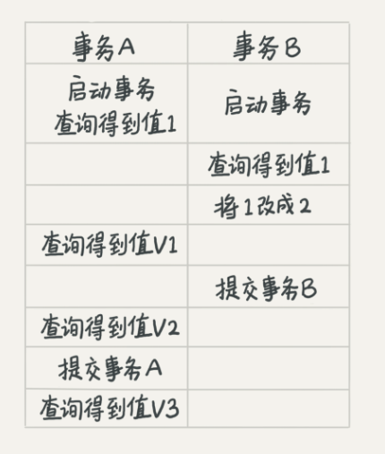
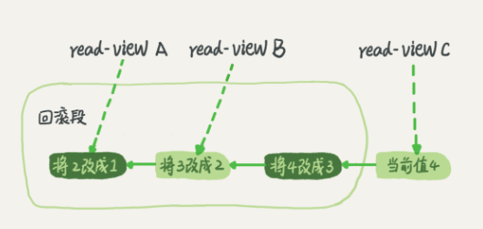

## 事务

事务保证一组数据库操作，要么全部成功，要么全部失败。在 MySQL中，事务支持是在引擎层实现的。

### 一、事务的 ACID 特性

ACID（Atomicity、Consistency、Isolation、Durability，即原子性、一致性、隔离性、持久性）

- 原子性：数据库事务是不可分割的工作单元。事务中的数据库操作都执行成功，才算整个事务成功；事务中任何一个SQL语句执行失败，已经执行成功的SQL语句也必须撤销，数据库保持应该退回到执行事务前的状态

- 一致性：事务将数据库从一种状态转变为下一种一致的状态。在事务开始之前和事务结束以后，数据库的完整性约束没有被破坏。而且一致性依赖于应用层开发者，数据库会保证所有的约束没有被打破，业务应该保证对数据有一定的约束。

    1. 比如 A要向B支付100元,而A的账户中只有90元,并且我们给定账户余额这一列的约束是,不能小于0.那么很明显这条事务执行会失败,因为90-100=-10,小于我们给定的约束了。这是不满足数据库的约束，支付之前我们数据库里的数据都是符合约束的,但是如果事务执行成功了,我们的数据库数据就破坏约束了,因此事务不能成功,这里我们说事务提供了一致性的保证。
    2. A要向B支付100元,而A的账户中只有90元,我们的账户余额列没有任何约束.但是我们业务上不允许账户余额小于0.因此支付完成后我们会检查A的账户余额,发现余额小于0了,于是我们进行了事务的回滚。如果事务执行成功,虽然没有破坏数据库的约束,但是破坏了我们应用层的约束.而事务的回滚保证了我们的约束,因此也可以说事务提供了一致性保证。ps:事实上,是我们应用层利用事务回滚保证了我们的约束不被破坏

    应用系统从一个正确的状态到另一个正确的状态.而ACID就是说事务能够通过AID来保证这个C的过程.C是目的,AID都是手段

- 隔离性：要求每个读写事务的对象对其他事务的操作对象能相互分离，即该事务提交前对其他事务都不可见，通过使用锁来实现。

- 持久性：事务一旦提交，其结果就是永久性的，即使发生宕机等故障，数据库也能恢复数据。但如果不是数据库本身发生故障，而是一些外部因素：RAID卡损坏、自然灾害等原因导致数据库发生问题，那么提交的数据可能都会丢失。因此持久性事务保证事务系统的高可靠性，而不是高可用性。

### 二、事务的隔离级别

当数据库上有多个事务同时执行时，会产生 脏读（dirty read）、不可重复读（non-repeatable read）、幻读（phantom read）的问题

- 脏读：读取未提交的数据，事务A读取事务B尚未提交的数据，此时如果事务B回滚，那么事务A读取的数据就是脏数据
- 不可重复读：事务前后多次读取，数据内容不一致
- 幻读：事务前后多次读取，数据总量不一致

不可重复读和幻读的区别：

- 不可重复读时是读取了其他事务更改的数据，针对 update 操作。解决：使用行级锁，锁定该行，事务A 多次读取操作完成之后才释放锁，才允许其他事务更改刚才的数据行
- 幻读是读取了其他事务新增的数据，针对 insert、delete 操作。解决：使用表级锁，锁定整张表，事务多次读取操作完成之后才释放锁

为解决这些问题，就有了隔离级别的概念，如下：

- 读未提交（read uncommitted）：一个事务还没提交时，它做的变更就能被别的事务看到
- 读提交（read committed）：一个事务提交之后，它做的变更才会被其他事务看到
- 可重复读（repeatable read）：一个事务执行过程中看到的数据，总是跟这个事务在启动时看到的数据是一致的。当然在可重复读隔离级别下，未提交变更对其他事务也是不可见的。
- 串行化（serializable ）：对于同一行记录，“写”会加“写锁”，“读”会加“读锁”。当出现读写锁冲突的时候，后访问的事务必须等前一个事务执行完成，才能继续执行



在不同的隔离级别下，事务A 会有哪些不同返回结果

- 读未提交，V1 的值就是 2 
- 读提交，V1 的值时 1，V2 的值为 2
- 可重复读，V1 和 V2 都是 1，V3 的值为 2
- 串行化，V1 和 V2 都是1，V3 的值为 2。事务 A 一开始查询值 1 的时候获取了读锁，根据两阶段加锁，事务 A 获取的锁要在 commit 的时候才释放，所以事务 B 在修改 1 为 2 的时候申请写锁会阻塞直到事务 A 提交，事务 A 提交之前获取的值都是 1。事务 A 提交后事务 B 获取到写锁完成更新操作，所以 V3 是 2

从实现上来看，数据库里面会创建一个视图，访问的时候以视图的逻辑结果为准。

- 读未提交 隔离级别下，直接返回记录上的最新值，没有视图概念
- 读已提交 隔离级别下，这个视图是在每个SQL 语句开始执行的时候创建的
- 可重复读 隔离级别下，这个视图是在事务启动时创建的，整个事务存在期间都用这个视图
- 串行化 隔离级别下，直接用加锁的方式来避免并行访问

隔离级别通过参数 transaction-isolation 设置，比如设置为 READ-COMMITTED 

### 三、事务隔离的实现

- 事务的隔离性用锁来实现
- 事务的原子性和持久性用 redo log 实现。redo log 重做日志，是物理日志，记录的是数据页的物理修改操作；用于恢复提交事务修改的页操作
- 事务的一致性用 undo log 实现。undo log 逻辑日志，根据每行记录进行记录，用于回滚 行记录 到某个特定版本

以可重复读来举例

在 MySQL 中，实际上每条记录在更新的时候都会同时记录一条回滚操作。记录上的最新值，通过回滚操作，都可以得到前一个状态的值。假设一个值从 1 被按顺序改成了2、3、4，在回滚日志（undo log）里面就有如下记录


当前值是 4，但是在查询这条记录时，不同时刻启动的事务会有不同的 read-view，这一个记录的值分别是1，2，4。当一个事务A开启的时候，会创建一个视图A，这个视图A 中数据其实并不是 1，而是针对 1 的回滚段。mysql 在读数据的时候，即使数据没有提交，读到的也是最新的值，只不过是通过回滚段将数据再回滚回初始的值。这样保证“可重复读”隔离级别中读到的永远是最初的值。对于 read-view A，要得到 1，就必须将当前值依次执行图中所有的回滚操作得到。

同一条记录在系统中可以存在多个版本，就是数据库的多版本并发控制（MVCC）（Multiversion concurrency control）。同时，即使现在有另一个事务正在将 4 改成 5，这个事务和 read-view A、B、C 对应的事务是不会冲突的

回滚日志只有当系统里没有比这个回滚日志更早的 read-view 的时候才会删除。

##### 为什么尽量不要使用长事务？

长事务意味着系统里面会存在很老的事务视图。由于这些事务随时可能访问数据库里面的任何数据，所以这个事务提交之前，数据库里面它可能用到的回滚记录都必须保留，这就会导致大量占用存储空间。

在 MySQL 5.5 及以前的版本，回滚日志是跟数据字典一起放在 ibdata 文件里的，即使长事务最终提交，回滚段被清理，文件也不会变小。因为数据和回滚段一起保存在一个文件中，不能直接删除文件。文件不会变小，是因为清除的空间仅仅是可以分配给其他数据存储，不再被回滚段占用。为了清理回滚段，只能重建整个库

长事务的存在导致锁发生冲突或等待的几率大大增加。如果某个应用有发生锁等待后尝试重新建立连接的机制，那么在发生锁等待或冲突的时候，应用就会不断地发起新的连接，导致MySQL的连接数被占用爆满。MySQL不能在提供连接服务，就挂掉了。

### 四、事务的启动方式

MySQL 的事务启动方式有以下几种：

1. 显式启动事务语句，begin 或 start transaction。配套的提交语句是 commit，回滚语句是 rollback
2. set autocommit = 0，这个命令会将这个线程的自动提交关掉。意味着如果你只执行一个 select 语句，这个事务就启动了，而且并不会自动提交。这个事务持续存在直到你主动执行 commit 或 rollback 语句，或者断开连接。

建议总是使用 ` set autocommit = 1` 通过显式语句的方式来启动事务。

可以在 information_schema 库的 innodb_trx 这个表中查询长事务。比如

```
select * from information_schema.innodb_trx where TIME_TO_SEC(timediff(now(),trx_started))>60
```

当设置为 autocommit=0 时，不会自动提交，每个事务在开始时都不需要主动执行一次“begin”，减少了语句的交互次数。可以推荐使用 `commit work and chain` 语法，设置 autocommit = 1 ，提交事务并自动开启下一个事务，功效等于 commit+begin。


