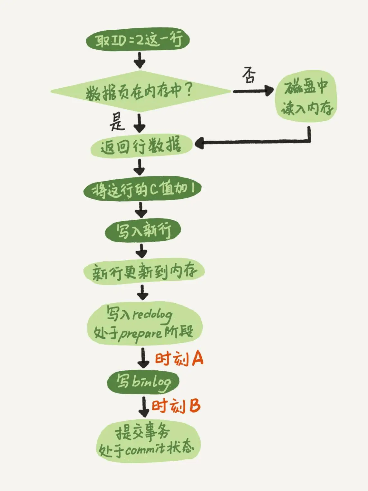

### 一、在两阶段提交的不同瞬间，MySQL如果发生异常重启，是怎么保证数据完整性的？



注意：这里的 commit 指的是事务提交的最后一步，如果没有显式开启事务，一句语句就相当于一个事务。

- 如果在时刻A，也就是写入 redo log 处于 prepare 阶段之后、写 binlog 之前，发生了崩溃（crash），由于此时 binlog 还没写，redo log 也还没提交，所以崩溃恢复的时候，这个事务会回滚。这时候，binlog 还没写，所以也不会传到备库。
- 如果在时刻B，也就是 binlog 写完，redo log 还没 commit 前发生 crash，那崩溃恢复的时候 MySQL 会
    1. 如果 redo log 里面的事务是完整的，也就是已经有了 commit 标识，则直接提交
    2. 如果 redo log 里面的事务只有完整的 prepare，则判断对应的事务 binlog 是否存在并完整
        - 如果是，则提交事务
        - 狗则，回滚事务

这两种情况都保证了主库与备库之间数据的一致性

##### 1. MySQL 如何知道 binlog 是完整的？

一个事务的 binlog 是有完整格式的：

- statement 格式 binlog，最后会有 COMMIT
- row 格式的 binlog，最后会有 XID event

在 MySQL 5.6.2 版本后，引入了 binlog-checksum 参数，用来验证 binlog 内容的正确性。

##### 2. redo log 和 binlog 如何关联

他们有一个共同的数据字段，叫 XID。崩溃恢复时，会按照顺序扫描 redo log：

- 如果碰到既有 prepare、又有 commit 的 redo log，就直接提交
- 如果碰到只有 prepare、而没有commit 的 redo log，就拿着 XID 去 binlog 找对应事务

##### 3. 为什么需要两阶段提交？干脆先 redo log 写完，在写 binlog。崩溃恢复的时候，必须两个日志都完整才可以。是不是一样的逻辑？

两阶段提交是经典的分布式系统问题，可以把 Server 层和引擎层看成两个分布式服务处理两个不同事情，redo log 在 innodb 引擎内操作，binlog 是在 server 层操作。他们要进行两个相关联的操作，就意味着实现分布式事务，两阶段提交就是其中的一种解决方案。

对于 InnoDB 引擎，如果 redo log 提交完成了，事务就不能回滚（如果允许回滚，就可能覆盖掉别的事务的更新）。而如果 redo log 直接提交，然后binlog 写入的时候失败，InnoDB 又回滚不了，数据和 binlog 日志又不一致了。两阶段提交就是给所有的分布式服务一个机会，都 Ok 的话，在一起提交。

##### 4. 如果只用 binlog 能否支持崩溃恢复和日志归档？

- 历史原因：InnoDB 并不是 MySQL 的原生存储引擎。MySQL 的原生存储引擎是 MyISAM，设计之初就没有支持崩溃恢复。而 InnoDB 在作为 MySQL 插件时，就已经是一个提供了崩溃恢复和事务支持的引擎

binlog 不支持崩溃恢复。在 InnoDB 的设计中，数据写入的时候，写到内存和 redo log、binlog 就算写完了。内存的数据有没有落盘主要看 redolog 有没有日志数据，只要 redolog 日志数据没有被 checkpoint 擦完，就代表还有数据在内存里，所以只要崩溃恢复了，就会把 redo log 的数据先恢复到内存的数据页。如果只有 binlog，无法得到这些日志哪些已经在磁盘哪些已经在内存中，起码现在的 binlog 不具备这个能力。总之，没有落盘的数据都在 redo log 里面记录着，所以他能崩溃恢复。

##### 5. 如果只用 redo log 能否支持崩溃恢复和日志归档吗？

redo log 是循环写，写到末尾要回到开头继续写，这样历史日志没有保留，redo log 也就无法归档。

binlog 被用到 MySQL 的很多地方，MySQL 高可用的基础就是 binlog 复制，主从复制之类的

##### 6. 正常运行中的实例，数据写入后的最后落盘，是从 redo log 更新过来的还是从 buffer pool 更新过来的？

redo_log记录"在某个数据页上做了什么修改"，而不是"这个数据修改后最新值是什么"。因此是需要先把磁盘的数据读入内存再执行 redo_log 中的内容的。redo_log其实并不是真正的物理日志，也是记录的数据页的逻辑日志，也是要根据之前的数据算出现在的数据的。因为如果是物理日志，那么原数据是200M,那么redo_log就得记录200M。所以redo_log实际上是逻辑和物理的组合，取物理逻辑各自的优点。

redolog 不管刷盘，redolog 只负责记录做了什么操作。当 redolog 满了，需要擦除部分 redolog 时，才会有专门的一个东西，根据 redolog 的记录操作，去查看操作的数据所在的数据页是不是脏页，如果不是脏页，直接擦掉这条记录，如果是脏页，那就把脏页刷新磁盘，然后在擦掉 redolog 中的这条记录。

1. 如果是正常运行的实例的话，数据页被修改以后，和磁盘的数据页不一致，称为脏页。最终数据落盘，就是把内存中的数据页写盘。这个过程，甚至与 redo log 无关
2. 在崩溃恢复场景中，InnoDB 如果判断到一个数据页可能在崩溃恢复的时候丢失了更新，就会将它读到内存，然后让 redo log 更新内存内容。更新完成后，内存页变成脏页，就回到了第一种情况的状态。

##### 7. redo log buffer 是什么？是先修改内存，还是先写 redo log 文件

在一个事务更新过程中，日志是要写多次的，比如下面的这个事务：

```
begin;
insert into t1 ...
insert into t2 ...
commit;
```

这个事务要往两个表中插入记录，插入数据的过程中，生成的日志都得先保存起来，但又不能在还没 commit 的时候就直接写到 redo log 文件中。所以 redo log buffer 就是一块内存，用来存 redo 日志的。也就是说，在执行第一个 insert 的时候，redo log buffer 中写入了这个日志。但是真正把日志写入 redo log 文件，是在执行 commit 语句的时候做的。

单独执行一个更新语句的时候，InnoDB 会自己启动一个事务，在语句执行完成的时候提交。过程跟上面是一样的，只不过是“压缩”到了一个语句里面完成


