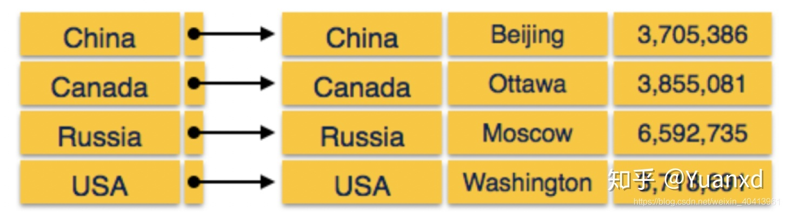

## 一、稀疏索引

对主文件中**部分记录**（形成的索引字段值），有索引项和它对应，这样的索引称为 稀疏索引.

比如 1、2、3、4、5、6、7 。稀疏索引的做法是将这 6 个值分组，1、2、3 和 4、5、6 和 7 分为不同的 3 组，取这三组中最小的索引值作为索引记录中的索引值，抽象索引记录如下：

- 1 -> 到顺序存储 1、2、3 的起始位置的指针
- 4 -> 到顺序存储 4、5、6 的起始位置的指针
- 7 -> 到顺序存储 7 的起始位置的指针

### 1. 稀疏索引如何定位记录

定位索引字段值为 K 的记录，需要通过二分查找来确认数据位置

- 首先找到相邻的小于 K 的最大索引字段值所对应的索引项
- 从该索引项所对应的记录开始顺序进行检索

稀疏索引的使用要求：主文件必须是按照对应索引字段属性排序存储

相比稠密索引：空间占用更少，维护任务更轻，但速度较慢

## 二、稠密索引

对于主文件中**每一个记录**（形成的每一个索引字段值），都有一个索引项和它对应，指明该记录所在位置，这样的索引称为 稠密索引

先查索引，然后再根据索引读主文件。

这两种不同的索引实现，一种建立了索引值与数据位置的 1:1 的关系，一种建立了索引值与数据位置 1:n 的关系。在大多数场景下稠密索引查询效率更高，稀疏索引占用空间更小。