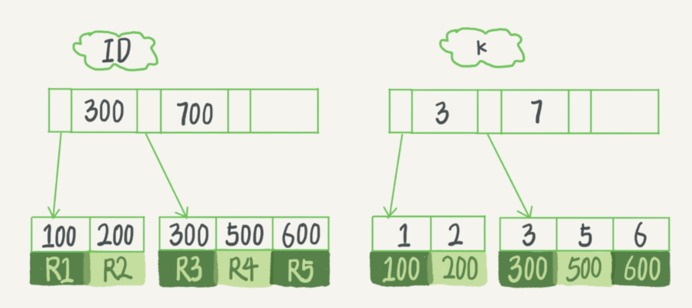
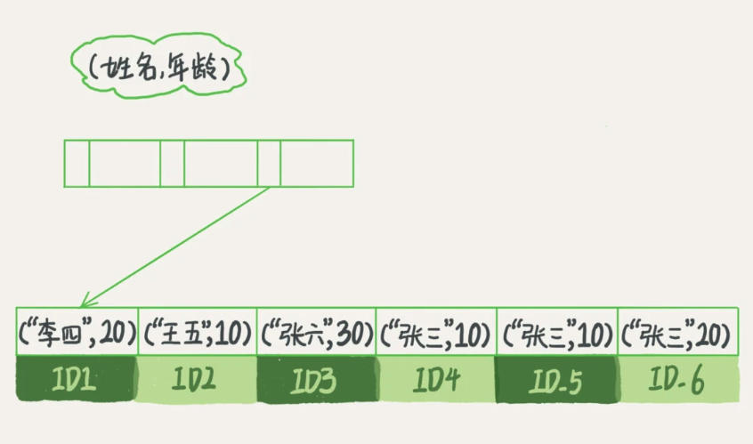
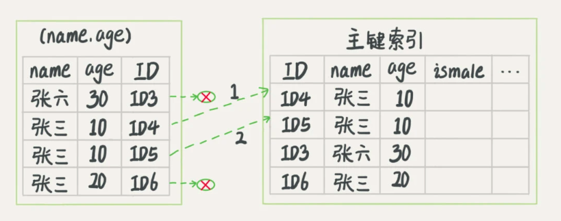

## InnoDB索引模型

InnoDB 使用 B+ 树索引模型，数据存储在 B+ 树中，每一个索引在 InnoDB 里面对应一棵 B+ 树。

根据叶子节点的内容，索引类型分为主键索引和非主键索引。

- 主键索引：也是聚簇索引，叶子节点存的是整行数据
- 非主键索引：也称为 二级索引，叶子节点存的是主键的值。也就是说，基于非主键索引的查询需要多扫描一颗索引树。

### 一、索引维护

建表语句：` create table T(id int primary key, k int not null, name varchar(16),index (k))engine=InnoDB; `



其中 ID 是主键、k 是普通索引。

B+树为了维护索引有序性，在插入新值的时候需要做必要的维护。比如要插入ID 为 400 的一行数据，需要逻辑上挪动后面的数据，空出位置。更糟的是，如果R5 所在的数据页已经满了，根据B+树的算法，需要申请一个新的数据页，然后挪动部分数据过去，这个过程叫做“**页分裂**”，这种情况下：

- 性能会受影响
- 而且页分裂还影响数据页的利用率，原本放在一页的数据要分到两个页中，整体空间利用率降低大约 50% 。当相邻两个页由于删除了数据，利用率很低之后，会将数据页做合并。

##### 1. 为什么要求建表语句一定要有自增主键？

性能角度：自增主键的插入数据模式，每次插入一条新记录，都是追加操作，都不涉及到挪动其他记录，也不会触发叶子节点的分裂。性能较高。

存储角度：由于每个非主键索引的叶子节点上都是主键的值，所以主键长度越小，普通索引的叶子节点就越小，普通索引占用的空间也就越小。

但是还有一些场景，比如

1. 只有一个索引
2. 该索引是唯一索引

由于没有其他索引也就不用考虑其他索引的叶子节点大小问题，是典型的 KV 场景。直接将这个索引设置为主键，可以避免每次查询需要搜索两棵树

### 二、回表

还是用上面的图，执行 ` select * from T where k between 3 and 5 ` 。会如何执行呢？

1. 在 k 索引树上找到 k=3 的记录，取得 ID = 300；
2. 再到 ID 索引树查到 ID=300 对应的 R3；
3. 在 k 索引树取下一个值 k=5，取得 ID=500；
4. 再回到 ID 索引树查到 ID=500 对应的 R4；
5. 在 k 索引树取下一个值 k=6，不满足条件，循环结束。

在这个过程中，回到主键索引树搜索的过程，我们称为回表。这个查询过程读了 k 索引树的 3 条记录，回表了两次。

为什么还要取下一个值 k=6 呢？因为普通索引不一定是唯一的。引擎内部在 k 索引树读了三个记录，但是对于 MySQL 的 server 层来说，他就是找引擎拿到了两条记录，因此MySQL 认为扫描行数为 2 

因为查询结果所需要的数据只在主键索引上有，所以不得不回表。可以优化索引，避免回表过程吗？

### 三、覆盖索引

`select ID from T where k between 3 and 5` 。我们只需要查 ID 的值，而 ID 的值已经在 k 索引树上了，因此可以直接提供查询结果，不需要回表。也就是说，索引 K 已经覆盖了我们的查询需求，我们称为覆盖索引。

覆盖索引可以减少树的搜索次数，显著提升查询性能，因此使用覆盖索引是一个常用的性能优化手段。

建立联合索引，也是一种覆盖索引。比如在一个市民信息表上，又一个高频请求要根据市民的身份证号查询他的名字。将身份证号和名字建立联合索引，给id_card 和 name建立联合索引后，name的值也会被保存在id_card索引树的节点上，这样根据给定id_card的值找到的对应行时，就可以直接获取到name了，而不需要拿着对应的主键再进行回表操作。

### 四、联合索引

也是一棵 B+ 树，不同的是联合索引的键值的数量大于等于 2。是按照字段顺序依次来排序的。

比如索引（a, b），针对单个 a 列的查询可以使用这个索引，对 a 和 b 的查询也可以使用。但是不能使用只针对 b 列的查询。

### 四、最左前缀原则

如果要按照市民的身份证号去查他的家庭地址？虽然这个查询概率不高，但总不能让他全表扫描吧。单独为一个不频繁的请求创建一个（身份证号，家庭地址）又感觉有点浪费。可以使用 B+树这种索引结构，利用索引的“最左前缀”，来定位记录。

比如有 （name，age）这个联合索引。我有一个 sql 语句 ` where name like '张%';` 于是找到第一个符合条件的 ID3，然后向后遍历，直到不满足条件为止。


如果合理的安排联合索引内的字段顺序，提高索引的复用能力。因为有了联合索引（a，b）后，一般就不需要单独在 a 上建立索引了。注意：查询条件里面只有 b 的语句是无法使用（a，b）这个联合索引的。

如果我们有联合索引（a，b），都有查询条件只有 a 和查询条件只有 b 的语句，这时就需要考虑空间了。比如 a 字段比 b 字段大，那可以创建一个（a，b）的联合索引和一个 b 的单字段索引。

### 五、索引下推

如果有这样的 ` select * from tuser where name like '张%' and age=10; ` 当有联合索引（name，age）时，不用每次找完 name 后再回表查询看 age 是否满足条件。而是直接在联合索引中判断，直接过滤掉不满足条件的记录，减少回表次数。


### 六、联合索引的问题

```sql
CREATE TABLE `geek` (
  `a` int(11) NOT NULL,
  `b` int(11) NOT NULL,
  `c` int(11) NOT NULL,
  `d` int(11) NOT NULL,
  PRIMARY KEY (`a`,`b`),
  KEY `c` (`c`),
  KEY `ca` (`c`,`a`),
  KEY `cb` (`c`,`b`)
) ENGINE=InnoDB;
```

如上建立了多个索引，

- 主键 a，b 的聚簇索引组织顺序相当于 `order by a，b` 语句。也就是先按 a 排序，在按 b 排序，c 无序。
- 索引 ca 的组织是按 c 先排序，在按 a 排序，同时叶子节点是 主键（但是这里是 b），会去重。
- 索引 cb 的组织是先按 c 排序，在按 b 排序，同时叶子节点是 主键（这里是 a），会去重
- 索引 c 的的叶子节点是联合索引（a，b），和 索引 ca 一模一样，因此索引 ca 和索引 c 选择一个即可。

### 七、聚簇索引和非聚簇索引

聚簇索引就是按照每张表的主键构造一颗B+树，同时叶子节点中存放的就是整张表的行记录数据，也将聚集索引的叶子节点称为数据页。这个特性决定了索引组织表中数据也是索引的一部分，每张表只能拥有一个聚簇索引。

Innodb通过主键聚集数据，如果没有定义主键，innodb会选择非空的唯一索引代替。如果没有这样的索引，innodb会隐式的定义一个主键来作为聚簇索引。

优点：

- 数据访问更快，因为聚簇索引将索引和数据保存在同一棵 B+ 树上。因此聚簇索引中获取数据比非聚簇索引快
- 聚簇索引对于主键的排序查找和范围查找速度非常快

缺点：

- 插入速度严重依赖于插入顺序，按照主键的顺序插入是最快的方式，否则将可能会出现页分裂，严重影响性能。因此，对于InnoDB表，我们一般都会定义一个自增的ID列为主键
- 更新主键的代价很高，因为将会导致被更新的行移动。因此，对于 InnoDB 表，我们一般定义主键为不可更新
- 如果主键字段比较大的话，那非聚簇索引的叶子节点存储的是主键字段，会占用过多空间

场景：何时使用聚簇索引与非聚簇索引

| 动作               | 使用聚簇索引 | 使用非聚簇索引 |
| ------------------ | ------------ | -------------- |
| 列经常被分组排序   | 应           | 应             |
| 返回某范围内的数据 | 应           | 不应           |
| 一个或极少不同值   | 不应         | 不应           |
| 小数目的不同值     | 应           | 不应           |
| 大数目的不同值     | 不应         | 应             |
| 频繁更新的列       | 不应         | 应             |
| 外键列             | 应           | 应             |
| 主键列             | 应           | 应             |
| 频繁修改索引列     | 不应         | 应             |

### 八、索引的一些知识

##### 1. 索引类型

索引类型：` show index from table_name; ` 查看索引一张表的索引详情

主键索引 Primary key：不允许有空值，一个表只能有一个主键索引

唯一索引 unique key：值必须唯一，但允许有空值，如果是组合索引，则列值的组合必须唯一
 ` create table table_name add unique(column); ` 和 ` alter table table_name add unique(column1, column2); `

普通索引 index：` alter table table_name add index index_name(column); ` 

组合索引：一个索引包含多个列，多用于避免回表查询。 ` alter table table_name add index index_name(column1, column2); ` 

全文索引 fulltext：也称全文检索，` alter table table_name add fulltext(column); ` 

索引一经创建不能修改，如果要修改索引，只能删除重建，使用 `drop index index_name on table_name` 删除索引

##### 2. 索引设计原则

- 对于有唯一性的字段，使用唯一索引，可以减少查询次数
- 经常需要 order by、group by、distinct 和 uinion 等操作的字段，排序操作会浪费很多时间，为其建立索引
- 为常作为查询条件的字段建立索引
- 限制索引的数目，每个索引都要占用磁盘空间，在修改表的内容时，索引必须更新，有时还需要重构。如果有一个索引很少利用或从不使用，那么会不必要的减缓表的修改速度。
- 尽量使用数据量少的索引，如果索引的值很长，那么查询的速度会受到影响
- 数据量小的表，可能遍历查询花费的时间比使用索引的时间还要短，索引可能不会产生优化效果
- 尽量使用前缀来索引，如果索引字段的值很长，最好使用值的前缀来索引。
- 删除不再使用的或者很少使用的索引，从而减少索引对更新操作的影响


