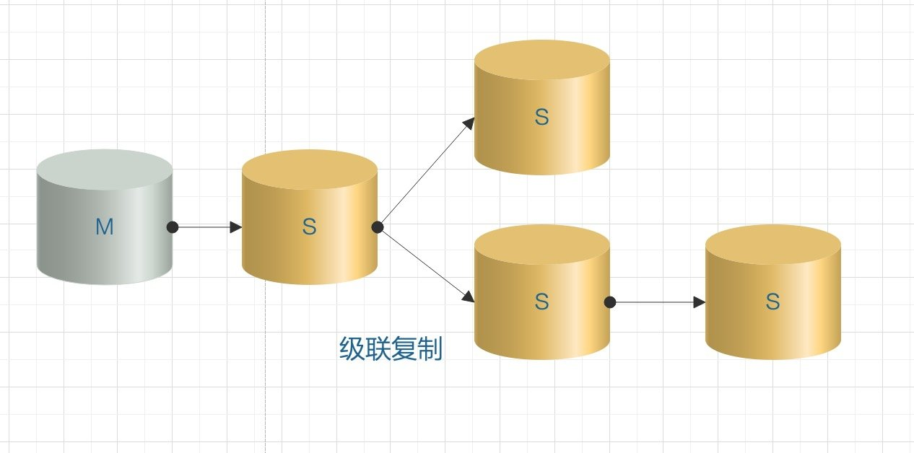

## 主从复制

binlog 日志主要作用是数据恢复和主从复制，是二进制格式的日志文件，网络传输无需进行协议转换。MySQL 集群的高可用、负载均衡、读写分离等功能都有基于 Binlog 来实现的

### 一、MySQL 主从复制主流架构模型

1. 一主一从 / 一主多从。一般实现主从配置或者读写分离都可以采用这种架构。如果是一主多从模式，当 Slave 增加到一定数量时，Slave 对 Master 的负载以及网络带宽都会成为一个严重的问题

2. 多主一从：将多个库的数据备份到一个库中存储

3. 双主复制：理论上跟主从一样，但是两个MySQL服务器互做对方的从，任何一方有变更，都会复制对方的数据到自己的数据库。双主适用于写压力比较大的业务场景，或者 DBA 做维护需要主从切换的场景，通过双主架构避免了重复搭建从库的麻烦。（主从相互授权连接，读取对方binlog日志并更新到本地数据库的过程；只要对方数据改变，自己就跟着改变）

4. 级联复制：如果 slave 节点很多，都连在 master 上对主服务器的压力肯定是不小的。所以部分 slave 节点连接到它上一级的从节点上。这样就缓解了主服务器的压力。级联复制解决了一主多从场景下多个从库复制对主库的压力，带来的弊端就是数据同步延迟比较大。

    

### 二、MySQL 主从复制原理

MySQL 主从复制涉及到三个线程：

- 主库的线程：log dump 线程，用来给从库的 IO 线程传 binlog 数据
- 从库的两个线程：一个 IO 线程，一个 SQL 线程。IO 线程会去请求主库的 binlog，并将得到的 binlog 写到本地的 relay log（中继日志）文件中；SQL 线程会读取 relay log 文件中的日志，并解析成 SQL 语句逐一执行


#### 1. 主库的 log dump 线程

当从节点连接主节点时，主节点会为其创建一个 log dump 线程，用于发送和读取 binlog 的内容。在读取 binlog 中的操作时，log dump 线程会对主节点上的 binlog 加锁；当读取完成锁会释放，然后发送给从节点。**主节点会为自己的每一个从节点创建一个 log dump 线程**

#### 2. 从节点 IO 线程

当从节点上执行 `start slave` 命令之后，从节点会创建一个 IO 线程用来连接主节点，请求主库中更新的 binlog，IO 线程收到主节点的 log dump 进程发来的更新之后，保存在本地 relay-log（中继日志）中。relay-log（中继日志）充当缓冲区。

relay-log 的相关参数查询：

```mysql
mysql> show variables like '%relay%';
+---------------------------+---------------------------------------------+
| Variable_name             | Value                                       |
+---------------------------+---------------------------------------------+
| max_relay_log_size        | 0                                           |
| relay_log                 |                                             |
| relay_log_basename        | /var/lib/mysql/d80c4a8db96c-relay-bin       |
| relay_log_index           | /var/lib/mysql/d80c4a8db96c-relay-bin.index |
| relay_log_info_file       | relay-log.info                              |
| relay_log_info_repository | FILE                                        |
| relay_log_purge           | ON                                          |
| relay_log_recovery        | OFF                                         |
| relay_log_space_limit     | 0                                           |
| sync_relay_log            | 10000                                       |
| sync_relay_log_info       | 10000                                       |
+---------------------------+---------------------------------------------+
```

- max_relay_log_size：标记 relay log 允许的最大值，如果该值为 0，则默认值为 max_binlog_size(1G)；如果不为 0，则max_relay_log_size 则为最大的 relay_log 文件大小
- relay_log_purge：是否自动清空不再需要中继日志时。默认值为1(启用)
- relay_log_recovery：当 slave 从库宕机后，假如 relay log 损坏了，导致一部分中继日志没有处理，则自动放弃所有未执行的 relay log，并且重新从 master 上获取日志，这样就保证了 relay log 的完整性。默认情况下该功能是关闭的，将 relay_log_recovery 的值设置为 1 时，可在 slave 从库上开启该功能，建议开启
- relay_log_space_limit：防止中继日志写满磁盘，这里设置中继日志最大限额

#### 3. 从节点 SQL 线程

读取 relay-log 中的数据解析成 events 

### 三、MySQL 基于 Binlog 主从复制的模式介绍

MySQL 主从复制默认是异步模式

#### 1. 异步模式（async-mode）

主库不会主动推送数据到从节点，主库在执行完客户端提交的事务后会立即将结果返回给客户端，并不关心从库是否已经接收并处理。这样就会产生一个问题，主节点如果崩溃掉了，此时主节点上已经提交的事务可能并没有传到从节点上，如果此时，强行将从节点提升为主节点，可能导致新主节点上的数据不完整。

#### 2. 全同步模式

当主库执行完一个事务，然后所有的从库都复制了该事务并成功执行完才返回成功信息给客户端。因为需要等待所有从库执行完该事务才能返回成功信息，所以全同步复制的性能必然会受到严重的影响。

#### 3. 半同步模式

介于异步复制和全同步复制之间，主库在执行完客户端提交的事务后不是立刻返回，而是等待至少一个从库收到并写到 relay-log 中才返回成功信息给客户端（只能保证主库的 binlog 至少传输到了一个从节点上），否则需要等待直到超时然后切换成异步模式再提交。

相对于异步复制，半同步复制提高了数据的安全性，一定程度的保证了数据能成功备份到从库，同时它也造成了一定程度的延迟，但是比全同步模式延迟要低，这个延迟最少是一个 TCP/IP 往返的时间。所以，半同步复制最好在低延时的网络中使用。半同步模式不是 MySQL 内置的，从 MySQL 5.5 开始集成，需要 master 和 slave 安装插件开启半同步模式。

### 四、新一代的主从复制模式 --- GTID 复制模式

#### 1. GTID 复制原理

GTID（global transaction identifier）即全局事务 ID，一个事务对应一个 GTID，保证了每个在主库上提交的事务在集群中有一个唯一的 ID。

在原来基于日志的复制中，从库需要告知主库要从那个偏移量进行增量同步，如果指定错误会造成数据的遗漏，从而造成数据的不一致。而基于 GTID 的复制中，从库会告知主库已经执行的事务的 GTID 值，然后主库会将所有未执行的 GTID 的列表返回给从库，并且可以保证同一个事务只在指定的从库执行一次。

GTID 的组成：`source_id:transaction_id` ，source_id 就是 server_uuid，会在第一次启动时生成。transaction_id 是顺序化的序列号（sequence number），是从 1 开始自增长的序列，是事务的唯一标识。

过程如下：

- master 更新数据时，会在事务提交时自动生成 GTID，一同记录到 binlog 日志中
- slave 端的 IO 线程将变更的 binlog，写入到本地的 relay log 中，slave 通过 gtid_next 变量的值确定要执行那个 GTID 
- SQL 线程从 relay-log 中获取 GTID，然后对比 slave 端的 binlog 是否有记录。如果有记录，说明该 GTID 的事务已经执行，slave 会忽略。如果没有记录，slave 就会从 relay-log 中执行该 GTID 的事务，并记录到 binlog 中

GTID 的优点：更容易搭建主从复制；发生主从切换时，不用一步一步的去定位 binlog 日志文件和查找 binlog 的位点信息

GTID 的局限性：

- `Create table ... select` 这些语句不能使用，该语句会产生的两个事件（创建表语句 `create table` 和插入表语句 `insert table`）。可能会使用同一个 GTID ，而同一个 GTID 在 slave 只能被使用一次
- 使用 GTID 复制时，不支持使用 `sql_slave_skip_counter` 参数进行跳过某个错误

### 五、MySQL 主从复制的方式

MySQL 主从复制有三种方式：

1. 基于 SQL 语句的复制（statement-based replication，SBR），binlog 文件的格式为 STATEMENT。MySQL 5.1.4 及之前版本使用这种方式，只需要记录会修改数据的 SQL 语句到 binlog 中。缺点是某些情况会导致数据不一致。比如：`now()` 函数主库和从库调用的时间不一致可能数据不一致
2. 基于行的复制（row-based replication，RBR)，binlog 文件的格式为 ROW。只记录那条数据被修改了，修改成了什么样。缺点是会产生大量的日志，尤其是修改 table 的时候会让日志暴增，同时增加了 binlog 同步时间，也不能通过 binlog 解析获取执行过的 sql 语句，只能看到数据的变更
3. 混合模式复制（mixed-based replication,MBR)。binlog 文件的格式为 MIXED。是对 STATEMENT 和 ROW 模式的混合，MySQL 会根据执行的 SQL 语句选择日志保存方式。例如像`update`或者`alter table`之类的语句修改，采用Statement格式。其余的对数据的修改例如`update`和`delete`采用Row格式进行记录。


