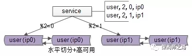
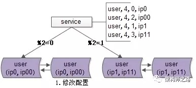
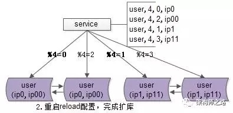
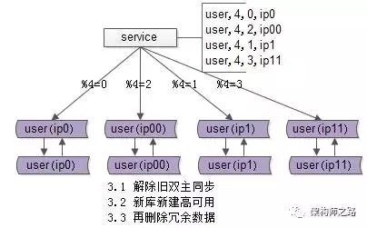

## 数据库秒级平滑扩容架构方案

### 一、常见的数据库架构设计

- 数据量较大，数据进行水平切分，分库后将数据分布到不同的数据库实例，以达到降低数据量，增加性能的扩容目的
- 为了保证可用性，使用双主同步，当主库挂掉，请求自动到另一个主库

如果数据量持续增大，2 个库性能不够，需要继续扩容，如何平滑的进行数据库的扩容呢？

### 二、停服务方案

- 首先需要周知用户，在某个时间段要停服
- 新建 N 个库，在停服务之后，进行数据迁移，将数据重新分布，从 M 个库导入到 N 个库，路由规则由 %M 升级为 %Y
- 修改其他服务配置，然后重启服务，连接新库重新对外提供服务

回滚方案：如果数据迁移失败，或者迁移后测试失败，则将配置改回 M 库，恢复服务，后面再重新扩容

方案优点：简单

方案缺点：停服务意味着没有高可用。依赖手工操作，出现问题的概率增大。如果有问题扩容测试中没有检查出来，启动了服务之后再发现又问题，难以回滚。

### 三、秒级、平滑的扩容方案

#### 1. 修改配置

- 原来 `%2 = 0` 的业务对应的两个互备（双主）数据库。现在将互备关系依然存在，只是两个互备的数据库都去提供服务，且针对不同的业务。也就是

    - 原来 `%2 = 0` 的库，变为 `%4 = 0` 和 `%4 = 2` 
    - 原来 `%2 = 1` 的库，变为 `%4 = 1` 和 `%4 = 3` 

    修改服务的配置（配置文件或者配置中心），这样修改保证，拆分后依然能够路由到正确的数据

#### 2. reload 配置，实例扩容

- 可以是配置文件重新加载，也可以是配置中心下发配置。
- reload 之后，数据库的实例扩容就完成了，原来是 2 个数据库实例提供服务，现在变为 4 个数据库实例提供服务。这个过程一般可以在秒级完成
- 整个过程可以逐步重启，对服务的正确性和可用性完全没有影响。
    - 即使 `%2` 方式和 `%4` 方式同时存在，也不影响数据的正确性，因为此时仍然是双主数据同步的
- 完成实例扩展之后，会发现每个数据库的数据量依然没有下降

#### 3. 收尾工作，数据收缩

- 解除旧的双主同步，让原来双主库的数据不再同步增加
- 增加新的双主同步，保证高可用
- 删除掉冗余数据
- 这样，每个库的数据量就降为原来的一半，数据收缩完成

这个方案能够实现 N 个库扩到 2N 个库，核心原理是：成倍扩容、避免数据迁移

