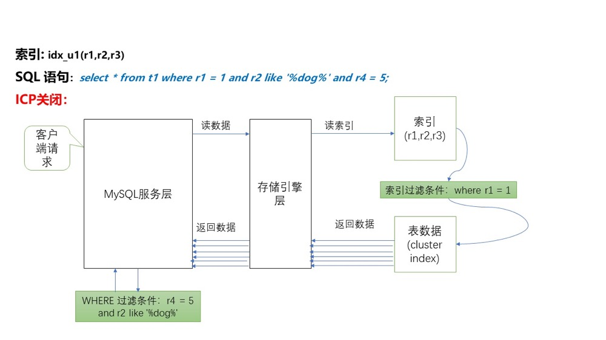
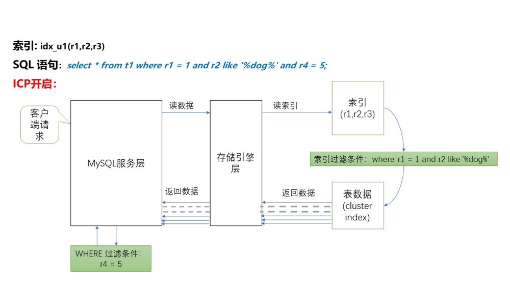

## 索引下推

索引下推（INDEX CONDITION PUSHDOWN，简称 ICP）是 MySQL 5.6 发布后针对扫描二级索引的一项优化改进。总的来说是通过把索引过滤条件下推到存储引擎，来减少 MySQL 存储引擎访问基表的次数以及 MySQL 服务层访问存储引擎的次数。ICP 适用于 MYISAM 和 INNODB。下面以 InnoDB 为例

### 一、概述

- MySQL 服务层：也就是 SERVER 层，用来解析 SQL 的语法、语义、生成查询计划、接管从 MySQL 存储引擎层上推的数据进行二次过滤等等
- MySQL 存储引擎层：按照 MySQL 服务层下发的请求，通过索引或者全表扫描等方式把数据上传到 MySQL 服务层
- MySQL 索引扫描：根据指定索引过滤条件（比如 `where id = 1`），遍历索引找到索引键对应的主键值后回表过滤剩余过滤条件
- MySQL 索引过滤：通过索引扫描并且基于索引进行二次条件过滤后再回表

ICP 就是把索引扫描和索引过滤合并在一起处理，过滤后的记录数据下推到存储引擎后的一种索引优化策略。这样做的优点：

- 减少了回表的操作次数
- 减少了上传到 MySQL server 层的数据

ICP 默认开启，可通过 `show variables like '%optimizer_switch%';` 中的 `index_condition_pushdown=on` 开启或者关闭

### 二、不使用 ICP 索引扫描的过程

MySQL 存储引擎层只把满足索引键值对应的整行表记录一条一条取出，并且上传给 MySQL 服务层。MySQL 服务层对接收的数据，使用 SQL 语句后面的 where 条件过滤，直到处理完最后一行记录，再一起返回给客户端。

如图中，表中索引有 `r1、r2、r3`，此 SQL 语句中，不使用索引下推，只会挑选 where 条件语句的一个条件来选择一个索引来查询并把对应的所有行记录返回。然后由 MySQL 服务层根据后面的 where 条件过滤，知道处理完最后一行记录，再一起返回给客户端。

### 三、使用 ICP 扫描的过程

MySQL 存储引擎层，先根据过滤条件中包含的索引键确定索引记区间，再在这个区间的记录上使用包含索引键的其他过滤条件进行过滤，之后规避掉不满足的索引记录，只根据满足条件的索引记录回表取回数据上传到 MySQL 服务层。

MySQL 服务层对接收到的数据，使用 where 子句中不包含索引列的过滤条件做最后的过滤，然后返回数据给客户端。

如图，返回数据这里的虚线表示规避掉的记录，开启 ICP 很明显减少了上传到 MySQL 存储引擎层、MySQL 服务层的记录条数，节省了 IO

查看语句是否用了 ICP，只需要对 SQL 进行 explain，在 explain 信息里可以看到 ICP 相关信息。其中 extra 列中显示 `Extra: Using index condition` 就代表用了 ICP 

### 四、ICP 限制

- ICP 仅用于需要访问基表所有记录时使用，适用的访问方法为：range、ref、eq_ref、ref_or_null。ICP 尤其是对联合索引的部分列模糊查找非常有效
- ICP 的目标是减少全行记录读取，从而减少 I/O 操作，仅用于二级索引。主键索引本身即是表数据，不存在下推操作
- ICP 不支持基于虚拟列上建立的索引，比如函数索引
- ICP 不支持引用子查询的条件

