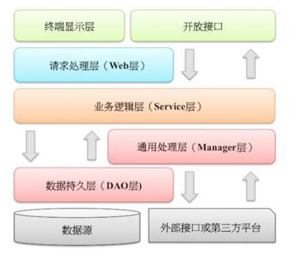
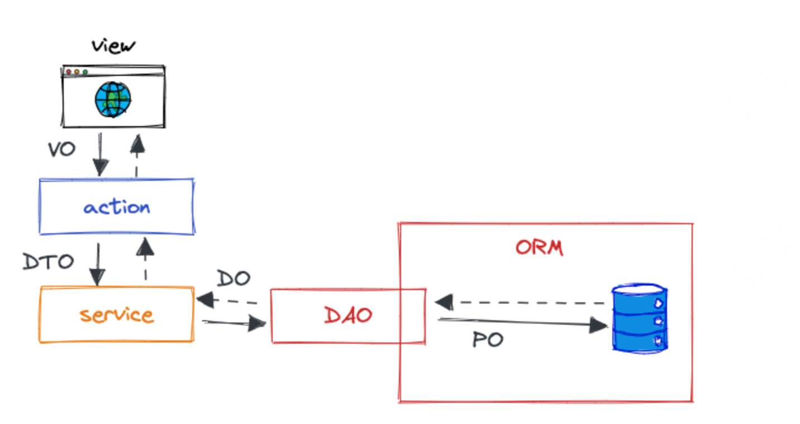
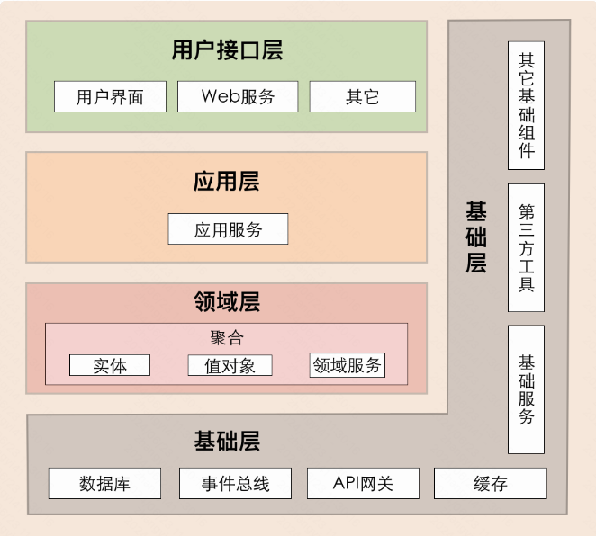
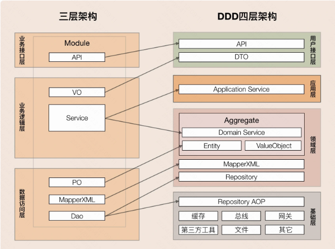
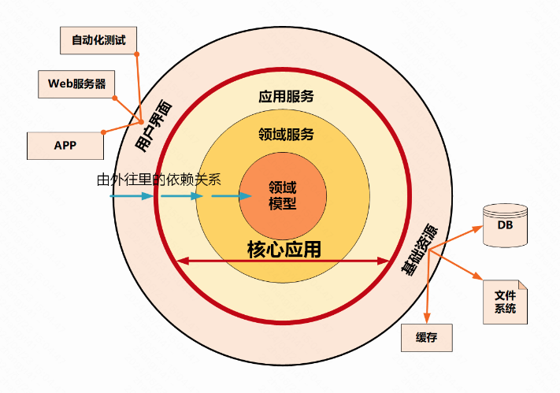
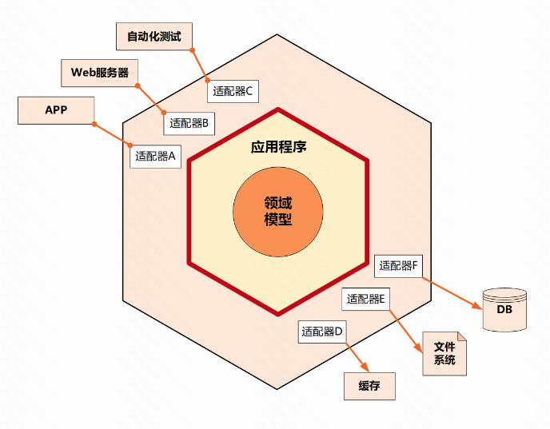
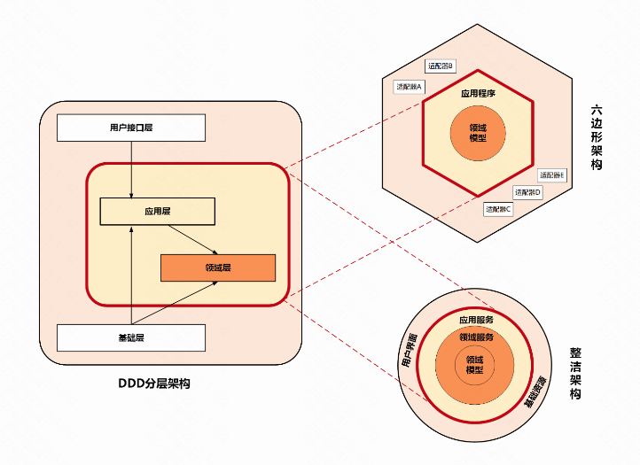
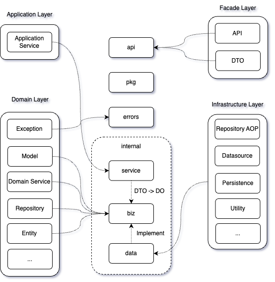
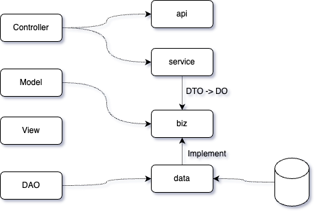

## 一、背景

个人使用 Go 语言做开发也有好几年时间了，经常因为代码的整洁、架构的清晰，将项目框架来回调整。一个业务开发项目有很大一部分时间用于追求代码项目架构的先进性。稍有不注意整个项目就陷入泥沼，项目的层与层之间划算不清楚，耦合严重，改动一个小地方，涉及整个代码库进行调整，整体服务都需要测试。谈何敏捷开发？谈何快速迭代？

非常希望 Go 语言能有类似 Java  Spring / Spring MVC / MyBits  等框架的能力，让业务同学专注业务开发。但同时，业务同学提高自身的代码项目架构设计是非常有必要的。丑陋的代码项目只能靠 “卷” 来完成工作，简直是在浪费生命。

本文致力于完善优化传统三层架构的问题，根据 DDD 领域驱动设计提出的思想，落地较为清晰的 Go 语言项目的代码框架。

## 二、传统的三层架构

### 1. 三层架构说明

- Controller 负载处理用户的请求，面向用户暴露的接口逻辑写在这里
- Service 负责编写业务层的逻辑
- DAO 负责处理数据层的逻辑，针对数据的增、删、改、查
- View 一般是面向用户的界面，与后台无关

在《阿里巴巴Java开发手册》中，建议的三层架构如下：

增加了一个 “通用处理层 ( Manager 层 )”，Manager 层是对第三方平台封装的层，预处理返回结果及转化异常信息。对 Service 层通用能力的下沉，如缓存方案、中间件通用处理。与 DAO 层交互，对多个 DAO 的组合复用。

### 2. 三层架构的问题

#### (1). 职责不清

传统的 Controller 接口处理层与 Service 业务逻辑层经常会出现职责不清的问题，代码开发过程中不经意间就会出现一些越界逻辑。

比如：我们要校验业务访问权限，如果这段代码放在 Controller 层，那每个 Controller 就容易堆积一堆相同的代码（假设这里不适合使用 Middleware 校验）。同时如果放在 Service 层，那就违反规则（用户请求应该在 Controller 层做），代码功能导致越界。

#### (2). 维护困难

DDD 提出了一些划分边界的思想，有很多防腐作用的概念，比如：

- VO（view object）：把某个指定页面或组件的所有数据封装起来
- DTO（Data Transfer Object）： 数据传输对象
- DO（Domain object）： 领域对象，从现实世界抽象出来的业务实体
- PO（Persistent object）： 持久化对象

三层架构没有这些领域概念，同时提出的 “贫血模型”、“充血模型” 无法承接现代的复杂业务开发。

- 贫血模型：将数据与操作分离，在代码中体现为数据和业务逻辑是分开两个类来实现。这种方式破坏了面向对象的封装特性，是一种典型的面向过程的编程风格。
- 充血模型：数据和业务逻辑被封装在同一个类中。典型的面向对象的编程风格。

如果没有定义清楚边界，没有领域概念针对对象进行划分时，最常见的问题就是导致各个实体对象直接传输到各个层级。透传的最直接问题就是，客户端可能需要某个数据字段，在实现中会污染整个业务对象。

比如，我们定义了一个用户对象，如果我们从 DAO 一直到接口到客户端都使用这样的结构定义，然后后面客户端更新，需要增加更多的字段（甚至一些接口是 DAO 层不需要的），那我们在修改数据库字段的时候还要考虑会不会影响展示层，这样就污染 DAO 层了，本来 DAO 层数据的修改不应该影响接口层的展现。还有用户对象若定义了用户密码的字段，这个字段肯定不能通过接口传递出去的，透传的话就需要有逻辑去过滤掉这个密码。因此，如果数据层和逻辑层的数据结构都用同一个，并且是透传，业务层的字段慢慢渗透到存储的持久层，导致不同的分层的这个结构最终是面向数据库表的。我们的业务逻辑很容易就演变成编写数据库逻辑。

总体来说，DAO 层被业务逻辑绑架了，业务和持久层混合，使得业务维护起来越来越困难，代码越来越腐败，慢慢的我们就会成了面向数据库写逻辑了。

## 三、DDD 领域驱动设计

### 1. DDD 领域驱动设计说明

我们首先简单说一下 DDD 的概念、思想。

DDD 核心思想是通过领域驱动设计方法定义领域模型，从而确定业务和应用边界，保证业务模型与代码模型的一致性。DDD 包括战略设计与战术设计两部分。

- DDD 的战略设计：主要从业务视角出发，建立业务领域模型，划分领域边界，建立通用语言的限界上下文，限界上下文可以作为微服务设计的参考边界
- DDD 的战术设计：从技术视角出发，侧重于领域模型的技术实现，完成软件开发和落地，包括：聚合根、实体、值对象、领域服务、应用服务和资源库等代码逻辑的设计和实现

#### (1). 领域、子领域：

那么领域是用于确定范围的，范围即边界。那么就会有大小之分，领域越大，业务范围就越大。因此领域可以进一步划分为子领域，每个子领域对应一个更小的问题域或者更小的业务范围。

#### (2). 核心域、通用域、支撑域：

子领域又可以根据自身重要性和功能属性划分为三类子领域。分别是：核心域、通用域、支撑域。

- 核心域：就是业务最重要的部分，业务的核心竞争力。
- 通用域：没有个性化的诉求，同时被多个子域使用的通用功能，比如认证、权限等。
- 支撑域：具有业务特性、同时不具有通用性，比如某个公司的 IP库。

核心域、支撑域和通用域的主要目标是：通过领域划分，区分不同子域在公司内的不同功能属性和重要性，从而公司可对不同子域采取不同的资源投入和建设策略，其关注度也会不一样。放在软件的设计开发上也是一致的。

#### (3). 通用语言、限定上下文

通用语言，一般指的是在制定方案时，团队交流可以通过通用语言达成共识，能够简单、清晰、准确描述业务含义和规则的语言。产品经理、项目经理、开发码农、测试经理都能够通过通用语言进行交流。

限定上下文，是 DDD 在战略设计上提出的概念，用来确定语义所在的领域边界。

#### (4). 实体和值对象

“实体” 拥有唯一的标识符，且标识符在经历各种状态变更后仍能保持一致。在战略设计中，实体是多个属性、操作或行为的载体。在战术代码模型中，实体的表现形式是实体类，这个类包含了实体的属性和方法，这些实体类通常采用充血模型。

实体以 DO（领域对象）的形式存在，每个实体对象都有唯一的 ID；比如一件商品，拥有一个商品ID，无论这个商品数据如何变化，商品ID不会变化。

值对象是将多个相关属性组合为一个概念整体，是一个集合。保证了属性归类的清晰和概念的完整性。比如有一个实体是人类，那么他包含的属性有 id、姓名、年龄、性别、地址。但是我们发现地址又可以拆分为省、市、县、街道等。如果将其单独列出来作为人类实体的属性是比较零碎，不够统一的。那么地址这个集合就是我们所说的值对象了。

本质上，实体是实实在在存在的业务对象，具有业务属性、业务行为和业务逻辑。而值对象只是若干个属性的集合，只有数据初始化操作和有限的不涉及修改数据的行为，基本不包含业务逻辑。值对象的属性集虽然在形式上独立出来了，但在逻辑上仍然是实体属性的一部分，用于描述实体的特征。

#### (5). 聚合和聚合根

领域模型中的实体和值对象就好比个体，而能让实体和值对象协同工作的组织就是聚合，他用来确保这些领域对象在实现共同的业务逻辑时，能保证数据的一致性。

聚合根的主要目的是为了避免由于复杂数据模型缺少统一的业务规则控制，而导致聚合、实体之间数据不一致性的问题。

聚合的特点：高内聚、低耦合，他是领域模型中最底层的边界，可以作为拆分微服务的最小单位，但切记不要对微服务过度拆分。对性能有极致要求的场景中，聚合可以独立作为一个微服务，以满足版本的高频发布和极致的弹性伸缩能力。一个微服务可以包含多个聚合，聚合之间的边界是微服务内天然的逻辑边界。有了这个逻辑边界，在微服务架构演进时就可以以聚合为单位进行拆分和组合了。

聚合根的特点：聚合根是实体，有实体的特点。一个聚合只有一个聚合根，聚合根在聚合内对实体和值对象采用直接对象引用的方式进行组合和协调，聚合根与聚合根之间通过 ID 关联的方式实现聚合之间的协同。

### 2. DDD 的分层思想

如下是 DDD 的四层架构

**用户接口层**：负责向用户显示信息和解释用户指令。这里的用户可能是：用户、程序、自动化测试和批处理脚本等

**应用层**：应用层位于领域层之上，因为领域层包含多个聚合，所以他可以协调多个聚合的服务和领域对象完成服务编排和组合，协作完成业务操作。同时，应用层也是微服务之间交互的通道，他可以调用其他微服务的应用服务，完成微服务之间的服务组合和编排。应用服务是在应用层的，他负责服务的组合、编排和转发，负责处理业务用例的执行顺序以及结果的拼装，以粗粒度的服务通过 API 网关向前端发布。应用服务还可以进行安全认证、权限校验、事务控制、发送和订阅领域事件等。

**领域层**：作用是实现企业核心业务逻辑，通过各种校验手段保证业务的正确性。领域层主要体现领域模型的业务能力，他用来表达业务概念、业务状况和业务规则。领域层包含：聚合根、实体、值对象、领域服务等领域模型中的领域对象。领域模型的业务逻辑主要是由实体和领域服务来实现的，其中实体会采用充血模型来实现所有与之相关的业务功能。其中，实体和领域服务在实现业务逻辑上不是同级的，当领域中的某些功能，单一实体（或者值对象）不能实现时，领域服务就会出马，他可以组合聚合内的多个实体（或者值对象），实现复杂的业务逻辑。

**基础层**：基础层是贯穿所有层的，作用就是为其他各层提供通用的技术和基础服务，包括第三方工具、驱动、消息中间件、网关、文件、缓存以及数据库等。比较常见的功能还是提供数据库持久化。基础层包含基础服务，他采用依赖倒置设计，封装基础资源服务，实现应用层、领域层与基础层的解耦，降低外部资源变化对应用的影响。

DDD 的分层架构有一个重要的原则：**每层只能与位于其下方的层发生耦合**。这是严格的分层架构。

如下是 三层架构和 DDD 四层架构之间的对比：

三层架构和 DDD 四层架构的不同主要发生在业务逻辑层和数据访问层。

- DDD 四层架构在用户接口层引入了 DTO，给前端提供了更多的可使用数据和更高的展示灵活性。
- DDD 四层架构将业务逻辑层的服务拆分到了应用层和领域层。应用层快速响应前端的变化，领域层实现领域模型的能力。改善了三层架构核心业务逻辑混乱、代码改动互相影响大的情况。
- 对于数据访问层和基础层，三层架构采用 DAO 方式，DDD 四层架构采用 仓储 repository 设计模式，通过依赖倒置实现各层对基础资源的解耦。仓储又分为两部分：仓储接口和仓储实现。仓储接口放在领域层中、仓储实现放在基础层。原来三层架构通用的第三方工具包、驱动、Common、Utility、Config 等通用公共的资源统一放在基础层。

再来通过 DDD 中的几个类对象详细说明下：

- 数据库持久化对象：PO（Persistent Object），与数据库结构一一映射，他是数据持久化过程中的数据载体。
- 领域对象：DO（Domain Object），微服务运行时核心业务对象的载体，DO 一般包括实体和值对象。
- 数据传输对象：DTO（Data Transfer Object），用于前端应用与微服务应用层或者微服务之间的数据组装和传输，是应用之间数据传输的载体。
- 视图对象：VO（View Object），用于封装展示层指定页面或组件的数据。

微服务基础层的主要数据对象是 PO，一般情况，我们要先建立 DO 和 PO 的映射关系，他们之间可能是多对多关系。在 DO 和 PO 数据转换时，需要进行数据重组。

当 DO 数据需要持久化时，先将 DO 转换为 PO 对象，由仓储实现服务完成数据库持久化操作。当 DO 需要构建和数据初始化时，仓储实现服务先从数据库获取 PO 对象，将 PO 转换为 DO 后，完成 DO 数据的构建和初始化。

领域层主要是 DO 对象，DO 是实体和值对象的数据和业务行为载体，承载着基础的核心业务逻辑，多个依赖紧密的 DO 对象构成聚合。领域层 DO 对象在持久化时需要转换为 PO 对象。

应用层主要对象由 DO 对象，但也可能有 DTO 对象。应用层在进行不同聚合的领域服务编排时，一般采用聚合根 ID 的引用方式，应尽量避免不同聚合之间的 DO 对象直接引用，避免聚合之间产生依赖。在设计跨微服务的应用服务调用时，在调用其他微服务的应用服务前，DO 会被转换为 DTO，完成跨微服务的 DTO 数据组装，因此会有 DTO 对象。在前端调用后端应用服务时，用户接口层先完成 DTO 到 DO 的转换，然后 DO 作为应用服务的参数，传导到领域层完成业务逻辑处理。

用户接口层主要完成 DO 和 DTO 的互转，完成微服务与前端应用数据交互和转换。用户接口服务在完成后端应用服务封装后，会对多个 DO 对象进行组装，转换为 DTO 对象，向前端应用完成数据转换和传输。用户接口服务在接收前端应用传入的 DTO 后，完成 DTO 向多个 DO 对象的转换，调用后端应用服务完成业务逻辑处理。

前端应用主要是 VO 对象，展现层使用 VO 进行界面展示，通过用户接口层与应用层采用 DTO 对象进行数据交互。

### 3. DDD 常见的模型

DDD 有常见的一些模型架构，比如分层架构、整洁架构、六边形架构。分层架构就是如上的 DDD 四层架构。

#### (1). 整洁架构

整洁架构最主要的原则是依赖原则，它定义了各层的依赖关系，越往里依赖越低，代码级别越高，越是核心能力。外圆代码依赖只能指向内圆，内圆不需要知道外圆的任何情况。

各层的职能划分如下：

- 领域模型实现领域内核心业务逻辑，他封装了企业级的业务规则。领域模型的主体是实体，一个实体可以是一个带方法的对象，也可以是一个数据结构和方法集合。
- 领域服务实现涉及多个实体的复杂业务逻辑
- 应用服务实现与用户操作相关的服务组合编排，他包含了应用特有的业务流程规则，封装和实现了系统所有用例。
- 最外层主要提供适配的能力，适配能力分为主动适配和被动适配。主动适配主要实现外部用户、网页、批处理和自动化测试等对内层业务逻辑访问适配。被动适配主要是实现核心业务逻辑对基础资源访问的适配，比如数据库、缓存、文件系统和消息中间件等
- 领域模型、领域服务和应用服务一起组成了软件核心业务能力

#### (2). 六边形架构

核心理念是：应用是通过端口与外部进行交互的。核心业务逻辑（应用程序和领域模型）与外部资源（包括APP、Web 应用以及数据库资源等）完成隔离，仅通过适配器进行交互。他解决了业务逻辑与用户界面的代码交错问题，很好的实现了前后端分离。同样的，都是由外向内依赖。

六边形架构将系统分为内六边形和外六边形两层。这两层的职能划分如下：

- 内六边形（应用程序和领域模型）实现应用的核心业务逻辑
- 外六边形完成外部应用、驱动和基础资源等的交互和访问，对前端应用以 API 主动适配的方式提供服务，对基础资源以依赖倒置被动适配的方式实现资源访问

六边形架构的一个端口可能对应多个外部系统，不同的外部系统也可能会使用不同的适配器，由适配器负责协议转换。这就使得应用程序能够以一致的方式被用户、程序、自动化测试和批处理脚本使用。

#### (3). 模型之间的对比

DDD 四层架构、整洁架构、六边形架构，这三种架构模型的设计思想正是微服务架构高内聚、低耦合原则的完美体现，也体现了以领域模型为中心的设计思想。

如上，红色线框内部主要实现核心业务逻辑，但核心业务逻辑也是有差异的，有的业务逻辑属于领域模型的能力，有的则属于面向用户的用户和流程编排能力。按照这种功能的差异，我们在这三种架构中划分了应用层和领域层，来承担不同的业务逻辑。

领域层实现面向领域模型，实现领域模型的核心业务逻辑，属于原子模型，它需要保持领域模型和业务逻辑的稳定，对外提供稳定的细粒度的领域服务，所以他处于架构的核心位置。

应用层实现面向用户操作相关的用例和流程，对外提供粗粒度的 API 服务。它就像一个齿轮一样进行前台应用和领域层的适配，接收前台需求，随时作出响应和调整，尽量避免将前台需求传导到领域层。应用层作为配速齿轮则位于前台应用和领域层之间。

### 4.  DDD 落地的困难

DDD 分层的职责非常明确，每一层都能做到各司其职，边界清晰。但是 DDD 只是规定了分层，告诉了我们怎么分层比较好，但是没有告诉我们怎么做。实现 DDD 项目分层非常复杂，无法根据概念分清楚自己的代码应该写在那里。再加上 DDD 的概念太多（CQRS命令和职责分离、事件驱动、六边形架构）等等。太难、太复杂，导致 DDD 在落地上存在非常大的困难。

并且，DDD 并不是银弹。对于业务不复杂的系统开发来说，三层架构不管是贫血模式或者充血模式，这种传统开发模式简单够用。反而如果使用 DDD 来做开发设计，可能会有点大材小用，无法发挥 DDD 作用；同时，由于前期需要在设计上投入更多的时间和精力，导致南辕北辙。

因此我们一定要顺势而为，根据自己具体的情况使用合理的方法，才能有最大的产出。

## 四、Go 语言工程化框架 spear

Go 语言是现代最受欢迎的编程语言之一。具有静态强类型、编译速度快、轻量级并发、语法简洁、开发效率高等特点。

结合我自己在写 Go 语言项目时的思考，以及对于三层架构、DDD 领域驱动设计的认识和理解，寄希望沉淀出一套方法论，打造出一个切合 Go 项目的工程化框架，并将其命名为 spear，希望他是一个创新的、突破性的解决方案，尤其是在面临挑战时。

### 1. spear 和 DDD 的映射关系

- DDD 的用户接口层（Facade Layer）：负责向用户显示信息和解释用户指令，一般包含用户界面、web 服务（restful、websocket 等），对应到 spear 的 api 层文件夹，包含了提供 web、rpc 等服务的 pb 文件以及 api 的定义
- DDD 的应用层（Application Layer）：负责协调多个聚合的服务和领域对象完成服务编排和组合，协作完成业务操作。对应到 spear 的 internal/service 的服务应用层，用来实现 api 的逻辑，主要任务就是把 DTO 转换为 DO。比如我们 protobuf 定义的数据就是 DTO（Data Transfer Object）
- DDD 的领域层（Domain Layer）：实现核心的业务逻辑，比如 Model、Domain Service、Repository、Entity 等。对应到 spear 的 internal/biz 层，主要负责组装业务逻辑，定义 repo 等
- DDD 的基础层（Infrastructure Layer）：基础层是贯穿所有层的，他的作用就是为其他各层提供通用的技术和基础服务，包含不限于第三方工具、驱动、消息中间件、API网关、文件、缓存以及数据库等。当然比较常见的功能就是数据库的持久化了。对应到 spear 的 internal/data 层，主要是封装一些业务数据的访问，比如 kafka、mysql、redis 等，他是对 internal/biz 层定义的 repo 接口的实现。

### 2. spear 和三层架构的映射关系

- 三层架构的 Controller 层：负载处理用户的请求，面向用户暴露的接口逻辑写在这里。对应 spear 的 api + internal/service 层
- 三层架构的 Model 层：或者称 Service 层，负责编写业务逻辑。对应 spear 的 internal/biz 层
- 三层架构的 DAO 层，负责处理数据层的逻辑，针对数据的增删改查。对应 spear 的 internal/data 层。不过需要注意的是，DAO 一般只描述和存取数据，而 internal/data 更偏向于将领域对象从持久层抽象出来。
- 三层架构的 View 层：一般是面向用户的界面，与后台无关

