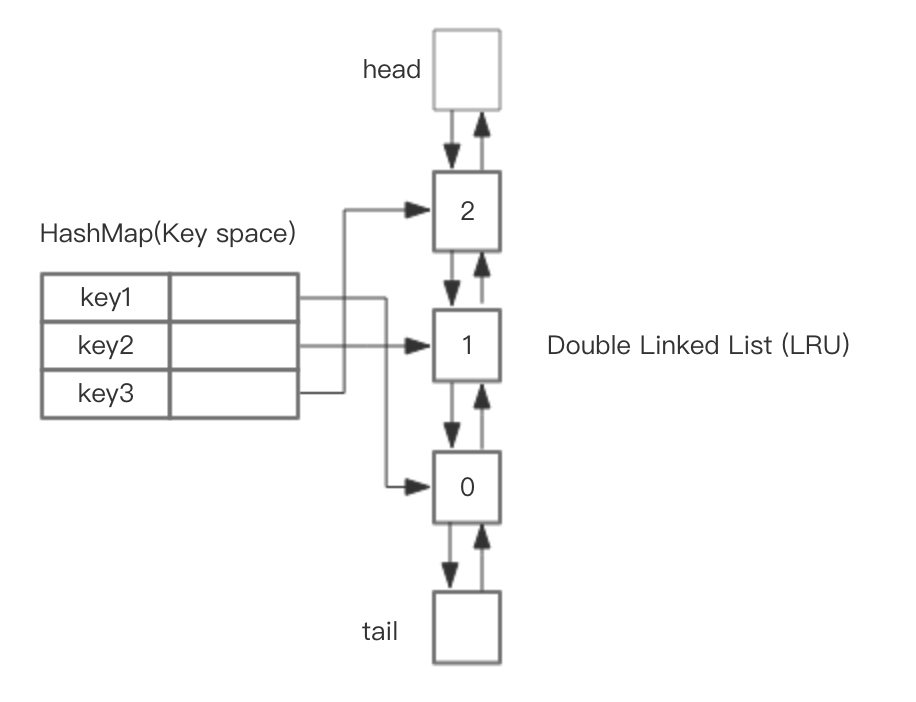

## 一、LRU 原理与实现

LRU（Least Recent Used），最近被频繁访问的数据会具备更高的留存，淘汰那些不常被访问的数据

设计一个LRU缓存，使得放入和移除都是 O(1) 的，我们需要把访问次序维护起来，但是不能通过内存中的真实排序来反应，有一种方案就是使用双向链表。

**基于 HashMap 和双向链表实现 LRU**

整体的设计思路是，可以使用 HashMap 存储 key，这样可以做到 save 和 get key的时间都是 O(1)，而 HashMap 的 Value 指向双向链表实现的 LRU 的 Node 节点



核心操作的步骤：

1. save(key, value)，首先在 HashMap 找到 Key 对应的节点，如果节点存在，更新节点的值，并把这个节点移动队头。如果不存在，需要构造新的节点，并且尝试把节点塞到队头，如果LRU空间不足，则通过 tail 淘汰掉队尾的节点，同时在 HashMap 中移除 Key。
2. get(key)，通过 HashMap 找到 LRU 链表节点，因为根据LRU 原理，这个节点是最新访问的，所以要把节点插入到队头，然后返回缓存的值。

## 二、Redis 的 LRU 实现和 LFU 实现

如果按照HashMap和双向链表实现，需要额外的存储存放 next 和 prev 指针，牺牲比较大的存储空间，显然是不划算的。

redisObject 结构体（Redis 整体上是一个大的 dict，key 是一个 string，而 value 都会保存为一个 redisObject）

```
typedef struct redisObject {
    ...
    unsigned lru:LRU_BITS; //LRU_BITS为24bit
    ...
} robj;
```

每个 redisObject 都有一个 24 bit 长度的 LRU 字段，LRU 字段里面保存的是一个时间戳

在 redis 的 dict 中每次按 key 获取一个值的时候，都会调用 lookupKey 函数，如果配置使用了 LRU 模式，则会更新 value（redisObject） 中的 LRU 字段为当前秒级别的时间戳。

redis 最初版本的实现算法很简单，随机从 dict 中取出五个 key，淘汰一个 LRU 字段值最小的。（随机选取的 key 是个可配置的参数 maxmemory-samples，默认值为 5）

在 redis 3.0 的时候，又改进了一版算法，首先第一次随机选取的 key 都会放入一个 pool 中( pool 的大小为 16 )，pool 中的 key 是按 lru 大小顺序排列的。接下来每次随机选取的 key 的 lru 值必须小于pool中最小的 lru 才会继续放入，直到将 pool 放满。放满之后，每次如果有新的key需要放入，需要将pool中lru最大的一个key取出。淘汰的时候，直接从pool中选取一个 lru 最小的值然后将其淘汰。

当 redis 3.0 增加了 pool 并且将采样 key 增加到 10 个后，基本等同于理想中的 LRU。如果继续增加采样的 key 或者 pool 的大小，就能进一步优化 LRU 算法。那也就是说，如果一个 key 经常被访问，那么该 key 的 idle time 应该是最小的

那么如果能够记录一个 key 被访问的次数，那么经常被访问的 key 最有可能再次被访问到。这也就是 LFU（least frequently used），访问次数最少的最应该被逐出。淘汰时，仍然是一个 pool，随机选取 10 个 key，访问次数最小的被淘汰。