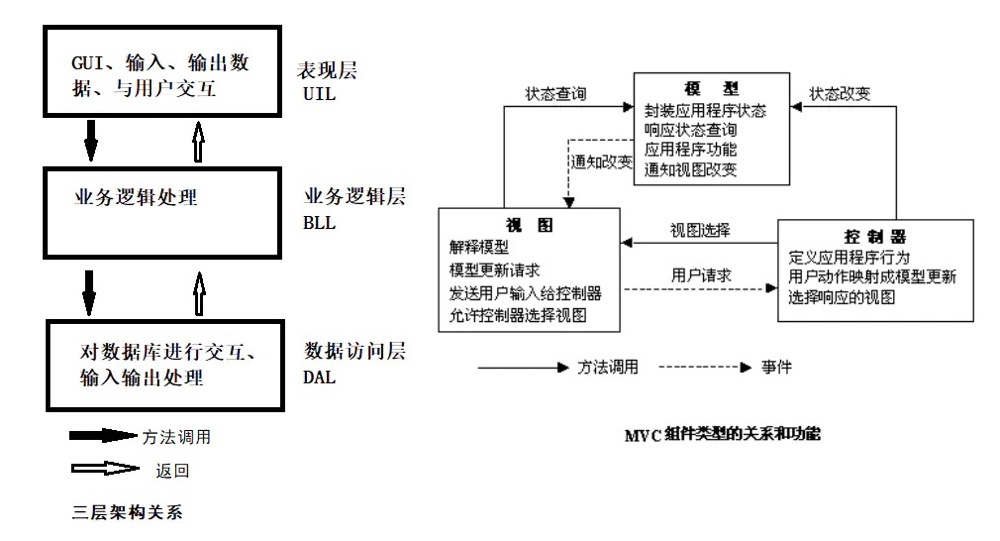

## MVC 设计模式和三层架构

### 一、两者之间的异同

不同点：

- 三层架构就是把应用程序分层，从而降低各个模块之间的耦合。而 MVC 是程序的一种设计模式，即应用程序确立架构后再根据需求决定是否要采用的一种模式，是一种使程序代码变的条理清晰、逻辑通用的代码规范。也就是说，三层架构是一种架构方式而 MVC 是一种设计模式或设计思想
- 三层架构的分层模式是典型的上下关系，上层依赖于下层。但 MVC 作为设计模式不存在上下关系，而是相互协作关系。

相同点：

MVC 与三层架构虽然说实质是不同的，但所达到的目的、所实现的效果是相同的；二者都是为了应用程序解耦，使应用程序达到“高内聚、低耦合”的目的

### 二、MVC

MVC（Model - View - Controller）他是一种 GUI 界面设计的主流模式，主流思想。分为：模型层、视图层、控制层。强制将应用程序的输入、处理、输出分开。

- M 模型层，用来实现数据表结构与应用程序实体对象对应、实现业务逻辑处理以及数据库的访问等等
- V 视图层，实现与用户交互的界面，实现数据的输入输出功能
- C 控制器层，用于联系、控制模型层和视图层去完成用户的需求，控制器本身不输出任何东西和做任何处理。他只是接收请求并决定调用那个模型构件去处理请求，然后再确定用那个视图来显示返回的数据

#### 1. MVC 架构的优缺点

优点：

- 有利于团队开发分工协作和质量控制，降低开发成本
- 可以为一个模型在运行时同时建立和使用多个视图。变化-传播机制可以确保所有相关的视图及时得到模型数据变化，从而使所有关联的视图和控制器做到行为同步
- 视图与控制器之间，允许更换视图和控制器对象，而且可以根据需求动态的打开或关闭、甚至在运行期间进行对象替换
- 模型的可移植性。因为模型是独立于视图的，所以可以把一个模型独立地移植到新的平台工作。需要做的只是在新平台上对视图和控制器进行新的修改
- 潜在的框架结构。可以基于此模型建立应用程序框架，不仅仅是用在设计界面的设计中

缺点：

- 增加了系统结构和实现的复杂性。对于简单的界面，严格遵循MVC，使模型、视图与控制器分离，会增加结构的复杂性，并可能产生过多的更新操作，降低运行效率
- 视图对模型数据的访问效率低。视图可能需要多次调用Model才能获得足够的显示数据
- 完全理解MVC并不是很容易。使用MVC需要精心的计划，由于它的内部原理比较复杂，所以需要花费一些时间去思考。同时由于模型和视图要严格的分离，这样也给调试应用程序到来了一定的困难

### 三、三层架构

通常意义的三层架构就是把整个业务应用划分为：表现层（UI）、业务逻辑层（BLL）、数据访问层（DAL）。区分层次的目的就是为了“高内聚、低耦合”的思想

- 表现层（UI），实现应用程序的界面，从而实现用户进行交互的功能
- 业务逻辑层（BLL），针对具体的业务需求而进行业务逻辑处理，直接对数据访问层进行操作
- 数据访问层（DAL），直接对存储（数据库）进行操作，对数据进行增删改等

