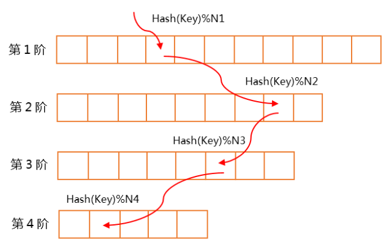

## 多阶哈希

### 一、原理

哈希表是一种非常高效的数据结构，它是通过散列函数将key映射成数组下标以达到O(1)算法复杂度的高效数据结构。但是对于不同的key哈希函数算出的结果可能出现冲突，也就是出现了哈希碰撞，解决碰撞的方式通常有：开放地址法、再哈希法、链地址法。今天要介绍的是一种称为多阶哈希的Rehash方法。
多阶Hash的实现原理并不复杂，每个Hash桶算作一阶，如果有4阶的多阶Hash，那么就是一个二维数组，第一维是Hash桶的阶数编号，第二维是对应阶编号下Hash桶的每个槽的位置。如下图所示：

每阶槽的个数都是质数个，每阶槽的个数依次递减。由于互质的特性，通常情况下会上面的阶数先被填满，然后再逐步填下面的阶数。在实际使用中，内存使用率可以达到90%以上。查找和插入的复杂度都是O(h)其中h是阶数。

- **查找过程**：先从第一阶开始依次往后查找，如果找到就返回，没找到就到下一阶继续查找，直到查找完所有的哈希桶返回查找失败。
- **插入过程**：依次从第一阶开始往后查找是否已存在哈希桶中，如果找到则直接覆盖数据，如果查找完所有的哈希桶都没有找到记录，则找出从第一阶到最后一阶可以分配给该key并且没有被使用的位置插入该记录。

### 二、 优点:

1 查找和插入时间稳定高效，正比于阶数虽然不是最高效的，但是链地址法冲突太多退化成链表操作效率不稳定。
2 实现简单，使用多维数组实现，和普通哈希实现相比除了需要访问多个哈希桶没其他复杂的实现。
3 便于扩容，只要在加一阶数组就可以完成扩容

### 三、缺点

1 容量有限，虽然可以很简便的扩容，但是数量总是有上限的
2 扩展性不好，在每一阶都填满的情况下会出现key无法存储，相比于链地址法碰撞的情况可以增加到链表末尾相比扩展性更差
3 由于数组是定长的，所以定义元素的时候需要以最大的value来定义元素大小

### 四、 优化

1 多阶哈希+末尾阶链地址法，使用这种方法之后就可以解决容量和扩展性问题，但是数据达到一定量之后会退化成链表操作，和普通的哈希相比并没什么优势，所以需要监控数据量动态的做出调整
2 数组元素存储地址索引而不是value，通过地址索引再找到实际的value值，这样就可以不用把数组元素大小设置成最大的value大小。