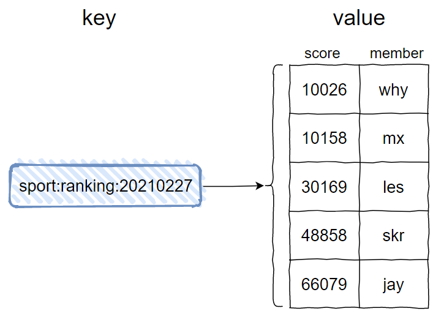
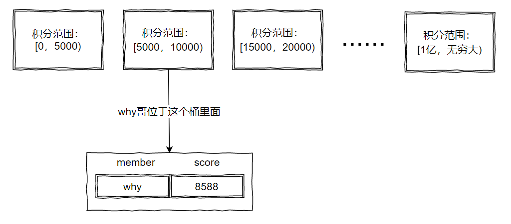

## 排行榜设计

方案设计不能脱离业务场景，业务量比较小的情况直接使用 MySQL 的 order by 即可

### 一、基于 redis 的 zset

跳表 + 字典 的实现 

redis 的有序集合（zset），如下，value 是一个集合，这个集合是有序的，集合中的每一个 member 都有 score，然后按照 score 进行降序排序。对于相同的 score ，就按照 member 的字典序排序。



一些常用的 redis 有序集合 API，

```
# 添加 member，支持添加多对 score-member 
zadd key score member [score member ...]

# 给 key 对应的有序集合中 member 增加 increment 
zincrby key increment member

# 获取 member 的排名，排名从 0 开始计算。 zrank 按照分数从低到高返回 member 排名；zrevrank 按照分数从高到低返回 member 排名
zrank key member 
zrevrank key member 

# 返回指定排名范围内的 member 。zrange 按照 score 从低到高返回指定排名范围内的 member；zrevrange 按照 score 从高到低返回指定排名范围内的 member 
zrange/zrevrange key start end [withscores] 
zrevrange key 0 2 withscores  # 返回排名前三的 member 和对应的 score 
zrevrange key 0 -1 # 返回所有 member 的排名 
```

如上基本上可以得出排行榜，但是我们需要关联到业务场景，

比如微信的步数，那就需要自己好友内的排行榜，而不是所有用户的排行榜，因为不可能为每个用户都有一个 key 存储这个用户的排行榜信息（一个用户的分数更新的时候需要对所有好友的 zset 更新）。可以将用户请求查看排行榜的时候，根据用户的好友关系，循环获取好友的步数，生成排行榜。

微信的步数还需要展示微信头像和朋友圈点赞个数。我们需要存储一个 User 对象，对象里面有这几个字段：昵称、头像图片链接、点赞数、步数等。可以使用 redis 的 hash 结构，

**如果我们需要提供一个最近七天、上一周、上一月、这一年的排行榜，如何做呢？**

```
# 获取交集/并集
zinterstore/zunionstore destination numkeys key [key ...] [weights weight [weight ...]] [aggregate sum|min|max] 
```

- zinterstore/zunionstore 交集/并集
- destination 将交集/并集的结果保存到这个键中
- numkeys 需要做交集/并集的集合的个数
- key [ key... ]   具体参与交集/并集的集合
- [weights weight [weight ...]]  每个参与计算的集合的权重。在做交集/并集计算时，每个集合中的 member 会把自己的 score 乘以这个权重，默认为 1
- [aggregate sum | min | max]  对于各个集合中的相同元素是 sum(求和)、min(取最小值)还是max(取最大值)，默认为 sum 

```
zunionstore sport:ranking:why:last_seven_day 7 sport:ranking:why:20210222 sport:ranking:why:20210223 sport:ranking:why:20210224 sport:ranking:why:20210225 sport:ranking:why:20210226 sport:ranking:why:20210227 sport:ranking:why:20210228 weights 1 1 1 1 1 1 1 aggregate sum
```

如上，我可以求出 20210222 - 20210228 这七天的排行榜存到键 sport:ranking:why:last_seven_day 中。我们使用的是并集，如果我们要求是对最近 7 天，每天都上传运动数据的人进行排序，则用交集来算。

### 二、分而治之的思想

分而治之的方案可以用于排行榜的设计上，比如王者荣耀的排行榜设计，王者有 8 个段位：青铜、白银、黄金、铂金、钻石、星耀、最强王者、荣耀王者。就可以对应有 8 个桶。将每个用户的得分先归到一个桶中。那我们只需要某个用户在一个桶中的排名即可得到总排名。

对于亿级用户，8 个桶还是太少了，我们可以继续分桶，比如：星耀有星耀一到星耀五，每个星耀还有五颗星等等

对于亿级用户来说，分桶解决了根本问题，我们可以把段位加上其他条件换算成积分，然后按照积分来拆分，如下：



带来了一个问题，积分的范围如何划分的均匀？这时需要进行数据分析，通过一系列的高数、概率、离散等知识去做每个桶大小的预估

### 三、其他考虑

上面说的都是从具体的算法角度来考虑，回归到业务场景中，我们还要考虑

- 考虑实时排序和非实时排序，对应实时榜和非实时榜。非实时榜可以在一段时间算好，然后存储 MySQL，直接查即可
- 还有子榜，比如有一个全国排名，还要有一个地域排名
- 业务可以周期性清榜
- 业务如何就近接入？做到低延时
- 如何容灾？

#### 1. 容灾/持久化存储

- 榜单 mmap 化，排行数据以mmap文件形式落地存储。出现进程crash，系统非异常重启时数据不丢失；同时又能够保证数据的读写效率。
- **多机多进程热备** 多机多进程热备，保证即便某一个节点失效后，仍能继续提供服务。节点出故障后，也能快速恢复。
- **topN数据存入nosql集群** 重要数据（比如topN）在nosql集群进行备份，一旦所有机器都出现不可恢复的故障导致数据丢失等严重问题时，topN数据还能从nosql集群中恢复。

#### 2. 高性能

- 除了优化排序算法之外，也可以
- **多线程** 当业务量很大，并且配置的子榜数表多的时候，如何保证排行服务的处理能力。由于本身排行服务是有状态的并且榜单之间数据强关联，无法采用传统的单线程多进程平行部署的方式。这时支持多线程能够充分利用机器的CPU资源，同时根据机器的CPU、内存资源按需合理充分地利用机器的资源。采用的多线程模型是 Dispatcher-Worker 模型，主线程主要做分发和部分全局处理逻辑。工作线程主要用来处理不同score_type对应的榜单（实时榜更新、榜单查询）逻辑的处理，同时为了避免多线程模型中的锁操作引发的低效，**保证对同一个榜单的访问都在同一个线程中进行**，且尽可能保证将所有榜单的处理工作**均衡**分发到多个工作线程中去。（类似于 map-reduce 思想）

#### 3. 数据一致性

- **服务进程之间的最终一致性** 互为热备的进程之间，通过一致性校验工具，通过两两之间定期去比对榜单数据，对于不一致的部分，工具进行补偿修正。为了能及时保证进程间一致性同时避免给进程造成太大的压力，一致性校验工具只校验实时榜（topN）部分的数据。一致性校验工具是通过向服务进程拉取全量topN榜单请求的方式来获取榜单的，需要控制向服务进程拉取的频率，避免影响排行服务进程的正常业务处理吞吐量。
- **玩家session一致性** 多机热备引起的不一致，即便采用一致性校验工具，也还是会存在临时的短暂不一致，**为了能够保证玩家的体验，我们对玩家查询榜单的请求做一致性哈希计算，保证正常提供服务期间同一个玩家查询到的榜单数据始终来源于同一个进程**。这样玩家看到的数据始终是一致的。

#### 4. 保护机制

- 数据保护
    - **不可恢复数据保护** 前面提到，榜单数据是保存在mmap文件中的，基本大部分的榜单更新操作都是非原子操作，也就是说，一旦在非原子操作中进程崩溃以后，其实榜单数据是错误的，并且很有可能是无法恢复的；错误的榜单如果直接呈现给玩家绝对是个不可容忍的问题。为了识别出这种非原子操作未完成崩溃引起的数据错乱问题，我们在每个榜单mmap结构中加入一个**dirty（脏位）**字段来做标记。
    - **mmap数据保护** 由于榜单都是mmap内存映射方式，进程虚拟地址空间的内存映射区之间都有可能由于逻辑错误产生越界，排行数据的mmap文件有个**首部和尾部**保护区。如果mmap被其它内存映射区越界写坏了，首部校验会失败；同样的，如果排行服务的mmap越界写坏了其它内存映射区，尾部校验时也能发现越界问题。**这样可以提前发现越界风险**，避免越界发生后花费大量时间精力去定位问题。另外一点就是，如果服务的mmap越界访问的内存空间很小的话，还可以起到保护后面的数据不会写坏的作用。
- 过载保护
    - 一致性校验工具拉取榜单的频率做了限制，超过限制就丢包，避免大量的拉取全量TopN榜单请求引起正常业务的访问；

