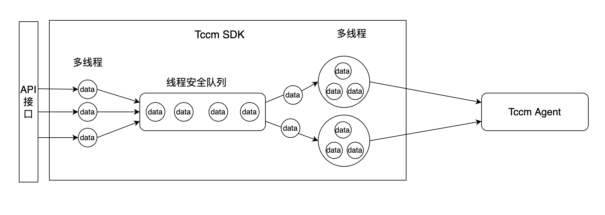
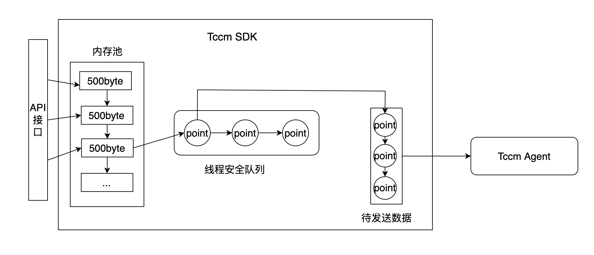

## 一、背景

对于21世纪的人类，已经不满足于单核并行的模式；提高效率，增效降本才是我们向往的。程序设计中选择什么样的数据结构体是解决某个问题的关键。如果多线程使用到的数据结构体要满足并发，则涉及到数据的线程安全问题，一种解决办法是选择单独的互斥元或外部锁来使数据结构体在某一时间段独占，且释放后没有残留。另一种就是设计可以多线程同时访问的数据结构体。明显，后者在大部分场景是效率较高的。

### 1. 工作中遇到的场景

腾讯云云监控团队对于自定义监控的场景没有一个适应现代化的上报组件，历史上例如 monitor、巴拉多、哈勃等监控系统，由于年代比较久远，只支持单维度上报、无法支持多维度的场景或改造困难，以及对于业界比较流行的统计方式(histogram、summary)无法支持，性能相对较差，页面老旧，无法覆盖业务场景，因此迫切需要一个上报组件，在业务和监控中台之间做一个连接。采集业务的指标数据进行处理、聚合后上报到监控中台。

因此我们云监控的自定义指标监控的路径为：` TCCM SDK -> TCCM Agent -> 监控中台 `。TCCM 全称为：tencent cloud - cloud monitor，即腾讯云云监控。在 TCCM SDK 的整体设计中，业务通过调用 SDK 提供的 API 接口，将自己的监控数据写入 SDK 内部的线程安全队列，然后由与 SDK 内部的线程去消费数据并发送给 TCCM Agent。如下图：


如上图是我们第一版本的 tccm 框架，首先进行具体的介绍，业务方会多线程调用我们 Tccm SDK 提供的接口，申请内存，填充数据；然后将数据写入线程安全队列。SDK内部会有 N 个线程读取数据并处理数据，最后批量发送数据。

相信我们很容易可以发现问题，一是内存空间可以是复用的，二是线程安全队列的读取线程可以一次读取所有数据然后批量发送。

那应该如何设计一个既能满足多线程访问、又可以保证效率最高的线程安全队列呢？于是我做了如下的工作

### 2. 第一次实现的线程安全队列代码

这里贴上我之前实现的线程安全队列的代码，记录问题所在
- 头文件
```cpp
template <typename T>
class ThreadSafeQueue {
private:
    struct Node {
        std::shared_ptr<T> data_;
        std::unique_ptr<Node> next_;
    };
    std::mutex head_mutex_;
    std::unique_ptr<Node> head_;
    std::mutex tail_mutex_;
    Node* tail_;
    std::condition_variable data_cond_;
    std::atomic<unsigned int> queue_size_;
    const unsigned int queue_capacity_;
private:
    Node* GetTailPtr();
    std::unique_ptr<Node> PopHeadPtr();
    std::unique_lock<std::mutex> WaitForData();
    std::unique_ptr<Node> WaitPopHeadPtr();
    std::unique_ptr<Node> WaitPopHeadPtr(T& value);
    std::unique_ptr<Node> WaitPopHeadPtrWithTimeout(int timeout_ms);
    std::unique_ptr<Node> TryPopHeadPtr();
    std::unique_ptr<Node> TryPopHeadPtr(T& value);

public:
    explicit ThreadSafeQueue(unsigned int queue_capacity);
    ThreadSafeQueue(const ThreadSafeQueue& other) = delete;
    ThreadSafeQueue& operator=(const ThreadSafeQueue& other) = delete;

    std::shared_ptr<T> TryPop();
    bool TryPop(T& value);
    std::shared_ptr<T> WaitAndPop();
    void WaitAndPop(T& value);
    std::shared_ptr<T> WaitAndPopWithTimeout(int timeout_ms);
    bool Push(T& new_value);
    unsigned int GetQueueSize();
    unsigned int GetQueueCapacity();
    bool Empty();
};
```
- 源文件
```cpp
template <typename T>
ThreadSafeQueue<T>::ThreadSafeQueue(unsigned int queue_capacity)
        : head_(new Node), tail_(head_.get()), queue_size_(0), queue_capacity_(queue_capacity)
{}

template <typename T>
typename ThreadSafeQueue<T>::Node* ThreadSafeQueue<T>::GetTailPtr() {
    std::lock_guard<std::mutex> tail_lock(tail_mutex_);
    return tail_;
}

template <typename T>
std::unique_ptr<typename ThreadSafeQueue<T>::Node> ThreadSafeQueue<T>::PopHeadPtr() {
    std::unique_ptr<Node> old_head = std::move(head_);
    head_ = std::move(old_head->next_);
    queue_size_--;
    return old_head;
}

template <typename T>
std::unique_lock<std::mutex> ThreadSafeQueue<T>::WaitForData() {
    std::unique_lock<std::mutex> head_lock(head_mutex_);
    data_cond_.wait(head_lock, [&]{return head_.get() != GetTailPtr(); });
    return head_lock; // 不使用 std::move(head_lock); 编译器会优化
}

template <typename T>
std::unique_ptr<typename ThreadSafeQueue<T>::Node> ThreadSafeQueue<T>::WaitPopHeadPtr() {
    std::unique_lock<std::mutex> head_lock(WaitForData());
    return PopHeadPtr();
}

template <typename T>
std::unique_ptr<typename ThreadSafeQueue<T>::Node> ThreadSafeQueue<T>::WaitPopHeadPtr(T& value) {
    std::unique_lock<std::mutex> head_lock(WaitForData());
    value = std::move(*head_->data_);
    return PopHeadPtr();
}

template <typename T>
std::unique_ptr<typename ThreadSafeQueue<T>::Node> ThreadSafeQueue<T>::WaitPopHeadPtrWithTimeout(
        int timeout_ms) {
    auto milli_second = std::chrono::milliseconds(timeout_ms);
    std::unique_lock<std::mutex> head_lock(head_mutex_);
    if (!data_cond_.wait_for(head_lock, milli_second, [&]{return head_.get() != GetTailPtr(); })) {
        return std::unique_ptr<Node>();
    }
    return PopHeadPtr();
}

template <typename T>
std::unique_ptr<typename ThreadSafeQueue<T>::Node> ThreadSafeQueue<T>::TryPopHeadPtr() {
    std::lock_guard<std::mutex> head_lock(head_mutex_);
    if (head_.get() == GetTailPtr()) {
        return std::unique_ptr<Node>();
    }
    return PopHeadPtr();
}

template <typename T>
std::unique_ptr<typename ThreadSafeQueue<T>::Node> ThreadSafeQueue<T>::TryPopHeadPtr(T& value) {
    std::lock_guard<std::mutex> head_lock(head_mutex_);
    if (head_.get() == GetTailPtr()) {
        return std::unique_ptr<Node>();
    }
    value = std::move(*head_->data_);
    return PopHeadPtr();
}

template <typename T>
std::shared_ptr<T> ThreadSafeQueue<T>::TryPop() {
    std::unique_ptr<Node> old_head = TryPopHeadPtr();
    return old_head ? old_head->data_ : std::shared_ptr<T>();
}

template <typename T>
bool ThreadSafeQueue<T>::TryPop(T& value) {
    std::unique_ptr<Node> const old_head = TryPopHeadPtr(value);
    return old_head;
}

template <typename T>
std::shared_ptr<T> ThreadSafeQueue<T>::WaitAndPop() {
    std::unique_ptr<Node> const old_head = WaitPopHeadPtr();
    return old_head->data_;
}

template <typename T>
void ThreadSafeQueue<T>::WaitAndPop(T& value) {
    std::unique_ptr<Node> const old_head = WaitPopHeadPtr(value);
}

template <typename T>
std::shared_ptr<T> ThreadSafeQueue<T>::WaitAndPopWithTimeout(int timeout_ms) {
    std::unique_ptr<Node> const old_head = WaitPopHeadPtrWithTimeout(timeout_ms);
    if (!old_head) {
        return std::shared_ptr<T>();
    }
    return old_head->data_;
}

template <typename T>
bool ThreadSafeQueue<T>::Push(T& new_value) {
    std::shared_ptr<T> new_data(std::make_shared<T>(new_value));
    std::unique_ptr<Node> p(new Node);
    do {
        std::lock_guard<std::mutex> tail_lock(tail_mutex_);
        if (queue_size_.load(std::memory_order_relaxed) >= queue_capacity_) {
            return false;
        }
        tail_->data_ = new_data;
        Node* const new_tail = p.get();
        tail_->next_ = std::move(p);
        tail_ = new_tail;
        queue_size_++;
    } while (false);
    data_cond_.notify_one();
    return true;
}

template<typename T>
unsigned int ThreadSafeQueue<T>::GetQueueCapacity() {
    return queue_capacity_;
}

template<typename T>
unsigned int ThreadSafeQueue<T>::GetQueueSize() {
    return queue_size_.load(std::memory_order_relaxed);
}

template <typename T>
bool ThreadSafeQueue<T>::Empty() {
    std::lock_guard<std::mutex> head_lock(head_mutex_);
    return (head_.get() == GetTailPtr());
}
```
如上是我实现的第一个版本的线程安全队列。底层使用的链表的方式做基本存储数据的结构。Push 的方法是非阻塞的，如果队列满，则插入失败。而 Pop 的方法提供了两种类型接口，阻塞式插入和非阻塞式插入。使用条件变量做为写进程和读进程之间的同步操作。这是功能的介绍。
我现在在去看这段代码的时候，我觉得还是有很多很多的优化点，我自己梳理下需要优化的点
1. 比如每次 push 的时候都需要调用条件变量的 notify 接口，一个系统调用的时间在当前场景中是非常不能容忍的。而且 notify 接口在实际测试时达到惊人的 3-4us 耗时，后面文章会分析为何如何耗时
2. 当前的场景中，发送数据需要批量发送，而此线程安全队列只提供了单次获取一条数据的接口。做了很多无用功
3. 链表的 Node 节点没有初始化好，在每次 push 的时候才去创建 Node 节点，还有 new 空间的开销。

那如何设计出符合某个具体场景，又可以再满足功能的情况，达到最优的性能呢？于是我做了下面的功课。

## 二、使用锁保证线程安全的理解

为了使一个数据结构体是线程安全的，对于加锁的情况，那么就必须保证多个线程可以轮流存取互斥元保护的数据，也就是以线性的而非并发的存取数据，将其称为序列化。那么我们希望可以有更小的保护区域、更少的操作被序列化、以及更高的并发潜能。则应该保证安全的存取数据和允许真正的并发存取。关于安全的存取数据，我想到的细节：

1. 保证一个线程在操作数据结构时，这个过程中此数据结构体的变化过程别的线程应该看不到，别的线程只需要看到结果即可。
2. 当使用锁时，可以限制锁的范围、避免使用嵌套锁，降低产生死锁的机会。
3. 数据结构体的接口在外界看来是可竞争的，因此可提供具有完整操作的接口，不应是操作步骤
4. 数据结构体应该有一些限制条件，对于特殊的函数
    - 构造函数和析构函数需要以独占方式操作数据结构，需要保证在构造函数完成前或者析构函数开始后数据结构不被操作。
    - 其他的拷贝构造、swap函数等与别的操作同时被调用时是否安全
5. 代码在某处抛出异常或其他原因到线程直接退出，数据结构体如何保证不被破坏

关于实现并发，我这样想：

1. 锁的范围是否被限定？锁范围内的某些操作是否可以在锁外被执行？锁的范围是否足够小？
2. 数据结构体中能否使用不同的互斥元来保证数据或操作的安全？且多个锁如何避免死锁？
3. 操作时是否需要不同级别的保护？

因此可以总结为：我们需要能够以必然发生的序列化，来最大限度的实现并发。

## 三、无锁保证线程安全的理解

作为对比，具有锁的数据结构体，操作系统会完全阻塞一个线程（并且将这个线程的时间片分配给另一个线程）直到另一个线程执行了适当的动作将其解锁，可以是解锁互斥元、通知条件变量或其他操作。这个过程中必须有一个以上的线程处于阻塞状态，可以看到单纯以锁的角度来看，锁的目的就是通过互斥来阻止并发。而使用无锁数据结构体最主要的原因就是为了实现最大程度的并发。也即多线程操作无锁数据结构体，每个线程不敢做什么操作，都可以继续执行而不需要等待。

无锁的优点之二是健壮性，对于有锁数据结构体，一个线程持有一个锁时终止，那这个数据结构体就永远的被破坏了。而对于无锁数据结构体，一个线程的终止不会影响到其他线程的正常执行，最多这个线程的数据丢了。

无锁的方式是原子操作，还有一个重点是顺序问题，必须确保编译器优化时代码的执行顺序是预知的。

当然，无锁方式虽然不会死锁，但多个线程都试图修改数据结构体时，每个线程所做的修改都会要求其他线程的操作重新执行，这种情况就很难受，通常这是短暂的，但也依赖线程的精确调度；这种情况也会降低性能。因此我们希望这种情况能够在有限的操作步骤下结束。所以，尽管无锁有可能提高并发能力，减少线程等待时间，但也有可能降低整体的性能。

因此，针对具体的场景应该有不同的解决方案来支撑；我们需要确认收益大于代价。

## 四、基础知识

在此之前，我们先来看一些基础知识，涉及的技术点的举例我大部分以 c++ 来举例

### 1. 原子操作与CAS

- 原子操作：是一个不可分割的操作，从系统中的任何一个线程中，你都无法观察到以恶搞完成了一半的这种操作，它要么做完了，要么没有做完。如果读取对象值的载入操作是原子的，并且所有对该对象的修改也都是原子的，那么这个载入操作所获得得要么是对象的初始值，要么是被修改者修改后的值。

- CAS 的意思是 Compare & Set 或者 Compare & Swap。整个过程是原子的。现代几乎所有的CPU指令都支持 CAS 的原子操作，X86 下对应的是 CMPXCHG 汇编指令

    在 c++ 的 atomic 中关于 CAS 的实现有两种

    ```c++
    template< class T >
    bool compare_exchange_weak (T& expected, T val, memory_order sync = memory_order_seq_cst) noexcept;
    template< class T >
    bool compare_exchange_strong (T& expected, T val, memory_order sync = memory_order_seq_cst) noexcept;
    ```

### 2. atomic_compare_exchange_weak 和 atomic_compare_exchange_weak

功能：如果原子变量值和期望值相等，则将原子变量值替换为 val。如果原子变量值和期望值不相等，则将期望值替换为原子变量值。两个函数的功能一致。默认使用 memory_order_seq_cst 内存顺序。

区别：compare_exchange_wak 有可能出现虚假失败，即原子变量值和期望值相等的情况下，依然返回失败。这种情况下原子变量值是不会变化的。这种情况最有可能发生在缺少单个的比较并交换指令的机器上或者某些平台使用伪指令(不是X86上的指令)，在这样的平台上，上下文切换，另一个线程重新加载相同的地址（或缓存行）等可能会使原语失败。因此 compare_exchange_wak 通常用在循环中：

```c++
bool expected = false;
extern atomic<bool> b;
while (!b.compare_exchange_weak(expected, true) && !expected);
```

在这种情况下，只要 expected 仍为 false，表明 compare_exchange_wak 调用虚假失败，应该保持循环

而 compare_exchange_strong 没有这种虚假失败，

如果待存储的值很简单，为了避免在 compare_exchange_weak 可能会虚假失败进行循环也还好。但如果待存储的值本身是耗时的，当个 expected 值没有变化时，使用 compare_exchange_strong 来避免被迫重新计算待存储的值可能是有意义的。并且虚假失败通常很少发生，compare_exchange_weak 的性能往往比 compare_exchange_strong 要快很多。

因此，简单来说，c++ 为我们提供这两种语义，一种是“尽力而为”，一种是“我一定会做到，无论中间有多少坏事发生”。

### 3. 内存顺序

先来举一个例子，引出话题

```c++
void foo(int a, int b) {
    std::cout << a << ',' << b << std::endl;
}
int get_num() {
    static int i = 0;
    return ++i;
}
int main() {
    foo(get_num(), get_num());
}
```

如上代码，你能否确认最终输出 “1，2” 还是 “2，1”呢？因为对 get_num() 的两次调用的顺序未指定。有时候，单条语句中的操作是有顺序的，例如使用内置的逗号操作符或者使用一个表达式的结果做为另一个表达式的参数。但是对于人类来说，一条语句中所有操作在下一条语句的之前发生，对于编译器却不这么看。如上还是单线程，应用到多线程呢？

#### 3.1 atomic 的内存顺序

c++ 提供的 atomic 有六种内存顺序选项，分别代表三种模型：

1. 顺序一致模型：memory_order_seq_cst
2. 获得-释放模型：memory_order_consume、memory_order_acquire、memory_order_release、memory_order_acq_rel
3. 松散模型：memory_order_relaxed

#### 3.2 顺序一致模型

简单来说，这意味着程序的行为基本可以按照人类的的眼光去看。也就是说，**操作不能被重排**，如果代码中在一个线程中有一个操作在另一个的前面，那么这个顺序对于所有的其他线程都是可见的。

易于理解的代价是巨大的，在多处理器的弱顺序机器上，性能会变得很差劲，**因为操作的整体顺序必须与处理器之间保持一致，这就可能需要处理器之间进行密集(其昂贵)的同步操作**。如下代码演示：

```c++
std::atomic<bool> x, y;
std::atomic<int> z;
void write_x() {
    x.store(true, std::memory_order_seq_cst);
}
void write_y() {
    y.store(true, std::memory_order_seq_cst);
}
void read_x_then_y() {
    while (!x.load(std::memory_order_seq_cst));
    if (y.load(std::memory_order_seq_cst)) ++z;
}
void read_y_then_x() {
    while (!y.load(std::memory_order_seq_cst));
    if (x.load(std::memory_order_seq_cst)) ++z;
}
int main() {
    x = false;
    y = false;
    z = 0;
    std::thread a(write_x);
    std::thread b(write_y);
    std::thread c(read_x_then_y);
    std::thread d(read_y_then_x);
    a.join();
    b.join();
    c.join();
    d.join();
    assert(z.load() != 0);
}
```

如上代码中，assert 永远都不会被触发，因为对 x 的 store 或者对 y 的 store 必须先发生。由于 memory_order_seq_cst 的语义需要在所有标记 memory_order_seq_cst 的操作上有着单个总体顺序，如 read_y_then_x 函数中 返回 false 的 `y.load()` 操作和 `x.load()`  操作之间有一个顺序关系。也就是说，如果一个线程看到 `y == false` ，随后看到了 `x==true`，那意味着在这个总体顺序上，y 的 store 操作一定发生在 x 的 store 操作之前。

当然，如 `read_x_then_y` 函数中返回 false 的 `x.load()`操作和 `y.load()` 操作之间有一个顺序关系，也就是说，如果一个线程看到 `x==false`，然后看到 `y-true`，那意味着在这个总体顺序上，x 的 store 操作一定发生在 y 的 store 操作之前。

在这两种情况中，z 都等于 1，无论如何 z 都不可能为0。

因此，顺序一致模型是最直观，也是最昂贵的内存顺序，它要求所有线程之间的全局同步，在多处理器中，可能需要处理器之间相当密集和耗时的通信。因此我们可以考虑考虑其他内存顺序

#### 3.3 松散顺序模型

松散顺序模型唯一的要求就是：**从同一个线程对单个原子变量的访问不能被重排，一旦给定的线程已经看到了原子变量的特定值，该线程之后的读取就不能获取该变量更早的值**。如下代码演示：

```c++
std::atomic<bool> x, y;
std::atomic<int> z;
void write_x_then_y() {
    x.store(true, std::memory_order_relaxed);
    y.store(true, std::memory_order_relaxed);
}
void read_y_then_x() {
    while (!y.load(std::memory_order_relaxed));
    if (x.load(std::memory_order_relaxed)) ++z;
}
int main() {
    x = false;
    y = false;
    z = 0;
    std::thread a(write_x_then_y);
    std::thread b(read_y_then_x);
    a.join();
    b.join();
    assert(z.load() != 0);
}
```

如上代码，assert 是可以被触发的，x 和 y 是两个不同的变量，所以关于每个操作所产生的值的可见性没有顺序保证。不同变量的松散操作可以被自由的重排。

#### 3.4 获取&释放模型

这种模型操作仍然没有总的顺序，但是引入了一些同步。释放操作和获取操作同步。这意味着不同的线程仍然可以看到不同的排序，但是这些顺序是受限制的。如下代码演示

```c++
std::atomic<bool> x, y;
std::atomic<int> z;
void write_x_then_y() {
    x.store(true, std::memory_order_relaxed);
    y.store(true, std::memory_order_release);
}
void read_y_then_x() {
    while (!y.load(std::memory_order_acquire));
    if (x.load(std::memory_order_relaxed)) ++z;
}
int main() {
    x = false;
    y = false;
    z = 0;
    std::thread a(write_x_then_y);
    std::thread b(read_y_then_x);
    a.join();
    b.join();
    assert(z.load() != 0);
}
```

如上代码，我替换了 y 变量的获取和释放的内存顺序。因此，对 y 的 load 操作将会看到由 y 的 store 写下的 true。对 y 的 load 和 store 之间是同步的。对 x 的 store 发生在对 y 的 store 之前，因为 write_x_then_y 在同一个线程中。因为对 y 的 store 与对 y 的 load 同步，且对 x 的 store 同样发生于从 y 的 load 之前，并且再推导可以得出，对 x 的 store 会发生与 对 x 的 load 之前。于是 x 的 load 也必然可以读到 true。因此 assert 不会触发。

但是如果 y 的 load 操作不在 while 循环里，就不一定是上面的情况了。从 y 的 load 可能读到 false，这种情况下，对 x 的 load 就没有要求了。

因此，为了提供同步，获取和释放操作必须配对，由释放操作存储的值必须被获取操作看到，以便两者中的任意一个生效。 

注：这种模型下还有其他更加深刻的语义，此文暂不进行深入探究

### 4. 内存屏障

内存屏障是全局操作，在之前内存顺序的松散模型中，编译器或者硬件通常可以自由的进行重新排序。屏障限制了这一自由。演示一段代码

```c++
std::atomic<bool> x, y;
std::atomic<int> z;
void write_x_then_y() {
    x.store(true, std::memory_order_relaxed);
    std::atomic_thread_fence(std::memory_order_release); // 释放屏障
    y.store(true, std::memory_order_relaxed);
}
void read_y_then_x() {
    while (!y.load(std::memory_order_relaxed));
    std::atomic_thread_fence(std::memory_order_acquire); // 获取屏障
    if (x.load(std::memory_order_relaxed)) ++z;
}
int main() {
    x = false;
    y = false;
    z = 0;
    std::thread a(write_x_then_y);
    std::thread b(read_y_then_x);
    a.join();
    b.join();
    assert(z.load() != 0);
}
```

如上代码。释放屏障和获取屏障同步，y 的 store 一定会在 y 的 load 之前。也就意味着对 x 的 store 发生在 x 的 load 之前，所以读取的值一定是 true。因此 assert 一定不会触发。

屏障的总体思路：如果获取操作看到了释放屏障后发生的存储的结果，该屏障与获取操作同步；如果在获取屏障之前发生的载入看到释放操作的结果，该释放操作与获取屏障同步。

### 5. ABA 问题

参考维基百科的定义，问题可以描述为：

1. 线程 T1 从共享内存中读取值 A
2. 线程 T1 被抢占，线程 T2 执行
3. 线程 T2 将共享内存中值 A 修改为值 B，然后又修改为值 A
4. 线程 T1 执行，看到值 A 没有发生变化，则继续执行

咋一看，没什么问题，但是如果这个值是指针呢？指针的值没有改变，但是指针所指向的内容有可能发生改变。而操作系统中内存复用（MRU算法）是常见的行为，很容易出现新分配的对象与删除的对象处于同一位置。而这个问题在无锁的线程安全队列中需要关注。

从网上找到的一个例子：

> 有一个人类(男)拿着一个装满钱的手提箱在飞机场，此时过来了一个火辣性感的美女，然后她很暖昧地挑逗着这个人类，并趁这个人类不注意的时候，用一个一模一样的手提箱和这个人类装满钱的箱子调了个包，然后就离开了，这个人类看到自己的手提箱还在，于是就提着手提箱去赶飞机去了。

### 6. 解决 ABA 问题

参考维基百科，有三种解决方法

1. 标记状态：一种常见的解决方法是在所要同步的结构上添加额外的“标签”位。例如，在指针上使用比较和交换的算法可能会使用地址的低位来指示指针已成功修改的次数。因此，即使地址相同，下一次比较和交换也会失败，因为标签位不匹配。这有时被称为ABAʹ，因为第二个A与第一个略有不同。

2. 中间节点：一个可行但昂贵的方法是使用不是数据元素的中间节点，从而在插入和删除元素时确保不变量，

3. 延迟回收：推迟回收已删除的数据元素，实现较为复杂

## 五、调研

我分别学习了 `go` 语言中 `channel` 的实现、`c++` 语言中 `boost` 库关于 `lockfree/queue` 的实现、`java` 语言中 `BlockingQueue、ConcurrentLinkedQueue` 的实现。

### 1. channel （go）实现

首先明确go语言的设计模块：不要通过共享内存的方式进行通信，而是应该通过通信的方式共享内存。这样在我看来让 go 语言代码更加整洁。因此 go 语言中 Goroutine 之间会通过 Channel 传递数据。基于go 1.15 版本，Channel 的实现：

#### 1.1 Channel 底层数据结构

chan 的底层数据结构如下：

```go
type hchan struct {
	qcount   uint           // 元素个数
	dataqsiz uint           // 环形队列的长度
	buf      unsafe.Pointer // 指向环形队列的指针
	elemsize uint16         // 环形队列中每个元素的大小
	closed   uint32         // chan 是否被关闭
	elemtype *_type         // 环形队列中元素的类型
	sendx    uint           // 环形队列中发送操作处理到的位置
	recvx    uint           // 环形队列中接收操作处理到的位置
	recvq    waitq          // 处于阻塞状态的接收 Goroutine 双向链表
	sendq    waitq  	    // 处于阻塞状态的发送 Goroutine 双向链表
	lock mutex	            // 互斥锁
}
```

chan 使用 make 关键字创建，可以带缓冲区的异步 Channel 和不带缓冲区的同步 Channel。这里对创建过程不做赘述。基本上分为三种情况：

1. 如果 Channel 不存在缓冲区，那么就只会给 hchan 结构体分配内存空间
2. 如果 Channel 存储的类型不是指针类型，会为当前的 Channel 和底层的缓冲区（hchan.buf）分配一块连续的内存空间
3. 其他情况会单独给 hchan 和缓冲区（hchan.buf）分配内存

#### 1.2 写数据

向 Channel 写数据，`chan <- data` 这样的操作最终会调用 `runtime.chansend` 函数，如下代码只保留了关键逻辑

```go
func chansend(c *hchan, ep unsafe.Pointer, block bool, callerpc uintptr) bool {
    // 首先会加锁
	lock(&c.lock)
    // 如果 Channel 中已经有处于接收等待状态的 Goroutine，那么会直接从接收队列 recvq 中取出最先陷入等待的 Goroutine 并直接向它发送数据
	if sg := c.recvq.dequeue(); sg != nil {
		// 发送数据，底层处理如下
        // 1. 调用 runtime.sendDirect 将发送的数据直接拷贝到 x <- c 表达式中变量 x 所在的内存地址
        // 2. 调用 runtime.goready 将等待接收数据的 Goroutine 标记为可运行，并把放到处理器的 runnext 上等待执行，该处理器会在下一次调度时唤醒它
        // 3. 解锁返回
		send(c, sg, ep, func() { unlock(&c.lock) }, 3)
		return true
	}
	// 如果 Channel 包含缓冲区并且缓冲区没有满，则将数据存储于缓冲区
	if c.qcount < c.dataqsiz {
		// 得到一个可以存储数据的位置，就是计算底层内存块的指针位置，根据存储元素的类型大小
		qp := chanbuf(c, c.sendx)
		// 内部调用 memmove 将发送的数据拷贝到缓冲区
		typedmemmove(c.elemtype, qp, ep)
        // 更新已发送操作的位置索引，因为底层内存块类似于一个环形数组，所以会判断是否回到数组开始位置
		c.sendx++
		if c.sendx == c.dataqsiz {
			c.sendx = 0
		}
        // 更新已存储的元素个数，解锁返回
		c.qcount++
		unlock(&c.lock)
		return true
	}
	// block 为 true 代表阻塞发送
    // 如果设置非阻塞发送，但是缓冲区满了，只能解锁返回false
	if !block {
		unlock(&c.lock)
		return false
	}
	// 下面代表 block为 true，阻塞写数据
	// 获取写数据使用的 Goroutine
	gp := getg()
    // 获取 runtime.sudog 的结构并设置这一次阻塞写的相关信息
	mysg := acquireSudog()
	mysg.releasetime = 0
	mysg.elem = ep
	mysg.waitlink = nil
	mysg.g = gp
	mysg.isSelect = false
	mysg.c = c
	gp.waiting = mysg
	gp.param = nil
    // 将创建并初始化的 runtime.sudog 加入到 Channel 的写阻塞等待队列中
	c.sendq.enqueue(mysg)
    // 将当前 Goroutine 陷入睡眠等待唤醒
	gopark(chanparkcommit, unsafe.Pointer(&c.lock), waitReasonChanSend, traceEvGoBlockSend, 2)
    // 被调度器唤醒后会执行一些析构的动作
	gp.waiting = nil
	gp.activeStackChans = false
	gp.param = nil
	mysg.c = nil
	releaseSudog(mysg)
	return true
}
```

如上面代码的注释，总结下写 Channel 的几种情况

1. 如果 Channel 的接收队列上存在已经被阻塞的 Goroutine，那么会直接将数据发送给这个 Goroutine，并设置其为下一个可运行的 Goroutine
2. 如果 Channel 存在缓冲区并且还有空闲的容量，则将数据存储在缓冲区
3. 如果不满足上述条件。设置为非阻塞，直接返回；设置为阻塞，则会创建一个 runtime.sudog 结构并加入 Channel 的发送队列中，当前 Goroutine 陷入阻塞等待其他 Goroutine 从 Channel 接收数据。

#### 1.3 读数据

从 Channel 读数据，`i <- chan` 这样的操作最终会调用 `runtime.chanrecv` 函数，如下代码只保留了关键逻辑

```go
func chanrecv(c *hchan, ep unsafe.Pointer, block bool) (selected, received bool) {
	// 首先加锁
	lock(&c.lock)
	// 当 Channel 中发送阻塞队列中包含处于等待状态的 Goroutine 时，取出队列头部等待的 Goroutine，接收其数据
	if sg := c.sendq.dequeue(); sg != nil {
		// 如果 Channel 不存在缓冲区，则将发送队列中 Goroutine 存储的数据拷贝到目标内存地址
        // 如果 Channel 存在缓冲区，先将队列中的数据拷贝到接收方的内存地址，再将发送队列头的数据拷贝到缓冲区，释放一个阻塞的发送方 Goroutine 
		recv(c, sg, ep, func() { unlock(&c.lock) }, 3)
		return true, true
	}
	// 当缓冲区包含数据
	if c.qcount > 0 {
		// 获取 Channel 中当前可以接收数据的位置
		qp := chanbuf(c, c.recvx)
		// 将缓冲区的数据拷贝到内存
		if ep != nil {
			typedmemmove(c.elemtype, ep, qp)
		}
        // 清理队列中的数据并完成收尾工作，解锁返回
		typedmemclr(c.elemtype, qp)
		c.recvx++
		if c.recvx == c.dataqsiz {
			c.recvx = 0
		}
		c.qcount--
		unlock(&c.lock)
		return true, true
	}
	// block 为 true 表示阻塞
    // 如果 block 设置为不阻塞的话，直接解锁退出
	if !block {
		unlock(&c.lock)
		return false, false
	}
	// 当 Channel 的发送队列中不存在等待的 Goroutine 并且缓冲区也不存在任何数据时，且设置为阻塞，执行如下
	gp := getg()
    // 创建一个 runtime.sudog 结构并初始化一些阻塞读的相关信息
	mysg := acquireSudog()
	mysg.releasetime = 0
	mysg.elem = ep
	mysg.waitlink = nil
	gp.waiting = mysg
	mysg.g = gp
	mysg.isSelect = false
	mysg.c = c
	gp.param = nil
    // 将创建并初始化的 runtime.sudog 加入到 Channel 的读阻塞等待队列中
	c.recvq.enqueue(mysg)
    // 将当前 Goroutine 陷入睡眠等待唤醒
	gopark(chanparkcommit, unsafe.Pointer(&c.lock), waitReasonChanReceive, traceEvGoBlockRecv, 2)
    // 被调度器唤醒后会执行一些析构的动作
	gp.waiting = nil
	gp.activeStackChans = false
	closed := gp.param == nil
	gp.param = nil
	mysg.c = nil
	releaseSudog(mysg)
	return true, !closed
}
```

读操作主要逻辑如上代码，总结下读 Channel 的几种情况：

1. 如果 Channel 的发送队列中存在挂起的 Goroutine，则会将接收位置索引所在的数据拷贝到接收变量所在的内存空间，并将发送队列中的头部 Goroutine 的数据拷贝到缓冲区，且释放这个 Goroutine
2. 如果 Channel 的缓冲区中包含数据，则直接拷贝接收位置索引对应的数据
3. 如果 Channel 的缓冲区无数据且为阻塞模式，则挂起当前 Goroutine，将 runtime.sudog 结构加入接收队列并陷入睡眠等待调度器的唤醒

#### 1.4 总结 Channel

从 Channel 的实现可以看出，Channel 是一个多读多写的线程安全队列。通过使用 Channel 来同步对内存的访问，实际上就是在使用锁。而对比测试 sync 包中的互斥锁和 Channel，使用 Go 内置的基准测试，得出如下数据：

```shell
BenchmarkSimpleSet-8 3000000 391 ns/op          # mutex
BenchmarkSimpleChannelSet-8 1000000 1699 ns/op  # buffer channel
BenchmarkSimpleChannelSet-8 1000000 2252 ns/op  # no buffer channel
```

数据来自：https://bravenewgeek.com/go-is-unapologetically-flawed-heres-why-we-use-it/

 就 Channel 单纯从线程安全队列的实现角度来看的话，应该还有很大的提升空间。尤其是锁的范围太大，Golang 开发者也应该是这样想的，可以解释为什么在Golang 的标准库，比如“net/http”的实现中几乎找不到 Channel，几乎全是 Mutex。 不过 Channel 更适合做一种协调模式，一种用通信来解决共享内存的安全性的方法。大部分场景使用 Channel 已经完全可以应付或解决多线程安全性问题。如果对性能特别特别敏感，那就要考虑清楚使用 Channel 了。

### 2. lockfree.queue（c++ boost）实现

c++语言本身没有提供线程安全的容器，而高质量的 boost 库中有实现线程安全队列，而且还是无锁的实现，以下代码基于 boost 库 1.78.0 版本

#### 2.1 queue 实现

我只保留了主要的代码逻辑，方便理解代码含义。
queue 采用链表为底层实现方式，包括头节点 head 和尾节点 tail。通过预先分配一个不存储数据的傀儡节点，可以少掉很多边界条件的判断，保证队列中总是至少会有一个节点，将在头尾的两个节点访问分开。对于一个空队列，head 和 tail 都指向这个傀儡节点，而不是 null。

```c++
class queue {
    // 队列中每个节点的结构定义
    struct BOOST_ALIGNMENT(BOOST_LOCKFREE_CACHELINE_BYTES) node
    {
        node(T const & v, handle_type null_handle) : data(v)
        {
            // 增加标签来避免 ABA 问题
            // 这里先只需要清楚是给链表节点的 next 指针赋值
            tagged_node_handle old_next = next.load(memory_order_relaxed);
            tagged_node_handle new_next (null_handle, old_next.get_next_tag());
            next.store(new_next, memory_order_release);
        }
        // node 节点的数据部分就是常见的 next 指针和业务数据
        atomic<tagged_node_handle> next;
        T data;
    };

// queue 类中数据定义
private:
    // head 为队列头节点
    atomic<tagged_node_handle> head_;
	// tail 为队列尾节点
    atomic<tagged_node_handle> tail_;
	// pool 为节点池，存储 node 节点
    pool_t pool;
    
public:
    // queue 的构造函数，主要是使用默认的内存分配器初始化一定大小的 pool，然后调用 initialize 初始化 head 和 tail 节点
    explicit queue(size_type n):
      	head_(tagged_node_handle(0, 0)),
        tail_(tagged_node_handle(0, 0)),
        pool(node_allocator(), n + 1)
    {
        initialize();
    }
    
    // 初始化 head 和 tail 节点 
    void initialize(void)
    {
        // 从 pool 中取出一个 node 节点做为傀儡节点，让 head 和 tail 都指向它
        node * n = pool.template construct<true, false>(pool.null_handle());
        tagged_node_handle dummy_node(pool.get_handle(n), 0);
        head_.store(dummy_node, memory_order_relaxed);
        tail_.store(dummy_node, memory_order_release);
    }
	
    // 线程安全的 push 底层调用函数，尾插的方式
    template <bool Bounded>
    bool do_push(T const & t)
    {
        // 从 pool 中取出一个 node 节点，将业务数据以引用的方式填充到 node 中
        // 这个 node_handle 就是我们希望插入链表的节点
        node * n = pool.template construct<true, Bounded>(t, pool.null_handle());
        handle_type node_handle = pool.get_handle(n);
		
        if (n == NULL)
            return false;
		// 以循环的方式，如果没有插入节点成功，则重试
        for (;;) {
            // 安全的获取到 tail 指针指向的 node 节点
            tagged_node_handle tail = tail_.load(memory_order_acquire);
            node * tail_node = pool.get_pointer(tail);
            // 安全的获取到 tail->next 指针指向的 node 节点
            tagged_node_handle next = tail_node->next.load(memory_order_acquire);
            node * next_ptr = pool.get_pointer(next);
			
            // 在当我们获取 tail->next 时其他线程已经修改了 tail 的指向。做二次确认，并准备重新取 tail 指针
            tagged_node_handle tail2 = tail_.load(memory_order_acquire);
            if (BOOST_LIKELY(tail == tail2)) {
                // tail->next 为空，代表可以插入 node 节点
                if (next_ptr == 0) {
                    // 给 next 节点打上标签
                    tagged_node_handle new_tail_next(node_handle, next.get_next_tag());
                    // 如果 tail_node->next 等于 next 时，就把 new_tail_next 赋给 tail_node->next, 返回 true 
                    // 如果 tail_node->next 不等于 next 时，说明有其他线程已经修改了 tail_node->next, 则返回 false 重新来
                    // compare_exchange_weak：可能返回虚假失败，且虚假失败时不会修改函数参数 expected 值。性能相对高
                    // compare_exchange_strong：不会出现虚假失败，性能相对低
                    // 这里概率性的会出现真的失败从而继续循环，选择 compare_exchange_weak 即使虚假失败，也无伤大雅。而且大大提高了性能
                    if ( tail_node->next.compare_exchange_weak(next, new_tail_next) ) {
                        // 给 tail 节点打上标签
                        tagged_node_handle new_tail(node_handle, tail.get_next_tag());
                        // 最后更新 tail 的指向，并返回 true
                        
                        // 这里为什么不判断交换失败的情况？？
                        // 因为假设线程 T1，上面 if 条件中 tail_node->next.compare_exchange_weak(next, new_tail_next) 执行成功的话
                        // tail_node->next = new_tail_next 操作成功，那么其他所有随后线程的 compare_exchange_weak 都会失败，然后就会再循环
                        // 此时，如果 T1 线程还没有更新 tail 指针，其他的线程就会继续失败，因为 tail_node->next 不为空了
                        // 直到 T1 线程更新完 tail 指针，其他的线程才可以拿到新的 tail 指针，继续操作。
                        // 也就意味着只要 tail_node->next 赋值成功，此线程对 tail 指针就时独占了，tail 指针必然可以被更新，不用担心失败
                        
                        // 这也引入了一个新的问题，要是某个线程在这里停掉或者挂掉，那岂不是其他线程进入了死循环？
                        // 因此请看下面的 else 部分代码，如果 tail_node->next 不为空，则更新 tail 指针，使 tail 指针指向下一个。
                        // 而且更新 tail 指针相当于对所有的线程都更新了 tail 指针
                        tail_.compare_exchange_strong(tail, new_tail);
                        return true;
                    }
                }
                else {
                    // 如果 tail->next 不为空，则说明其他线程已经添加了节点到 tail->next 上， 因此更新 tail 的指针指向下一个
                    // 在更新前给 tail 指针打上标签
                    tagged_node_handle new_tail(pool.get_handle(next_ptr), tail.get_next_tag());
                    tail_.compare_exchange_strong(tail, new_tail);
                }
            }
        }
    }

    // 线程安全的 pop 底层调用函数，从头节点取出
    template <typename U>
    bool pop (U & ret)
    {
        // 如果队列为空，则 head 和 tail 指向同一个节点
        for (;;) {
            // 取出 head 指针
            tagged_node_handle head = head_.load(memory_order_acquire);
            node * head_ptr = pool.get_pointer(head);
            // 取出 tail 指针
            tagged_node_handle tail = tail_.load(memory_order_acquire);
            // 取出 head->next 指针和其 node 节点
            tagged_node_handle next = head_ptr->next.load(memory_order_acquire);
            node * next_ptr = pool.get_pointer(next);

            // 如果 head 指针已经移动了，则重新取 head 指针
            tagged_node_handle head2 = head_.load(memory_order_acquire);
            if (BOOST_LIKELY(head == head2)) {
                // 如果 head 指针和 tail 指针指在同一个节点，且 head-next 为空，说明队列此时是空的
                
                // head 指针和 tail 指针指向同一个节点，已经说明了队列为空了，为什么还要加上 head->next(next_ptr) 为空这个条件呢？
                // 因为当 push 操作做了一半，做到了将新 node 节点插到 tail->next 上时，还没有更新 tail 指针。
                // 此时队列中是有元素的，而且 head 和 tail 指针的指向相同
                if (pool.get_handle(head) == pool.get_handle(tail)) {
                    // 到这里，队列中一定没有元素，返回 false
                    if (next_ptr == 0)
                        return false;
					// 如果是上述情况 head == tail，但队列中有元素，则说明 tail 指针落后了，更新 tail 指针且更新前加标签
                    tagged_node_handle new_tail(pool.get_handle(next), tail.get_next_tag());
                    tail_.compare_exchange_strong(tail, new_tail);

                } else {
                    // else 分支说明 head 和 tail 没有指向同一个 node 节点，为什么还要判断 head->next 是否为空呢？
                    // 由于 node 节点底层的内存空间是复用的，在分配节点时清除了 next_ptr，因此可能会看到一个空指针
                    // 当然这个判断与具体的实现有关
                    if (next_ptr == 0)
                        continue;
                    // 将 head->next 指向的 node 节点的数据拷贝给 ret 
                    detail::copy_payload(next_ptr->data, ret);
                    
                    tagged_node_handle new_head(pool.get_handle(next), head.get_next_tag());
                    // 更新 head 指针指向 head->next
                    // 这里什么情况会失败呢？就是别的线程已经更新了 head 指针，并且拿走了 head 指针所指向的数据
                    // 因此当前线程就需要重新循环，重新获取 head 指针，直到更新成功为止
                    if (head_.compare_exchange_weak(head, new_head)) {
                        // 清理原来老的 dummy 节点
                        pool.template destruct<true>(head);
                        return true;
                    }
                }
            }
        }
    }
};
```

如上是 boost 库中关于无锁的线程安全队列的实现。其中涉及到的 ABA 问题以及 ABA 问题如何解决，还有 atomic 的内存顺序，应该如何选择，在下文会详细说明。而 atomic 的 compare_exchange_weak 和 compare_exchange_strong 就是 CAS 技术。下文也会统一说明。由于上述注释已经很明确了，所以我就不在赘述具体的代码逻辑了。

#### 2.2 lockfree.queue 总结

boost 库实现的无锁的线程安全队列和如下两篇论文的思想是一致的。

- John D. Valois 1994年10月在拉斯维加斯的并行和分布系统系统国际大会上的一篇论文——《[Implementing Lock-Free Queues](http://citeseerx.ist.psu.edu/viewdoc/download?doi=10.1.1.53.8674&rep=rep1&type=pdf)》
- 美国纽约罗切斯特大学 Maged M. Michael 和 Michael L. Scott 在1996年3月发表的一篇论文 《[Simple, Fast, and Practical Non-Blocking and Blocking ConcurrentQueue Algorithms](https://www.cs.rochester.edu/u/scott/papers/1996_PODC_queues.pdf)》

业界大部分的无锁的 queue 大都是同样的思路，不过需要关注不同语言的不同特性，比如 gc 等等。

### 3. BlockingQueue/ConcurrentLinkedQueue （java）实现

Java提供的线程安全的 Queue 可以分为阻塞队列和非阻塞队列，其中阻塞队列的典型例子是 BlockingQueue，非阻塞队列的典型例子是 ConcurrentLinkedQueue。以下的代码基于 `openjdk version "11.0.8"`

BlockingQueue 是一个接口，具体的实现有很多，如 ArrayBlockingQueue、DelayQueue、LinkedBlockingDeque、LinkedBlockingQueue、PriorityBlockQueue、SynchronousQueue。就拿 ArrayBlockingQueue 来看吧

#### 3.1 ArrayBlockingQueue 实现

ArrayBlockingQueue 提供了很多 API 供我们使用，在插入数据和获取数据我只选择了两个具有代表性的 API 进行分析，其余相似的 API 都是换汤不换药，基本的逻辑思想都是一致的。下面代码只罗列出比较重要的部分。

```java
public class ArrayBlockingQueue<E> extends AbstractQueue<E>
        implements BlockingQueue<E>, java.io.Serializable {
    // 底层用于存储数据节点的数组
    final Object[] items;
    // 移除元素现在所处的位置索引
    int takeIndex;
    // 插入元素现在所处的位置索引
    int putIndex;
	// 队列中元素的个数
    int count;
    // 可重入的独占锁
    final ReentrantLock lock;
    // 为了移除元素的等待条件
    private final Condition notEmpty;
    // 为了插入元素的等待条件
    private final Condition notFull;
    
	// 将指定的元素插入此队列的尾部，如果该队列已满，则在到达指定的等待时间之前等待可用的空间。
    public boolean offer(E e, long timeout, TimeUnit unit)
        throws InterruptedException {
        long nanos = unit.toNanos(timeout);
        // 首先加锁
        final ReentrantLock lock = this.lock;
        lock.lockInterruptibly();
        try {
            // 当队列元素个数已满的时候，等待一定时间再去判断，如果还是满的就退出
            while (count == items.length) {
                if (nanos <= 0)
                    return false;
                nanos = notFull.awaitNanos(nanos);
            }
            // 队列有空间，则插入元素
            enqueue(e);
            return true;
        } finally {
            // 最后解锁
            lock.unlock();
        }
    }
	// 向队列尾插入元素
    private void enqueue(E x) {
        final Object[] items = this.items;
        // 在 putIndex 位置添加数据
        items[putIndex] = x;
        // 因为队列底层使用环形数组，所以当达到数组长度时，putIndex 重头再来
        if (++putIndex == items.length)
            putIndex = 0;
        // 元素个数自增
        count++;
        // 添加完数据后，说明数组中有数据了，所以可以唤醒 notEmpty 条件对象等待队列(链表)中第一个可用线程去获取数据
        notEmpty.signal();
    }
    
    // 获取并移除此队列的头部，在指定的等待时间前等待可用的元素（如果有必要）
    public E poll(long timeout, TimeUnit unit) throws InterruptedException {
        long nanos = unit.toNanos(timeout);
        // 加锁
        final ReentrantLock lock = this.lock;
        lock.lockInterruptibly();
        try {
            // 如果队列为空，则等待一定时间再判断
            while (count == 0) {
                if (nanos <= 0)
                    return null;
                nanos = notEmpty.awaitNanos(nanos);
            }
            // 取出数据
            return dequeue();
        } finally {
            lock.unlock();
        }
    }
	// 从队列头取出数据
    private E dequeue() {
        final Object[] items = this.items;
		// 提取 takeIndex 位置上的数据
        E x = (E) items[takeIndex];
        // 清空 takeIndex 位置上的数据
        items[takeIndex] = null;
        // 环形数组
        if (++takeIndex == items.length)
            takeIndex = 0;
        // 数组中元素个数减一
        count--;
		// 提取完数据后，说明数组中有空位，所以可以唤醒 notFull 条件对象的等待队列(链表)中的第一个可用线程去写数据
        notFull.signal();
        return x;
    }
}
```

可以看到 java 中加锁的 ArrayBlockingQueue 底层使用数组做为环形队列的实现是比较简单的。我们找找可以优化的点，我自认为：

1. 使用一把锁来控制出队入队，相对效率较低，是否也可以借助分段的思想把入队和出队分裂成两个锁，减少锁竞争。可以参考 LinkedBlockingQueue，它采用两把锁的锁分离技术实现入队出队互不阻塞(这样相比arraryblockingqueue来说性能更好因为锁粒度更细)
2. 使用条件变量来同步生产者和消费者，而且在锁内部进行条件变量的 notify 或 wait，如果底层使用系统调用则带来上下文切换的性能开销，且 notify 相对来说是很耗时的，会大大影响性能

#### 3.2 ConcurrentLinkedQueue 的实现

一个基于链表的无界线程安全队列。此队列按照 FIFO（先进先出）原则对元素进行排序。新的元素插入到队列的尾部，队列获取操作从队列头部获得元素。当多个线程共享访问一个公共 collection 时，`ConcurrentLinkedQueue` 是一个恰当的选择。此队列不允许使用 `null` 元素。

此实现采用了有效的“无等待 (wait-free)”算法，该算法基于 Maged M. Michael 和 Michael L. Scott 合著的 [Simple, Fast, and Practical Non-Blocking and Blocking Concurrent Queue Algorithms](http://www.cs.rochester.edu/u/michael/PODC96.html) 中描述的算法。

java 的版本无锁线程安全队列的 ABA 问题是采用延迟回收思路，依赖 java 的垃圾回收机制。

下面的代码只罗列主要逻辑：

```java
public class ConcurrentLinkedQueue<E> extends AbstractQueue<E>
        implements Queue<E>, java.io.Serializable {
    // Node 节点定义
    private static class Node<E> {
        // Node 中的元素
        volatile E item;
        // Node 中 next 指针
        volatile Node<E> next;
    }
    // head 头指针
    private transient volatile Node<E> head;
    // tail 尾指针
    private transient volatile Node<E> tail;
    
    // 构造函数，会将 head 和 tail 指向一个傀儡节点
    public ConcurrentLinkedQueue() {
        head = tail = new Node<E>(null);
    }
    
    // offer 函数，将指定元素插入此队列的尾部
    public boolean offer(E e) {
        // 先拿到业务数据并创建一个 Node 节点
        final Node<E> newNode = new Node<E>(e);

        for (Node<E> t = tail, p = t;;) {
            Node<E> q = p.next;
            if (q == null) {
                // 代表 tail->next 为空，则说明 tail->next 没有被别的线程添加元素，现在给 tail->next 添加元素
                if (p.casNext(null, newNode)) {
                    // 在 CAS 中判断 tail->next 是否为空，为空则将 newNode 赋给 tail->next 
					// 将元素赋给 tail->next 后，需要更新 tail 的位置
                    // p 此时指向 newNode(tail->next) 位置，t 指向 tail 位置。这是理想情况
                    // 因为这里会出现多个线程同时发现 tail->next 不为空的情况，所以 tail 指针和实际的尾节点的距离不一定是1
                    if (p != t) 
						// 因为没有要求 tail 指针和实际的尾节点的距离是1
                        casTail(t, newNode); 
                    return true;
                }
                // 这里是在 CAS 中判断 tail->next 不为空，因为别的线程已经给 tail->next 添加了元素，因此需要重新获取 tail 的值
            }
            else if (p == q)
                // 如果发现当前 p 节点不是实际上的尾节点，会先检查它的 next 指针是否指向了自己，
                // 因为在出队函数 poll 中，将一个元素出队后会把它的 next 指向自己，所以这一步实际上是判断当前的 p 节点是否已经出队
                // 如果 tail 指针发送了改变，就从最新的 tail 开始遍历
                // 否则，从 head 开始遍历，因为这时候 tail 可能指向一个不可用(已经从队列中移除)的节点，于是有了下面的逻辑
                // 比较原来的 t 和 tail 是否相等，并将 tail 赋给 t
                // 如果不相等，则 p 获得了当前 tail 值，否则获取 head 值
                p = (t != (t = tail)) ? t : head;
            else
                // 这里是没有遍历到尾节点的情况
                // 如果发现已经进行过一次向后遍历的过程，并且 tail 指针发生了改变，就直接使用 tail 指针
                // 如果还没有遍历过，或者虽然遍历但是 tail 指针没有变，就继续遍历
                p = (p != t && t != (t = tail)) ? t : q;
        }
    }
    
    // poll 函数，获取并移除此队列的头，如果此队列为空，则返回 null。
    public E poll() {
        restartFromHead:
        for (;;) {
            for (Node<E> h = head, p = h, q;;) {
                E item = p.item;
				// 拿到头节点，并把原头节点置空
                if (item != null && p.casItem(item, null)) {
                    // CAS 成功的话说明已经移除一个节点了，因为会有多个线程同时操作移除 head，所以从 head 至少向后遍历一次时才修改 head 指针
                    if (p != h) // hop two nodes at a time
                        // 如果刚删除的节点 p->next 为空，则让 p 做为 head（p 做为傀儡节点）
                        // 如果刚删除的节点 p->next 不为空，则让 p->next 做为 head
                        updateHead(h, ((q = p.next) != null) ? q : p);
                    return item;
                }
                else if ((q = p.next) == null) {
                    // 这里是 p->next 为空，说明队列中无元素，p 现在处在傀儡节点上
                    // 在返回前，把 p 设置为新的 head 来减少其他线程的遍历开销
                    updateHead(h, p);
                    return null;
                }
                else if (p == q)
                    // 这里是当前检查的这个节点已经被别的线程从队列中移除了，那就重新开始
                    continue restartFromHead;
                else
                    // q 是 p->next, 相当于 p = p->next, 相当于从 head 向后遍历
                    p = q;
            }
        }
    }
}
```

如上是 ConcurrentLinkedQueue 的基本实现，此实现是无界的，因此要及时出队，防止队列元素过多，内存暴增。实现基本上和C++ boost 库中 lockfree.queue 的逻辑思路一致。

## 六、设计

我认为在做一个设计或者架构的时候，一定要结合当前的场景，选择适合的架构设计。不一定非要做出一个通用的框架结构，应该有所取舍，一定结合当前的场景，确认付出和收益之间是正比的关系。

因为我当前的场景需要一个多写单读的线程安全队列。我的多写单读队列实现比较简单，后期可再做优化，以链表做为底层数据结构，且一次会读出所有数据。会先初始化一个内存节点池，如下图


- 对于 push 操作：
    1. 从内存节点池中拿出一个 node 节点，进行业务操作，填充业务的数据
    2. 加锁，head 为空，head 指向 node 节点，解锁返回；否则将这个 node 节点的 next 指针指向 head，并将 head 指向 node ，size++，解锁
- 对于 pop 操作
    1. 定时判断 head 是否为空，为空睡眠一定时间再来
    2. head 不为空，加锁，用一个指针指向 head 所指向的，head 置空，size=0，解锁
    3. 处理拿到的数据

解决了什么问题？根据第一个版本线程安全队列我提出的问题
1. 比如每次 push 的时候都需要调用条件变量的 notify 接口，一次系统调用很耗时
2. 当前的场景中，发送数据需要批量发送，而此线程安全队列只提供了单次获取一条数据的接口。
3. 链表的 Node 节点没有初始化好，在每次 push 的时候才去创建 Node 节点，还有 new 空间的开销。

新版本的线程安全队列，push 方法去掉了内存申请耗时操作，且不会调用系统调用。仅仅是简单的指针操作。而且 pop 方法单次可以批量获取到所有队列数据节点，减少了读线程和写线程之间的竞争次数。使用 size 保证即便 pop 线程挂掉也不会导致链表元素太多，内存占用过高；加锁的范围极其小，锁的粒度特别小。而且锁范围内只有简单的赋值和++操作，不会发生异常情况。在有锁和无锁中， 我选择有锁，因为无锁的实现并不能给我带来性能上大的提升；而且代码实现起来较为简单，收益和付出成正比。代码比较简单就不贴了，思路才是重要的。

## 七、小结

无锁队列一定优于有锁队列吗？

不一定，对于 CAS 实现的硬件级的互斥，其单次操作性能比相同条件下的应用层的较为高效，但当多个线程并发时，硬件级的互斥引入的代价与应用层的锁争用同样令人惋惜。因此如果纯粹希望通过使用 CAS 无锁算法及相关数据结构而带来程序性能的大量提升是不可能的，硬件级原子操作使应用层操作变慢，而且无法再度优化。相反通过对有锁多线程程序的良好设计，可以使程序性能没有任何下降，可以实现高度的并发性。

但是我们也要看到应用层无锁的好处，比如不需要程序员再去考虑死锁、优先级反转等棘手的问题，因此在对应用程序不太复杂，而对性能要求稍高时，可以采用有锁多线程。而程序较为复杂，性能要求满足使用的情况下，可以使用应用级无锁算法。

> 参考文章:
>
> - 耗子叔的无锁队列实现：https://coolshell.cn/articles/8239.html
> - 维基百科ABA问题：https://en.wikipedia.org/wiki/ABA_problem
> - Go语言设计与实现：https://draveness.me/golang/docs/part3-runtime/ch06-concurrency/golang-channel/#fn:6
> - 微信的Summer框架：https://km.woa.com/group/24938/articles/show/235793


#### 改动
1. 首先在做tccm sdk 的开发中，遇到了什么问题？抛出问题？
2. 然后去理解这个问题，做了哪些调研，看了哪些源码？熟悉了哪些技术
3. 根据以往的问题，结合业界的主流设计，做了哪些改进，得到了什么结果，结果要对比一下
4. 最后做一下自己的总结。

其他：加一下数据上的对比（优化前和优化后）
linux 下信号的底层 notify/wait 底层看一下，为什么性能差？为什么java也是用的信号来同步，为什么java 的好一点？

后面可以补齐 tccm sdk 的优化过程

