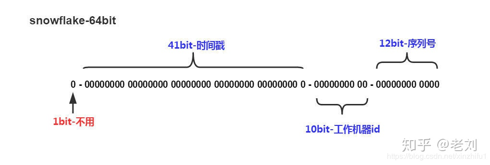

## 分布式ID

分布式 ID 也称全局唯一 ID 。

### 一、分布式 ID 需要满足什么条件

- 全局唯一：必须保证ID是全局性唯一的，基本要求
- 高性能：高可用低延时，ID生成响应要块，否则反倒会成为业务瓶颈
- 高可用：100%的可用性是骗人的，但是也要无限接近于100%的可用性
- 好接入：要秉着拿来即用的设计原则，在系统设计和实现上要尽可能的简单
- 趋势递增：最好趋势递增，这个要求就得看具体业务场景了，一般不严格要求

### 二、分布式 ID 的生成方式

- UUID
- 数据库自增ID
- 数据库多主模式
- 号段模式
- Redis
- 雪花算法（SnowFlake）
- 滴滴出品（TinyID）
- 百度 （Uidgenerator）
- 美团（Leaf）

#### 1. 基于 UUID

```
public static void main(String[] args) { 
       String uuid = UUID.randomUUID().toString().replaceAll("-","");
       System.out.println(uuid);
 }
```

它具有唯一的特性，可以做分布式 ID，但并不推荐。

优点：

- 生成足够简单，本地生成无网络消耗，具有唯一性

缺点：

- 无序的字符串，不具备趋势自增特性
- 没有具体的业务含义。比如用作订单号，看不出和订单相关的有用信息（订单号可以关联时间、用户名之类的）
- 长度过长16 字节128位，36位长度的字符串，存储以及查询对MySQL的性能消耗较大，MySQL官方明确建议主键要尽量越短越好，作为数据库主键 `UUID` 的无序性会导致数据位置频繁变动，严重影响性能。

#### 2. 基于数据库自增 ID

基于数据库的`auto_increment`自增ID完全可以充当`分布式ID`，具体实现：需要一个单独的MySQL实例用来生成ID，建表结构如下：

```
CREATE DATABASE `SEQ_ID`;
CREATE TABLE SEQID.SEQUENCE_ID (
    id bigint(20) unsigned NOT NULL auto_increment, 
    value char(10) NOT NULL default '',
    PRIMARY KEY (id),
) ENGINE=InnoDB;

insert into SEQUENCE_ID(value)  VALUES ('values');
```

当我们需要一个ID的时候，向表中插入一条记录返回`主键ID` 

优点：

- 实现简单，ID单调自增，数值类型查询速度快

缺点：

- DB单点存在宕机风险，无法扛住高并发场景

#### 3. 基于数据库集群模式

前边说了单点数据库方式不可取，那对上边的方式做一些高可用优化，换成主从模式集群。害怕一个主节点挂掉没法用，那就做双主模式集群，也就是两个Mysql实例都能单独的生产自增ID。设置不同的起始值和自增步长，避免生成重复的 ID

```
mysql_1 配置
set @@auto_increment_offset = 1;     -- 起始值
set @@auto_increment_increment = 2;  -- 步长
mysql_2 配置
set @@auto_increment_offset = 2;     -- 起始值
set @@auto_increment_increment = 2;  -- 步长
```

如果 MySQL 需要扩容增加节点，那就需要人工修改前几台 MySQL 实例的起始值和步长。必须时可能还需要停机修改

优点：

- 解决DB单点问题

缺点：

- 不利于后续扩容，而且实际上单个数据库自身压力还是大，依旧无法满足高并发场景。

#### 4. 基于数据库的号段模式

号段模式是当下分布式ID生成器的主流实现方式之一，号段模式可以理解为从数据库批量的获取自增ID，每次从数据库取出一个号段范围，例如 (1,1000] 代表1000个ID，具体的业务服务将本号段，生成1~1000的自增ID并加载到内存。表结构如下

```
CREATE TABLE id_generator (
  id int(10) NOT NULL,
  max_id bigint(20) NOT NULL COMMENT '当前最大id',
  step int(20) NOT NULL COMMENT '号段的步长',
  biz_type	int(20) NOT NULL COMMENT '业务类型',
  version int(20) NOT NULL COMMENT '版本号',
  PRIMARY KEY (`id`)
) 
```

其中 version 是一个乐观锁，每次都更新 version，保证并发时数据的正确性

等这批号段ID用完，再次向数据库申请新号段，对`max_id`字段做一次`update`操作，`update max_id= max_id + step`，update成功则说明新号段获取成功，新的号段范围是`(max_id ,max_id +step]`。

```
update id_generator set max_id = #{max_id+step}, version = version + 1 where version = #{version} and biz_type = XXX
```

由于多业务端可能同时操作，所以采用版本号`version`乐观锁方式更新，这种`分布式ID`生成方式不强依赖于数据库，不会频繁的访问数据库，对数据库的压力小很多。

#### 5. 基于 redis 模式

利用`redis`的 `incr`命令实现ID的原子性自增。

```
127.0.0.1:6379> set seq_id 1     // 初始化自增ID为1
OK
127.0.0.1:6379> incr seq_id      // 增加1，并返回递增后的数值
(integer) 2
```

用`redis`实现需要注意一点，要考虑到redis持久化的问题。`redis`有两种持久化方式`RDB`和`AOF`

- `RDB`会定时打一个快照进行持久化，假如连续自增但`redis`没及时持久化，而这会Redis挂掉了，重启Redis后会出现ID重复的情况。
- `AOF`会对每条写命令进行持久化，即使`Redis`挂掉了也不会出现ID重复的情况，但由于incr命令的特殊性，会导致`Redis`重启恢复的数据时间过长。

#### 6. 基于雪花算法（Snowflake）模式

雪花算法（Snowflake）是twitter公司内部分布式项目采用的ID生成算法



`Snowflake`生成的是Long类型的ID，8 个字节，64 比特

Snowflake ID组成结构：`正数位`（占1比特）+ `时间戳`（占41比特）+ `机器ID`（占5比特）+ `数据中心`（占5比特）+ `自增值`（占12比特），总共64比特组成的一个Long类型。

- 第一个bit位（1bit）：Java中long的最高位是符号位代表正负，正数是0，负数是1，一般生成ID都为正数，所以默认为0。
- 时间戳部分（41bit）：毫秒级的时间，不建议存当前时间戳，而是用（当前时间戳 - 固定开始时间戳）的差值，可以使产生的ID从更小的值开始；41位的时间戳可以使用69年，(1L << 41) / (1000L * 60 * 60 * 24 * 365) = 69年
- 工作机器id（10bit）：也被叫做`workId`，这个可以灵活配置，机房或者机器号组合都可以。
- 序列号部分（12bit），自增值支持同一毫秒内同一个节点可以生成4096个ID

根据算法逻辑，只需要封装一个工具类，那么各个业务应用可以直接使用该工具方法来获取分布式ID，只需保证每个业务应用有自己的工作机器id即可，而不需要单独去搭建一个获取分布式ID的应用。

#### 7. uin-generator（百度）

`uid-generator`是基于`Snowflake`算法实现的，与原始的`snowflake`算法不同在于，`uid-generator`支持自定义时间戳、工作机器ID和 序列号等各部分的位数，而且`uid-generator`中采用用户自定义`workId`的生成策略。`uid-generator`需要与数据库配合使用，需要新增一个`WORKER_NODE`表。当应用启动时会向数据库表中去插入一条数据，插入成功后返回的自增ID就是该机器的`workId`数据由host，port组成。

项目GitHub地址：https://link.zhihu.com/?target=https%3A//github.com/baidu/uid-generator

#### 8. Leaf（美团）

github地址：https://link.zhihu.com/?target=https%3A//github.com/Meituan-Dianping/Leaf

`Leaf`同时支持号段模式和`snowflake`算法模式，可以切换使用。

**(1). 号段模式：**

先导入源码 https://link.zhihu.com/?target=https%3A//github.com/Meituan-Dianping/Leaf ，在建一张表`leaf_alloc`

```
DROP TABLE IF EXISTS `leaf_alloc`;

CREATE TABLE `leaf_alloc` (
  `biz_tag` varchar(128)  NOT NULL DEFAULT '' COMMENT '业务key',
  `max_id` bigint(20) NOT NULL DEFAULT '1' COMMENT '当前已经分配了的最大id',
  `step` int(11) NOT NULL COMMENT '初始步长，也是动态调整的最小步长',
  `description` varchar(256)  DEFAULT NULL COMMENT '业务key的描述',
  `update_time` timestamp NOT NULL DEFAULT CURRENT_TIMESTAMP ON UPDATE CURRENT_TIMESTAMP COMMENT '数据库维护的更新时间',
  PRIMARY KEY (`biz_tag`)
) ENGINE=InnoDB;
```

然后在项目中开启`号段模式`，配置对应的数据库信息，并关闭`snowflake`模式

```
leaf.name=com.sankuai.leaf.opensource.test
leaf.segment.enable=true
leaf.jdbc.url=jdbc:mysql://localhost:3306/leaf_test?useUnicode=true&characterEncoding=utf8&characterSetResults=utf8
leaf.jdbc.username=root
leaf.jdbc.password=root

leaf.snowflake.enable=false
#leaf.snowflake.zk.address=
#leaf.snowflake.port=
```

启动`leaf-server` 模块的 `LeafServerApplication`项目就跑起来了

**snowflake 模式**

`Leaf`的snowflake模式依赖于`ZooKeeper`，不同于原始snowflake算法，也主要是在`workId`的生成上，`Leaf`中`workId`是基于`ZooKeeper`的顺序 ID 来生成的，每个应用在使用`Leaf-snowflake`时，启动时都会都在`Zookeeper`中生成一个顺序Id，相当于一台机器对应一个顺序节点，也就是一个`workId`。

```
leaf.snowflake.enable=true
leaf.snowflake.zk.address=127.0.0.1
leaf.snowflake.port=2181
```

#### 9. Tinyid （美团）

`Tinyid`由滴滴开发，Github地址：https://link.zhihu.com/?target=https%3A//github.com/didi/tinyid%E3%80%82

`Tinyid`是基于号段模式原理实现的与`Leaf`如出一辙，每个服务获取一个号段（1000,2000]、（2000,3000]、（3000,4000] 


`Tinyid`提供`http`和`tinyid-client`两种方式接入


