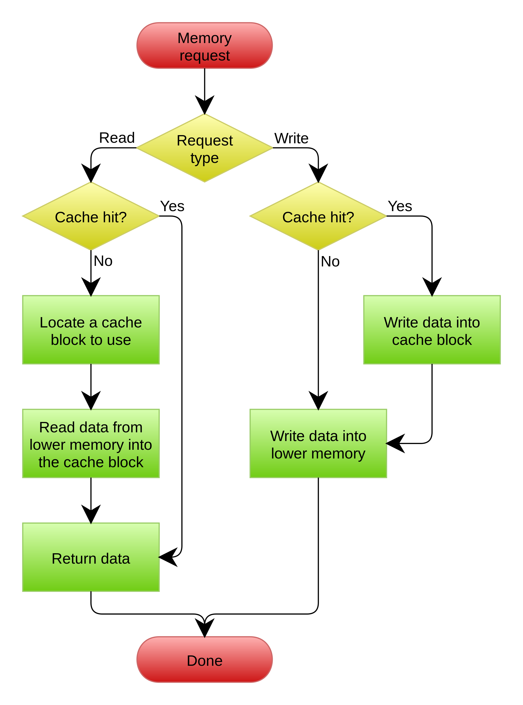
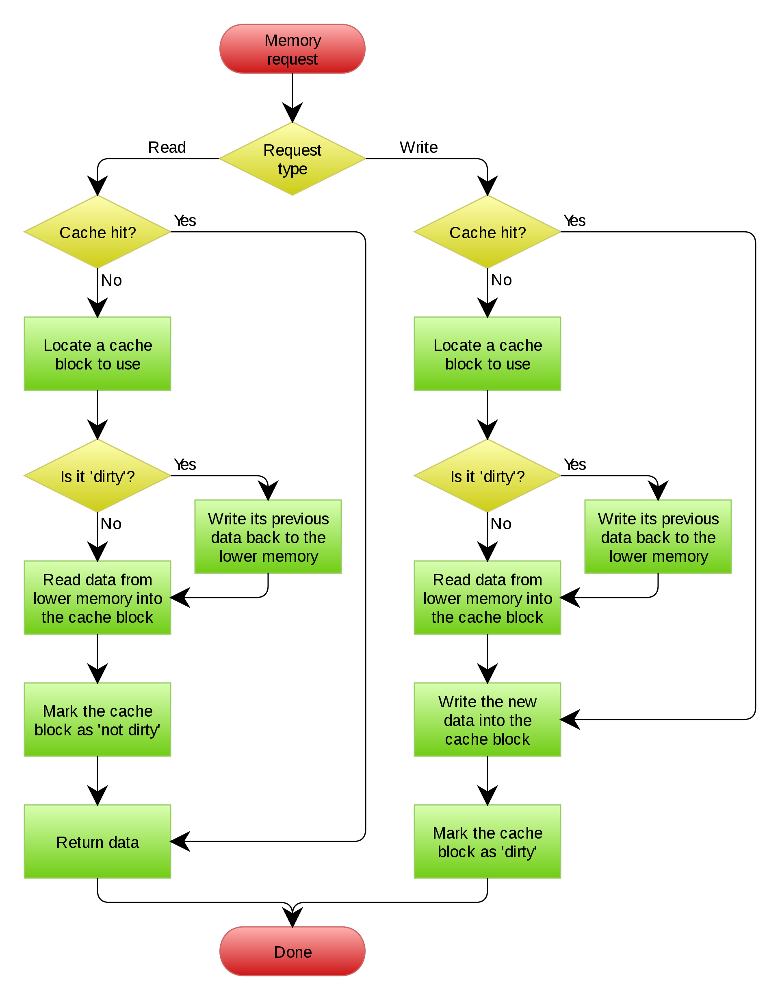

## 缓存

### 错误的做法

做法：更新数据时，先删除缓存，然后再更新数据库。查询操作时，发现缓存中没有数据然后会从数据库中更新到缓存中。错误的逻辑。

场景：两个并发操作，一个是更新操作，另一个是查询操作。更新操作删除缓存后，查询操作没有命中缓存，则把老数据读出来后放到了缓存。更新操作更新了数据库。于是，在缓存中的数据还是老的数据，导致缓存中的数据是脏的，而且一直是脏的

更新缓存的 Design Pattern 有四种：Cache aside，Read through，Write through，Write behind caching。

### 一、Cache Aside Pattern

#### 1. 介绍

- 更新操作：先把数据存到数据库中，成功后，再让缓存失效
- 查询操作：应用程序从 cache 取数据，取到了成功返回；取不到则从数据库中取数据，成功后，放到缓存中

这种做法规避了刚才的提到的缓存中脏数据的问题。如果一个查询操作和一个更新操作的并发，因为没有删除 cache 数据的操作，所以更新操作在更新数据时，缓存是有效的，并发的查询操作拿到的是没有更新的数据。然后更新操作让缓存失效了，后续的查询操作再从数据库中将数据取出来放到缓存。

这时标准的 design pattern，包括 Facebook 的论文《[Scaling Memcache at Facebook](https://www.usenix.org/system/files/conference/nsdi13/nsdi13-final170_update.pdf)》也使用了这个策略。

#### 2. 思考

- 多思考一点：为什么更新操作写完数据库后是让缓存失效而非更新缓存呢？

    参考：《[Why does Facebook use delete to remove the key-value pair in Memcached instead of updating the Memcached during write request to the backend?](https://www.quora.com/Why-does-Facebook-use-delete-to-remove-the-key-value-pair-in-Memcached-instead-of-updating-the-Memcached-during-write-request-to-the-backend)》

    主要怕两个并发的写操作导致脏数据。更新操作A先写了数据库，使数据库数据变为X；更新操作B写了数据库，使数据库数据变为Y，然后更新缓存为Y，更新缓存A再更新缓存为X，此时数据库中为Y，而缓存中的数据为X。

    - 如何避免这个问题呢？

        1. 单个事务协调器
        2. 多个事务协调器，通过 Paxos 或者 Raft 共识算法选出主节点
        3. 在数据库更新后，让缓存数据失效或者删除缓存数据

        选择 3 较为好，因为 1 可能会有单点故障，2 使用的 Paxos/Raft 算法不容易实现，而且为了一致性牺牲了可用性

#### 3. 问题

这个标准的 design pattern 也是有问题的，如下场景

问题场景：并发的读操作和写操作，读操作没有命中缓存，然后去数据库取数据；此时写操作，写完数据库，让缓存失效了。读操作这时将老的数据更新到缓存了，出现了脏数据。

这个 case 理论上是会出现的，但是实际上出现的概率非常低。因为这个条件需要发生在读缓存时缓存失效，而且并发着一个写操作。而实际上数据库的写操作会比读操作慢的多，而且还要锁表，而读操作必须在写操作前进入数据库操作，而又要晚于写操作更新缓存，所有的这些条件都具备的概率并不大。

因此要么通过 2PC 或者 Paxos 协议保证一致性，要么就是降低并发时脏数据的概率，Facebook 使用了降低概率的方法，因为 2PC 太慢，Paxos 太复杂。当然，最好还是为缓存设置上过期时间。

### 二、Read/Write Through Pattern

把更新数据库的操作由缓存自己代理了，对应用层来说比较简单。对应用来说，后端就是一个单一的存储，而存储自己维护自己的 cache

#### 1. Read Through

当缓存失效时（过期或者LRU换出），Cache Aside 是有调用方负责把数据加载入缓存，而 Read Through 则用缓存服务自己来加载。

#### 2. Write Through

当有数据更新时，如果没有命中缓存，直接更新数据库，然后返回。如果命中了缓存，则更新缓存，然后再由 cache 自己更新数据库（这里的更新缓存和更新数据库时同步操作）

### 三、Write Behind Caching Pattern

又称为 Write Back，其实就是 Linux 文件系统的 Page Cache 算法。在更新数据的时候，只更新缓存，不更新数据库，缓存中的数据会异步的批量更新到数据库。这个设计的好处就是让数据的 I/O 操作非常快，直接操作内存。因为异步，write back 还可以合并对同一个数据的多次操作，因此性能是非常可观的。但是带来的问题就是数据不是强一致性的，而且可能会丢失（unix/linux 非正常关机会导致数据丢失）。

Write Back 的实现逻辑比较复杂，他需要跟踪有哪些数据是被更新了，需要刷到持久层。操作系统的 Write Back 会在这个缓存需要失效时，才会被真正持久起来，比如内存不足，进程退出等等情况，这叫 Lazy Write

需要根据具体的场景，数据的强一致性和高性能，高可用和高性能是有冲突的，软件设计应该取舍。

## 皓哥的叮嘱

- 有时候，我们觉得能做宏观的系统架构的人一定是很有经验的，其实，宏观系统架构中的很多设计都来源于这些微观的东西。比如，云计算中的很多虚拟化技术的原理，和传统的虚拟内存不是很像么？Unix下的那些I/O模型，也放大到了架构里的同步异步的模型，还有Unix发明的管道不就是数据流式计算架构吗？TCP的好些设计也用在不同系统间的通讯中，仔细看看这些微观层面，你会发现有很多设计都非常精妙……所以，**请允许我在这里放句观点鲜明的话——如果你要做好架构，首先你得把计算机体系结构以及很多老古董的基础技术吃透了**
- 在软件开发或设计中，我非常建议在之前先去参考一下已有的设计和思路，**看看相应的guideline，best practice或design pattern，吃透了已有的这些东西，再决定是否要重新发明轮子**。千万不要似是而非地，想当然的做软件设计
- 上面，我们没有考虑缓存（Cache）和持久层（Repository）的整体事务的问题。比如，更新Cache成功，更新数据库失败了怎么吗？或是反过来。关于这个事，如果你需要强一致性，你需要使用“两阶段提交协议”——prepare, commit/rollback，比如Java 7 的[XAResource](https://docs.oracle.com/javaee/7/api/javax/transaction/xa/XAResource.html)，还有MySQL 5.7的 [XA Transaction](https://dev.mysql.com/doc/refman/5.7/en/xa.html)，有些cache也支持XA，比如[EhCache](http://www.ehcache.org/documentation/3.0/xa.html)。当然，XA这样的强一致性的玩法会导致性能下降，关于分布式的事务的相关话题，你可以看看《[分布式系统的事务处理](https://coolshell.cn/articles/10910.html)》一文

---

参考：

- 缓存更新的套路：https://coolshell.cn/articles/17416.html