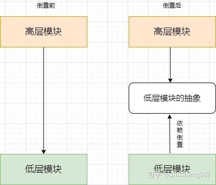

## 面向对象的六大原则

### 一、单一职责（Single Responsibility Principle）

一个类应该只负责一个职责，也就是说，一个类中应该是一组相关性很高的函数以及数据的封装

### 二、开闭原则（Open Close Principle）

由 Bertrand Meyer（勃兰特.梅耶）在1988年出版的《面向对象软件构造》。

一个软件实体应当对扩展开放，对修改关闭。即软件实体应尽量在不修改原有代码的情况下进行扩展。提倡一个类一旦开发完成，后续增加新的功能就不应该通过修改这个类来完成，而是通过继承，增加新的类。

为什么应该对修改关闭呢？因为一旦修改了某个类就有可能破坏系统原来的功能，就需要重新测试。但是也不是一定不能修改，如果在有条件的情况下及时重构，能够避免系统加速腐败

### 三、里氏替换原则（Liskov Substitution Principle）

所有引用基类（父类）的地方必须能透明的使用其子类的对象。也就是说，一个软件系统中所有用到一个类的地方都替换成其子类，系统应该仍然可以正常工作。这个原则依赖面对对象的继承特性和多态特性。我们要做到面向抽象（接口）编程

### 四、依赖倒置原则（Dependence Inversion Principle）

这个原则的提倡者正是大名鼎鼎的 Robert C. Martin，人称Bob大叔。

抽象不应该依赖于细节，细节应当依赖于抽象。也就是说，要针对接口编程，而不是针对实现编程。关键点：

- 高层模块不应该依赖底层模块，两者都应该依赖其抽象
- 抽象不应该依赖细节
- 细节应该依赖抽象

正常情况下：调用类（高层模块）应该依赖**具体实现类**（低层模块实现细节）

倒置后：高层模块与低层模块都依赖了实现类的**接口**（低层模块的细节抽象），底层模块的依赖箭头向上了，所以叫依赖倒置了。

### 五、接口隔离原则（Interface Segregation Principle）

使用多个专门的接口，而不使用单一的总接口，即客户端不应该依赖那些它不需要的接口。也就是说，让调用者依赖的接口尽可能的小。

### 六、迪米特法则（Law of Demeter 又名Least Knowledge Principle）

迪米特法则来自于1987年美国东北大学(Northeastern University)一个名为“Demeter”的研究项目，又称最少知识原则(LeastKnowledge Principle, LKP)

一个软件实体应当尽可能少的与其他实体发生相互作用。也就是说，一个类应该对自己需要调用的类知道的最少，类的内部如何实现、如何复杂都与调用者或者依赖者没有关系，调用者或者依赖者只需要知道他需要的方法即可，其他的一概不关心

