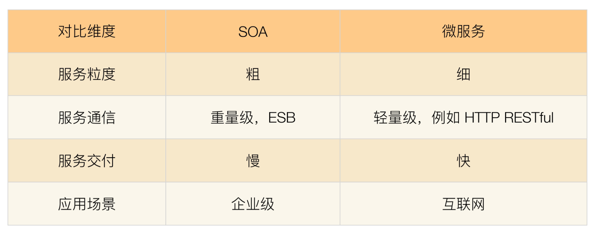
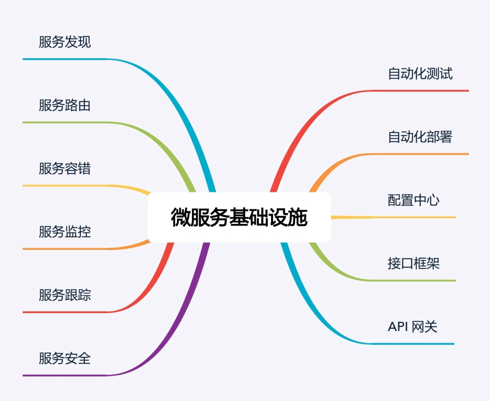
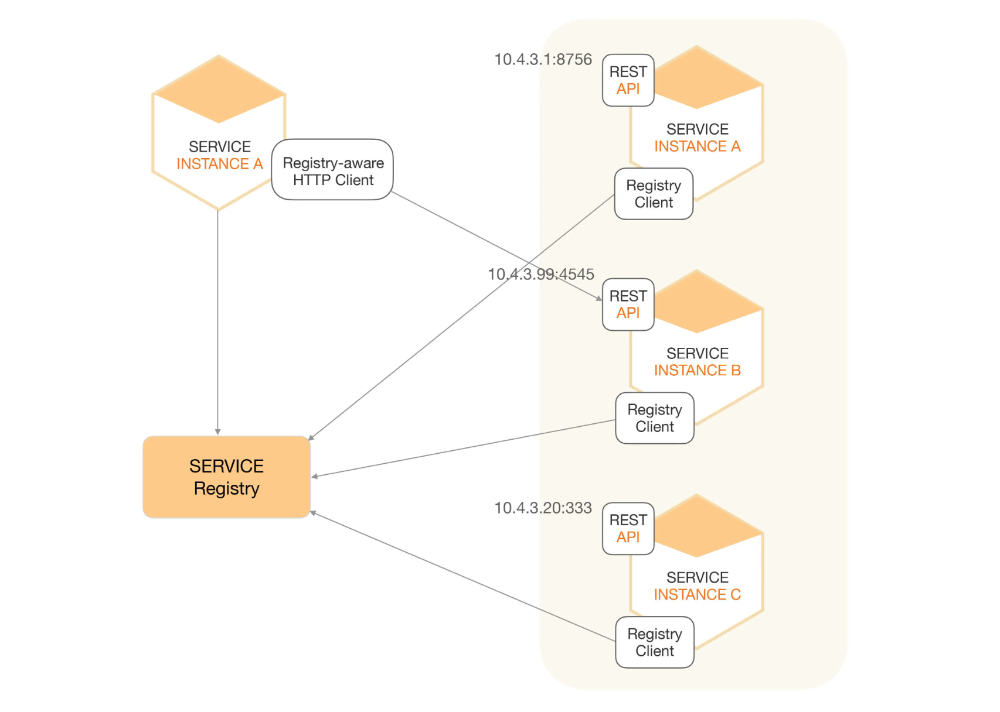
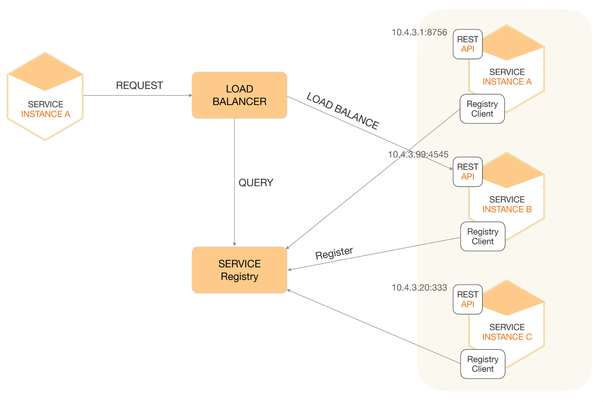

## 微服务

**微服务的核心是服务治理，而服务治理的关键是服务划分。故微服务架构的本质就是对码农的分化和治理**

SOA 和微服务对比：

微服务就是一些协同工作小而自治的服务。2014年，[Martin Fowler](https://zh.m.wikipedia.org/wiki/Martin_Fowler) 与 [James Lewis](https://zh.m.wikipedia.org/w/index.php?title=James_Lewis&action=edit&redlink=1) 共同提出了微服务的概念，定义了微服务是由以单一应用程序构成的小服务，自己拥有自己的进程与轻量化处理，服务依业务功能设计，以全自动的方式部署，与其他服务使用[HTTP API](https://zh.m.wikipedia.org/wiki/超文本传输协议)通信。同时服务会使用最小的规模的集中管理 (例如 [Docker](https://zh.m.wikipedia.org/wiki/Docker)) 能力，服务可以用不同的编程语言与数据库等组件实现

### 一、 微服务的陷阱

1. 服务划分过细，服务间关系复杂 
    单个服务的复杂度下降了，但是整个系统的复杂度却上升了，服务间的关系复杂了很多
2. 服务数量太多，团队效率急剧下降
    团队人员也就 5-6 个人，然后却拆分出 30 多个微服务，无论是设计、开发、测试、部署都需要工程师不停的在不同的服务间切换
3. 调用链太长，性能下降
    微服务之间都是通过 HTTP 或者 RPC 调用的，每次调用必须经过网络。
4. 调用链太长，问题定位困难
    一次用户请求需要多个微服务协同处理，任意微服务的故障都将导致整个业务失败。然后由于微服务数量较多，且故障存在扩散现象，快速定义到底是哪个微服务故障是一件复杂的事情
5. 没有自动化支撑，无法快速交付
    如果没有相应的自动化系统进行支撑，都是靠人工操作，那么微服务不但达不到快速交付的目的，甚至还不如一个大而全的系统效率高。
6. 没有服务治理，微服务数量多了后管理混乱
    - 服务路由：假设某个微服务有 60 个节点，部署在 20 台机器上，那么其他依赖的微服务如何知道这个部署情况呢？
    - 服务故障隔离：60 个节点有 5 个节点发送故障了，依赖的微服务如何处理这种情况呢
    - 服务注册和发现：60 个节点想要扩展到 80 个，或者缩减为 40 个，新增或者减少的节点如何让依赖的服务知道呢

总结：拆分过细（过分强调 small）、基础设施不全（忽略了 automated）、并不轻量级（规模大了， lightweight 不在适应）

一点建议：

- 建设好基础设施，RPC、服务治理、日志、监控、持续集成、持续部署、运维自动化是基本的，其它包括服务编排、分布式追踪等。 
- 要逐步演进和迭代，不要过于激进，更不要拆分过细，拆分的粒度，要与团队的架构相互匹配。（康威定律） 
- 微服务与数据库方面，是个很大的难点，可以深入了解下领域驱动设计，做好领域建模，特别是数据库要随着服务一起拆分。

康威定理：设计系统的架构受制于产生这些设计的组织的沟通结构。即系统设计本质上反映了企业的组织机构。系统各个模块间的接口也反映了企业各个部门之间的信息流动和合作方式。康威定律源于模块的设计者需要互相之间频繁沟通。而跨部门交流比较难

### 二、微服务架构最佳实践 --- 方法

#### 1. 服务粒度

针对微服务拆分过细导致的问题，我建议基于团队规模进行拆分。

#### 2. 拆分方法

1. 基于业务逻辑拆分
    将系统中的业务模块按照职责范围识别出来，每个单独的业务模块拆分为一个独立的服务

    问题：在实践过程中最常见的一个问题就是团队成员对于“职责范围”的理解差异很大。

2. 基于可扩展拆分
    将系统中的业务模块按照稳定性排序，将已经成熟和改动不大的服务拆分为稳定服务，将经常变化和迭代的服务拆分为变动服务。稳定的服务粒度可以粗一些，即使逻辑上没有强关联的服务，也可以放在同一个子系统中，例如将“日志服务”和“升级服务”放在同一个子系统中；不稳定的服务粒度可以细一些，但也不要太细，始终记住要控制服务的总数量。
    这样拆分主要是为了提升项目快速迭代的效率，避免在开发的时候，不小心影响了已有的成熟功能导致线上问题

3. 基于可靠性拆分
    将系统中的业务模块按照优先级排序，将可靠性要求高的核心服务和可靠性要求低的非核心服务拆分开来，然后重点保证核心服务的高可用

    好处：

    - 避免非核心服务故障影响核心服务
    - 核心服务高可用方案可以更简单
    - 能够降低高可用成本

4. 基于性能拆分
    将性能要求高或者性能压力大的模块拆分出来，避免性能压力大的服务影响其他服务。常见的拆分方式和具体的性能瓶颈有关，可以拆分 Web 服务、数据库、缓存等。例如电商的抢购，性能压力最大的是入口的排队功能，可以将排队功能独立为一个服务

可以根据实际情况自由排列组合上述的拆分方法，例如可以基于可靠性拆分出服务 A，基于性能拆分出服务 B，基于可扩展拆分出 C/D/F 三个服务，加上原有的服务 X，最后总共拆分出 6 个服务

#### 3. 基础设施

虽然建设基础设施是一项庞大的工程，但是 

1. 已经有开源的微服务基础设施全家桶了，比如 Spring Cloud 项目，涵盖了服务发现、服务路由、网关、配置中心等。 
2.  如果微服务的数量不是很多的话，并不是每个基础设施都是必须的，可以按照下面优先级搭建基础设施
    - 服务发现、服务路由、服务容错：这是最基本的微服务基础设施。
    - 接口框架、API 网关：主要是为了提升开发效率，接口框架是提升内部服务的开发效率，API 网关是为了提升与外部服务对接的效率。
    - 自动化部署、自动化测试、配置中心：主要是为了提升测试和运维效率。
    - 服务监控、服务跟踪、服务安全：主要是为了进一步提升运维效率。

其中 自动化部署、服务监控、服务追踪、服务安全 这种基础设施，其重要性会随着微服务节点数量增加而越来越重要，但在微服务节点数量较少的时候，可以通过人工的方式支撑，虽然效率不高，但也基本能够顶住

### 三、微服务架构最佳实践 --- 基础设施

##### 1. 自动化测试

自动化测试涵盖的范围包括代码级的单元测试、单个系统级的集成测试、系统间的接口测试

##### 2. 自动化部署

自动化部署系统包括版本管理、资源管理（例如，机器管理、虚拟机管理）、部署操作、回退操作等功能。

##### 3. 配置中心

配置中心包括配置版本管理（例如，同样的微服务，有 10 个节点是给移动用户服务的，有 20 个节点给联通用户服务的，配置项都一样，配置值不一样）、增删改查配置、节点管理、配置同步、配置推送等功能

##### 4. 接口框架

微服务提倡轻量级的通信方式，一般采用 HTTP/REST 或者 RPC 方式统一接口协议。但在实践过程中，光统一接口协议还不够，还需要统一接口传递的数据格式。例如，我们需要指定接口协议为 HTTP/REST，但这还不够，还需要指定 HTTP/REST 的数据格式采用 JSON，并且 JSON 的数据都遵循如下规范

##### 5. API 网关

微服务需要一个统一的 API 网关，负责外部系统的访问操作。因为

- 在外部系统看来，它不需要也没办法理解这么多微服务的职责分工和边界，它只会关注它需要的能力，而不会关注这个能力应该由哪个微服务提供
- 外部系统访问系统还涉及安全和权限相关的限制，如果外部系统直接访问某个微服务，则意味着每个微服务都要自己实现安全和权限的功能，这样做不但工作量大，而且都是重复工作

API 网关是外部系统访问的接口，所有的外部系统接⼊系统都需要通过 API 网关，主要包括接入鉴权（是否允许接入）、权限控制（可以访问哪些功能）、传输加密、请求路由、流量控制等功能

##### 6. 服务发现

1. 自理式：每个微服务自己完成服务发现
    

    例如：图中 SERVICE INSTANCE A 访问 SERVICE REGISTRY 获取服务注册信息，然后直接访问 SERVICE INSTANCE B

    自理式服务发现实现比较简单，因为这部分的功能一般通过统一的程序库或者程序包提供给各个微服务调用，而不会每个微服务都自己来重复实现一遍；并且由于每个微服务都承担了服务发现的功能，访问压力分散到了各个微服务节点，性能和可用性上不存在明显的压力和风险

2. 代理式
    

    代理式结构就是指微服务之间有一个负载均衡系统（图中的 LOAD BALANCER 节点），由负载均衡系统来完成微服务之间的服务发现。但是风险较大，第一个风险是一旦 LOAD BALANCER 系统故障，就会影响所有微服务之间的调用；第二个风险是性能，所有微服务的流量都要经过 LOAD BALANCER 系统，性能压力会随着微服务数量和流量增加而不断增加，最后成为性能瓶颈

不管是自理式还是代理式，服务发现的核心功能就是服务注册表，注册表记录了所有的服务节点的配置和状态，每个微服务启动后都需要将自己的信息注册到服务注册表，然后由微服务或者 LOAD BALANCER 系统到服务注册表查询可用服务。

##### 7. 服务路由

通常情况下是和服务发现放在一起实现的。对于自理式服务发现，服务路由是微服务内部实现的；对于代理式服务发现，服务路由是由 LOAD BALANCER 系统实现的。无论放在哪里实现，服务路由核心的功能就是路由算法。常见的路由算法有：随机路由、轮询路由、最小压力路由、最小连接数路由等

##### 8. 服务容错

微服务具有故障扩散的特点，如果不及时处理故障，故障扩散开来就会导致看起来系统中很多服务节点都故障了，因此需要微服务能够自动应对这种出错场景，及时进行处理。

常见的服务容错包括请求重试、流控和服务隔离。通常情况下，服务容错会集成在服务发现和服务路由系统中

##### 9. 服务监控

- 实时搜集信息并进行分析，避免故障后再来分析，减少了处理时间。
- 服务监控可以在实时分析的基础上进行预警，在问题萌芽的阶段发觉并预警，降低了问题影响的范围和时间。

通常情况下，服务监控需要搜集并分析大量的数据，因此建议做成独立的系统，而不要集成到服务发现、API 网关等系统中

##### 10. 服务跟踪

服务监控和服务跟踪的区别可以简单概括为宏观和微观的区别。例如，A 服务通过 HTTP 协议请求 B 服务 10 次，B 通过 HTTP 返回 JSON 对象，服务监控会记录请求次数、响应时间平均值、响应时间最高值、错误码分布这些信息；而服务跟踪会记录其中某次请求的发起时间、响应时间、响应错误码、请求参数、返回的 JSON 对象等信息

##### 11. 服务安全

服务安全主要分为三部分：接入安全、数据安全、传输安全。通常情况下，服务安全可以集成到配置中心系统中进行实现，即配置中心配置微服务的接入安全策略和数据安全策略，微服务节点从配置中心获取这些配置信息，然后在处理具体的微服务调用请求时根据安全策略进行处理。由于这些策略是通用的，一般会把策略封装成通用的库提供给各个微服务调用

