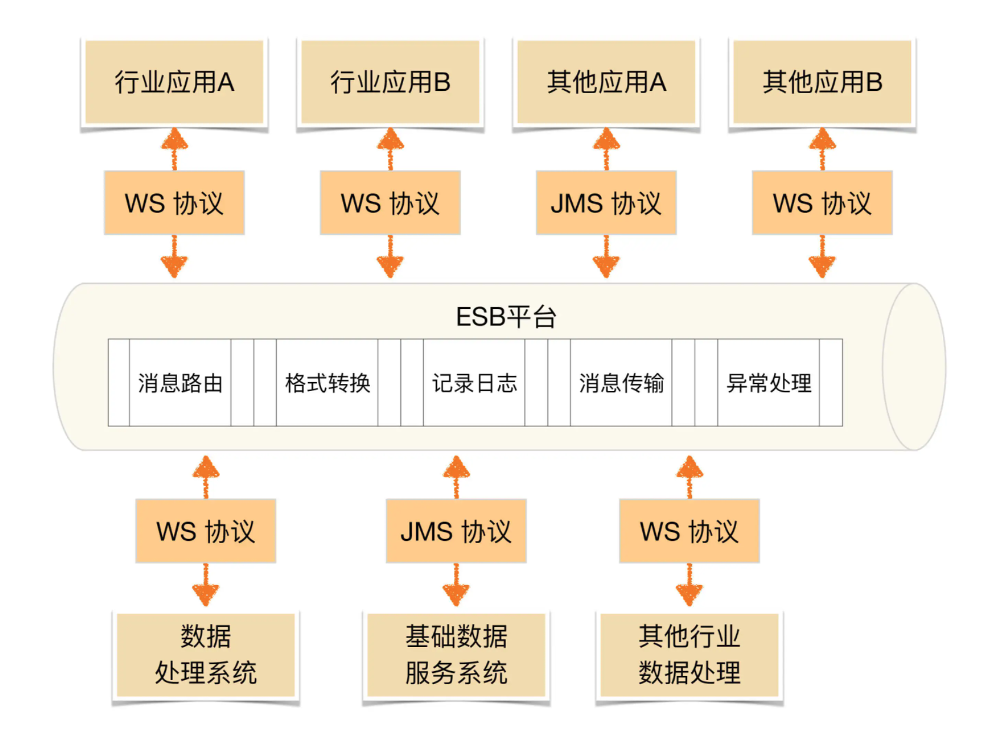

## 基本思想和模式

可扩展架构的背后的核心思想就是**拆**。按照不同的思路来拆分软件系统，就会得到不同的架构，常见的拆分思路如下：

- 面向流程拆分：将整个业务流程拆分成几个阶段，每个阶段作为一部分
- 面向服务拆分：将系统提供的服务拆分，每个服务作为一部分
- 面向功能拆分：即系统提供的功能拆分，每个功能作为一部分

以 TCP/IP 协议栈为例，来说明流程、服务、功能的区别和联系

- 流程，对应 TCP/IP 四层模型，因为 TCP/IP 网络通信流程是：应用层 -> 传输层 -> 网络层 -> 物理+数据链路层，不管最上层的应用层是什么，这个流程不变
- 服务，对应应用层的 HTTP、FTP、SMTP等
- 功能，每个服务都会提供相应的功能。例如，HTTP 服务提供 GET、POST 功能，FTP 提供上传下载功能

服务是一种相似功能的集合。

不同的拆分方式，本质上决定了系统的扩展方式。因为程序员对业务的熟悉程度不同、写代码的风格等等，合理的拆分，能够强制保证即使程序员出错，出错的范围也不会太广，影响也不会太大

不同的拆分方式应对扩展时的优势

1. 面对流程拆分
    扩展时大部分情况只需要修改某一层，少部分情况可能修改关联的两层，不会出现所有层都同时要修改。例如学生信息管理系统，如果我们将存储层从 MySQL 扩展为同时支持 MySQL 和 Oracle，那么只需要扩展存储层和数据层即可，其他层无须变动
2. 面向服务拆分
    对某个服务扩展，或者要增加新的服务时，只需要扩展相关服务即可，无须修改所有的服务。同样以学生管理系统为例，如果我们需要在注册服务中增加一种“学号注册”功能，则只需要修改“注册服务”和“登录服务”即可，“信息管理服务”和“安全设置”服务无须修改
3. 面向功能拆分
    对某个功能扩展，或者要增加新的功能时，只需要扩展相关功能即可，无须修改所有的服务。同样以学生管理系统为例，如果我们增加“学号注册”功能，则只需要在系统中增加一个新的功能模块，同时修改“登录功能”模块即可，其他功能都不受影响。

不同的拆分方式，将得到不同的系统架构，典型的可扩展系统架构有：

- 面向流程拆分：分层架构。
- 面向服务拆分：SOA、微服务。
- 面向功能拆分：微内核架构。

### 一、分层架构

也被称为 N 层架构，常见的二层架构，例如 C/S 架构、B/S 架构。常见的三层架构，例如 MVC、MVP 架构

1. C/S 架构、B/S 架构
    划分的对象是整个业务系统，划分的维度是用户交互，即将和用户交互的部分独立为一层，支撑用户交互的后台作为另外一层

2. MVC、MVP 架构
    划分的对象是单个业务子系统，划分的维度是职责，将不同的职责划分到独立层，但各层的依赖关系比较灵活。例如，MVC 架构中各层之间是两两交互的
3. 逻辑分层架构
    划分的对象可以是单个业务子系统，也可以是整个业务系统，划分的维度也是职责。
    逻辑分层架构和 MVC 架构、MVP 架构的不同点在于，逻辑分层架构中的层是自顶向下依赖的。典型的有操作系统内核架构、TCP/IP 架构

无论采取何种分层维度，分层架构设计最核心的一点就是需要**保证各层之间的差异足够清晰，边界足够明显**，让人看到架构图后就能看懂整个架构，这也是分层不能分太多层的原因

分层架构之所以能够较好地支撑系统扩展，本质在于**隔离关注点**（separation of concerns），即**每个层中的组件只会处理本层的逻辑**。比如说，展示层只需要处理展示逻辑，业务层中只需要处理业务逻辑，这样我们在扩展某层时，其他层是不受影响的，通过这种方式可以支撑系统在某层上快速扩展。例如，Linux 内核如果要增加一个新的文件系统，则只需要修改文件存储层即可，其他内核层无须变动。

分层时要**保证层与层之间的依赖是稳定的**，才能真正支撑快速扩展。例如，Linux 内核为了支撑不同的文件系统格式，抽象了 VFS 文件系统接口

分层结构的另外一个特点就是**层层传递**，也就是说一旦分层确定，整个业务流程是按照层进行依次传递的，**不能在层之间进行跳跃**。分层结构的这种约束，好处在于强制将分层依赖限定为两两依赖，降低了整体系统复杂度。但分层结构的代价就是冗余，也就是说，不管这个业务有多么简单，每层都必须要参与处理，甚至可能每层都写了一个简单的包装函数

分层架构另外一个典型的缺点就是**性能**，因为每一次业务请求都需要穿越所有的架构分层，有一些事情是多余的，多少都会有一些性能的浪费。当然，这里所谓的性能缺点只是理论上的分析，实际上分层带来的性能损失因为硬件和网络的性能有了质的飞越，绝大部分场景下都可以忽略不计

### 二、SOA

SOA 的全称是 Service Oriented Architecture，中文翻译为“面向服务的架构”。出现的背景是企业内部的 IT 系统重复建设且效率低下，比如人力资源系统、财务系统、销售系统等，某个员工离职之后，需要分别到上述三个系统中删除员工的权限。为了应对传统 IT 系统存在的问题，SOA 提出了 3 个关键概念

1. 服务
    所有业务功能都是一项服务，服务就意味着要对外提供开放的能力，当其他系统需要使用这项功能时，无须定制化开发。服务可大可小，可简单也可复杂。例如，人力资源管理可以是一项服务，包括人员基本信息管理、请假管理、组织结构管理等功能；而人员基本信息管理也可以作为一项独立的服务。具体的粒度需要根据企业的实际情况来判断
2. ESB
    ESB 的全称是 Enterprise Service Bus，中文翻译为“企业服务总线”。ESB 将企业中各个不同的服务连接在一起。因为各个独立的服务是异构的，如果没有统一的标准，则各个异构系统对外提供的接口是各式各样的。SOA 使用 ESB 来屏蔽异构系统对外提供各种不同的接口方式，以此来达到服务间高效的互联互通。
3. 松耦合
    减少各个服务间的依赖和互相影响。因为采用 SOA 架构后，各个服务是相互独立运行的，甚至都不清楚某个服务到底有多少对其他服务的依赖。

典型的 SOA 架构，如下

SOA 解决了传统 IT 系统重复建设和扩展效率低的问题，但其本身也引入了更多的复杂性。SOA 最广为人诟病的就是 ESB，ESB 需要实现与各种系统间的协议转换、数据转换、透明的动态路由等功能。现实中的协议有很多种，如 JMS、WS、HTTP、RPC等，数据格式也有很多种，如 XML、JSON、二进制、HTML等，ESB 要完成这么多协议转换，工作量和复杂度都很大，而且这种转换是需要耗费大量计算性能的，ESB 本身会成为整个系统的性能瓶颈。

esb集中化的管理带来了性能不佳，厚重等问题。也无法快速扩展。不适合互联网的业务特点，因此在互联网界采用不多

