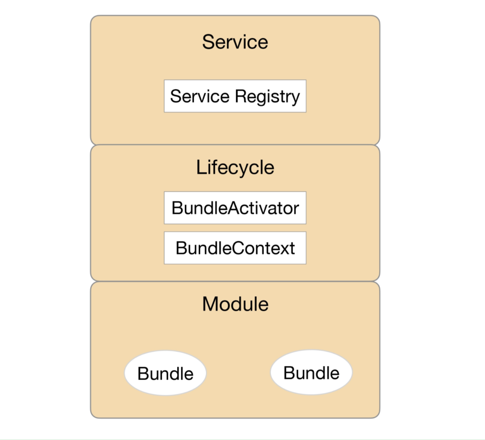
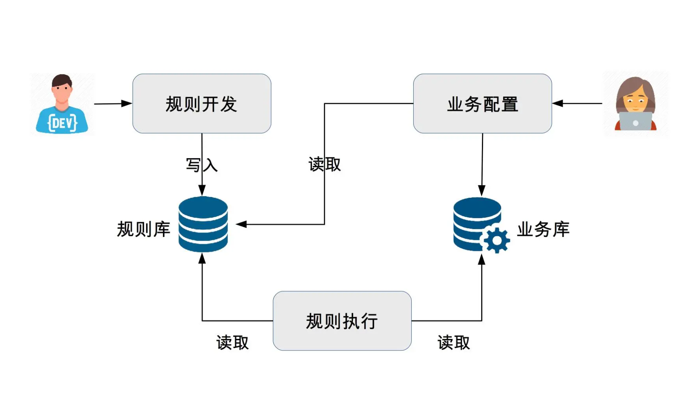

## 微内核架构

微内核架构（Microkernel Architecture），也被称为插件化架构（Plug-in Architecture），是一种面向功能进行拆分的可扩展性架构，通常用于实现基于产品（原文为 product-based，指存在多个版本、需要下载安装才能使用，与 web-based 相对应）的应用。例如 Eclipse 这类 IDE 软件、UNIX 这类操作系统、淘宝 App 这类客户端软件等，也有一些企业将自己的业务系统设计成微内核的架构，例如保险公司的保险核算逻辑系统，不同的保险品种可以将逻辑封装成插件。

微内核架构包含两类组件：核心系统（core system）和插件模块（plug-in modules）。核心系统负责和具体业务功能无关的通用功能；插件模块负责实现具体的业务逻辑。

### 一、设计关键点

微内核的核心系统设计的关键技术有：插件管理、插件连接和插件通信

#### 1. 插件管理

核心系统需要知道当前有哪些插件可用，如何加载这些插件，什么时候加载插件。常见的实现方法是插件注册表机制

核心系统提供插件注册表（可以是配置文件，也可以是代码，还可以是数据库），插件注册表含有每个插件模块的信息，包括它的名字、位置、加载时机（启动就加载，还是按需加载）等

#### 2. 插件连接

插件连接指插件如何连接到核心系统。通常来说，核心系统必须制定插件和核心系统的连接规范，然后插件按照规范实现，核心系统按照规范加载即可。

常见的连接机制有 OSGi（Eclipse 使用）、消息模式、依赖注入（Spring 使用），甚至使用分布式的协议都是可以的，比如 RPC 或者 HTTP Web 的方式。

#### 3. 插件通信

设计时插件时完全解藕的，但是实际业务中，某个业务流程需要多个插件协同，需要插件之间通信。由于插件之间没有直接联系，通信必须通过核心系统，因此核心系统需要提供插件通信机制

### 二、OSGI 架构简析

OSGi 的全称是 Open Services Gateway initiative，本身其实是指 OSGi Alliance。旨在建立一个开放的服务规范，为通过网络向设备提供服务建立开放的标准，这个标准就是 OSGi specification

1. 模块层（Module 层）
    模块层实现插件管理功能，OSGi 中，插件被称为 Bundle，每个 Bundle 是一个 Java 的 JAR 文件，每个 Bundle 里面都包含一个元数据文件 MANIFEST.MF，这个文件包含了 Bundle 的基本信息。例如，Bundle 的名称、描述、开发商、classpath，以及需要导入的包和输出的包等，OSGi 核心系统会将这些信息加载到系统中用于后续使用
2. 生命周期层（Lifecycle 层）
    生命周期层实现插件连接功能，提供了执行时模块管理、模块对底层 OSGi 框架的访问。生命周期层精确地定义了 Bundle 生命周期的操作（安装、更新、启动、停止、卸载），Bundle 必须按照规范实现各个操作
3. 服务层（Service 层）
    服务层实现插件通信的功能。OSGi 提供了一个服务注册的功能，用于各个插件将自己能提供的服务注册到 OSGi 核心的服务注册中心，如果某个服务想用其他服务，则直接在服务注册中心搜索可用服务中心就可以了

### 三、规则引擎架构简析

规则引擎从结构上来看也属于微内核架构的一种具体实现，其中执行引擎可以看作是微内核，执行引擎解析配置好的业务流，执行其中的条件和规则，通过这种方式来支持业务的灵活多变

规则引擎的优点：

1. 可扩展。通过引入规则引擎，业务逻辑实现与业务系统分离，可以在不改动业务系统的情况下扩展新的业务功能。
2. 易理解。规则通过自然语言描述，业务人员易于理解和操作，而不像代码那样只有程序员才能理解和开发。
3. 高效率。规则引擎系统一般提供可视化的规则定制、审批、查询及管理，方便业务人员快速配置新的业务

- 开发人员将业务功能分解提炼为多个规则，将规则保存在规则库中
- 业务人员根据业务需要，通过将规则排列组合，配置成业务流程，保存在业务库中
- 规则引擎执行业务流程实现业务功能

规则引擎是如何具体实现微内核的呢？

1. 插件管理：规则引擎中的规则就是微内核架构的插件，引擎就是微内核架构的内核。规则可以被引擎加载和执行。规则引擎架构中，规则一般保存在规则库中，通常使用数据库来存储。
2. 插件连接：类似于程序员开发的时候需要采用 Java、C++ 等语言，规则引擎也规定了规则开发的语言，业务人员需要基于规则语言来编写规则文件，然后由规则引擎加载执行规则文件来完成业务功能，因此，规则引擎的插件连接实现机制其实就是规则语言
3. 插件通信：通信的方式就是数据流和事件流，由于单个规则并不需要依赖其他规则，因此规则之间没有主动的通信，规则只需要输出数据或者事件，由引擎将数据或者事件传递到下一个规则

