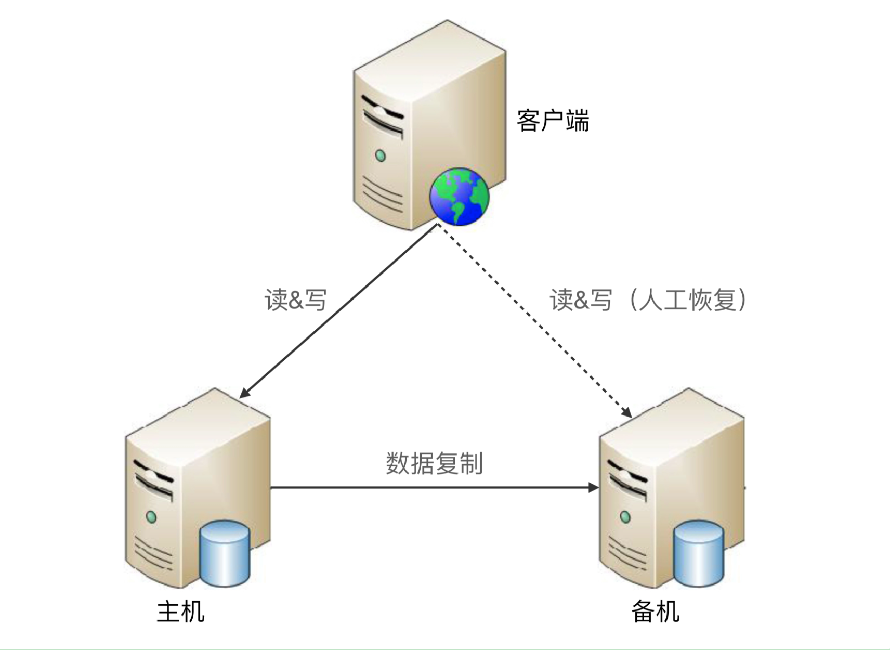
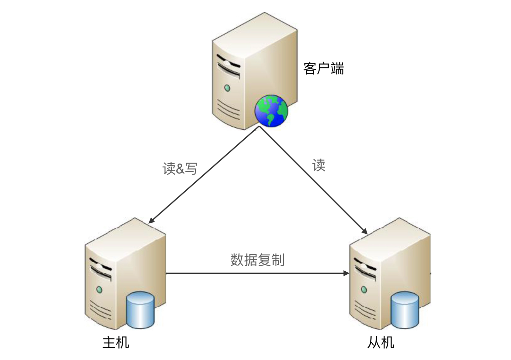
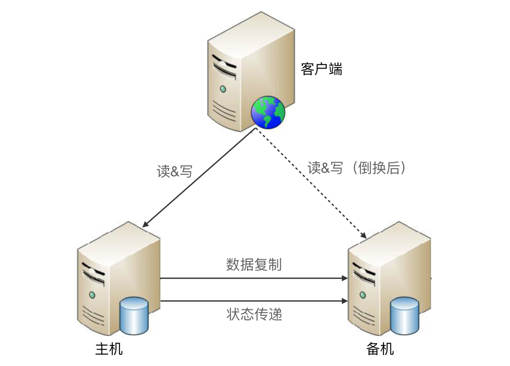
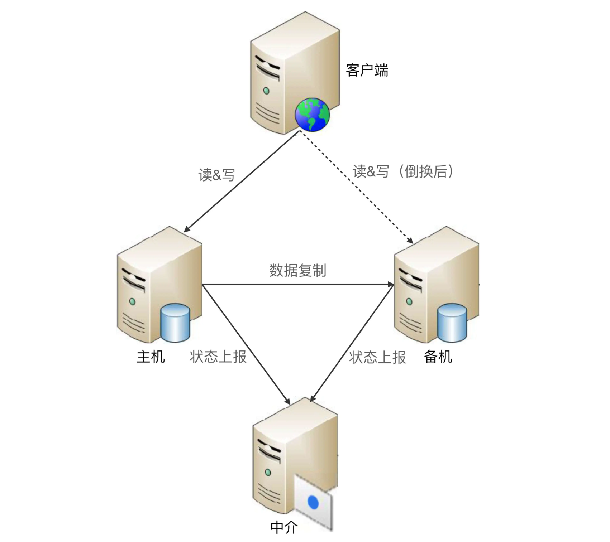
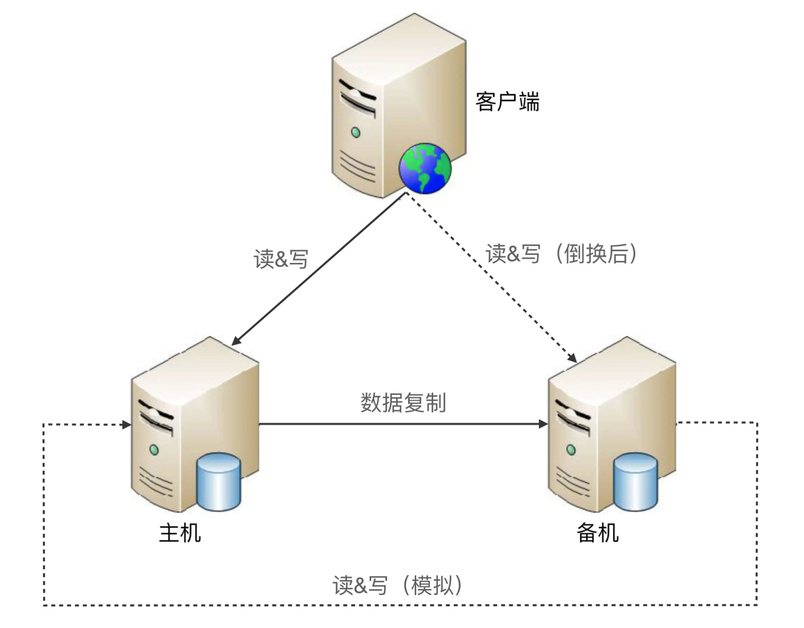
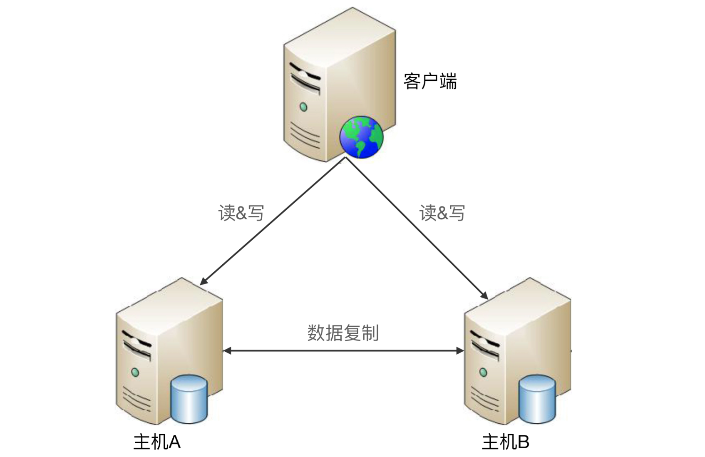

## 高可用存储架构-双机架构

存储高可用方案的本质都是通过将数据复制到多个存储设备，通过数据冗余的方式来实现高可用，其复杂性主要体现在如何应对**复制延迟**和**中断导致的数据不一致**问题。对一个高可用存储方案，需要从以下几个方面进行思考和分析：

- 数据如何复制？
- 各个节点的职责是什么？
- 如何应对复制延迟？
- 如何应对复制中断？

常见的高可用存储架构有主备、主从、主主、集群、分区，

### 一、主备复制

主机将数据复制到备机，主备架构中的备机主要是备份数据作用，并不承担实际的业务读写操作，如果要把备机改为主机，需要人工操作

优点就是简单，如下：

- 对客户端来说，不需要感知备机的存在，即使备机被人工修改为主机
- 对于主机和备机来说，双方只需要进行数据复制，无须进行状态判断和主备切换这类复杂操作

缺点：

- 备机仅仅只为备份，并没有提供读写操作，硬件成本上有浪费
- 故障后需要人工干预，无法自动恢复，人工恢复过程容易出错

场景：内部的后台管理系统使用主备复制架构的情况会比较多，例如学生管理系统。因为这类系统的数据变更频率低，即使在某些场景下丢失数据，也可以通过人工的方式补全。

### 二、主从复制

主机负责读写操作，从机只负责读操作

优点：

- 主从复制在主机故障时，读操作的业务依然可以继续运行
- 从机提供读操作，发挥了硬件的性能

缺点：

- 客户端需要感知主从关系，写操作之能发给主机，复杂度较高
- 从机提供读业务，如果主从复制延迟比较大，业务会因为数据不一致出现问题
- 故障时需要人工干预

场景：写少读多的业务使用主从复制的存储架构比较多

### 三、双机切换

#### 1. 引出方案

主备复制和主从复制有两个共性问题：

- 主机故障，无法进行写操作
- 如果主机无法恢复，需要人工指定新的主机角色

双机切换包括主备切换和主从切换两种方案。这两个方案就是在原有方案的基础上增加“切换”功能，即系统自动决定主机角色，并完成角色切换。主备切换和主从切换在切换的设计上没有差别

#### 2. 完善的切换方案

要实现一个完善的切换方案，必须考虑以下几个关键点

##### (1). 主备间状态判断

- 状态传递的渠道：是相互连接、还是第三方仲裁
- 状态检测的内容：例如机器是否掉电、进程是否存在、响应是否缓慢

##### (2). 切换策略

- 切换时机：什么情况下备机应该升级为主机？是机器掉电后备机才升级，还是主机上的进程不存在就升级，还是主机响应时间超过 2 秒就升级
- 切换策略：原来的主机故障恢复后，要继续切换做主机，还是原来的主机故障恢复后自动成为新的备机
- 自动程度：切换是完全自动的，还是半自动的

##### (3). 数据冲突解决

当原有故障的主机恢复后，新旧主机之间可能存在数据冲突。比如，用户在旧主机新增了一条 ID 为 100 的数据，这个数据还没有复制到旧的备机就发生了切换，旧备机升级为新的主机，用户又在新的主机上新增一条 ID 为 100 的数据，当旧的故障主机恢复后，这两条 ID 都为 100 的数据，应该如何处理。没有一个统一的答案，不同的业务要求不一样

#### 3. 常见架构

常见的主备切换架构有三种：互连式、中介式、模拟式

##### (1). 互连式

主备机直接建立状态传递的渠道

传递“状态信息”的通道可以有很多方式：

- 网络连接，也可以是非网络连接（用串口线连接）
- 可以是主机发送状态给备机，也可以是备机到主机来获取状态信息
- 可以和数据复制通道共用，也可以独立一条通道
- 状态传递可以是一条，也可以是多条，还可以是不同类型的通道混合（网络+串口）

为了充分利用切换方案能够自动决定主机这个优势，客户端这里也会有一些相应的改变，常见的方式如：

- 为了切换后不影响客户端的使用，主机和备机之间共享一个对客户端来说唯一的地址。例如：虚拟IP
- 客户端同时记录主备机的地址，那个能访问就访问那个。备机拒绝掉客户端的访问即可

互连式主备切换的缺点：

- 如果状态传递的通道本身有故障，那么备机会认为主机故障而从将自己升级为主机，可能出现两个主机
- 虽然可以通过增加多个通道来增强状态传递的可靠性，但这样做只是降低了通道故障的概率。而且维护麻烦，通道越多，后续的状态决策会更加复杂，可能会收到不同甚至矛盾的状态信息

##### (2). 中介式

主备机之间不直接连接，而都去连接中介，并且通过中介来传递状态信息

- 连接管理更加简单，降低了主备机的连接管理复杂度
- 状态决策更简单，无须考虑多种类型的连接通道获取的状态信息如何决策的问题。只需要按照简单的算法即可完成状态决策
    1. 无论是主机还是备机，初始状态都是备机，并且只要与中介断开连接，就将自己降级为备机，因此可能出现双备机的情况。
    2. 主机与中介断连后，中介能够立刻告知备机，备机将自己升级为主机。
    3. 如果是网络中断导致主机与中介断连，主机自己会降级为备机，网络恢复后，旧的主机以新的备机身份向中介上报自己的状态。
    4. 如果是掉电重启或者进程重启，旧的主机初始状态为备机，与中介恢复连接后，发现已经有主机了，保持自己备机状态不变。
    5. 主备机与中介连接都正常的情况下，按照实际的状态决定是否进行切换。例如，主机响应时间超过 3 秒就进行切换，主机降级为备机，备机升级为主机即可。

中介式的关键问题在于如何实现中介本身的高可用。如果中介自己宕机了，整个系统就进入了双备的状态。可能就陷入了套娃，为了实现中介的高可用，再来一个中介。但是开源方案比如：ZooKeeper 本身已经实现了高可用集群架构，帮我们解决了中介本身的可靠性问题。

##### (3). 模拟式

主备机之间并不传递任何状态数据，而是备机模拟成一个客户端，向主机发起模拟的读写请求，根据读写操作的响应情况来判断主机的状态

优点是实现简单，因为省去了状态传递通道的建立和管理工作。缺点是模拟式读写操作获取的状态信息只有响应信息（例如：HTTP 404，超时、响应时间超过3秒等），没有互连式那么多样（除了响应时间，还有CPU负载、I/O负载、吞吐量等），基于有限的状态来做状态决策，可能出现偏差

### 四、主主复制

两台机器都是主机，互相将数据复制给对方，客户端可以任意挑选其中一台机器进行读写操作。

难点：如果采取主主复制架构，必须保证数据能够双向复制，而很多数据是不能双向复制，如：

- 用户注册后生成的用户ID，自增ID
- 库存不能双向复制，一件商品库存100件，主机 A 上减了 1 件变成99件，主机 B 上减去2件变成 98 件，两者不可复制

因此主主复制架构对数据的设计有严格的要求，一般适用于哪些临时性、可丢失、可覆盖的数据场景。比如：用户登录产生的 session 数据（可以重新登录生成）、用户行为的日志数据（可丢失）、论坛的草稿数据（可丢失）等

