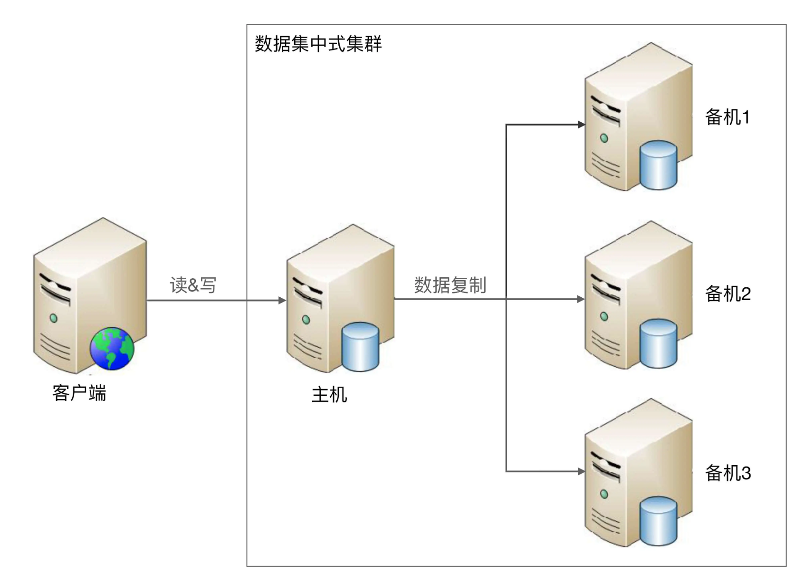

## 高可用存储架构：集群和分区

## 一、数据集群

集群就是多台机器组成在一起形成的一个统一的系统，数量上至少是3台。根据集群中机器承担的不同角色来划分，集群可以分为两类：数据集中集群、数据分散集群

#### 1. 数据集中集群

也可以将数据集中集群称为1主多备或1主多从。数据只能往主机中写。

难点在于：

- 主机如何将数据复制给备机？

    1. 存在多条复制通道。多条复制通道首先会增大主机复制的压力
    2. 多条复制通道，可能会导致多个备机之间数据不一致

- 备机如何检测主机状态？

    多台备机都需要对主机状态进行判断，而不同的备机判断的结果可能是不同的，如何处理不同备机对主机状态的不同判断，是一个复杂的问题。

- 主机故障后，如何决定新的主机？
    有多台备机都可以升级为主机，但实际上只能允许一台备机升级为主机，那么究竟选择哪一台备机作为新的主机，备机之间如何协调。

开源的数据集中集群以 Zookeeper 为典型，通过 ZAB 算法来解决上述问题

#### 2. 数据分散集群

多个服务器组成一个集群，每台服务器都会负责一部分数据，同时为了提升硬件利用率，每台服务器又会备份一部分数据

难点在于如何将数据分配到不同的服务器上，需要考虑如下：

- 均衡性：保证服务器上的数据分区基本是均衡的，不能存在某台服务器上的分区数量是另一台的几倍情况
- 容错性：当出现部分服务器故障时，算法需要将原来分配给故障服务器的数据分区分配给其他服务器
- 可伸缩性：当集群容量不够，扩充新的服务器后，算法能够自动将部分数据分区迁移到新服务器，并保证扩容后所有服务器的均衡性。

#### 3. 场景

数据集中集群和数据分散集群的异同

- 数据分散集群中每台服务器都可以处理读写请求，数据集中集群有专门负责写的主机
- 数据分散集群必须有一个角色来负责执行数据分配算法，这个角色可以是独立的一台服务器，也可以是集群自己选举出的一台服务器

hadoop 的实现就是独立的服务器负责数据分区的分配；而 elasticsearch 集群通过选举一台服务器来做数据分区的分配

一般来说，数据集中集群适合数据量不大，集群机器数量不多的场景。例如 Zookeeper 集群，一般推荐 5 台机器左右

而数据分散集群，由于其良好的可伸缩性，适合业务数据量巨大、集群机器数量庞大的业务场景。例如，Hadoop 集群、HBase 集群，大规模的集群可以达到上百台甚至上千台服务器。

## 二、数据分区

对于一些影响非常大的灾难，我们需要基于地理级别的故障来设计高可用架构。采用数据分区的架构后，即使某个地区发生严重的自然灾害或者事故，受影响的也只是一部分数据，而不是全部数据不可用，其他地区的备份的数据也可以帮助故障地区快速恢复业务

设计良好的数据分区架构，需要考虑如下：

- 数据量，数据量的大小直接决定了分区的规则复杂度。例如，使用 MySQL 来存储数据，一台 MySQL 的存储能力是 500GB，如果数据是 200TB，并不是增加到 800 台的 MySQL 那么简单，因为如果有太多的 MySQL
    1. 可能每周都有两台服务器故障，从 800 台里面定位出 2 台服务器故障不容易，运维复杂度很高
    2. 增加新的服务器，分区相关的配置甚至规则需要修改，每次修改都有可能影响到已有的 800 台服务器的运行
    3. 如果这些全部集中于某个城市，风险很大，遇到了火灾、停电，数据可能全部丢失，因此分区规则需要考虑地理容灾
- 分区规则：地理位置有远有近，可以得到不同的分区规则，包括洲际分区、国家分区、城市分区。需要综合考虑业务范围、成本等因素
- 复制规则：每个分区本身的数据量虽然只是整体数据的一部分，但还是很大，损失或者丢失也难以接受

#### 常见的分区复制规则

1. 集中式：存在一个总的备份中心，所有的分区都将数据备份到备份中心
    优缺点：

    - 设计简单，各分区之间并无直接联系，可以做到互不影响
    - 扩展容易，增加新的分区，其他分区不受影响
    - 成本较高，需要建设一个独立的备份中心

2. 互备式：每个分区备份另一个分区的数据
    优缺点：

    - 设计复杂，各个分区需要承担数据存储、备份功能，相互之间互相关联和影响
    - 扩展麻烦，如果新增新区，比如：增加一个武汉分区，则需要修改广州分区的复制指向武汉分区，然后将武汉分区的复制指向北京分区。而原有北京分区已经备份了的广州分区的数据怎么处理也是个难题，不管是做数据迁移，还是广州分区历史数据保留在北京分区，新数据备份到武汉分区，无论哪种方式都很麻烦。
    - 成本低，直接利用已有的设备

3. 独立式：指每个分区自己有独立的备份中心，各个分区的备份并不和原来的分区在一个地方

    优缺点：

    - 设计简单，各分区互不影响
    - 扩展容易，新增加的分区只需要搭建自己的备份中心即可
    - 成本高，每个分区需要独立的备份中心

