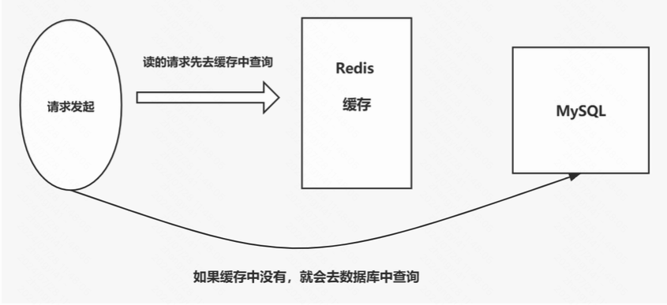

缓存技术的底层原理：“空间换时间”、“内存比磁盘快”

我们多使用一些内存空间，提升系统的响应速度。另外，由于内存必然比磁盘的读写速度快、读写延迟低，所以我们只要把热门数据和计算结果存储在内存中，就可以提高数据的读取速度，进而提升系统总体性能。

### 一、缓存更新策略

最原始的缓存架构，如下图

如上的缓存架构会有几点问题。

#### 1. 缓存击穿问题

比如在秒杀活动中，热点数据的缓存失效的话，瞬间会有多个请求发现读取不到缓存内容，就会直接从数据库读取，进而数据库被瞬间高压击垮。这个过程就是缓存击穿。

解决方案：

- 互斥锁/分布式锁：保证同一时间只有一个业务线程更新缓存，如果某个请求未能获取互斥锁，则等待或直接返回空值/默认值。
- 缓存不过期：可以使用后台进程定期异步更新缓存，也可以定期检查缓存过期时间，在过期前对数据进行刷新，并设置新的过期时间。

>缓存不过期的悖论
>
>前提：内存空间不是无限大。
>
>如果内存空间不够大，那就需要做数据淘汰。一旦做了数据淘汰，就会产生某些缓存失效。如果我们再引入一个不存在时候的数据库直连机制，那这个架构又变成了最原始的缓存架构。
>
>当然如果内存空间足够大，那就可以让缓存不过期了。

#### 2. 缓存雪崩问题

缓存雪崩是指在某个时间点，缓存中大量的数据同时失效，导致请求被集中大量发送给了后端的数据库，导致数据库因为瞬间的高负载而崩溃的问题。

解决方案：

- 错开过期时间。根据资源类型、资源本身的差异将缓存失效时间错开。
- 缓存不过期。我们也可以使用后台线程定期异步更新缓存来解决这个问题。
- 双 key 设计。对每一条缓存都用两个 key 存两份，一个是主 key，会设置过期时间，一个是备 key，不设置过期时间，他们的 key 不一样，value 值一样。当访问不到主 key 时，就直接返回备 key 中的数据，之后只需要等待后台线程生成新的缓存数据即可。本质上是空间换时间，用多一倍的内存空间解决缓存失效问题。

>有一种思想：不赞成使用高可用集群来规避缓存服务器宕机。
>
>因为绝大多数情况下并不是因为缓存服务器的软硬件故障而宕机，而是因为内存不够，或者被超大读写压力给打挂了。
>
>所以，如果缓存服务器宕机，应该直接返回错误，让运维来修复。
>
>当我们的数据读取流程依赖了缓存服务器时，此时缓存服务器就是一个单点。对整体系统而言，他对系统的重要性就和背后的数据库一样了，数据库宕机了还要对外提供服务吗？完全没有必要，出现了数据丢失反而更加麻烦。缓存服务器也一样。

#### 3. 后台更新缓存的设计

使用消息队列对缓存的更新流程进行解耦。

前面的缓存更新中，查询过程和更新过程是必须在同一个进程/线程内先后进行，这才是最大的束缚。我们使用消息队列对查询过程和更新过程进行解耦。查询过程和更新过程由两个进程/线程去执行。流程如下：

- 每次读取缓存，都判断一下是否即将失效
- 若即将失效，则通过消息队列向后台的缓存更新进程/线程发送一条 “某缓存 key 需要更新” 的消息
- 在高并发下，短时间内后台进程可能会收到多条消息，但这不重要。实际从数据库读取信息更新缓存之前，只需要判断一下过期时间即可，由于队列的排队执行特性，更新数据操作只会被执行一次。

这个方法的巧妙之处在于，把阻塞的、需要立刻处理的操作，转换成一条又一条的消息。而消息的处理是顺序的，只要队列处理器可以及时消费即可。

如果消息太多，队列消费的太慢。可以为每个 key 单独设置一个队列处理器。因为理论上缓存 key 相互之间没有关系。

### 二、缓存淘汰策略

缓存服务内存不足时，我们需要选择一种方法来淘汰旧数据。常见的淘汰策略包括：

- 最近最少使用（LRU）：LRU策略认为最近被访问过的缓存数据是有可能再次被访问的，因此优先保留最近被使用过的数据。适用于访问模式比较集中的场景。
- 先进先出（FIFO）：FIFO策略按照缓存数据进入缓存的顺序进行淘汰，最早进入缓存的数据最先被淘汰。适用于缓存数据没有特定的访问模式，并且对访问顺序没有特别要求的场景。
- 最不经常使用（LFU）：LFU策略认为被访问次数最少的缓存数据在未来的一段时间内仍然可能不被频繁访问，因此优先淘汰访问次数最少的数据。适用于部分数据非常热门，大部分数据较冷门的场景。
- 最长时间未使用（LRU-TTL）：该策略基于最近最少使用（LRU），但还考虑了缓存数据的过期时间。当缓存数据长时间未被访问又已经过期时，优先淘汰该数据。
- 最频繁使用（MFU）：与 LFU 正好相反。淘汰使用次数最多的
- 后进先出（LIFO）：与 FIFO 正好相反，最后进入缓存的数据最先被淘汰。
- 基于成本的淘汰（CBA）：该策略根据缓存数据的成本信息进行淘汰。成本可以包括缓存数据的存储成本、计算成本、更新成本等，也就是先淘汰数据量更大的key。
- 随机淘汰（Random）：该策略在缓存空间不足时，随机选择一个缓存数据进行淘汰。

### 三、缓存穿透问题

缓存穿透：调用者查询一个缓存和数据库中都不存在的数据。比如场景：

- 业务误操作，缓存和数据库中的数据都被误删除了，所以导致缓存和数据库中都没有数据
- 黑客恶意攻击，故意访问大量不存在的数据

如果我们对非法请求进行判断，这个判断就需要读取数据库，那么短时间如果有海量的 “查询某个key是否存在” 的语句打到数据库，有可能把数据库打崩。因此，对了应对这个风险，我们可以业务代码中做限流，或者使用“布隆过滤器”。

#### 1. 布隆过滤器

布隆过滤器是一种空间效率极高的概率型数据结构，用于判断一个元素是否在一个集合中。它是由一个很长的二进制数组和一组哈希函数组成。

- 当一个元素插入到布隆过滤器时，会通过多个哈希函数进行映射，将元素的位置标记为 1
- 当查询一个元素是否存在时，同样会通过多个哈希函数进行映射。如果所有位置都是 1，那么认为该元素存在于集合中。如果某个位置为 0，那么认为元素不存在集合中
- 布隆过滤器不支持删除操作，所以需要重新添加元素来覆盖已删除的元素

布隆过滤器存在一定的误判率。可以通过调整数组的长度和哈希函数的数量来降低误判率。

### 四、缓存预热

通过提前把预期的热数据主动载入到缓存中，可以大大降低秒杀活动开始一瞬间的系统压力。

如果业务进程需要等待数据载入缓存，那么就会在一瞬间引发“多级缓存雪崩”，系统在刚开始的时间，压力会非常大。而如果提前把热数据载入内存缓存的话，那活动开始瞬间的突发流量就会被抹平，等于系统一步就进入了稳定运行状态，对秒杀流程中的所有机器和服务都是一种有效的保护。

### 五、缓存高可用

内存缓存同步设计比较困难，原因是：内存的读写速度比网络高了两个数量级，延迟更是差了上千倍。所以如果我们需要通过又慢延迟又高的网络来同步内存中的数据，一定需要从架构设计到用户读写策略等方面，都要做好协调。

最重要的一点是：一旦某项数据被放入缓存，那么这项数据大概率首先追求的是高性能，其次是高可用，最后才是节点之间的一致性。所以 redis 的各种集群方案都是以高性能、高可用为设计目标的。时至今日，redis 集群依然遵循最常见的集群设计思路来演进：主从同步、增量复制、主从切换哨兵、哨兵集群。

以 redis 集群为例，阐述一下缓存高可用目前依然没有被完美解决的问题：

#### 1. 全量同步 / 增量同步 悖论：

全量同步可以获得最完善的一致性，但是需要消耗大量的资源；

增量同步大大减少了需要传输和处理的数据量，因此性能更好，资源消耗也相对较小。但是增量同步需要依赖于一种机制来跟踪哪些数据已经同步过，哪些是新的变化。这通常涉及到使用某种形式的日志记录或版本控制。此外，增量同步需要预先规划环形缓冲区的内存空间大小，这是因为需要有足够的空间来存储待同步的增量数据，而这部分空间不能随意改变，否则会导致数据丢失或不完整。

增量同步适用于“计划中”的运维事件，比如预知的主从切换，因为这类事件可以提前准备，确保有足够的资源和空间进行同步。但是，在节点宕机等异常场景下，由于宕机通常是突发的，没有足够的时间来规划和准备，增量同步可能无法立即恢复服务，因为它需要时间来识别和同步所有的增量数据。

#### 2. 脑裂问题

缓存业务天然的高性能需求几乎让任何分布式缓存系统必然选择容忍 “脑裂问题”。甚至基础的主从强一致性目前都没有一种集群架构能完全做到。

#### 3. 故障切换

虽然哨兵集群在理论上解决了单节点宕机后主节点无法切换的大问题，但是现实世界中，单节点宕机只是小概率事件，更容易出现的其实是网络故障和集群容量爆满问题，这两个问题哨兵集群都无能为力。

>为什么 k8s 集群的高可用看起来很完美？
>
>因为 k8s 只把可以做到集群高可用的部分留在了自己的系统中，真正的单点：网关和流量洪峰都是无法被 k8s 集群很好的处理的。这两个高可用系统中最关键的要素都需要我们在架构的其他部分自己想办法解决。

### 六、队列

有时候我们希望有一个单点，可以把所有的需求排成队，一个一个的执行完成。

比如我们以数据库 Mysql 来作为我们的场景。Mysql 中 update 语句会由一个事务来执行。并且事务非常严谨，执行不会出错，但是性能差。如果瞬间有大量并发的有冲突的事务，还会引发死锁，导致连接数暴涨，数据库服务挂掉。这个问题就可以使用队列来解决。如下是列举的两种场景。

场景一：

比如在秒杀活动开始的几分钟，下单压力比较大。但是几分钟后请求就骤减了，和平常一样的水平。所以我们可以用队列来把短时间内暴增的数据库压力稍微均匀分摊一下，让库存的扣减和订单的生成稍微等待一下，我们的数据库就不会挂，秒杀活动就能正常进行。

场景二：

多线程并发的对共享数据的操作，可能会出现非预期的结果。也可以使用队列来解决。

- 使用队列来降低争抢激烈程度。比如秒杀活动一千个人一起抢，但是后端只开了 3 个队列处理器进程。这样就变成了 3 个人一起抢。即便还用 Mysql 事务来做原子化操作，死锁的概率就低很多了。不过代价是大部分用户需要等待前面的任务都处理完才能拿到自己没有抢到的结果。
- 直接利用 redis 的原子性。将共享数据直接存入 redis，只要 redis 还是单体架构，那对同一个 key 的操作就是原子化的。这样做就可以完全不依赖数据库了，理论上性能会更高，坏处是 redis 会承担更大的压力，需要设计更复杂的锁机制来减少对 redis 的压力。此外 Mysql 和 redis 之间的数据同步也是一个无法被忽略的大问题。

### 八、缓存和队列的架构意义

1. **缓存的本质是用一致性换取读取性能**

放弃一部分数据一致性，获取一个客观的读取性能提升，这在处理不经常更新的数据时非常有用。

2. **队列的本质是将关键操作从同步改为异步**

对于 HTTP Web后端系统，队列存在的意义比较重大，他的核心价值是把一些耗时的任务从同步执行改为异步执行。很多任务本身并不需要很多的资源，但是当两个任务连在一起执行时，就会导致长时间的资源占用。我们使用队列工具，在时间上把任务拆分开，可以很大程度解放系统性能，也就是“用未来的时间换现在的时间”。

3. **消息订阅 - 架构解耦**

“消息订阅 - 架构解耦” 对高并发系统架构有着决定性的影响。在业务复杂的大型高并发系统中，各个业务之间的协作是一个大问题，如果同步等待，那么整个系统中就会出现大量的等待，甚至会显著影响用户体验，代价非常大。

而以 kafka 为列表的消息订阅软件对大型系统的架构设计做出了很大贡献。而且由于 kafka 的消息之间没有关系，所以数据的离散性让 kafka 可以放开手脚，设计出一个近乎完美的高吞吐量、高可靠性、具有持久性的分布式消息订阅系统。

### 九、常见的问题解决方案

#### 1. 如何设计一个每秒一万单的秒杀系统

使用队列可以实现一个每秒一万单的秒杀系统。

- 用队列把短期内暴增的数据库压力稍微均匀分摊到一段时间中
- 使用队列来降低争抢激烈程度。比如秒杀活动一千个人一起抢，但是后端只开了 3 个队列处理器进程。这样就变成了 3 个人一起抢。即便还用 Mysql 事务来做原子化操作，死锁的概率就低很多了。不过代价是大部分用户需要等待前面的任务都处理完才能拿到自己没有抢到的结果。
- 直接利用 redis 的原子性。将共享数据直接存入 redis，只要 redis 还是单体架构，那对同一个 key 的操作就是原子化的。这样做就可以完全不依赖数据库了，理论上性能会更高，坏处是 redis 会承担更大的压力，需要设计更复杂的锁机制来减少对 redis 的压力。此外 Mysql 和 redis 之间的数据同步也是一个无法被忽略的大问题。

#### 2. 分布式缓存如何保证数据一致性

在分布式系统中，有如下几种保证数据一致性的方法：

- 缓存失效策略：通过标记失效和重新获取最新数据来避免脏数据的读取
- 更新广播：通过消息队列通知变动，使缓存节点及时更新数据
- 读写锁：控制对共享资源的访问，读操作并发进行，写操作独占资源
- 基于版本号的处理：通过比较版本号来更新缓存
- 一致性哈希算法：将数据分散到不同节点，影响部分数据的迁移
- 分布式事务：确保操作的原子性和一致性

#### 3. 如何保证消息仅被消费一次

保证消息仅被消费一次，有如下几种方法：

- 消费者确认机制（ACK）：消费者在处理完消息后向消息队列发送确认信号，告知队列消息已被正确消费。消息队列收到确认信号后将该消息标记为已处理并删除或移到 “已消费队列”，确保每条消息只被一个消费者处理。
- 消息去重：消费者通过唯一标识符或业务逻辑判断实现消息去重。记录已处理过的消息标识符，下次消费时先检查该标识符，若已存在则不再处理
- 幂等性处理：消费者实现幂等性处理，即使同一条消息被重复消费，也能保证最终结果一致。通过添加幂等性判断和处理机制，在多次处理同一条消息时不会产生错误
- 消费者分组：将多个消费者组成一个消费组。消息只会被组内某个消费者消费，其他消费者无法接收相同消息，确保同一条消息只被消费者组内处理。
- 基于事务的消费：使用支持事务的消息队列，将消息的消费与业务逻辑放在一个事务中进行。如果事务提交成功，则消息被标记为已处理；否则回滚事务，确保消息不被重复消费。

#### 4. 如何降低分布式消息队列中消息的延迟

有如下几种方法：

- 异步处理：将操作异步化，提高处理吞吐量，减少等待时间
- 批量处理：批量拉取和写入，减少网络开销和调用次数，降低延迟
- 负载均衡：合理分配负载，避免过载导致延迟增加
- 预取机制：引入预取机制，提前拉取下一批消息，避免等待时间
- 消息索引和缓存：在内存中维护索引和缓存，减少访问时间开销
- 水平扩展：增加并行度，通过分区或增加消费者数量提升处理能力
- 性能监控和优化：定期监控性能指标，针对瓶颈问题进行优化，提高整体性能和效率
