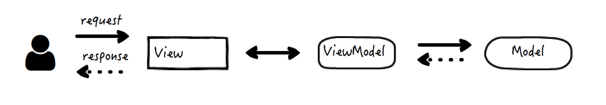

## MVC

#### 1. 传统的三层架构，包含这样三层：

- 控制器（Controller），恰如其名，主要负责请求的处理、校验和转发。
- 视图（View），将内容数据以界面的方式呈现给用户，也捕获和响应用户的操作。
- 模型（Model），数据和业务逻辑真正的集散地。

#### 2. MVC 的常见形式：

- 第一种实现
    

    用户请求发送给 Controller，Controller 是大总管，需要主动调用 Model 层的接口去取得实际需要的数据对象，之后将数据对象发送给需要渲染的 View，View 渲染之后返回页面给用户
    这种情况下，Controller 往往比较大，因为它要知道需要调用哪个 Model 的接口获取数据对象，还需要知道要把数据对象发送给哪个 View 去渲染。而 View 和 Model 都比较简单纯粹，他们只需要根据 Controller 的要求完成他们自己的任务即可

- 第二种实现

    

    这种情况下的 Controller 相对就比较简单，写操作是 Controller 发起的，读操作是由 View 发起的，二者的业务对象模型可以不相同，非常适合需要命令职责分离的场景。

#### 3. MVC 的扩展：MVP、MVVM

1. MVP 包含的三层为 Model、View 和 Presenter，它往往被用在用户的界面设计当中。

    

    - Model 的职责没有太大的变化，依然是业务数据的唯一来源
    - View 变成了纯粹的被动视图，它被动地响应用户的操作来触发事件，并将其转交给 Presenter；反过来，它的视图界面被动地由 Presenter 来发起更新
    - Presenter 变成了 View 和 Model 之间的协调者（Middle-man），它是真正调度逻辑的持有者，会根据事件对 Model 进行状态更新，又在 Model 层发生改变时，相应地更新 View

    不同点：对于 MVC 来说，Controller 层次上完全独立于 View，他可以跨多个视图，可以决定视图路由，更多存放的是控制逻辑，应用较为广泛，但多数在服务端代码中；对于 MVP 来说，Presenter 其实是和 View 在相似的层次上，协调并把 Model 的数据绑定到指定 View 上去，主要用在纯粹 UI 的实现中

2. MVVM 是在 MVP 的基础上，将职责最多的 Presenter 替换成了 ViewModel，它实际是一个数据对象的转换器，将从 Model 中取得的数据简化，转换为 View 可以识别的形式返回给 View。View 和 ViewModel 实行双向绑定，成为命运共同体，即 View 的变化会自动反馈到 ViewModel 中，反之亦然

    

### 一、框架解析定义

#### 1. Model 层

模型就是当我们使用软件去解决真实世界中各种实际问题的时候，对那些我们关心的实际事物的抽象和简化。

贫血模型、充血模型。这里的血指的是逻辑。

- 贫血模型：意味着模型实体在设计和实现上，不包括或者包含很少的逻辑。通常逻辑被挪了出来，由其他单独一层代码（比如 Service 层）来完成

    不是面向对象的，因为对象需要数据和逻辑的结合。这时模型实体不包含逻辑，但是包含状态，逻辑被解耦到了无状态 Service 中。

- 充血模型：模型实体包含数据，也包含逻辑，具备了更高程度的完备性和自洽性。是面向对象的。

软件的耦合和复杂性问题往往都可以通过分层解决，模型层内部也一样，但是我们需要把握其中的度。层次划分过多、过细，并不利于开发人员严格遵从和保持层次的清晰，也容易导致产生过多的无用样板代码，从而降低开发效率

CQRS模式（Command Query Responsibility Segregation，命令查询职责分离），“命令”可以类比为写，“查询”可以类比为读。是贫血模式，模型层的接口只分为两种：

- 命令：他不返回任何结果，但会改变数据的状态
- 查询：他返回结果，但是不会改变数据的状态

```java
class Book {
    private long id;
    private String name;
    private Date publicationDate;
    private Date creationDate;
    ... // 省略其它属性和 getter/setter 方法
}

class BookService {
    public void add(Book book);
    public Pagination<Book> query(Query bookQuery);
}
```

CQRS 模式就是 MVC 的第二种实现方式

#### 2. View 层

MVC 架构中的视图是指将数据有目的、按规则呈现出来的组件。可以是 UI 界面、以 JSON、XML 等特定格式组织呈现的数据也算是视图。主要是前端的展示

页面聚合技术：

- 结构聚合：指的是将一个页面中不同的区域聚合起来，这体现的是分治的思想。例如一个页面，具备页眉、导航栏、目录、正文、页脚，这些区域可能是分别生成的，但是最后需要把它们聚合在一起，再呈现给用户
- 数据 - 模板聚合：指的是聚合静态的模板和动态的数据，这体现的是解耦的思想。例如有的新闻网站首页整个页面的 HTML 是静态的，用户每天看到的样子都是差不多的，但每时每刻的新闻列表却是动态的，是不断更新的

#### 3. Controller 层

控制器用于接收请求，校验参数，调用 Model 层获取业务数据，构造和绑定上下文，并转给 View 层去渲染。也就是说，控制器是 MVC 的大脑，它知道接下去该让谁去做什么事。

- （1）路径映射和视图指向。
    - 入口路由就是路径映射，根据配置的规则，以及请求 URL 的路径，找到具体接收和处理这个请求的控制器逻辑
    - 出口路由就是视图指向，根据配置的规则，以及控制器处理完毕后返回的信息，找到需要渲染的视图页面
- （2）请求参数绑定。需要从 HTTP 的请求中把参数取出来，绑定到控制器这一层。
- （3）参数验证
- （4）视图上下文绑定。将数据传给 View 视图层

上面步骤的任何一步，根据实际情况都是可以省略的。

https://www.jianshu.com/p/4b754ea48a40

 


