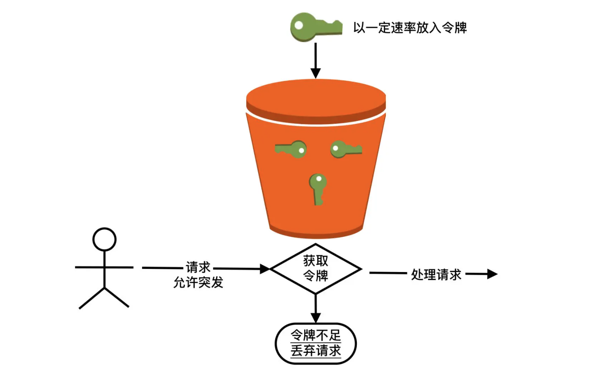
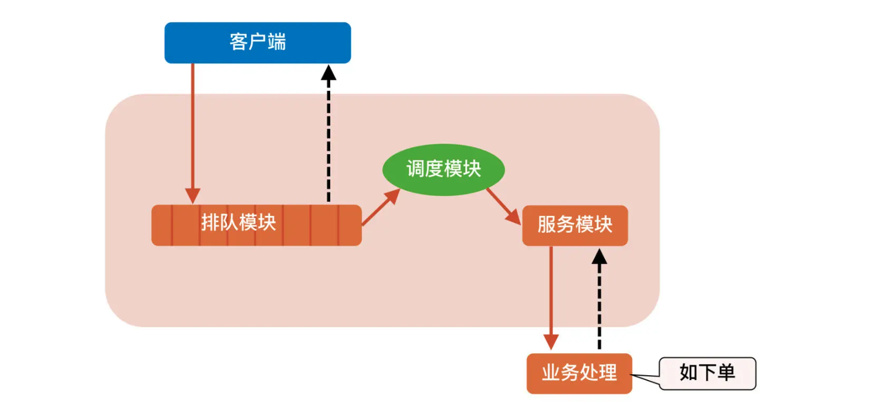
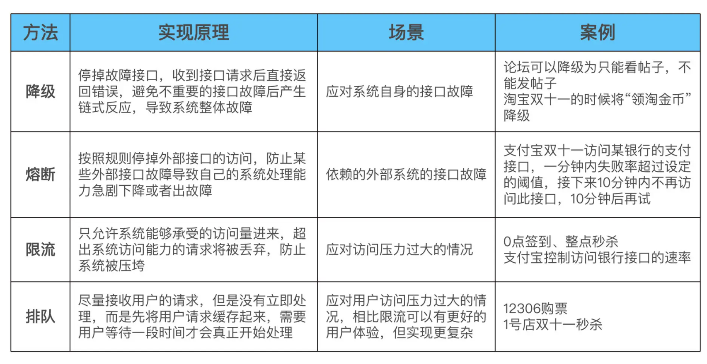

## 如何应对接口级的故障

接口级故障的典型表现就是，系统并没有宕机、网络也没有中断，但业务却出现问题了，例如业务响应缓慢、大量访问超时和大量访问出现异常（给用户弹出提示“无法连接数据库”）

这类问题的主要原因在于系统压力太大、负载太高，导致无法快速处理业务请求，由此引发更多的后续问题。最常见的情况就是，数据库慢查询将数据库的服务器资源耗尽，导致读写超时，业务读写数据库时要么无法连接数据库、要么超时，最终用户看到的现象就是访问很慢，一会儿访问抛出异常，一会儿访问又是正常结果。

导致接口级的故障的原因可以分为两大类：

- 内部原因：包括程序BUG 导致死循环，某个接口导致数据库慢查询，内存泄露等
- 外部原因：黑客攻击、第三方系统响应慢

解决接口级故障的核心思想和异地多活基本类似，都是**优先保证核心业务**和**优先保证绝大部分用户**。常见的应对方法有：降级、熔断、限流、排队

### 一、降级

降级指系统将某些业务或者接口的功能降低，可以是只提供部分功能，也可以是完全停掉所有功能。比如论坛只能看帖子，不能发帖子

常见的实现降级的方式有两种：

1. 系统后门降级，例如系统提供一个降级URL。实现成本低，但主要缺点是如果服务器数量多，需要一台一台去操作，效率比较低
2. 独立降级系统，将降级操作独立到一个单独的系统中，实现复杂的权限管理、批量操作等功能

### 二、熔断

按照规则停掉外部接口的访问，防止某些外部接口故障导致自己的系统处理能力急剧下降或者出故障

为降级的目的是应对系统自身的故障，而熔断的目的是应对依赖的外部系统故障的情况。

假设一个这样的场景：A 服务的 X 功能依赖 B 服务的某个接口，当 B 服务的接口响应很慢的时候，A 服务的 X 功能响应肯定也会被拖慢，进一步导致 A 服务的线程都被卡在 X 功能处理上，于是 A 服务的其他功能都会被卡住或者响应非常慢。这时需要熔断机制：A 服务不再请求 B 服务的这个接口，A 服务内部只要发现是请求 B 服务的这个接口就立即返回错误，从而避免 A 服务整个被拖慢甚至拖死。

实现熔断机制有两个关键点：

- 需要有一个统一的 API 调用层，由 API 调用层来进行采样或者统计。如果接口调用散落在代码各处，就没法进行统一处理
- 阈值的设计，例如，1 分钟内 30% 的请求响应时间超过 1 秒就熔断。这个策略中的 1分钟、30%、1秒 都对最终的熔断效果有影响

### 三、限流

降级是从系统功能优先级的角度考虑如何应对故障，而限流则是从用户访问压力的角度来考虑如何应对故障。限流指只允许系统能够承受的访问量进来，超出系统访问能力的请求将被丢弃。

#### 1. 限流方式

常见的限流方式可以分为两类：基于请求限流和基于资源限流

###### (1). 基于请求限流

1. 限制总量，也就是限制某个指标的累积上限。常见的是限制当前系统服务的用户总量。
2. 限制时间量，也就是限制一段时间内某个指标的上限。例如 1分钟只允许 1w 个用户访问

无论是限制总量还是限制时间量，共同的特点都是实现简单，但在实践中面临的主要问题是比较难以找到合适的阈值。即使找到了合适的阈值，基于请求限流还面临硬件相关的问题。例如一台 32 核的机器和 64 核的机器处理能力差别很大，阈值是不同的。

为了找到合理的阈值，通常情况下可以采用性能压测来确定阈值，但性能压测也存在覆盖场景有限的问题，可能出现某个性能压测没有覆盖的功能导致系统压力很大；另外一种方式是逐步优化：先设定一个阈值然后上线观察运行情况，发现不合理就调整阈值

基于上述的分析，根据阈值来限制访问量的方式更多的适应于业务功能比较简单的系统，例如负载均衡系统、网关系统、抢购系统等

###### (2). 基于资源限流

基于请求限流是从系统外部考虑的，而基于资源限流是从系统内部考虑的，也就是找到系统内部影响性能的关键资源，对其使用上限进行限制。常见的内部资源包括连接数、文件句柄、线程数和请求队列等

基于资源限流相比基于请求限流能够更加有效地反映当前系统的压力。有两个难点：如何确定关键资源？如何确定关键资源的阈值？通常情况下这也是一个逐步调优的过程：设计的时候先根据推断选择某个关键资源和阈值，然后测试验证，再上线观察，如果发现不合理，再进行优化。

#### 2. 限流算法

常见的限流算法如下：

###### (1). 时间窗

限制一定时间窗口内的请求量或者资源消耗量

- 固定时间窗。统计固定时间周期内的请求量或者资源消耗量，超过限期就会启动限流

    优点：实现简单
    缺点：存在临界点问题。统计会有偏差，比如限流 1分钟100次，统计的窗口是 1分钟，1.30-2.30 这个时间已经达到了 150次，而统计的 1.00-2.00 分钟是 75次，2.00-3.00 分钟是75次。从单个窗口看没有超过限额，所以不会启动限流，但结果可能导致系统因为压力太大而挂掉

- 滑动时间窗。两个统计周期部分重叠，从而避免短时间内的两个统计点分属不同的时间窗的情况。比如 0.00 - 1.00 分钟统计，0.30 - 1.30 分钟做统计，1.00 - 2.00 做统计

    总体上看，滑动时间窗的限流效果要好一点，但没有完全解决，实现也稍微复杂一点

##### (2). 桶算法

用一个虚拟的桶来存储一些东西，根据桶里的东西，分为 漏桶和令牌桶

- 漏桶，将请求放入桶（消息队列），业务处理单元（线程、进程、应用）从桶里拿出请求处理，桶满则丢弃新的请求
    关键实现点：

    1. 流入速率不固定：可能瞬间流入非常多的请求

    2. 均匀（极速）流出，也就是说即使大量请求进入了漏桶，但是从漏桶流出的速度是均匀的，速度的最大值就是系统的极限处理速度。这样就保证了系统在收到海量请求的时候不被压垮，这是第一层的保护措施。需要注意的是：如果漏桶没有堆积，那么流出速度就等于流入速度，这个时候流出速度就是不均匀的

    3. 桶满则丢弃请求：这是第二层保护错误，也就是说漏桶不是无限容量，而是优先容量。

    漏桶算法的技术本质是总量控制，桶大小是设计关键。具体的优缺点如下：

    1. 突发大量流量时丢弃的请求较少，因为漏桶本身有缓存请求的作用
    2. 桶大小动态调整比较困难，需要不断的尝试才能找到符合业务需要的最佳桶大小
    3. 无法精确控制流出速度，也就是业务的处理速度

    场景：适用于瞬时高并发流量的场景（整点秒杀），在短短几分钟内涌入大量请求时，为了更好的业务效果和用户体验，即使处理慢一点，也要做到尽量不丢弃用户请求

- 令牌桶算法
    桶中放入的不是请求，而是令牌，这个令牌就是业务处理前需要拿到的许可证。也就是说，当系统收到一个请求，先要到令牌桶中拿令牌，拿到令牌才能进一步处理，拿不到就要丢弃请求。
    
    关键设计点：

    1. 有一个处理单元往桶里放令牌，放的速率是可以控制的
    2. 桶里面可以累积一定数量的令牌，当突发流量过来的时候，因为桶里面有累积的令牌，此时业务处理速度会超过令牌放入的速度
    3. 如果令牌不足，即使系统有能力处理，也会丢弃请求

    令牌桶算法的技术本质是速率控制，令牌产生的速率是设计关键，优缺点如下：

    1. 可以动态调整处理速率，实现更加灵活
    2. 突发大量流量的时候可能丢弃很多请求，因为令牌桶不能累积太多令牌
    2. 令牌桶没有优先级，无法让重要的请求先通过
    3. 实现相对复杂
    
    场景：
    
    1. 一种是需要控制访问第三方服务的速度，防止把下游压垮，例如支付宝访问银行接口的速率
    2. 另一种是需要控制自己的处理速度，防止过载，例如压测结果显示系统最大处理 TPS 为 100，那么就用令牌桶来限制最大的处理速度
    
- 漏桶算法 vs 令牌桶算法

    令牌桶的算法原本是用于网络设备控制传输速度的，而且它控制的目的是保证一段时间内的平均传输速度。之所以说令牌桶适合突发流量，是指在网络传输的时候，可以允许某段时间内（一般就几秒）超过平均传输速率，这在网络环境下常见的情况就是“网络抖动”。但这个短时间的突发流量并不会导致雪崩效应，网络设备也能够处理得过来。

    本质上漏桶算法相当于将请求缓存了，然后异步处理。但是令牌桶是同步处理策略，一个每秒 30 TPS 的令牌桶，桶的容量可能只能设计成 40 左右，再多就真的挂了。

令牌桶文章：https://studygolang.com/articles/29683

### 四、排队

排队实际上是限流的一个变种，限流是直接拒绝用户，排队是让用户等待一段时间。由于排队需要临时缓存大量的业务请求，单个系统内部无法缓存这么多数据，一般情况下，排队需要独立的系统去实现，例如：使用 kafka 消息队列

如上图的实现：

- 排队模块。负责接收用户的抢购请求，将请求以先入先出的方式保存下来。每一个参加秒杀活动的商品保存一个队列，队列大大小可以根据参与秒杀的商品数量自行定义
- 调度模块。负责排队模块到服务模块的动态调度，不断检查服务模块，一旦处理能力有空闲，就从排队队列头上把用户访问请求调入服务模块，并负责向服务模块分发请求。这里调度模块扮演一个中介的角色，但不只是传递请求而已，它还担负着调节系统处理能力的重任。我们可以根据服务模块的实际处理能力，动态调节向排队系统拉取请求的速度
- 服务模块。负责调用真正业务来处理服务，并返回处理结果，调用排队模块的接口回写业务处理结果

### 总结

