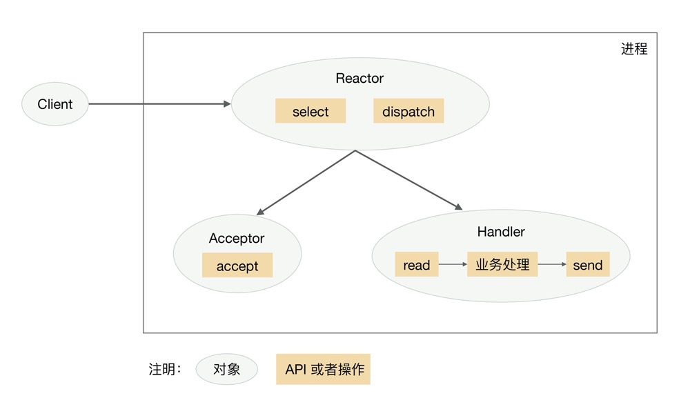
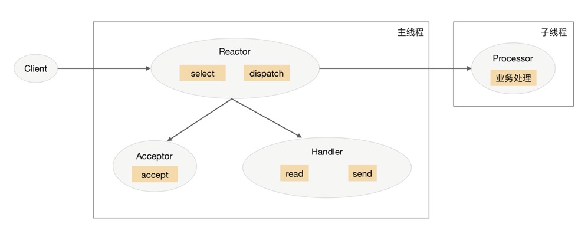
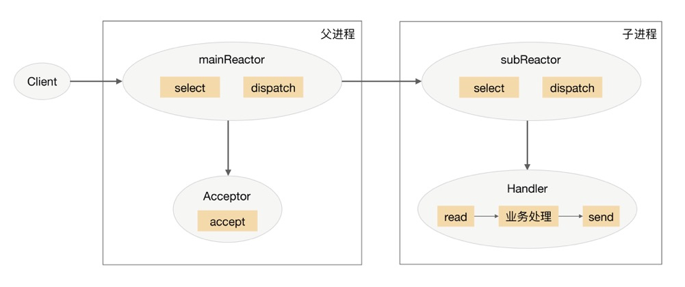
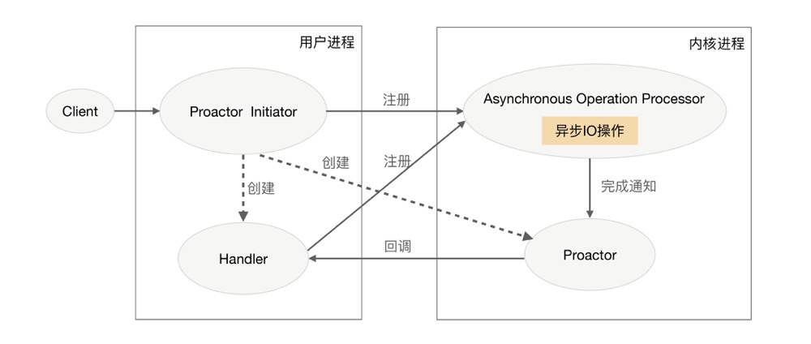

## 单服务器高性能模式：Reactor与Proactor

IO 复用技术的两个关键点：

- 当多条连接共用一个阻塞对象后，进程只需要在一个阻塞对象上等待，而无须在轮询所有连接，常见的实现：select、epoll、kqueue 等
- 当某条连接有新的数据可以处理时，操作系统会通知进程，进程从阻塞状态返回，开始进行业务处理

### 一、Reactor

Reactor 模式要求主线程（IO处理单元）只负责监听文件描述符上是否有事件发生，有的话就立即将该事件通知工作线程（逻辑单元）。除此之外，主线程不做任何其他实质性的工作。读写数据、接受新的连接、处理客户请求均在工作线程中完成

Reactor 模式也叫做 Dispatcher 模式。Reactor 模式的核心组成部分包括 Reactor 和处理资源池（进程池或线程池），其中 Reactor 负责监听和分配事件，处理资源池负责处理事件。Reactore 的数量可以是一个或多个；资源池中的进程/线程数量也可以变化。

“多Reactor单进程” 实现方案相比“单Reactor单进程”方案，即复杂又没有性能优势。

#### 1. 单Reactor 单进程/线程

其中，select、accept、read、send 是标准的网络编程 API，dispatch 和“业务处理”是需要完成的操作。

- Reactor 对象通过 select 监控连接事件，收到事件后通过 dispatch 进行分发
- 如果是连接建立事件，则由 Acceptor 处理，Acceptor 通过 accept 接受连接，并创建一个 Handler 来处理连接后续的各种事件
- 如果不是连接建立事件，则 Reactor 会调用连接对应的 Handler 来响应
- Handler 会完成 read -> 业务处理 -> send 的完整业务流程

单 Reactor 单进程/线程模式的优点是实现简单，没有进程间通信，没有进程竞争，全部都在同一个进程内完成。但是缺点也比较明显：

-  只有一个进程，无法发挥多核 CPU 的性能
- Handler 在处理某个连接上的业务时，整个进程无法处理其他连接的事件，很容易导致性能瓶颈。

单 Reactor 单进/线程 模式只适用于业务处理非常快速的场景。比如著名的就是 Redis

#### 2. 单 Reactor 多线程

- 主线程中，Reactor 对象通过 select 监控连接事件，收到事件后通过 dispatch 进行分发
- 如果是连接建立的事件，则由 Acceptor 处理，Acceptor 通过 accept 接受连接，并创建一个 Handler 来处理连接后续的各种事件
- 如果不是连接建立事件，则 Reactor 会调用连接对应的 Handler 来进行响应
- Handler 只负责响应事件，不进行业务处理；Handler 通过 read 读取到数据后，会发给 Processor 进行业务处理
- Processor 会在独立的子线程中完成真正的业务处理，然后将响应结果发给主线程的 Handler 处理；Handler 收到影响后通过 send 将响应结果返回 client 

单 Reactor 多线程方案能够充分利用多核多CPU 的处理能力，但存在如下问题：

- 多线程数据共享和访问复杂。涉及到数据的互斥和保护机制
- Reactor 承担所有事件的监听和响应，只在主线程中运行，瞬间高并发时会成为性能瓶颈

单 Reactor 多进程方案涉及进程之间的通信，相比线程之数据的共享，复杂度要高很多

#### 3. 多 Reactor 多进程/线程

-  父进程中 mainReactor 对象通过 select 监控连接建立事件，收到事件后通过 Acceptor 接收，将新的连接分配给某个子进程
- 子进程的 subReactor 将 mainReactor 分配的连接加入连接队列进行监听，并创建一个 Handler 用于处理连接的各种事件
- 当有新的事件发生时，subReactor 会调用连接对应的 Handler 来进行响应
- Handler 完成 read -> 业务处理 -> send 的完整业务流程

多 Reactor 多进程/线程 实现反而更加简单，因为

- 父进程和子进程的职责非常明确，父进程只负责接受新连接，子进程负责完成后续的业务处理
- 父进程和子进程的交互很简单，父进程只需要把新连接传给子进程，子进程无须返回数据
- 子进程之间是互相独立的，无须同步共享之类的处理（这里仅限于网络模型相关的 select、read、send 等无须同步共享，“业务处理”还是有可能需要同步共享的）

采用 多Reactor 多进程 的系统比如 nginx，采用 多 Reactor 多线程 的比如 Memcache 和 Netty 

注意：Nginx 采用的是 多reactor 多进程的模式，但方案与标准的有差异，表现在主进程中仅仅创建了监听端口，并没有创建 mainReactor 来 accept 连接，而是由子进程来 accept 连接，通过锁来控制一次只有一个子进程进行 accept ，子进程 accept 新连接后就放到自己的 reactor 进行处理，不会在分配给其他子进程。

### 二、Proactor 

### 1. 网络模型解析

IO 操作分为两个阶段

1. 等待数据准备好（读到内核缓存）
2. 将数据从内核读到用户空间（进程空间）

一般来说，阶段 1 上花费的时间远远大于阶段 2，因此：

- 同步阻塞IO：阶段 1 阻塞，阶段 2 也阻塞
- 同步非阻塞IO：阶段 1 非阻塞，阶段 2 阻塞
- 异步非阻塞IO：阶段 1 非阻塞，阶段 2 非阻塞

### 2. Proactor 方案解释

 Proactor 可以理解为：来了事件我来处理，处理完了我通知你。这里的“我”就是操作系统内核；“事件”就是有新连接、有数据可读、有数据可写的这些 IO 事件；“你”就是我们的程序代码。

- Proactor initiator 负责创建 Proactor 和 Handler，并将 Proactor 和 Handler 都通过 Asynchronous Operation Processor 注册到内核
- Asynchronous Operation Processor 负责处理注册请求，并完成 I/O 操作
- Asynchronous Operation Processor 完成 I/O 操作后通知 Proactor
- Proactor 根据不同的事件类型回调不同的 Handler 进行业务处理
- Handler 完成业务处理，Handler 也可以注册新的 Handler 到内核进程

理论上 Proactor 比 Reactor 效率要高一些，异步 I/O 能够充分利用 DMA 特性，让 I/O 操作与计算重叠，但要实现真正的异步 I/O，操作系统需要做大量的工作。目前 Windows 下通过 IOCP 实现了真正的异步 I/O，而在 Linux 系统下的 AIO 并不完善，因此在 Linux 下实现高并发网络编程时都是以 Reactor 模式为主。所以即使 Boost.Asio 号称实现了 Proactor 模型，其实它在 Windows 下采用 IOCP，而在 Linux 下是用 Reactor 模式（采用 epoll）模拟出来的异步模型。

