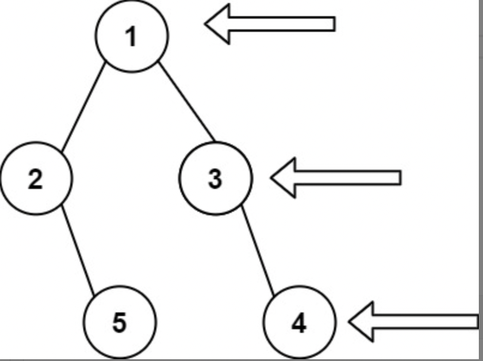

### 一、题目

给定一个二叉树的 **根节点** `root`，想象自己站在它的右侧，按照从顶部到底部的顺序，返回从右侧所能看到的节点值。



Leetcode：https://leetcode.cn/problems/binary-tree-right-side-view/

### 二、分析

本题目比较简单，层序遍历的思路。只需要保存每次层序遍历过程中最右边的节点即可

```
class Solution {
public:
    vector<int> rightSideView(TreeNode* root) {
        if (root == nullptr) {
            return std::vector<int>();
        }
        std::queue<TreeNode*> qu;
        std::vector<int> res;
        TreeNode* last = root;
        TreeNode* nlast = root;
        qu.push(root);
        while (!qu.empty()) {
            TreeNode* node = qu.front();
            qu.pop();
            if (node->left != nullptr) {
                qu.push(node->left);
                nlast = node->left;
            }
            if (node->right != nullptr) {
                qu.push(node->right);
                nlast = node->right;
            }
            if (last == node) {
                res.emplace_back(node->val);
                last = nlast;
            }
        }
        return res;
    }
};
```

