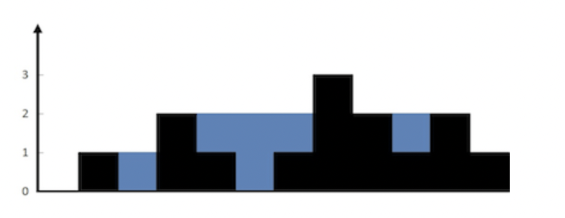

### 一、接雨水

给定 `n` 个非负整数表示每个宽度为 `1` 的柱子的高度图，计算按此排列的柱子，下雨之后能接多少雨水。

Leetcode：https://leetcode.cn/problems/trapping-rain-water/



```
输入：height = [0,1,0,2,1,0,1,3,2,1,2,1]
输出：6
解释：上面是由数组 [0,1,0,2,1,0,1,3,2,1,2,1] 表示的高度图，在这种情况下，可以接 6 个单位的雨水（蓝色部分表示雨水）。
```

### 二、分析

我们用动态规划来做这道题目。先来谈谈暴力法

对于下标 i，下雨后水能到达的最大高度等于下标 i 两边的最大高度的最小值。记住是最大高度的最小值，下标 i 处能接的雨水量等于下标 i 处的水能到达的最大高度减去 `height[i]`

因此，我们在遍历到 i 位置的时候，知道 i 位置左边和右边的最大高度的最小值，此问题迎刃而解。于是，我们使用两个数组，一个数组 left_arr 保存 i 位置左边的最大值，另一个数组 right_arr 保存 i 位置右边的最大值。如何填充这两个数组呢？

第一个数组 left_arr ，从左到右，从 1 开始遍历，而非 0。每次取 `height[i-1]` 和 `left_arr[i-1]` 的最大值。

第二个数组 right_arr，从右到左，从 size-2 开始遍历。每次取 `height[i+1]` 和 `right_arr[i+1]` 的最大值

之后再次遍历数组，从 1 开始，到 size-2（包括）结束。因为最左边和最右边的两个柱子不用统计，因为无法存水。注意如果 `height[i]` 大于等于 `min(left_arr[i], right_arr[i])` ，就无法接到雨水了，直接绕过这次循环。

如下代码

```
class Solution {
public:
    int trap(const std::vector<int>& height) {
        if (height.size() < 2) {
            return 0;
        }
        std::vector<int> left_high(height.size(), 0);
        std::vector<int> right_high(height.size(), 0);
        for (int i = 1; i < height.size(); i++) {
            left_high[i] = std::max(height[i-1], left_high[i-1]);
        }
        for (int i = height.size()-2; i >= 0; i--) {
            right_high[i] = std::max(height[i+1], right_high[i+1]);
        }
        int res = 0;
        for (int i = 1; i < height.size()-1; i++) {
            int min = std::min(left_high[i], right_high[i]);
            if (height[i] >= min) {
                continue;
            } else {
                res += min - height[i];
            }
        }
        return res;
    }
};
```

