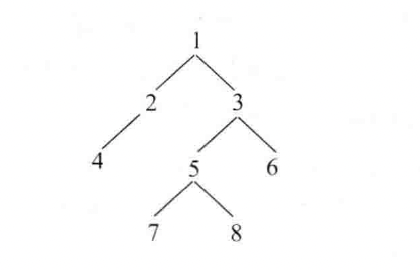

### 一、题目

如下，有一个二叉树，请按照 Z 字形打印



打印结果为：

```
Level 1 from left to right: 1
Level 2 from right to left: 3 2
Level 3 from left to right: 4 5 6
Level 4 from right to Left: 8 7
```

### 二、分析

我们使用一个双端队列可以做此题目，使用两个变量来标记一层的结束。双端队列用 deque 表示，这两个变量分别是 last 和 nlast。last 开始时为 head，nlast 开始时为 nullptr。并且用一个变量 lr 作为方向。

原则1：如果是从左到右的过程，那么一律从 deque 的头部弹出节点，如果弹出的节点没有孩子节点，当然不用放入任何节点到 deque 中；如果当前节点有孩子节点，先让左孩子从尾部进入 deque，再让右孩子从尾部进入 deque。

原则2：如果是从右到左的过程，那么一律从 deque 的尾部弹出节点，如果弹出的节点有孩子节点，先让右孩子从头部进入 deque，再让左孩子从头部进行 deque

最后通过 lr 来控制 原则1 和 原则2 之间的切换。

```
#include <deque>
#include <iostream>

struct Node {
    int val;
    Node* left;
    Node* right;

    explicit Node(int v) : val(v), left(nullptr), right(nullptr) {}
};

class Solution {
public:
    void print_zigzag(Node* head) {
        std::deque<Node*> deq;
        deq.emplace_front(head);
        Node* last = head;
        Node* nlast = nullptr;
        bool lr = true;  // 从左到右
        int level = 1;
        print_data(level++, lr);
        Node* tmp = nullptr;
        for (; !deq.empty();) {
            if (lr) {
                tmp = deq.front();
                deq.pop_front();
                if (tmp->left != nullptr) {
                    nlast = nlast == nullptr ? tmp->left : nlast;
                    deq.emplace_back(tmp->left);
                }
                if (tmp->right != nullptr) {
                    nlast = nlast == nullptr ? tmp->right : nlast;
                    deq.emplace_back(tmp->right);
                }
            } else {
                tmp = deq.back();
                deq.pop_back();
                if (tmp->right != nullptr) {
                    nlast = nlast == nullptr ? tmp->right : nlast;
                    deq.emplace_front(tmp->right);
                }
                if (tmp->left != nullptr) {
                    nlast = nlast == nullptr ? tmp->left : nlast;
                    deq.emplace_front(tmp->left);
                }
            }

            std::cout << tmp->val << ", ";
            if (last == tmp && !deq.empty()) {
                lr = !lr;
                last = nlast;
                nlast = nullptr;
                std::cout << std::endl;
                print_data(level++, lr);
            }
        }
        std::cout << std::endl;
    }

private:
    void print_data(int level, bool lr) {
        std::cout << "level: " << level;
        std::cout << (lr == true ? ", from left to right: " : ", from right to left: ");
    }
};

int main() {
    Solution s;
    Node* head = new Node(1);
    head->left = new Node(2);
    head->right = new Node(3);
    head->left->left = new Node(4);
    head->right->left = new Node(5);
    head->right->right = new Node(6);
    head->right->left->left = new Node(7);
    head->right->left->right = new Node(8);
    s.print_zigzag(head);
    return 0;
}
```

时间复杂度：O(n)，空间复杂度：O(n)

