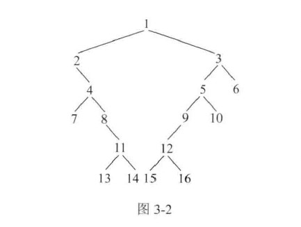

## 打印二叉树的边界节点

### 一、题目

给定一颗二叉树的头节点 head，按如下标准实现二叉树边界节点的逆时针打印

1. 头节点为边界节点
2. 叶节点为边界节点
3. 如果节点在其所在层中是最左的或最右的，那么也是边界节点



打印结果为：`1,2,4,7,11,13,14,15,16,12,10,6,3`

### 二、分析

- 得到二叉树每一层上最左和最右的节点。记录如下：


- 然后从上到下打印所有层中的最左节点。即打印：`1,2,4,7,11,13`

- 先序遍历二叉树，打印那些不属于某一层最左或最右的节点，但同时又是叶节点的节点。打印：`14,15`
- 从下到上打印所有层中的最右节点，但节点不能既是最左节点，又是最右节点。因此打印：`16,12,10,5,3`

于是得出代码如下：

```
struct Node {
    int value{0};
    struct Node* left{nullptr};
    struct Node* right{nullptr};

    explicit Node(int v) : value(v) {}
};

int get_height(Node* head, int height) {
    if (head == nullptr) {
        return height;
    }
    return std::max(get_height(head->left, height+1), get_height(head->right, height+1));
}

void set_edge_vec(Node* node, int height, std::vector<std::vector<Node*>>& edge_vec) {
    if (node == nullptr) {
        return;
    }
    edge_vec[height][0] = edge_vec[height][0] == nullptr ? node : edge_vec[height][0];
    edge_vec[height][1] = node;
    set_edge_vec(node->left, height+1, edge_vec);
    set_edge_vec(node->right, height+1, edge_vec);
}

void print_leaf_edge(Node* node, int heigth, const std::vector<std::vector<Node*>>& edge_vec) {
    if (node == nullptr) {
        return;
    }
    if (node->left == nullptr && node->right == nullptr
        && node != edge_vec[heigth][0] && node != edge_vec[heigth][1]) {
        std::cout << node->value << " ";
    }
    print_leaf_edge(node->left, heigth+1, edge_vec);
    print_leaf_edge(node->right, heigth+1, edge_vec);
}

void print_edge(Node* head) {
    if (head == nullptr) {
        return;
    }
    // 获取树的高度
    int height = get_height(head, 0);
    // 保存树上最左的节点和最右的节点
    std::vector<std::vector<Node*>> edge_vec(height, std::vector<Node*>(2, nullptr));
    set_edge_vec(head, 0, edge_vec);
    // 打印左边的所有边界节点
    for (int i = 0; i < height; i++) {
        std::cout << edge_vec[i][0]->value << " ";
    }
    // 打印叶子结点（既不是左边界、也不是右边界）
    print_leaf_edge(head, 0, edge_vec);
    // 最后打印右边界的节点
    for (int i = height-1; i >= 0; i--) {
        if (edge_vec[i][0] != edge_vec[i][1]) {
            std::cout << edge_vec[i][1]->value << " ";
        }
    }
    std::cout << std::endl;
}
```

