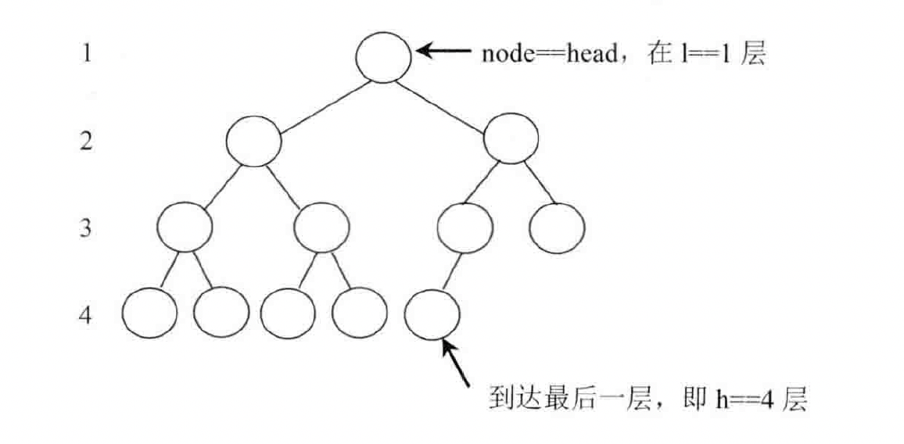
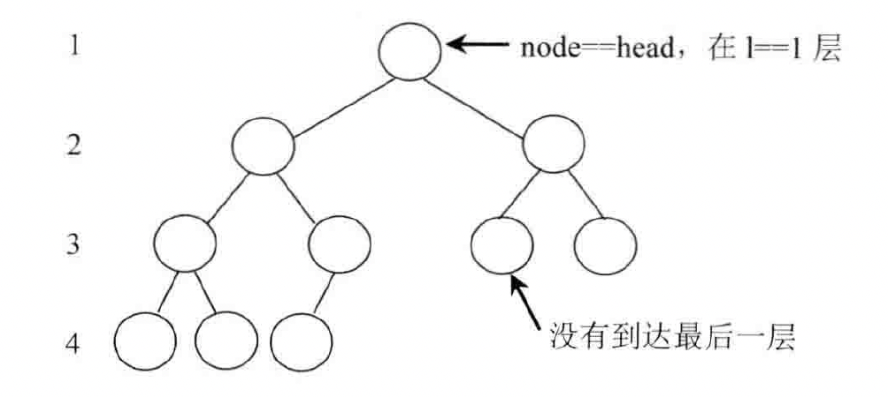

### 一、题目

给你一棵 **完全二叉树** 的根节点 `root` ，求出该树的节点个数。

Leetcode：https://leetcode.cn/problems/count-complete-tree-nodes/

遍历二叉树的过程是 `O(n)` 的时间复杂度，我们需要一个时间复杂度更低的算法

### 二、分析

完全二叉树我们来看如下两种情况：

最后一层的最后一个节点在右子树，所以 `head->left` 是一棵满二叉树



最后一层的最后一个节点在左子树，所有 `head->right` 是一颗满二叉树



完全二叉树就这两种情况。求解此题，我们先求出这颗完全二叉树的高度。然后主要的求解逻辑是一个递归过程

`bs(node, level, h)` 其中 node 表示当前节点，level 表示 node 所在的层数，h 表示整棵树的层数，是不变的；而返回值表示以 node 为头的完全二叉树的节点数是多少。

一颗满二叉树的节点数为：`pow(2, level)-1` 。其中 level 是层数。

初始时 node 的值为 head，我们在递归中，我们以当前节点为二叉树的顶点，判断以当前节点的右子树的最左节点的高度 是否等于以当前节点为二叉树的总高度。如果是，则是第一种情况，以当前节点为二叉树顶点的二叉树的左子树是满二叉树。如果不是则是如上第二种情况。

因此，如下看代码比较直观，时间复杂度做到：`O(h^2)`

每一层只会选择一个节点 node 进行 bs 的递归过程，所有调用 bs 函数的次数为 `O(h)`。每次调用 bs 函数时，都会查看 node 右子树的最左节点，所有会遍历 `O(h)` 个节点，整个过程的时间复杂度：`O(h^2)` 

```
#include <iostream>

struct Node {
    int val;
    Node* left;
    Node* right;
};

class Solution {
public:
    int get_nodes(const Node* head) {
        if (head == nullptr) {
            return 0;
        }
        return bs(head, 1, get_max_level(head, 1));
    }

private:
    int bs(const Node* head, int level, int high) {
        if (head == nullptr) {
            return 0;
        }
        if (get_max_level(head->right, level+1) == high) {
            return (1 << (high - level)) + bs(head->right, level+1, high);
        } else {
            return (1 << (high-level-1)) + bs(head->left, level+1, high);
        }
    }

    int get_max_level(const Node* head, int level) {
        while (head != nullptr) {
            head = head->left;
            level++;
        }
        return level - 1;
    }
};
```


