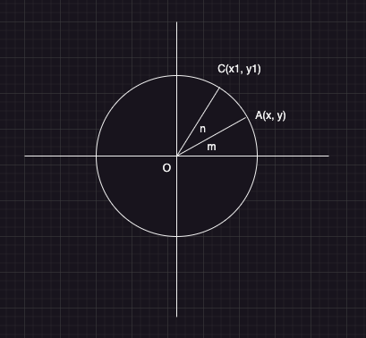
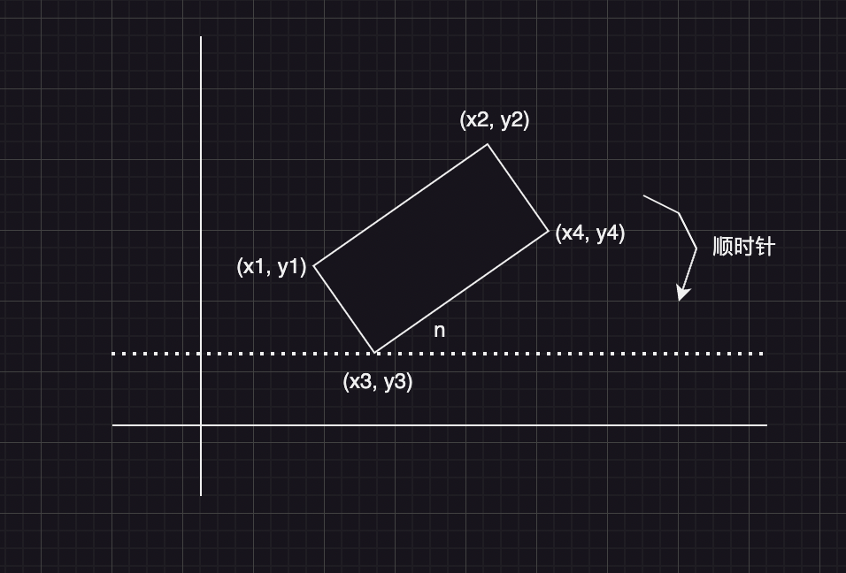

### 一、题目

在二维坐标系中，所有的值都是 double 类型，那么一个矩形可以由 4 个点来代表。 `(x1, y1)` 为最左的点，`(x2, y2)` 为最上的点，`(x3, y3)` 为最下的点，`(x4, y4)` 为最右的点。给定 4 个点代表的矩形，在给定一个点 `(x, y)` ，判断 `(x, y)` 是否在矩形中。

### 二、分析

矩形在一个二维坐标系中，如果矩形和横坐标或者纵坐标轴平行。那么好办，只需要选取对角线上的两个坐标点，然后判断这个点，是否在两个坐标点之内即可。如下：

```
bool is_inside_parallel(double x1, double y1, double x4, double y4, double x, double y) {
		if (x <= x1) {
				return false;
		}
		if (x >= x4) {
				return false;
		}
		if (y >= y1) {
				return false;
		}
		if (y <= y4) {
				return false;
		}
		return true;
}
```

如果矩形的边不平行于坐标轴呢？我们可以通过将矩形进行旋转成平行的，需要判断的点也跟着旋转。旋转完成后，按照如上的规则进行判断即可。



如上，按照逆时针，从 A 点旋转到 C 点。如上的 m、n 是角度。

OA 的距离为：`|OA| = y / sin(m) = x / cos(m)`

OC 的距离为：`|OC| = y1 / sin(m+n) = x1 / cos(m+n)`

OA 和 OC 的长度一致并且设置为 r，因此：` r = y/sin(m) = x/cos(m) = y1/sin(m+n) = x1/cos(m+n)  `

三角函数两角和差公式如下：

```
sin(m+n) = sin(m)*cos(n) + cos(m)*sin(n)
cos(m+n) = cos(m)*cos(n) - sin(m)*sin(n)
```

因此，得出如下：

```
y1 = r*sin(m+n) = r*sin(m)*cos(n) + r*cos(m)*sin(n)
x1 = r*cos(m+n) = r*cos(m)*cos(n) - r*sin(m)*sin(n)

因为 r = y/sin(m) = x/cos(m)
所以：
y1 = r*sin(m)*cos(n) + r*cos(m)*sin(n) = y*cos(n) + x*sin(n)
x1 = r*cos(m)*cos(n) - r*sin(m)*sin(n) = x*cos(n) - y*sin(n)

最终得出：逆时针情况下
y1 = y*cos(n) + x*sin(n)
x1 = x*cos(n) - y*sin(n)
```

顺时针旋转可以理解为逆时针的一个负角度，根据 sin、cos 的奇偶性，即：

```
sin(-n) = -sin(n)
cos(-n) = cos(n)
```

因此可以得出顺时针的情况下：有如下公式

```
y1 = y*cos(n) - x*sin(n)
x1 = x*cos(n) + y*sin(n)
```

有了这个公式后，我们便可以继续做题了，拿到矩形的对角线的两个点进行顺时针旋转。



比如我们选择两个点：`(x1, y1)` 和 `(x4, y4)`，进行顺时钟旋转一个角度，相当于矩形旋转成平行于坐标轴。因此，有如下代码：

```
bool is_inside(double x1, double y1, double x2, double y2,
    double x3, double y3, double x4, double y4, double x, double y) {
    // 说明已经是平行的了
    if (y1 == y2) {
            return is_inside_parallel(x1, y1, x4, y4, x, y);
    }
    double l = std::abs(y4 - y3);
    double r = std::abs(x4 - x3);
    double s = std::sqrt(l*l + r*r);
    double sin = l / s;
    double cos = r / s;
    double x1_new = x1*cos + y1*sin;
    double y1_new = y1*cos - x1*sin;
    double x4_new = x4*cos + y4*sin;
    double y4_new = y4*cos - x4*sin;
    double x_new = x*cos + y*sin;
    double y_new = y*cos - x*sin;
    return is_inside_parallel(x1_new, y1_new, x4_new, y4_new, x_new, y_new);
}
```


