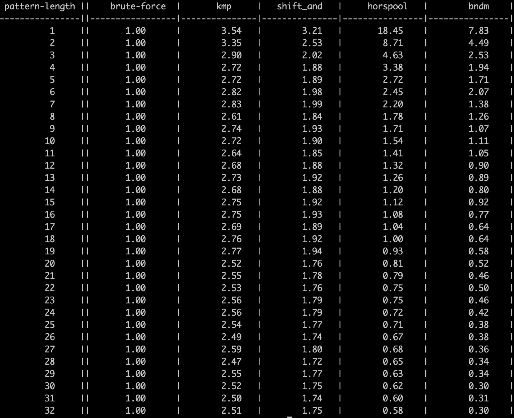

### 一、题目

给你两个字符串 haystack 和 needle ，请你在 haystack 字符串中找出 needle 字符串的第一个匹配项的下标（下标从 0 开始）。如果 needle 不是 haystack 的一部分，则返回  -1 。

```
输入：haystack = "sadbutsad", needle = "sad"
输出：0
解释："sad" 在下标 0 和 6 处匹配。
第一个匹配项的下标是 0 ，所以返回 0 。
```

Leetcode：https://leetcode.cn/problems/find-the-index-of-the-first-occurrence-in-a-string

### 二、分析

其实就是 `std::string.find()` 的功能，我们使用 KMP 算法来求解。

我们先来看一个概念，一个字符串，我们求出关于这个字符串的 next 数组。比如字符串：`sadbutsad`

next 数组的长度和字符串的长度一致，则

```
next[i] 的含义是在 str[i] 之前的字符串 str[0 .. i-1] 中
- 必须以 str[0 .. i-1] 结尾的后缀子串(不能包含 str[0])  与
- 必须以 str[0] 开头的前缀子串(不能包含 str[i-1])
的最大匹配长度是多少。
这个长度就是 next[i] 的值

比如，str="aaaab" 字符串，next[4] 的值如何求？str[4]='b'
str[4] 之前的字符串为 "aaaa"，根据定义的字符串的后缀子串和前缀子串的最大匹配为 "aaa"
也就是当后缀子串等于 str[1 .. 3]="aaa"，前缀子串等于 str[0 .. 2]="aaa" 时，这是前缀和后缀不仅相等，而且是所有前缀和后缀的可能性中最大的匹配。所以 next[4]=3
```

求 next 数组的过程的时间复杂度是 `O(M)`，M 为 match 字符串的长度。如何求 next 数组呢？首先 next 数组的前两个元素是已知的。

```
next[0] = -1;
next[1] = 0;
```


我们要求 `next[i]` 的话，我们已知了 `next[i-1]` 了，现在只需要比较 `str[j]` 和 `str[i-1]` 即可

- 如果相等，那么 `next[i] = next[i-1]+1`
- 如果不相等，并且 j 不等于 0，这时候让 `j = next[j]`，继续往前找。
- 如果不相等，并且 j 等于 0 且 `str[0] != str[i-1]`，这时相当于找不到前缀子串和后缀子串相等的情况。直接让 `next[i]=0`

如下代码表示：

```
    std::vector<int> get_next_arr(const std::string& str) {
        if (str.size() == 1) {
            return std::vector<int>{-1};
        }
        std::vector<int> vec(str.size(), 0);
        vec[0] = -1;
        vec[1] = 0;
        int i = 2;
        int cn = 0;
        while (i < vec.size()) {
            if (str[i-1] == str[cn]) {
                vec[i++] = ++cn;
            } else if (cn > 0) {
                cn = vec[cn];
            } else {
                vec[i++] = 0;
            }
        }
        return vec;
    }
```

求出 next 数组之后，我们继续，对于原始字符串和匹配字符串。变量 `index_1` 表示原始字符串的下标，变量 `index_2` 表示匹配字符串的下标。

我们进行遍历，遍历的条件是 `index_1 < str1.size() && index_2 < str2.size()` 即可。循环内有如下

-  `str1[index_1] == str2[index_2]` 那么让 `index_1` 和 `index_2` 都往后走
- 当条件一不满足时，并且 `index_2 > 0`，那么此时：`index_2 = next[index_2]`
- 当条件一不满足时，并且 `index_2 == 0`，那么此时匹配不到了，直接让 `index_1++`

这个过程的时间复杂度是 `O(N)`，所以整体的时间复杂度为 `O(N+M)`

如下代码

```
struct Solution {
public:
    int get_pos(const std::string& str1, const std::string& str2) {
        if (str1.empty() || str2.empty() || str1.size() < str2.size()) {
            return -1;
        }
        std::vector<int> next_arr = get_next_arr(str2);
        int i_1 = 0;
        int i_2 = 0;
        while (i_1 < str1.size() && i_2 < str2.size()) {
            if (str1[i_1] == str2[i_2]) {
                i_1++;
                i_2++;
            } else if (i_2 > 0) {
                i_2 = next_arr[i_2];
            } else {
                i_1++;
            }
        }
        return i_2 == str2.size() ? (i_1 - i_2) : -1;
    }

private:
    std::vector<int> get_next_arr(const std::string& str) {
        if (str.size() == 1) {
            return std::vector<int>{-1};
        }
        std::vector<int> vec(str.size(), 0);
        vec[0] = -1;
        vec[1] = 0;
        int i = 2;
        int cn = 0;
        while (i < vec.size()) {
            if (str[i-1] == str[cn]) {
                vec[i++] = ++cn;
            } else if (cn > 0) {
                cn = vec[cn];
            } else {
                vec[i++] = 0;
            }
        }
        return vec;
    }
};
```

### 三、KMP算法性能不如暴力搜索法？

先说结论

- 暴力搜索法在实际业务场景的平均复杂度是趋于 `O(n)` 的
- CPU Cache 命中率对程序性能的影响是非常大的
  - 即便时间复杂度同为 `O(n)`，KMP、shift-And 等算法性能也比暴力搜索法差很多，原因就在 CPU Cache 命中率上
  - 时间复杂度为亚线性（小于O(n)）的horspool算法在模式串较短时，其算法增益都不足以抵消CPU Cache命中率低带来的影响

C++ 标准库中对于字符串的查找如下，

```
// std::string::find()的实现，摘自 basic_string.tcc
  template<typename _CharT, typename _Traits, typename _Alloc>
    typename basic_string<_CharT, _Traits, _Alloc>::size_type
    basic_string<_CharT, _Traits, _Alloc>::
    find(const _CharT* __s, size_type __pos, size_type __n) const
    _GLIBCXX_NOEXCEPT
    {
        __glibcxx_requires_string_len(__s, __n);
        const size_type __size = this->size();

        if (__n == 0)
            return __pos <= __size ? __pos : npos;
        if (__pos >= __size)
            return npos;

        const _CharT __elem0 = __s[0];
        const _CharT* const __data = data();
        const _CharT* __first = __data + __pos;
        const _CharT* const __last = __data + __size;
        size_type __len = __size - __pos;

        while (__len >= __n)
        {
            // Find the first occurrence of __elem0:
            __first = traits_type::find(__first, __len - __n + 1, __elem0);
            if (!__first)
                return npos;
            // Compare the full strings from the first occurrence of __elem0.
            // We already know that __first[0] == __s[0] but compare them again
            // anyway because __s is probably aligned, which helps memcmp.
            if (traits_type::compare(__first, __s, __n) == 0)
                return __first - __data;
            __len = __last - ++__first;
        }
        return npos;
    }
```

可以看到，std::string::find()的实现用的就是最简单的暴力搜索法（只不过它是先用一个类memchr()的函数定位第一个字符，再用memcmp()函数整体比较，本质上其实是一样的）。这就有点奇怪了，如果KMP算法（或shift_and等其他线性算法）真这么香，为什么作为stl标准库不提供性能最优的实现呢？

答案其实很简单，因为在大多数真实业务场景里，KMP算法的性能是不如暴力搜索法的。有测试过。其中 brute-force 为暴力搜索法，其他算法均为相对 brute-force 算法的平均耗时倍率，pattern-length 表示对不同模式串长度的长度。



注意：

- 以上测试是在ASCII字符集上进行的，对于中文字符集，情况可能会有所不同。此外不同场景测试结果肯定会有差异，以上测试数据仅供参考！
- horspool和bndm算法是亚线性时间复杂度，所以某些场景表现会优于暴力搜索法，不过这些算法的空间复杂度都比较高，所以有局限性。

为什么呢？

#### 1. 暴力搜索法在真实业务场景的平均时间复杂度接近 `O(n)`

我们这样假设：

- 字母集包含 K 个字符
- 每个字符等概率随机出现

根据数学期望，暴力搜索的第二层循环每轮的平均比较长度为：

```
N(averge-compare-len) = E(compareLen) = 1 + 1/k + 2/(k^2) + 3/(k^3) + ...
```

假设 `k=50`，则 arverge-compare-len 约等于 1.03，可见这个平均比较长度是很接近1的。即便是对于不完全符合上述假设的实际业务场景，这个平均长度也大概率不会超过3。也就是说，暴力搜索在实际业务场景中的平均复杂度也是 `O(n)`

#### 2. 暴力搜索法的 CPU Cache 命中率更高

我们知道，CPU Cache line的大小通常是64字节（L1 Cache），即每次发生CPU Cache Miss，会一次性读入Cache 64个字节数据。brute-force算法对两个字符串的读操作都是从前向后顺序读的，这样的读取方式显然是可以保证最大化的CPU Cache命中率的（接近63/64）。

注意：Linux 系统可通过 `/proc/cpuinfo` 中的 `clflush size` 字段查看 `cache line` 大小