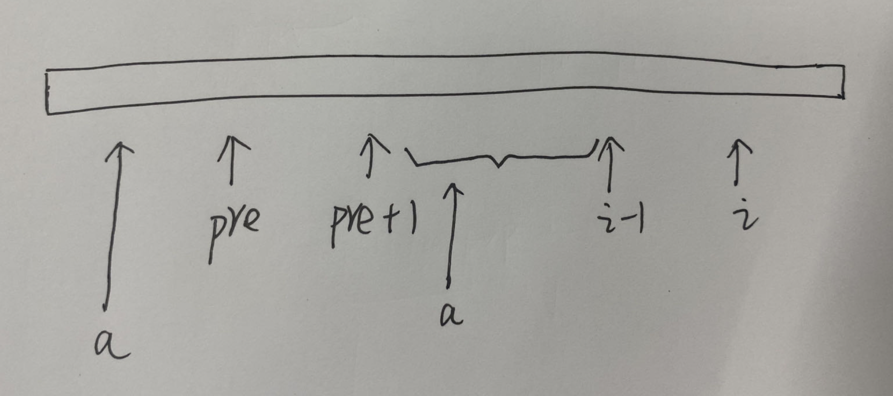

### 一、题目

给定一个字符串 `s` ，请你找出其中不含有重复字符的 **最长子串** 的长度。

leetcode：https://leetcode.cn/problems/longest-substring-without-repeating-characters/

### 二、分析

滑动窗口的思路，来一个滑动窗口，记录他的最左边和最右边。再来一个 set 记录元素是否出现过，

- 滑动窗口从向右扩一位的时候，就判断下这位数是否在 set 中，如果没在，那就将其插入到滑动窗口中，然后继续向右扩
- 如果发现这位数在 set 中，那么就说明如果要加上当前位的话，必须剔除掉在滑动窗口中的重复值。因此滑动窗口的左指针，开始想右移动排查，直到滑动窗口中没有重复值为止。
- 在滑动窗口向右移动的时候，同时记录滑动窗口的最大值即可

代码如下：

```
#include <iostream>
#include <string>
#include <unordered_set>

class Solution {
public:
    int lengthOfLongestSubstring(const std::string& s) {
        if (s.empty()) {
            return 0;
        }
        std::unordered_set<int> st;
        int end = -1;
        int n = s.size();
        int res = 0;
        for (int i = 0; i < n; ++i) {
            if (i != 0) {
                st.erase(s[i-1]);
            }
            while ((end+1 < n) && (st.find(s[end+1]) == st.end())) {
                st.insert(s[end+1]);
                end++;
            }
            res = std::max(res, end-i+1);
        }
        return res;
    }
};

int main() {
    std::string str("abcabcbb");
    Solution s;
    int len = s.lengthOfLongestSubstring(str);
    std::cout << len << std::endl;
    return 0;
}
```

还有另外一种思路，只使用一个 map 即可，我们定义这么几个变量：

- pre：表示以 `str[i-1]` 字符结尾，最长的无重复字符子串的前一位置。初始时 pre 的值为 -1。也就是说 `[pre+1, i-1]` 中是没有重复字符的
- `mp[str[i]]` 表示之前遍历中最近一次出现 `str[i]` 字符的位置

那么我们假定 `mp[str[i]]` 的值表示之前的遍历中最近一次出现 `str[i]` 字符的位置，假定在 a 位置。

- 如果 pre 位置在 a 的左边，那么以 `str[i]` 结尾的最长无重复子串是 `[a+1, i]`
- 如果 pre 位置在 a 的右边，那么以 `str[i]` 结尾的最长无重复子串是 `[pre+1, i]`

很明显，pre 在 a 的右边的时候，它的长度更长一点。

每次循环遍历 str 的时候，更新最大值即可。



代码如下：

```
class Solution {
public:
    int get_max_length_substr(const std::string& str) {
        if (str.empty()) {
            return 0;
        }
        std::unordered_map<char, int> mp;
        for (int i = 0; i < str.size(); ++i) {
            mp[str[i]] = -1;
        }
        int res = 0;
        int pre = -1;
        for (int i = 0; i < str.size(); ++i) {
            pre = std::max(pre, mp[str[i]]);
            res = std::max(res, i - pre);
            mp[str[i]] = i;
        }
        return res;
    }
};
```

