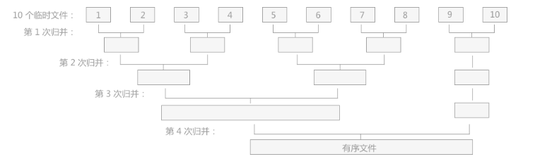
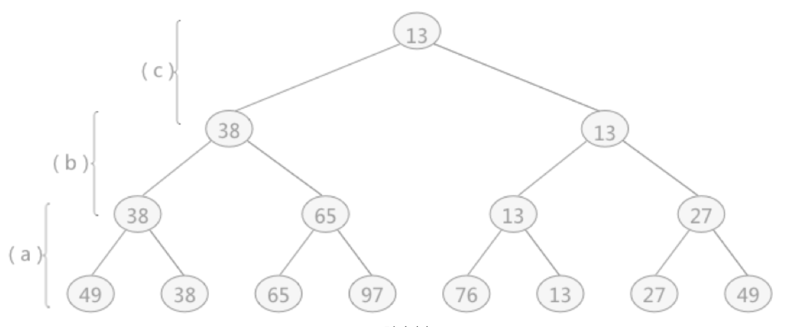
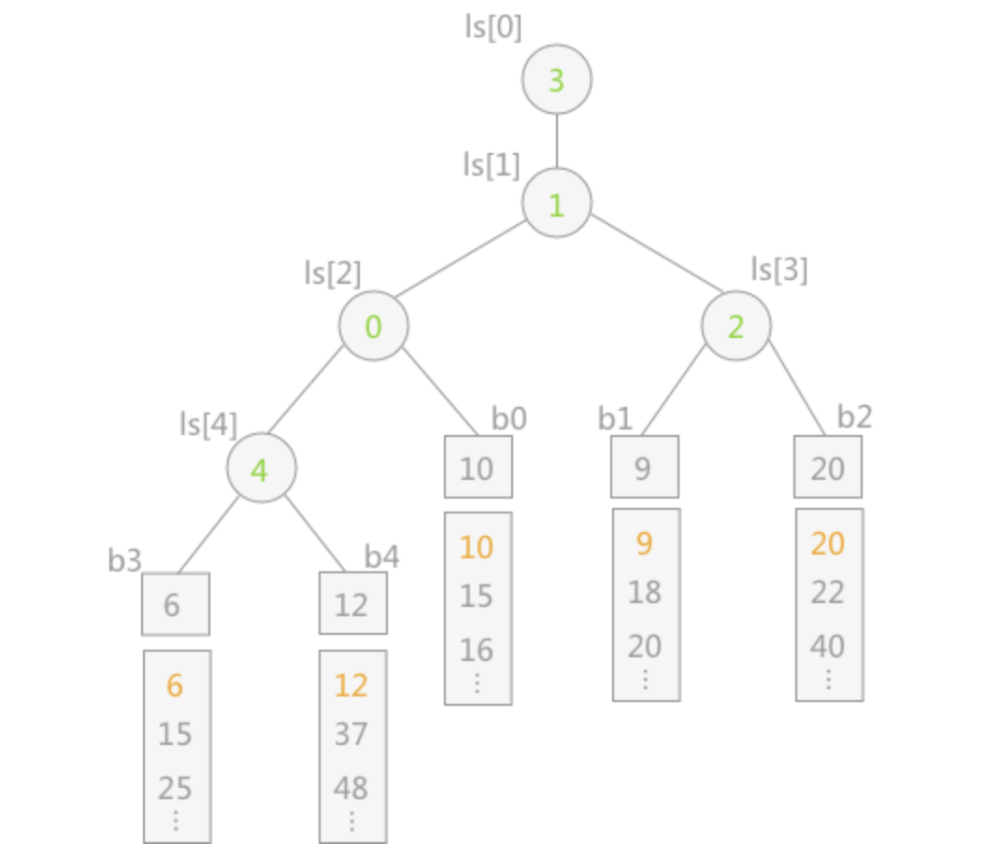

本文来介绍下外部排序

### 一、归并形式的外部排序

由两个阶段构成：

- 按照给定的内存大小，将大文件分成若干个小文件，这个小文件容量应该小于内存的可使用容量。然后将各个小文件依次读入内存，然后使用适当的内部排序算法对其进行排序，排好序之后写入对应的小文件。此时，我们就可以获得若干个排好序的小文件。
- 然后对若干个小文件进行两两归并，直到得到一个完整的有序文件。

#### 1. 两路归并

小文件两两归并的过程如下：

两两归并的过程中需要注意的是，由于内存容量的限制，不能同时将 2 个小文件全部完整的读入内存进行归并，只能不断的取两个小文件中的一小部分进行归并，比如两个小文件各取 10 个元素进行排序，需要注意的是，如果有一方用完了这 10 个元素，必须先从文件中再加载 10 个元素，然后才能进行排序。

然后将两个小文件归并成一个稍大文件之后，依次在将两个稍大文件，归并成一个更大的文件。直到得到一个完整的有序文件。

对于外部排序算法来说，影响整体排序效率的因素主要取决于读写外存的次数，即访问外存的次数越多，算法花费的时间就越多，效率就越低。

#### 2. 多路归并

对于同一个文件来说，对其进行外部排序时访问外存的次数同归并的次数成正比，即归并操作的次数越多，访问外存的次数就越多。因此我们不仅可以两路归并，也可以 3 路归并，甚至 K 路归并。

对于 K 路归并，增加 K 值可以减少归并的次数，从而减少外存读写的次数，最终达到提高算法效率的目的。除此之外，一般情况下，对于 m 个小文件进行 K 路归并时，归并的次数一般为：`log` 以 K 为底，m 的对数。

因此，想要达到减少归并次数从而提高算法效率的目的，可以：

- 增加 K 路归并中的 K 值
- 在内存满足的情况下，尽量减少小文件的数量 m，也就是增加每个小文件的容量

那么，增加 K 值的做法引申出一种外部排序算法：多路平衡归并算法；增加每个小文件的容量引申出另一种外部排序算法：置换-选择排序算法。

### 二、多路平衡归并算法

多路平衡归并算法，也即 K 路归并，增加 K 值可以减少归并的次数，从而减少外存读写的次数。但是 K 值越大，内部归并的时间也越大。比如：

对于 10 个临时文件，当采用 2 路归并时，若每次从 2 个文件中得到一个最小值时只需比较一次；而采用 5 路平衡归并时，若每次从 5 个文件中想要得到一个最小值需要比较 4 次。以上仅仅是得到一个最小值记录，如果要得到一整个排好序的临时文件，其耗费的时间就会相差很大。

因此，为了避免在增加 K 值的过程中影响内部归并的效率，在进行 K 路归并时可以使用 “败者树” 来实现，该方法在增加 K 值时不会影响其内部归并的效率。

#### 1. 胜者树与败者树

胜者树：树中每个非终端节点（除叶子结点之外的其他节点）存储的是胜利的一方。

比如，节点 49 和节点 38，相比较之后，较小的一方是 38，属于胜者，所以他们的父节点存储的即是胜利的一方节点元素，即为 38 节点。然后每个节点（除终端节点之外）都符合这种性质。

那么败者树刚好相反，非终端节点存储的是，两个孩子节点相比较之后，失败的一方。

#### 2. 败者树如何应用多路归并排序

如上图所示，是一个 5 路归并，`b0 b1 b2 b3 b4` 分别代表 5 个归并段（小文件）。我们现在需要归并这 5 个已经排好序的小文件。比如 b3 归并段和 b4 归并段中的数字 6 和 数字 12 进行比较，6 比较小，胜出，因此在 `ls[4]` 处填充 3，表示 b3 这个归并段。然后在拿 b3 归并段的元素 6 和 b0 归并段的元素 10 进行比较，元素 6 依然比较小，胜出，因此 `ls[2]` 填充 3，代表 b3 这个归并段。最终，我们在 `ls[0]` 中填充 3，代表归并段 b3。（图中的节点数字填充可能有误）

经过这个过程，于是我们可以选择出来一个最小值（多个归并段中）。同理，我们也可以通过类似这个方法选择出一个最大值。这种方法也被称为胜者树/败者树的原理来实现多路归并排序，以达到多个小文件（归并段）排序的目的。

其实这个思路和堆的思路差不多，只不过节点存储的元素不一样。胜/败者树存储的是那个归并段（小文件），这样子就可以快速从多个归并段（小文件）中选择出一个归并段，并且这个归并段中存储当前的最小值。

最后，使用败者树来实现 K 路归并，可以提高外部排序的整体效率。但是 K 值的选择也不是越大越好，而是要综合考虑选择一个 K 值。

### 三、置换选择算法

这种做法的原理是减少归并段（小文件）的个数，也即让每个归并段的元素尽可能多。但是内存大小是固定的，所以我们需要一定的算法来操作归并段使其元素数量增多。以下举例子来说明。

假如我们初识的大文件有 24 个元素，我们的内存可以容纳 6 个元素。按照之前的内存排序方法需要分为 4 个归并段，但使用置换-选择算法我们将其分为 3 个或者更少的归并段。操作过程如下：

- 首先从初识大文件中拿出 6 个元素进到内存中
- 然后从内存中拿出最小的元素记为 cur_min
- 然后将 cur_min 写到一个新文件 new_file 中
- 那么，此时内存中还剩下 5 个元素。如果初识大文件中还有元素，那就再拿出来一个元素放入内存中
- 再从内存中找到一个最小值，并且此最小值要比 cur_min 大，找到之后这个值写入 new_file 文件中，然后将这个值更新为 cur_min
- 重复以上 3-5 过程，直到内存中选不出 cur_min 为止，我们就得到了排好序的归并段
- 重复以上的 2-6 过程，直到内存中为空，我们就得到了全部的已经排好序的归并段

我们举一个详细的例子来说明以下。

- 假设我们首先拿出 6 个元素到内存中。分别为 `51,49,39,46,38,29`。
- 此时，内存中最小值为 29，将 29 写入到一个文件 new_file 中，并且将 cur_min 记为 29
- 然后从初识大文件中拿出一个元素 14 写入到内存中。此时内存中元素为：`51,49,39,46,38,14`
- 拿出一个当前内存中的最小值，并且此最小值比 `cur_min=29` 大，所以这个元素为 38。将其写入文件 new_file 中，并且记录 cur_min 为 38
- 继续从初识大文件中拿出一个元素 12 写入到内存中。此时内存中元素为：`51,49,39,46,14,12`
- 继续拿出一个当前内存中的最小值，并且此最小值比 `cur_min=38` 大，所以这个元素为 39。将其写入文件 new_file 中，并且记录 cur_min 为 39
- 假设初始大文件中现在没有元素了，但我们继续从内存中拿出最小值，并且比 `cur_min=39` 大，所以这个元素为 46。将其写入文件 new_file 中，并且记录 cur_min 为 46
- 依次进行如上的过程，最终 new_file 文件中会记录的元素：`29,38,39,46,49,51`。而内存中剩下两个元素：`14,12`
- 对于内存中的元素，我们继续如上的过程，可以形成一个新的排好序的文件

对于上述过程，从内存中选择出 cur_min 的这个步骤，我们可以使用败者树或者堆来来做。其实 “胜者树/败者树” 的思路和 “堆” 基本一致。

TODO：http://data.biancheng.net/view/78.html

拿到所有已经排好序的归并段之后，我们在对这些已经排好序的归并段继续进行归并。最后可以获得完整的排好序的文件。

通过置换选择排序算法得到的初始归并段，其长度并不会受内存容量的限制，且通过证明得知使用该方法所获得的归并段的平均长度为内存工作区大小的两倍。若不计输入输出的时间，通过置换选择排序生成初始归并段的所需时间为`O(nlogw)`（其中 n 为记录数，w 为内存工作区的大小）。

### 四、最佳归并树

http://data.biancheng.net/view/79.html

