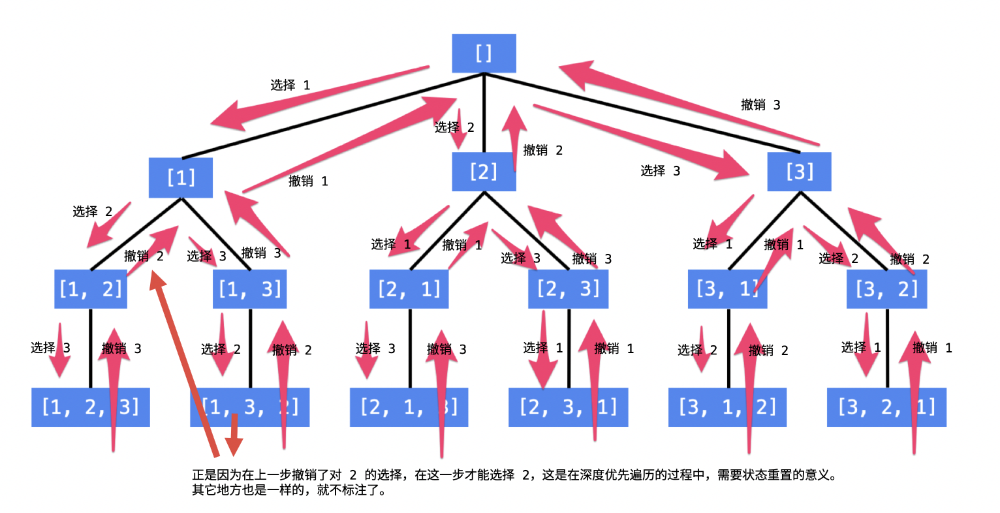

### 一、题目

给定一个不含重复数字的数组 `nums` ，返回其所有可能的全排列 。你可以 **按任意顺序** 返回答案。

```
输入：nums = [1,2,3]
输出：[[1,2,3],[1,3,2],[2,1,3],[2,3,1],[3,1,2],[3,2,1]]
```

Leetcode：https://leetcode.cn/problems/permutations/

### 二、分析

回溯法 采用试错的思想，它尝试分步的去解决一个问题。在分步解决问题的过程中，当它通过尝试发现现有的分步答案不能得到有效的正确的解答的时候，它将取消上一步甚至是上几步的计算，再通过其它的可能的分步解答再次尝试寻找问题的答案。回溯法通常用最简单的递归方法来实现，在反复重复上述的步骤后可能出现两种情况：

- 找到一个可能存在的正确的答案；
- 在尝试了所有可能的分步方法后宣告该问题没有答案。

以数组 [1, 2, 3] 的全排列为例。

- 先写以  1 开头的全排列，它们是：[1, 2, 3], [1, 3, 2]，即 1 + [2, 3] 的全排列（注意：递归结构体现在这里）
- 再写以 2 开头的全排列，它们是：[2, 1, 3], [2, 3, 1]，即 2 + [1, 3] 的全排列
- 最后写以 3 开头的全排列，它们是：[3, 1, 2], [3, 2, 1]，即 3 + [1, 2] 的全排列

总结搜索的方法：按顺序枚举每一位可能出现的情况，已经选择的数字在 当前 要选择的数字中不能出现。按照这种策略搜索就能够做到 不重不漏。这样的思路，可以用一个树形结构表示



```
class Solution {
public:
    vector<vector<int>> permute(vector<int>& nums) {
        std::vector<std::vector<int>> res;
        if (nums.empty()) {
            return res;
        }
        recursion(res, nums, 0, nums.size()-1);
        return res;
    }

private:
    void recursion(std::vector<std::vector<int>>& res, std::vector<int>& nums, int left, int right) {
        if (left == right) {
            res.push_back(nums);
        }
        for (int i = left; i <= right; i++) {
            std::swap(nums[i], nums[left]);
            recursion(res, nums, left+1, right);
            std::swap(nums[i], nums[left]);
        }
    }
};
```


