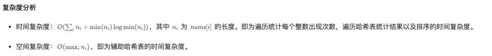
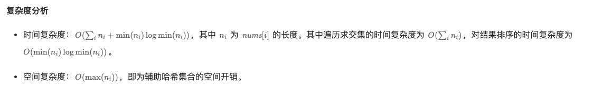

### 一、给多个无序数组，求这些数组中元素的交集。

因为数组无序，所以我们必须要遍历所有数组所有元素。

#### 1. 统计每个整数的出现次数

我们用 N 表示二维数组 nums 的长度。如果一个元素在每个数组中都出现过，则他出现的次数一定等于 N。因此我们用哈希表维护每个整数的出现次数，随后我们遍历二维数组所有元素，并更新到这个哈希表。

最终，我们遍历哈希表，其中出现次数等于 N 的元素即为交集。

**这种方法，在最坏情况下，二维数组中所有元素都没有交集的情况下。哈希表非常大，会存储所有元素。而且数组中不能出现重复元素，如果有重复元素，使用出现次数就不准确。**

```C++
class Solution {
public:
    vector<int> intersection(const vector<vector<int>>& nums) {
        int n = nums.size();
        unordered_map<int, int> freq;
        for (const auto& arr: nums) {
            for (int num: arr) {
                ++freq[num];
            }
        }
        vector<int> res;
        for (const auto& [k, v]: freq) {
            if (v == n) {
                res.push_back(k);
            }
        }
        return res;
    }
};
```



#### 2. 模拟方式

二维数组相当于有 N 个一维数组，先使用一个哈希表 res 存储第一个数组 `nums[0]` 的所有元素。然后循环遍历其余的数组。当遍历第 i 个数组时，我们用一个哈希表 tmp 来存储 res 和 `nums[i]` 中元素的交集，也就是说我们通过遍历 `nums[i]` 判断每个元素是否在 res 中，最后，我们让 `res = tmp`。这样就可以得到前 i+1 个数组的交集。

```c++
class Solution {
public:
    vector<int> intersection(vector<vector<int>>& nums) {
        int n = nums.size();
        unordered_set<int> res(nums[0].begin(), nums[0].end());
        for (int i = 1; i < n; ++i) {
            unordered_set<int> tmp;
            for (int num: nums[i]) {
                if (res.count(num)) {
                    tmp.insert(num);
                }
            }
            res = tmp;
        }
        vector<int> ans(res.begin(), res.end());
        sort(ans.begin(), ans.end());
        return ans;
    }
};
```



### 二、多个有序数组求交集

有多个有序数组。求这些数组中的交集。我们列出多种方法。

#### 1. 二分查找+多路归并

先使用第一个数组作为基准，也就是说，用第一个数组中的元素作为基准。拿到第一个数组的长度为 N，然后外层循环是从 0 到 N，也就是遍历第一个数组中的元素。假设一共有 M 个数组，内层循环是遍历剩下的所有数组，也就是从 1 到 M，第一个数组不用再遍历。

我们再来一个数组，保存每个数组的索引位置，我们称为索引数组。

然后我们每次以第一个数组中元素作为目标值，通过二分法在其他数组中查找是否有这个元素。如果可以找到，将这个数组的当前索引保存起来，下次直接从这个位置起查找。如果没有找到，直接跳出这个内层循环，因为那个目标值（第一个数组的元素）肯定不是交集。

还有一点优化是，在内层循环中，如果索引数组保存的某个数组的索引值已经大于这个数组的长度，则函数直接返回退出，因为此时肯定不会再存在交集了。

每次循环过程中，使用一个标志 flag，作为是否找到交集的信号，如果找到则直接打印或者保存交集元素。

```c++
int binary_search(int val, const std::vector<int>& vec, int idx) {
    int left = idx, right = vec.size()-1;
    for (; left <= right;) {
        int mid = left + (right-left)/2;
        if (vec[mid] == val) {
            return mid;
        } else if (vec[mid] < val) {
            left = mid + 1;
        } else {
            right = mid - 1;
        }
    }
    return -1;
}

std::vector<int> get_value(const std::vector<std::vector<int>>& arrs) {
    int n = arrs[0].size();
    std::vector<int> vec(arrs[0]);
    std::vector<int> index_arr(n, 0);
    std::vector<int> res;
    bool flag = false;
    for (int i = 0; i < n; i++) {
        flag = true;
        for (int j = 1; j < arrs.size(); j++) {
            if (index_arr[j] > arrs[j].size()) {
                return res;
            }
            int loc = binary_search(vec[i], arrs[j], index_arr[j]);
            if (loc != -1) {
                index_arr[j] = loc;
            } else {
                flag = false;
                break;
            }
        }
        if (flag) {
            res.emplace_back(vec[i]);
        }
    }
    return res;
}
```

最坏的情况下，多个元素全部相同的数组，假设有 N 个数组，最短的数组为 M， 时间复杂度：`O(N*M*Log(M))`

这种方式很好的采用了多路归并+二分的思想，用一个数组保存遍历过程中每个数组的索引位置，这样在每次查找时，就可以直接从索引位置往下找，之前的元素不用再重复查找。这样对于数据量比较庞大的输入有很好的优化效果。

还有一种分治的思路：https://www.cnblogs.com/hitxiaoyin/articles/divideSearch.html