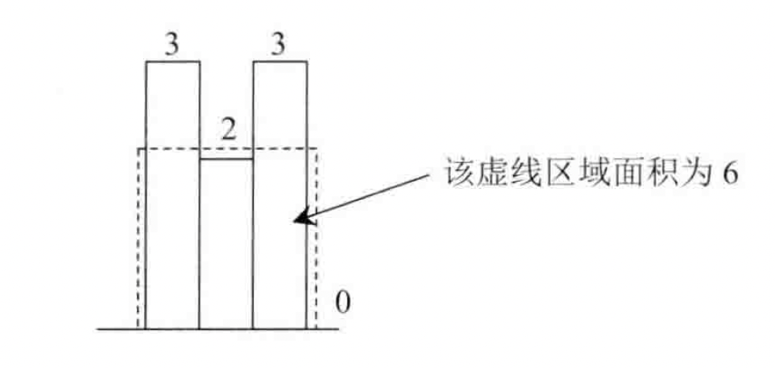

## 最大子矩阵的大小

### 一、题目

给定一个由 0 和 1 组成的矩阵 matrix ，找出只包含 1 的最大矩形，并返回其面积。

注意：此题 matrix 输入格式为一维 0/1 字符串数组。

leetcode：https://leetcode.cn/problems/PLYXKQ/

### 二、思路

要求出最大的子矩阵，我们先做一个假设，如果想要组成一行 N 列的矩阵，我们可以先求出二维数组中每一列的矩阵大小。然后我们再将这些列数据组合起来。如下图

假设有一个二维数组：

```
1 0 1 1
1 1 1 1
1 1 1 0
```

以每一行做切割，统计当前行作为低的情况下，每个位置往上的 1 的数量。

- 第一行，height = {1, 0, 1, 1}
- 第二行，height = {2, 1, 2, 2}
- 第三行，height = {3, 2, 3, 0}

注意，当遍历某行、某列时出现为 0 的数据时，那么当前的 height 的位置应为 0；否则自增。也就是说，我们求得了一个直方图。



那么这个直方图很清晰了。接下来，我们只需要求每一根柱子向左和向右扩展后矩阵面积即可。

那么如何求以每一根柱子为基础，向两边扩展的矩阵面积呢？使用栈来做

遍历这个直方图，也就是一维数组 arr。如果栈为空，就直接插入。栈中存储一维数组的下标。假设现在遍历到 arr[i] 位置。

- 如果 arr[i] 数值大于栈顶元素，直接将数组下标压入栈中。也就是说栈中存储的元素从底到顶为递增的，并且没有不重复的。为什么这么做呢？因为对于大于栈顶元素的 arr[i]，给栈中的每个元素，也就是给每个柱子，提供了可能更大矩阵的可能，栈中元素（柱子）较小，来一根长柱子，肯定可以增大那根短柱子所组成的矩阵的面积。

- 如果 arr[i] 数值小于等于栈顶元素，那么应该从栈中弹出元素，直到栈顶元素小于 arr[i] 为止。在弹出元素的过程中，我们就可以求弹出元素（也就是柱子）所代表的矩阵面积了。因为这根柱子的左边已经确定了，栈中元素没有重复的；这根柱子的右边也确定了，来了一个比栈顶元素小的 arr[i]，从 i 位置向右就不可能了。所以此时是可以求出这根柱子的最大矩阵面积了。具体如何求呢？我们把弹出元素（柱子）的位置记为 j。把新的栈顶元素（柱子）的位置记为 k。

  - 如果 arr[j] > arr[i]，向右肯定是可以到达 i-1 的位置。因为栈中从底到顶存储的依次是递增元素。
  - 如果 arr[j] == arr[i]，那么 i-1 位置不一定就是向右的最远的位置。因为最少 i 位置也应该算入。但是此时我们发现，i 位置 和 j 位置所代表的柱子围成的矩阵是同一个的。而且 i 位置也要插入栈中，也就进行计算。所以当前先不用管，哪怕算出来的结果是错误的，等待 i 位置重新计算即可
  - 如果 arr[j] < arr[i]，停止弹出，插入 arr[i]
  - 那么对于这根 j 位置的柱子，最左可以到达 k+1 的位置，因为栈中没有重复元素，而且从栈低到栈顶是递增的，而且 k 和 j 位置是相邻的。那么向右呢？可以到达 i-1 位置。

  因此，弹出元素 j 代表的柱子，向左到达 k+1 位置，向右到达 i-1 位置。
  那么围成的矩阵面积宽度为 `((i-1) - (k+1))+1 = i-k-1 `；高度为 arr[j]。于是我们通过保存比较每个柱子的所代表的矩阵的面积的最大值即可。

  在遍历结束后，不要忘了栈中如果还有元素，我们还需要继续按照如上逻辑讲栈中所有元素出栈。

### 三、code

```c++
#include <iostream>
#include <vector>
#include <string>
#include <stack>
#include <algorithm>

using namespace std;

void print_vec(const std::vector<int>& vec) {
    std::for_each(vec.begin(), vec.end(), [](int x) {
        std::cout << x << " ";
    });
    std::cout << std::endl;
}

class Solution {
public:
    int maximalRectangle(vector<string>& matrix) {
        if (matrix.empty()) {
            return 0;
        }
        int max_res = 0;
        std::vector<int> height_arr(matrix.back().size(), 0);
        for (const auto& row : matrix) {
            for (size_t i = 0; i < row.size(); ++i) {
                height_arr[i] = row[i] == '0' ? 0 : ++height_arr[i];
            }
            max_res = std::max(max_res, get_max_matrix_area(height_arr));
        }
        return max_res;
    }

private:
    int get_max_matrix_area(std::vector<int>& height_arr) {
        std::stack<int> st;
        int j = 0, k = 0;
        int max_res = 0;
        for (size_t i = 0; i < height_arr.size(); ++i) {
            if (st.empty()) {
                st.push(i);
            } else {
                j = st.top();
                if (height_arr[i] > height_arr[j]) {
                    st.push(i);
                } else {
                    while (!st.empty() && height_arr[i] <= height_arr[st.top()]) {
                        j = st.top();
                        st.pop();
                        k = st.empty() ? -1 : st.top();
                        max_res = std::max(max_res, static_cast<int>(((i-k-1) * height_arr[j])));
                    }
                    st.push(i);
                }
            }
        }
        while (!st.empty()) {
            j = st.top();
            st.pop();
            k = st.empty() ? -1 : st.top();
            max_res = std::max(max_res, static_cast<int>((height_arr.size()-k-1) * height_arr[j]));
        }
        return max_res;
    }
};

int main() {
    // std::vector<std::string> matrix = {"10100", "10111", "11111", "10010"};
    // std::vector<std::string> matrix = {"1011", "1111", "1110"};
    std::vector<std::string> matrix;
    Solution s;
    auto res = s.maximalRectangle(matrix);
    std::cout << res << std::endl;
    return 0;
}
```

时间复杂度：O(N*M)