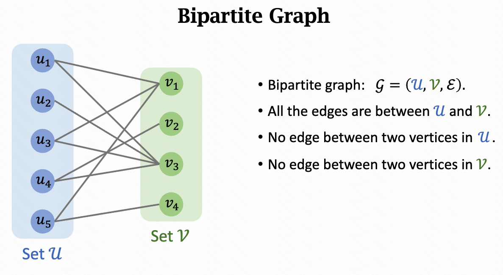

二部图的定义如下：

- 其中集合U表示蓝色节点集合，集合V表示绿色节点集合，E表示所有边集合
- 集合U中节点之间没有边。集合V中节点之间没有边



二部图的判定方法，算法思路：

```
1. Select a vertex, assign red color to it, and put it in the queue.
2. While the queue is not empty:
    a. 𝑣 ← dequeue( );
    b. 𝑐 ← the opposite color of 𝑣; // 假设v是红色，则c为蓝色
    c. For each 𝑢 ∈ Neighbor 𝑣 :
        i. If 𝑢 has been colored, check whether there is a violation; // u和v的颜色需要不同
        ii. Otherwise, assign color 𝑐 to 𝑢, and put 𝑢 in the queue;
		d. If color violation is found, return FALSE (not bipartite).
3. When the queue is empty, check if all the vertices have been colored.
		a. If yes, end the program and return TRUE.
		b. If no, delete the colored vertices, and apply the algorithm to the remaining subgraph.
```

实际上，就是 BFS+染色的思路。代码实现如下：

```c++
#include <iostream>
#include <vector>
#include <queue>
#include <string>

using namespace std;

// 颜色定义：-1 = 未染色, 0 = 红, 1 = 蓝
static const int UNCOLORED = -1;
static const int RED = 0;
static const int BLUE = 1;

// 对某个起点 start 执行 BFS 染色；若发现冲突则返回 false
bool bfsColoring(int start, const vector<vector<int>> &adj, vector<int> &color)
{
    queue<int> q;

    // 1) 选择一个顶点，染成红色并入队
    color[start] = RED;
    q.push(start);

    // 2) BFS
    while (!q.empty())
    {
        int v = q.front();
        q.pop();

        int c = (color[v] == RED) ? BLUE : RED; // v 的反色

        // 遍历 v 的邻居 u
        for (int u : adj[v])
        {
            if (color[u] != UNCOLORED)
            {
                // i) u 已染色：检查是否违反（u 和 v 颜色必须不同）
                if (color[u] == color[v])
                {
                    return false; // 冲突：不是二部图
                }
            }
            else
            {
                // ii) u 未染色：给 u 染上反色并入队
                color[u] = c;
                q.push(u);
            }
        }
    }
    return true;
}

// 判断整张图是否为二部图（处理非连通图：对每个未染色点重复 BFS）
bool isBipartite(int n, const vector<vector<int>> &adj)
{
    vector<int> color(n, UNCOLORED);

    // 3) 如果还有未染色顶点，则对剩余子图继续（等价于“删除已染色顶点再做”）
    for (int i = 0; i < n; i++)
    {
        if (color[i] == UNCOLORED)
        {
            if (!bfsColoring(i, adj, color))
            {
                return false;
            }
        }
    }
    return true;
}

// 无向图加边
void addUndirectedEdge(vector<vector<int>> &adj, int u, int v)
{
    adj[u].push_back(v);
    adj[v].push_back(u);
}

void runExample(const string &title, int n, const vector<pair<int, int>> &edges)
{
    vector<vector<int>> adj(n);
    for (auto [u, v] : edges)
    {
        addUndirectedEdge(adj, u, v);
    }

    cout << "=== " << title << " ===\n";
    cout << "n = " << n << ", edges = " << edges.size() << "\n";
    cout << (isBipartite(n, adj) ? "Result: TRUE (bipartite)\n" : "Result: FALSE (not bipartite)\n");
    cout << "\n";
}

int main()
{
    // 示例 1：二部图
    // 0-1, 0-3, 2-1, 2-3 这是一个 K2,2 的结构（标准二部图）
    runExample(
        "Example 1: Bipartite graph (K2,2)",
        4,
        {{0, 1},
         {0, 3},
         {2, 1},
         {2, 3}});

    // 示例 2：非二部图（包含奇环：三角形 0-1-2-0）
    runExample(
        "Example 2: Not bipartite (triangle cycle of length 3)",
        3,
        {{0, 1},
         {1, 2},
         {2, 0}});

    // 示例 3：非连通图（包含两个连通分量）
    // 分量 A：0-1-2-3 是链（可二部）
    // 分量 B：4-5-6-4 是三角形（不可二部）
    runExample(
        "Example 3: Disconnected graph (one bipartite component + one triangle component)",
        7,
        {{0, 1},
         {1, 2},
         {2, 3},
         {4, 5},
         {5, 6},
         {6, 4}});

    return 0;
}
```


