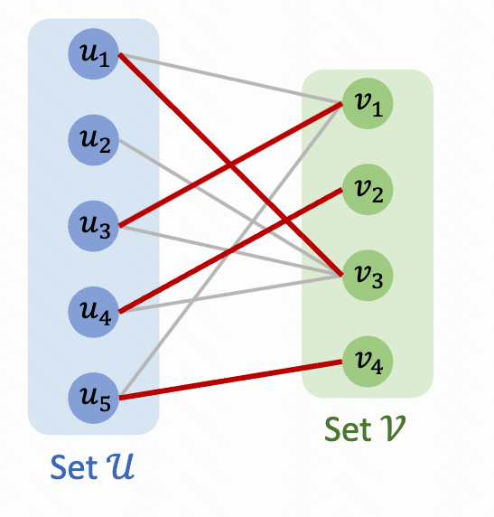
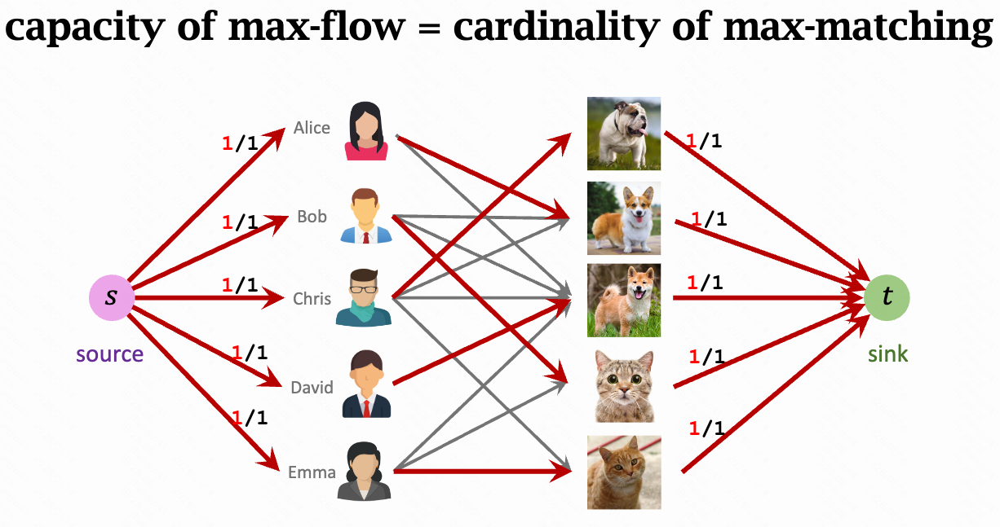
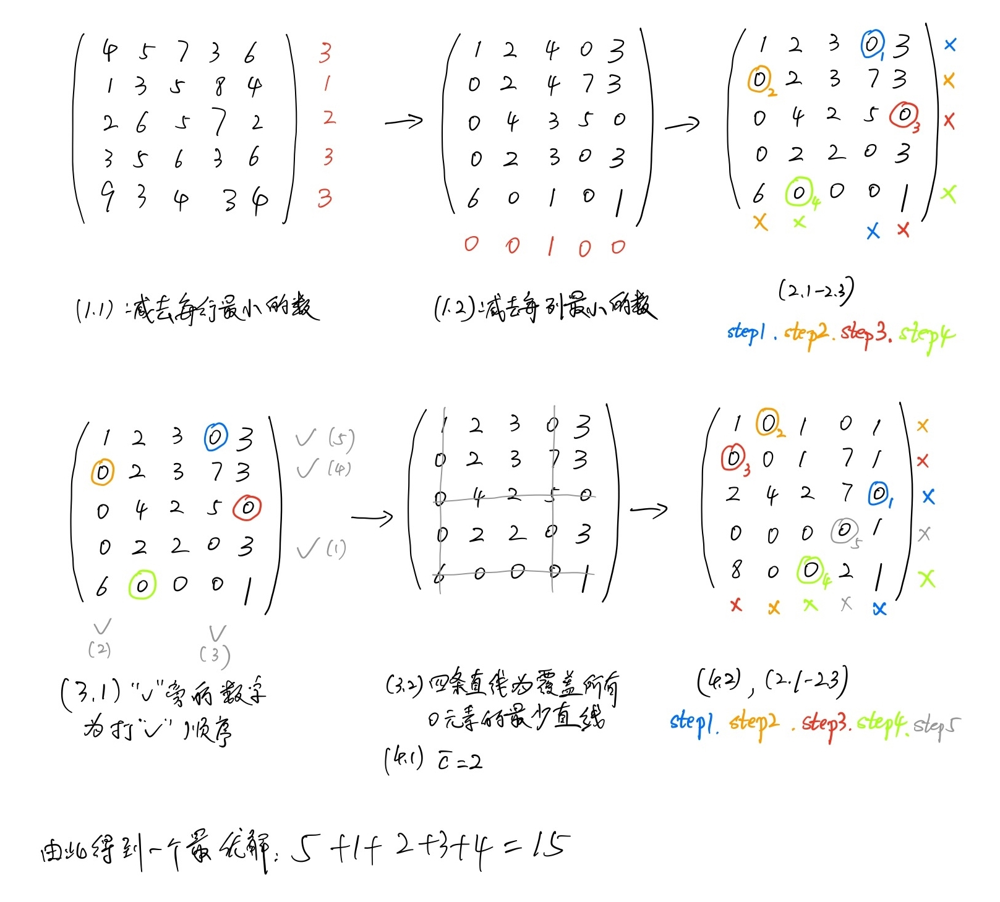

### 一、无权图的最大匹配问题

Maximum-Cardinality Bipartite Matching (MCBM)

给定一个二部图 G=(L ∪ R, E)，在所有边的子集 M⊆E  中，选出一组两两不共享端点的边（即每个顶点最多参与一次配对），并使得所选边数 ∣M∣  最大；该 M 称为最大匹配，∣M∣ 为最大匹配数。



可以使用求解最大流的思路去求解。

- 建立 source、sink 节点，并分别和两个集合的节点连接，边的容量为 1。
- 使用求解最大流的方法即可保证两个集合中各自节点之间只有一条边。



### 二、有权图的最大匹配问题（匈牙利算法）

有权图的边上增加了权重。定义：给定二部图 G=(L∪R, E) ，每条边 e∈E 具有权重 w(e)，在所有匹配集合 M⊆E （任意两条边不共享端点）中，选择使得总权重最大的匹配。

其实，最大匹配问题和最小匹配问题是一样的逻辑。直接把边的权重取反即可，比如边的权重为3，则改为-3。

**匈牙利算法**，别名KM算法（Kuhn–Munkres algorithm）可以求解最小匹配问题，需要两个集合的节点数相同。
时间复杂度可以优化到O(n^3)

算法思路：

```
我们发现这类分配问题可以用一个矩阵表示(称为效益矩阵), 记为 C. 算法如下:

1. 效益矩阵初始化
	(1.1) 将矩阵 C 每行减去该行的最小元素, 得新矩阵 C';
	(1.2) 将矩阵 C' 每列减去该列的最小元素, 得新矩阵 C'', 以下操作对 C'' 进行;
2. 对当前效益矩阵求可行解。
	这一阶段要做的是：在所有的 0 里，挑出尽可能多的“互不冲突的 0”（不同行、不同列），相当于构造匹配。
  (2.1) 从含零最少的行(或列)开始, 圈出矩阵中的一个 “0”, 并划去其所在的行和列;
  (2.2) 重复步骤 (2.1) 直至矩阵中所有的 “0” 均被划去或圈出为止;
  (2.3) 若已圈出 n 个 “0”, 它们即对应一最优解, 如不然转步骤 3.
3. 求覆盖当前效益矩阵中所有 “0” 的最少条数直线。
	这一阶段本质在求：用最少的行线+列线把矩阵里所有0覆盖掉。他的意义比较关键：
	- 如果最少直线数 = n，就意味着存在完美匹配（可匹配满）
	- 如果最少直线数 < n, 说明“0的结构还不够”，需要调整才能产生更多0
	(3.1) 对没有圈出 “0” 的行打 √, 对打 √ 行上所有 “0” 所在的列打 √, 再对打 √ 的列上所有有 “0” 被圈出的行打 √, 直至打不出 
 为止;
	(3.2) 将没有打 √ 的行和打 √ 的列划上直线, 这些直线即为所求.
4. 调整效益矩阵
	(4.1) 找出没有被直线覆盖的所有元素中最小的数 c;
	(4.2) 将打 √ 的行上每个元素减去 c, 打 √ 的列上每个元素加上 c, 得到新的效益矩阵. 返回步骤 2.

```

如下是一个 n=5 的例子




