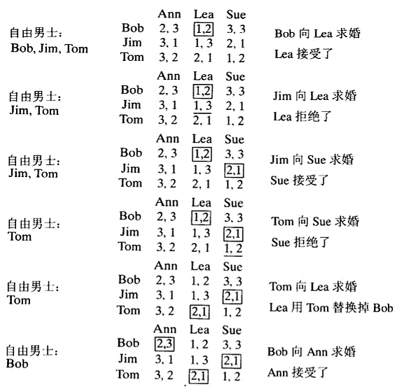

稳定婚姻问题要求基于给定的匹配优先级，求出两个n元素集合的元素之间的“稳定匹配”。该问题可以用**稳定婚姻算法**求解，而且总有解。是二部图匹配问题的一个实现思路。

### 一、算法思想

核心是：让一侧“主动求婚”，另一侧“暂时保留最好选择”

- 主动方不断向自己偏好列表中 “还没有拒绝过自己的人” 发出提议
- 被动方可以暂时接受一个当前求婚者，但如果之后来了更喜欢的求婚者，就换人。把原来的暂存者拒绝掉
- 被拒绝的人继续向下一个偏好对象求婚
- 直到没有人需要继续求婚

这种“暂存 + 替换”保证过程单调推进（每个人不会回头提议同一个人），最终终止并得到稳定匹配。

### 二、举例

输入：有一个n个男士的集合和一个n个女士的集合，以及每个男士选择女士的优先级和每个女士选择男士的优先级。
输出：一个稳定的婚姻匹配。
**第0步**：一开始所有的男士和女士都是自由的。
**第1步**：如果有自由男士，从中任选一个然后执行以下步骤：

- **求婚**：选中的自由男士m向w求婚，w是他优先列表上的下一个女士(即优先级最高而且之前没有拒绝过他)。
- **回应**：如果w是自由的，她接受求婚和m配对。如果她不是自由的，她把m和她当前的配偶作比较。如果她更喜欢m，她接受m的求婚，她的前配偶就变成自由人。否则，她拒绝m的求婚，m还是自由的。

**第2步**：返回n个匹配对的集合。

### 三、缺陷

- 稳定婚姻算法更容易满足 “求婚者” 的偏好
- 稳定婚姻算法保证“稳定”，但不保证“整体最优”或“公平”。如果目标是“最大幸福”，则使用匈牙利算法计算加权匹配。

