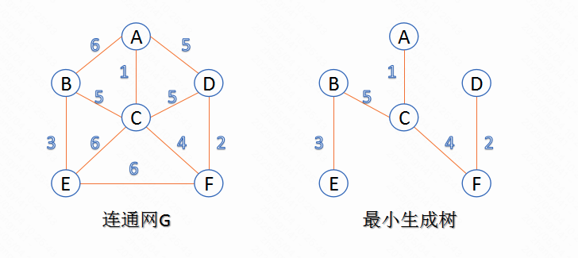
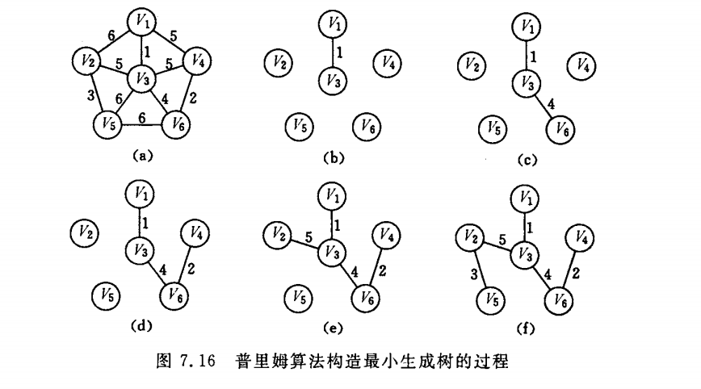
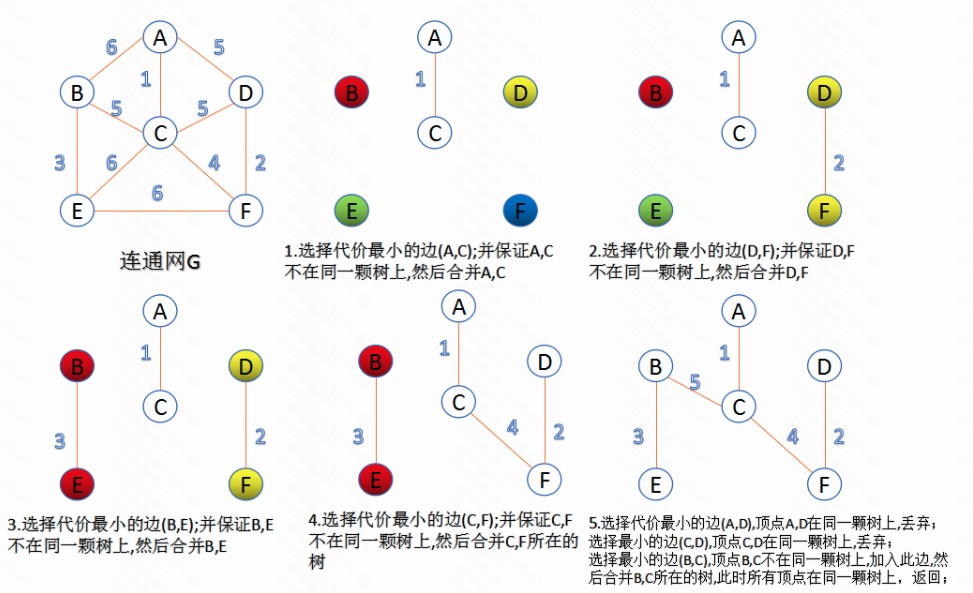

关于图的概念：

```
连通图：在无向图中，若任意两个顶点 vi 与 vj 都有路径相通，则称该无向图为连通图。
强连通图：在有向图中，若任意两个顶点 vi与 vj 都有路径相通，则称该有向图为强连通图。
连通网：在连通图中，若图的边具有一定的意义，每一条边都对应着一个数，称为权；权代表着连接连个顶点的代价，称这种连通图叫做连通网。
生成树：一个连通图的生成树是指一个连通子图，它含有图中全部n个顶点，但只有足以构成一棵树的n-1条边。一颗有n个顶点的生成树有且仅有n-1条边，如果生成树中再添加一条边，则必定成环。
最小生成树：在连通网的所有生成树中，所有边的代价和最小的生成树，称为最小生成树。
```

在一张无向图中，求一棵树，并且这棵树的边权和最小。这棵树的定义：

- 有 n-1 条边
- 无环
- 连通所有点

也即：怎么花最小的成本连通所有点。也就是最小生成树。



有两种算法，包括：Prim（普里姆）算法、Kruskal（克鲁斯卡尔）算法。

### 一、Prim算法

树从任意节点开始，直到树的所有节点全部加入。每次加入节点的时候需要保证边权尽可能小。

由于每次选择的是节点，和边的数量无关。因此相对适合于稠密图。

算法思路：

```
第一步：初始化的时候，随机选一个节点，此时树中只有一个节点，没有边
第二步：集合U表示树中的节点， 集合T来保存树的边
第三步：开始循环,每次挑选一个节点和一条边
	1. 已经在集合U中节点全部标为红色，未在集合U中节点全部标为蓝色。
	2. 红色和蓝色集合之间，找出所有的边中，权重最小的边。
	3. 将这条权重最小的边添加到集合T
	4. 将对应的节点添加到集合U
```




### 二、Kruskal算法

每次寻找较小的边，直到所有节点连成一棵树。

由于每次选择的是边，和节点的数量无关。因此相对适合于稀疏图。

此算法可以称为“加边法”，初始最小生成树边数为0，每迭代一次就选择一条满足条件的最小代价边，加入到最小生成树的边集合里。
1. 把图中的所有边按代价从小到大排序；
2. 把图中的n个顶点看成独立的n棵树组成的森林；
3. 按权值从小到大选择边，所选的边连接的两个顶点ui,vi,应属于两颗不同的树，则成为最小生成树的一条边，并将这两颗树合并作为一颗树。
4. 重复(3),直到所有顶点都在一颗树内或者有n-1条边为止。



### 三、代码实现

```c++
#include <algorithm>
#include <iostream>
#include <vector>

#define INFINITE 0xFFFFFFFF
#define VEX_COUNTS 6 // 顶点数量
// 所有的顶点
char vextex[] = {'A', 'B', 'C', 'D', 'E', 'F'};

// 用于辅助 Prim 算法的结构
struct node {
  unsigned int data;       // 顶点
  unsigned int lowestCost; // 最小价格
} closeEdge[VEX_COUNTS];

// 原始图的边信息
typedef struct {
  unsigned int u;
  unsigned int v;
  unsigned int cost; // 边的价格
} Arc;

// 构建临接矩阵
void buildMatrix(unsigned int adjMat[][VEX_COUNTS]) {
  // 初始化邻接矩阵
  for (int i = 0; i < VEX_COUNTS; i++) {
    for (int j = 0; j < VEX_COUNTS; j++) {
      adjMat[i][j] = INFINITE;
    }
  }
  adjMat[0][1] = 6;
  adjMat[0][2] = 1;
  adjMat[0][3] = 5;
  adjMat[1][0] = 6;
  adjMat[1][2] = 5;
  adjMat[1][4] = 3;
  adjMat[2][0] = 1;
  adjMat[2][1] = 5;
  adjMat[2][3] = 5;
  adjMat[2][4] = 6;
  adjMat[2][5] = 4;
  adjMat[3][0] = 5;
  adjMat[3][2] = 5;
  adjMat[3][5] = 2;
  adjMat[4][1] = 3;
  adjMat[4][2] = 6;
  adjMat[4][5] = 6;
  adjMat[5][2] = 4;
  adjMat[5][3] = 2;
  adjMat[5][4] = 6;
}

// 返回最小价格边
int getMinCostEdge(struct node *edge) {
  unsigned int min = INFINITE;
  int index = -1;
  for (int i = 0; i < VEX_COUNTS; i++) {
    if (edge[i].lowestCost < min && edge[i].lowestCost != 0) {
      min = edge[i].lowestCost;
      index = i;
    }
  }
  return index;
}

void MiniSpannTreeOfPrim(unsigned int adjMat[][VEX_COUNTS], unsigned int s) {
  for (int i = 0; i < VEX_COUNTS; i++) {
    closeEdge[i].lowestCost = INFINITE;
  }
  // 从顶点 s 开始
  closeEdge[s].data = s;
  closeEdge[s].lowestCost = 0;
  for (int i = 0; i < VEX_COUNTS; i++) {
    if (i != s) {
      closeEdge[i].data = s;
      closeEdge[i].lowestCost = adjMat[s][i];
    }
  }
  for (int j = 1; j <= VEX_COUNTS - 1; j++) {
    int k = getMinCostEdge(closeEdge);
    std::cout << vextex[closeEdge[k].data] << "--" << vextex[k] << std::endl;
    closeEdge[k].lowestCost = 0;
    for (int i = 0; i < VEX_COUNTS; i++) {
      if (adjMat[k][i] < closeEdge[i].lowestCost) {
        closeEdge[i].data = k;
        closeEdge[i].lowestCost = adjMat[k][i];
      }
    }
  }
}

// 保存图的边价格信息
void ReadArc(unsigned int adjMat[][VEX_COUNTS], std::vector<Arc> &vertexArc) {
  Arc *temp = NULL;
  for (unsigned int i = 0; i < VEX_COUNTS; i++) {
    for (unsigned int j = 0; j < i; j++) {
      if (adjMat[i][j] != INFINITE) {
        temp = new Arc();
        temp->u = i;
        temp->v = j;
        temp->cost = adjMat[i][j];
        vertexArc.emplace_back(*temp);
      }
    }
  }
}

bool FindTree(unsigned int u, unsigned int v,
              std::vector<std::vector<unsigned int>> &tree) {
  unsigned int index_u = INFINITE;
  unsigned int index_v = INFINITE;
  // 检查 (u,v) 分别属于那棵树
  for (unsigned int i = 0; i < tree.size(); i++) {
    if (std::find(tree[i].begin(), tree[i].end(), u) != tree[i].end()) {
      index_u = i;
    }
    if (std::find(tree[i].begin(), tree[i].end(), v) != tree[i].end()) {
      index_v = i;
    }
  }
  // (u,v) 不在一棵树上，合并两棵树
  if (index_u != index_v) {
    for (unsigned int i = 0; i < tree[index_v].size(); i++) {
      tree[index_u].emplace_back(tree[index_v][i]);
    }
    tree[index_v].clear();
    return true;
  }
  return false;
}

void MiniSpannTreeOfKruskal(unsigned int adjMat[][VEX_COUNTS]) {
  std::vector<Arc> vertexArc;
  ReadArc(adjMat, vertexArc);
  std::sort(vertexArc.begin(), vertexArc.end(),
            [](Arc a, Arc b) { return a.cost < b.cost ? true : false; });
  // 有 VEX_COUNTS 棵独立树
  std::vector<std::vector<unsigned int>> tree(VEX_COUNTS);
  for (unsigned int i = 0; i < VEX_COUNTS; i++) {
    tree[i].emplace_back(i);
  }
  // 依次从小到大取最小价格边
  for (unsigned int i = 0; i < vertexArc.size();i++) {
    unsigned int u = vertexArc[i].u;
    unsigned int v = vertexArc[i].v;
    if (FindTree(u, v, tree)) {
      std::cout << vextex[u] << "---" << vextex[v] << std::endl;
    }
  }
}

int main() {
  unsigned int adjMat[VEX_COUNTS][VEX_COUNTS] = {0};
  buildMatrix(adjMat);

  std::cout << "Prim: " << std::endl;
  MiniSpannTreeOfPrim(adjMat, 0);
  std::cout << std::endl;

  std::cout << "Kruskal: " << std::endl;
  MiniSpannTreeOfKruskal(adjMat);
  std::cout << std::endl;
}
```

