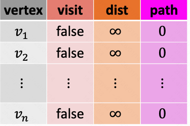
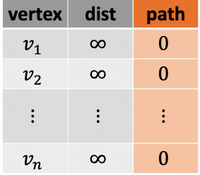
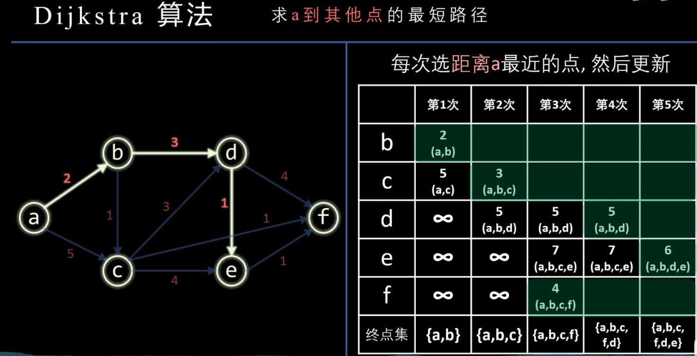

### 一、无权图中的最短路

算法思路：

```
输入：节点集合V，边集合E，起点s

第一步：初始化一个空队列（先入先出）
第二步：初始化一个辅助表, 设置辅助表中 visit列为false，dist为无穷大，path为0
第三步：将起点 s 入队列末尾，设置辅助表中 visit[s]=true, dist[s]=0
第四步：循环，从队列头取出节点，直到队列清空为止
	1. 取出队列头节点，记做 v 节点。
	2. 找到 v 所有相邻的节点，相邻的含义是从 v 出发走一步可以到达。只保留这些节点中没有访问过的，并将这些未访问的节点集合记做S
	3. 循环 集合S中的节点，每个节点记做 u
		- 把 u 插入到队列中
		- 设置 visit[u]=true, dist[u]=dist[v]+1, path[u]=v

输出：
dist[v] 表示所有最短路的长度
path[v] 表示最短路的路径
```

如下是一张辅助表

- visit 列：表示节点是否被访问。未访问的节点需要插入到队列中，访问过的节点则不需要。
- dist 列：表示从起点到当前节点的最短路的长度
- path列：表示最短路的路径中，当前节点的前驱节点是谁？依次往前找便可以找到最短路的路径。



算法的时间复杂度：O(V+E)，其中V是节点数量，E是边数量。

### 二、有权图中的最短路（Dijkstra 算法-无法处理负权边）

有权图的最短路径，Dijkstra(迪杰斯特拉算法)。定义：给定一个源顶点，源顶点分别到其他顶点的最短路径问题。

算法思路：

```
输入：节点集合V，边集合E，起点s

第一步：初始化一个“优先级队列”，存储（节点，距离），距离作为权重。
第二步：初始化一个辅助表, 设置辅助表中 dist为无穷大，path为0
第三步：起点s, dist[s]=0, 把起点s插入到队列中 enqueue(s,0)
第四步：循环，从优先级队列取出节点，直到队列清空为止
	1. 从优先级队列 取出 优先级最高的节点，记做v
	2. 找到v相邻的节点，相邻表示从v出发，走一步可以到的节点。将这些节点加入到集合S中
	3. 循环，针对集合S中所有节点，每个节点记做u
		- 起点到u的新距离 = dist[v] + v到u的距离
		- 如果 ‘起点到u的新距离’ 小于 dist[u], 则
				i. 设置 dist[u] 为新距离，path[u]=v。
				ii. 并将(u,新距离)加入到队列,如果u已经存在于队列中，则更新队列中u的新距离。
```

如下是一个辅助表

- dist 列：表示从起点到当前节点的最短路的长度
- path列：表示最短路的路径中，当前节点的前驱节点是谁？依次往前找便可以找到最短路的路径。



注意：

- 算法要求所有边的权重为非负数。如果存在负数，算法可能一直循环下去。
- 他是一个“单源”最短路径算法，只能算出起点到其他点的最短路径。如果要算出任意点与点之间的最短路径，则需要跑N次。
- 算法需要进行入队和出队操作，最多进行 O(V+E) 次。优先级队列出队和入队操作耗时 O(logV)。因此算法的时间复杂度是：O( (V+E) * logV )

总结：

采用贪心策略，按照路径长度递增的顺序，逐个产生各个顶点的最短路径。

>Dijkstra算法和 Prim 算法的本质区别：每次更新的路径不一样。
>
>prim 更新的是 “未标记集合” 到 “已标记集合” 之间的距离。
>
>dijkstra 更新的是 “源点” 到 “未标记集合” 之间的距离。



代码实现：

```c++
#define MAX_DIST 0x3F3F3F3F

class Solution {
public:
  int countPaths(int n, vector<vector<int>> &roads) {
    int count = n;
    std::vector<std::vector<int>> matrix(count,
                                         std::vector<int>(count, MAX_DIST));
    buildMatrix(count, roads, matrix);

    std::unordered_set<int> vexSet;
    std::vector<std::vector<int>> path(count, std::vector<int>(0));
    std::vector<int> dist(count, MAX_DIST);
    for (int i = 0; i < count; i++) {
      dist[i] = matrix[0][i];
      path[i].emplace_back(0);
      path[i].emplace_back(i);
    }
    vexSet.insert(0);

    for (int i = 1; i < count; i++) {
      // 选择节点
      int min = MAX_DIST;
      int k = MAX_DIST;
      for (int j = 0; j < count; j++) {
        if (vexSet.find(j) == vexSet.end() && dist[j] < min) {
          min = dist[j];
          k = j;
        }
      }
      vexSet.insert(k);
      // 寻找下一个
      for (int j = 0; j < count; j++) {
        if (vexSet.find(j) == vexSet.end() && matrix[k][j] != MAX_DIST &&
            matrix[k][j] + dist[k] < dist[j]) {
          dist[j] = matrix[k][j] + dist[k];
          path[j] = path[k];
          path[j].emplace_back(j);
        }
      }
      for (int j = 0; j < path[k].size(); j++) {
        std::cout << path[k][j] << ", ";
      }
      std::cout << "    dist: " << dist[k] << std::endl;
    }
  }

  void buildMatrix(int count, vector<vector<int>> &roads,
                   std::vector<std::vector<int>> &matrix) {
    for (int i = 0; i < count; i++) {
      for (int j = 0; j < count; j++) {
        matrix[i][j] = MAX_DIST;
      }
    }
    for (int i = 0; i < roads.size(); i++) {
      int u = roads[i][0];
      int v = roads[i][1];
      int dist = roads[i][2];
      matrix[u][v] = dist;
    }
  }
};

class Solution3 {
public:
  int countPaths(int n, vector<vector<int>> &roads) {
    const long long mod = 1e9 + 7;

    std::vector<std::vector<std::pair<int, int>>> table(n);
    for (auto &road : roads) {
      int x = road[0];
      int y = road[1];
      int len = road[2];
      table[x].emplace_back(y, len);
      table[y].emplace_back(x, len);
    }
    std::vector<long long> dist(n, LLONG_MAX);
    std::vector<long long> ways(n);

    auto cmp = [](std::pair<int, long long> &a, std::pair<int, long long> &b) {
      return a.second > b.second;
    };

    std::priority_queue<std::pair<int, long long>,
                        std::vector<std::pair<int, long long>>, decltype(cmp)>
        minHeap(cmp);
    minHeap.emplace(0, 0);
    dist[0] = 0;
    ways[0] = 1;

    while (!minHeap.empty()) {
      auto [u, len1] = minHeap.top();
      minHeap.pop();
      if (len1 > dist[u]) {
        continue;
      }
      for (auto [v, len2] : table[u]) {
        if (len1 + len2 < dist[v]) {
          dist[v] = len1 + len2;
          ways[v] = ways[u];
          minHeap.emplace(v, len1 + len2);
        } else if (len1 + len2 == dist[v]) {
          ways[v] = (ways[u] + ways[v]) % mod;
        }
      }
    }
    return ways[n - 1];
  }
};

int main() {
  Solution3 s;
  //   std::vector<std::vector<int>> roads{
  //       {0, 6, 7}, {0, 1, 2}, {1, 2, 3}, {1, 3, 3}, {6, 3, 3},
  //       {3, 5, 1}, {6, 5, 1}, {2, 5, 1}, {0, 4, 5}, {4, 6, 2}};
  std::vector<std::vector<int>> roads{{0, 1, 5}, {0, 2, 1}, {1, 3, 1},
                                      {1, 5, 1}, {2, 3, 2}, {2, 4, 1},
                                      {3, 4, 1}};
  int result = s.countPaths(6, roads);
  std::cout << result << std::endl;
  return 0;
}
```

