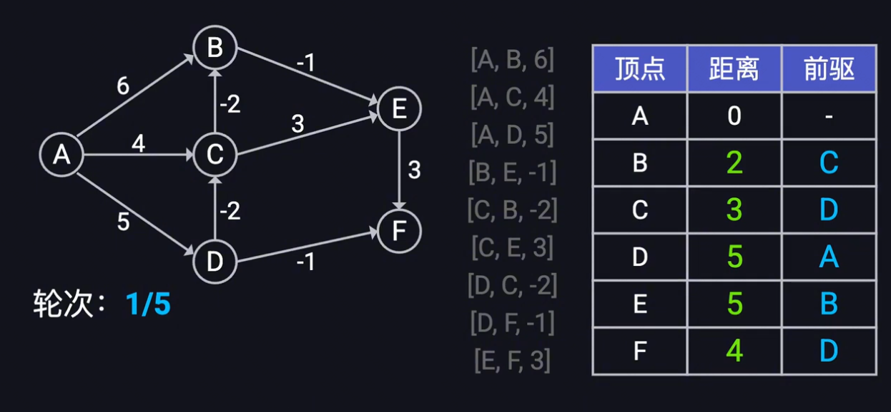

## 一、Bellman-Ford算法

### 1. 定义

单源最短路径算法

适用范围：

- **允许负权边**（边权可为负）
- **可以检测从源点可达的负环**，若存在从 s 可达的负环，则相关点的“最短路”不存在（可以无限变小）。

### 2. 思想

核心思想：不断尝试更新所有的边，直到所有可能的最短路径都被找到

1. 初始化距离：起点为0，其他点为无穷大
2. 执行 V-1 轮松弛操作：遍历所有边，更新最短距离。收敛后可获得最短路径
3. 检测负权环：额外遍历一次，若仍可更新，则存在负权环

### 3. 缺陷

时间复杂度 O(V * E)。最多 V-1 轮，每轮扫描 E 条边

空间复杂度：O(V)

## 二、SPFA算法

### 1. 定义

bellman-ford算法加上一个队列，就是SPFA算法。

SPFA算法不会盲目尝试所有节点，而是维护一个备选节点队列，并且仅有节点被松弛之后才会放入到队列中。

### 2. 思想

初始化：distance数组（从源点s到各点的最小费用）全部赋值为inf，用一个队列保存所有待松弛的顶点，初始时将s点放入队列中。

队列+松弛操作：每次出队一个顶点u，对其所有的边进行松弛，如果存在某条边u->v松弛成功（dist(v)>dist(u)+w(u,v)），则将v加入队列中（当v不在队列时）；重复以上操作直到队列为空或者发现负权环。
如果网络中存在负权回路，则算法永远都不会结束，陷入死循环。

判断是否存在负权环的方法：对任何一个顶点，每进入一次队列，意味着需要进行一次松弛，即如果某个顶点进入队列的次数超过V，说明存在负权环。

### 3. 缺陷

