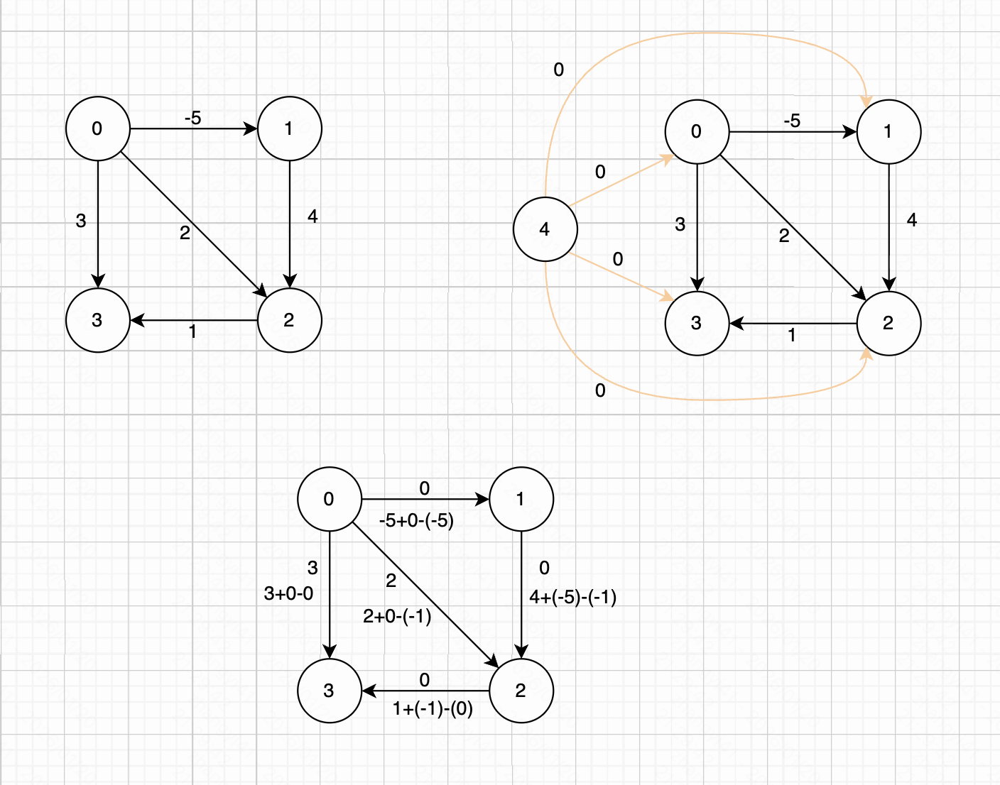

### 1. 定义

由于 dijkstra 算法要求图中所有边的权值非负，不适合通用的情况。Johnson 提出对所有边的权值进行“re-weight”的算法，使得边的权值非负，进而可以使用 dijkstra 算法进行最短路径的计算。

### 2. 思想

第一步：对于一张图，新增一个源顶点 4，并使其与其他顶点连通，新边赋权值为0

第二步：使用 Bellman-Ford算法，计算新的顶点到所有其他顶点的最短路径，则从 4 到 {0,1,2,3} 的最短路径分别是 {0, -5, -1, 0}。
即有 h[] = {0, -5, -1, 0}。当得到这个 h 数组后，将新增的顶点 4 移除，然后使用如下公式对所有边的权值进行“re-weight”。

```
w(u, v) = w(u, v) + { h[u] - h[v] }
```



此时，所有边的权值已经被重写为非负。那么，我们就可以利用 Dijkstra 算法对每个顶点分别进行最短路径的计算了。

Johnson 算法描述如下：

1. 给定图 G = (V, E)，增加一个新的顶点 s，使 s 指向图 G 中的所有顶点都建立连接，设新的图为 G’
2. 对图 G’ 中顶点 s 使用 Bellman-Ford 算法计算单源最短路径，得到结果 h[] = {h[0], h[1], .. h[V-1]}
3. 对原图 G 中的所有边进行 "re-weight"，即对于每个边 (u, v)，其新的权值为 w(u, v) + (h[u] - h[v])
4. 移除新增的顶点 s，对每个顶点运行 Dijkstra 算法求得最短路径

### 3. 复杂度

假设有 V 个点，E 条边。

- Bellman-Ford （一次，用于求势函数并检测负环），时间复杂度 O(VE)
- 对每个源点跑一次 Dijkstra 算法(堆实现)。单次 Dijkstra 时间：O( (V+E) * log V )，跑 V 次，总共 O(V * (V+E) * logV)

因此 Johonson 总时间复杂度为：

```
O(V*E) + O(V * (V+E) * LogV)

大多数情况下 E > V，因此可写为 O(V * E * logV)
```


