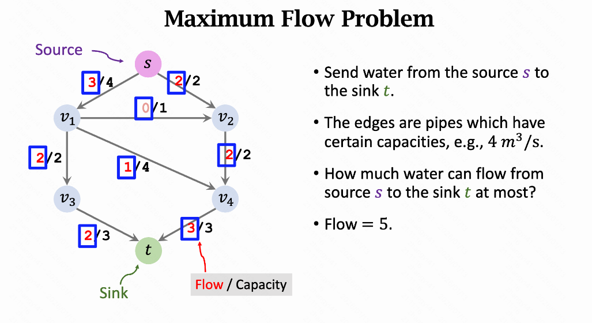
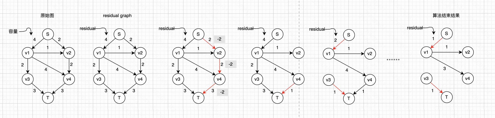
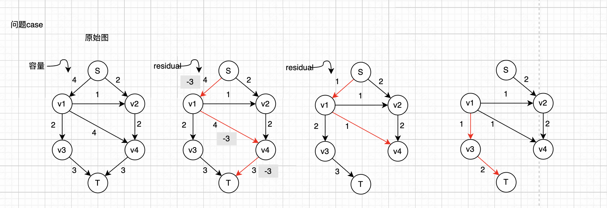
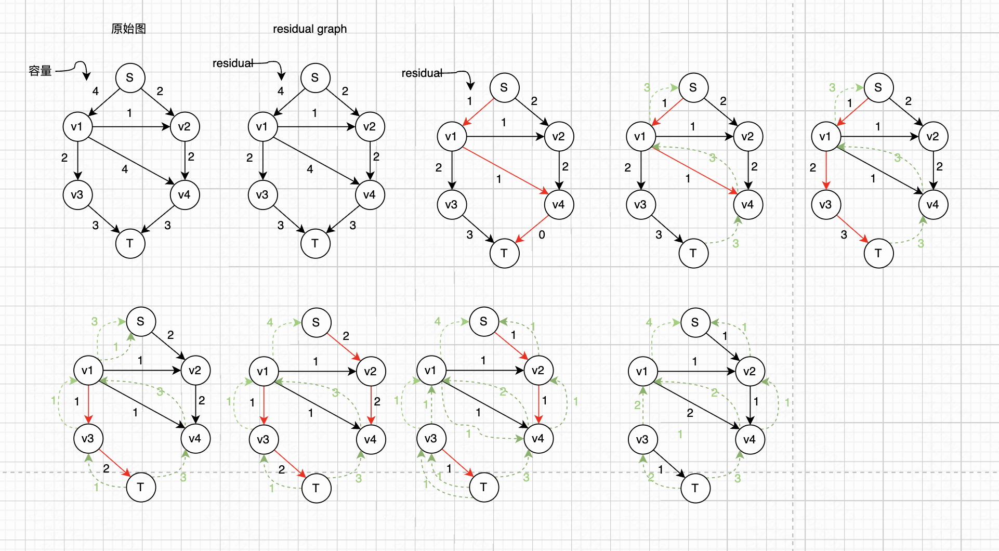
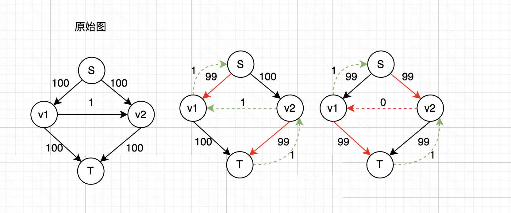
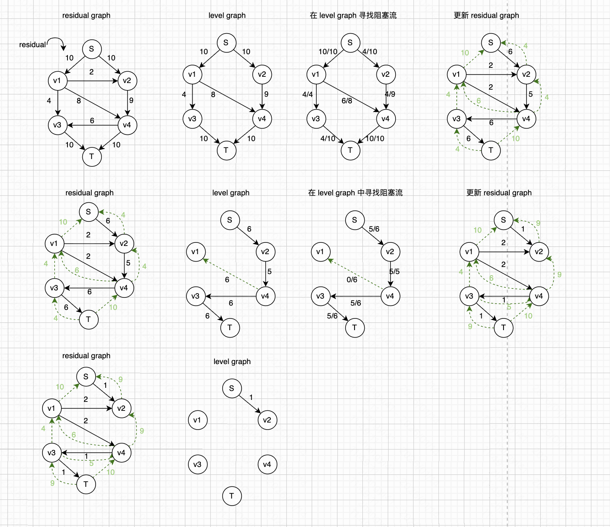

### 一、定义

定义：在一个图上，从起点 s 到终点 t，寻找网络中的最大流。

从起点 s 流出的流量，一定等于流入终点 t 的流量。



### 二、简单算法（可行解但不是最优解）

思路：

1. 构建一个“剩余容量”图，图中每条边的“剩余容量”等于“原始容量”。
2. 在图中循环如下流程
   - 随机寻找一条从 s 到 t 的路径，算出这条路径的 “可通行流量”。“可通行流量” = min(所有边的容量)。这条路径上所有边的“剩余容量”就等于“剩余容量”减去“可通行流量”。
   - 上一步骤路径的边中，剔除容量为0的边。
3. 直到找不到“从s到t的通路”。算法结束。
4. 图中的边，使用“原始容量”减去“剩余容量”，就等于这条边“流过的流量”。



这个算法只能找到可行的阻塞流，但找不到最大流。原因如下：

如下这个图，最大流应该是 5，但是此时得到的只有4。



我们也称这种流为“阻塞流”。

### 三、Ford-Fullkerson 算法

允许“反悔”，可以撤销之前选中的路径。不过寻找路径时还是采用随机算法。

思路：

1. 构建一个“剩余容量”图，图中每条边的“剩余容量”等于“原始容量”。
2. 在图中循环如下流程：
   - 随机寻找一条从 s 到 t 的路径，算出这条路径的 “可通行流量”。“可通行流量” = min(所有边的容量)。这条路径上所有边的“剩余容量”就等于“剩余容量”减去“可通行流量”。
   - 这条路径的所有边中，剔除容量为0的边。
   - 这条路径的所有边中，添加一条“反向边”。“反向边”的“剩余容量”为 “可通行流量”
   - 合并相同方向的边，并更新“剩余容量”
3. 直到找不到“从s到t的通路”。算法结束。
4. 图中的边，使用“原始容量”减去“剩余容量”，就等于这条边“流过的流量”。



最坏的时间复杂度：

``` 
O(f * m)
其中 f 是最大的流量
m 是边的数量
```

实际情况中，最大的流量可能比较大，因此最坏的时间复杂度偏高。



### 四、Edmonds-Karp算法

他是 Ford-Fullkerson 算法的一种特例。在寻找路径时使用“最短路算法”。

思路：

1. 构建一个“剩余容量”图，图中每条边的“剩余容量”等于“原始容量”。
2. 在图中循环如下流程：
   - 《使用“最短路算法”》寻找一条从 s 到 t 的路径，算出这条路径的 “可通行流量”。
   - “可通行流量” = min(所有边的容量)。这条路径上所有边的“剩余容量”就等于“剩余容量”减去“可通行流量”。
   - 这条路径的所有边中，剔除容量为0的边。
   - 这条路径的所有边中，添加一条“反向边”。“反向边”的“剩余容量”为 “可通行流量”
   - 合并相同方向的边，并更新“剩余容量”
3. 直到找不到“从s到t的通路”。算法结束。
4. 图中的边，使用“原始容量”减去“剩余容量”，就等于这条边“流过的流量”。

Edmonds-Karp算法 和  Ford-Fullkerson 算法， 区别的地方的就在于寻找路径时使用“最短路算法”。

```
最坏的时间复杂度
m：边的数量
n：节点的数量
寻找最短路时，需要将图变成一个无权图。因此寻找一条最短路需要 O(m)
已经证明，Edmonds-Karp算法最多循环 m*n 轮。
因此最坏的时间复杂度是 O(m^2 * n)
```

### 五、Dinic 算法

思路：

1. 初始化，构建一个“residual graph”，图中每条边的“redidual”等于“原始容量
2. 在图中循环如下流程：
   - 根据 “residual graph”，构建一个 “level graph”
   - 在 “level graph” 中寻找一个“阻塞流”
   - 在 “residual graph” 中，更新这个“阻塞流”对应的数据（更新边的剩余容量、移除饱和边、添加反向边）
3. 直到在 “level graph” 中找不到“从s到t的通路”。算法结束。
4. 图中的边，使用“原始容量”减去“剩余容量”，就等于这条边“流过的流量”。

详细说一下如何构建 “level graph”

- 从起点 s 开始，走一步可以到的节点列出来，记做 第一层节点
- 从第一层节点开始，走一步可以到的节点画出来，记做第二层节点。注意：已经添加的节点不再添加边。
- 依次上述流程，直到找到终点 t。



```
m：边的数量
n：节点的数量
算法最多循环 n-1 次，每次需要 O(m*n)
Dinic算法的最坏时间复杂度: O(m * n^2)
```


