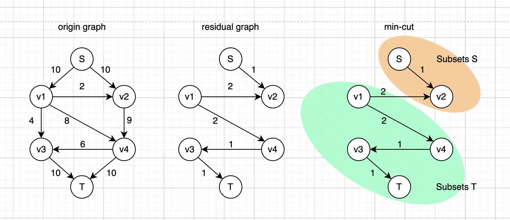

最小割并不唯一。

最大流最小割定理：对于一个网络流问题，最大流的流量等于最小割的容量。

最小割算法思路：

- 使用 “任意最大流算法” 获取最终的 residual graph
  - 使用 Edmonds-Karp 算法或者 “dinic” 算法都可以找到最大流
  - 剔除 residual graph 中的反向边
- 寻找最小割
  - 在 residual graph 中，从起点出发，找到所有可以达到的节点
  - 把这些能到达的节点记做集合S。
  - 把其他所有节点记做集合T。也即：从起点出发到达不了的节点

举例如下：

